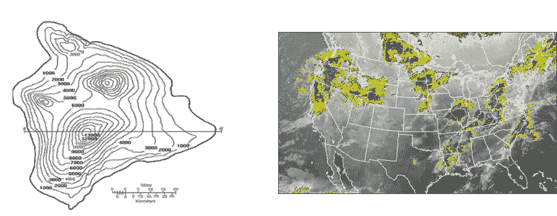
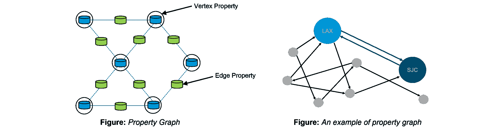
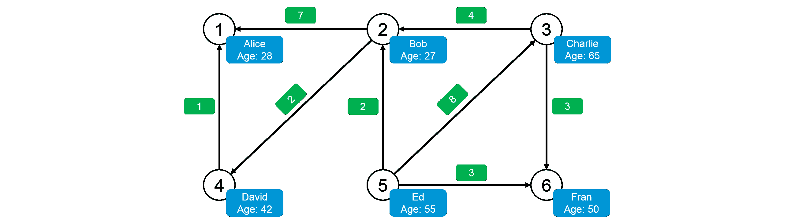
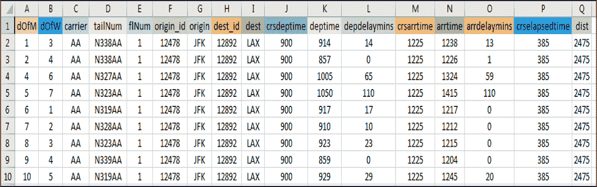
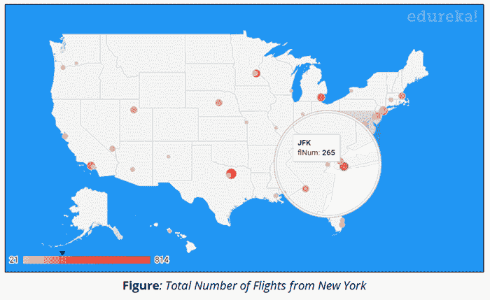

# Spark GraphX 教程 Apache Spark 中的图形分析

> 原文：<https://www.edureka.co/blog/spark-graphx/>

*GraphX* 是 Apache Spark 针对图形和图形并行计算的 API。GraphX 在单个系统中统一了 ETL(提取、转换&加载)过程、探索性分析和迭代图计算。在脸书的朋友、LinkedIn 的连接、互联网的路由器、天体物理学中星系和恒星之间的关系以及谷歌地图中可以看到图表的用法。尽管图计算的概念看起来非常简单，但图的应用实际上是无限的，仅举几个例子，例如灾难检测、银行、股票市场、银行和地理系统。学习这个 API 的使用是 ***[阿帕奇星火课程](https://www.edureka.co/apache-spark-scala-training#curriculum)*** 的重要组成部分。通过本博客，我们将通过示例了解 Spark GraphX 的概念、特性和组件，并浏览使用 GraphX 进行飞行数据分析的完整用例。

我们将在 Spark GraphX 博客中讨论以下主题:

1.  [什么是图？](#What_Are_Graphs)
2.  [图计算的用例](#Graph_Use_Cases)
3.  [什么是 Spark GraphX？](#What_Is_GraphX)
4.  [Spark GraphX 特性](#Spark_GraphX_Features)
5.  [用实例理解 GraphX](#Understanding_GraphX_With_Examples)
6.  [用例——使用 GraphX](#Use_Case_Flight_Data_Analysis) 进行飞行数据分析

## **什么是图？**

图是一种数学结构，相当于一组对象，其中一些对象对在某种意义上是相关的。这些关系可以用构成图形的边和顶点来表示。顶点代表对象，边显示这些对象之间的各种关系。

** 图:***Spark GraphX 教程——图中的顶点、边和三元组* 

在计算机科学中，图是一种抽象数据类型，旨在实现数学中的无向图和有向图概念，特别是在图论领域。图形数据结构还可以将某个*边值*与每个边相关联，例如符号标签或数字属性(成本、容量、长度、等)。).

## **图计算的用例**

以下用例提供了图形计算的前景，以及使用图形实现其他解决方案的进一步范围。

1.  **Disaster Detection System**  

    图表可用于检测飓风、地震、海啸、森林火灾和火山爆发等灾害，以便向人们发出警告。

2.  **页面排名**    页面排名可用于寻找任何网络中的影响者，例如论文引用网络或社交媒体网络。
3.  **Financial Fraud Detection **

    图表分析可用于监控金融交易，并发现参与金融欺诈和洗钱的人员。

4.  **Business Analysis **

    图表在与机器学习结合使用时，有助于了解客户的购买趋势。如优步、麦当劳等。

5.  **Geographic Information Systems **

    图形被广泛用于开发地理信息系统的功能，如流域划分和天气预报。

6.  **Google Pregel** 

    Pregel 是谷歌的可扩展和容错平台，其 API 足够灵活，可以表达任意图形算法。

## **什么是 Spark GraphX？**

*GraphX* 是用于图形和图形并行计算的 Spark API。它包含了越来越多的图形算法和构建器来简化图形分析任务。

 GraphX 用弹性分布式属性图扩展了 Spark RDD。 属性图是可以有多条平行边的有向多重图。每个边和顶点都有用户定义的相关属性。平行边允许相同顶点之间有多个关系。

## **Spark GraphX 特性**

以下是 Spark GraphX 的特点:

1.  **灵活性** : Spark GraphX 同时处理图形和计算。GraphX 在单个系统中统一了 ETL(提取、转换&加载)、探索性分析和迭代图计算。我们可以将相同的数据视为图形和集合，使用 rdd 有效地转换和连接图形，并使用 Pregel API 编写定制的迭代图形算法。
2.  **速度** : Spark GraphX 提供了与最快的专业图形处理系统不相上下的性能。它可以与最快的图形系统相媲美，同时保留了 Spark 的灵活性、容错性和易用性。
3.  **不断增长的算法库** : 我们可以从 Spark GraphX 提供的不断增长的图形算法库中进行选择。一些流行的算法是页面排名、连通分量、标签传播、SVD++、强连通分量和三角形计数。

## **用实例理解 GraphX**

现在我们将通过一个例子来理解 Spark GraphX 的概念。让我们考虑一个简单的图表，如下图所示。

** 图:  ** *星火 GraphX 教程——图形示例* 

查看图表，我们可以提取关于人(顶点)和他们之间的关系(边)的信息。这里的图表代表了 Twitter 用户以及他们在 Twitter 上关注的人。例如，鲍勃在推特上关注大卫和爱丽丝。

让我们使用 Apache Spark 实现同样的功能。首先，我们将为 GraphX 导入必要的类。

```

//Importing the necessary classes 
import org.apache.spark._ 
import org.apache.spark.rdd.RDD 
import org.apache.spark.util.IntParam 
import org.apache.spark.graphx._ 
import org.apache.spark.graphx.util.GraphGenerators 

```

**显示顶点** : 此外，我们现在将显示所有用户的姓名和年龄(顶点)。

```
val vertexRDD: RDD[(Long, (String, Int))] = sc.parallelize(vertexArray)
val edgeRDD: RDD[Edge[Int]] = sc.parallelize(edgeArray)
val graph: Graph[(String, Int), Int] = Graph(vertexRDD, edgeRDD)
graph.vertices.filter { case (id, (name, age)) => age > 30 }
.collect.foreach { case (id, (name, age)) => println(s"$name is $age")}

```

上述代码的输出如下:

```
David is 42 
Fran is 50 
Ed is 55 
Charlie is 65
```

**显示边缘**:让我们看看推特上哪个人喜欢谁。

```
for (triplet <- graph.triplets.collect)
{
println(s"${triplet.srcAttr._1} likes ${triplet.dstAttr._1}")
}

```

上述代码的输出如下:

```
Bob likes Alice
Bob likes David
Charlie likes Bob
Charlie likes Fran
David likes Alice
Ed likes Bob
Ed likes Charlie
Ed likes Fran
```

现在我们已经了解了 GraphX 的基础知识，让我们更深入一点，并对其进行一些高级计算。

**关注者数量**:我们图表中的每个用户都有不同数量的关注者。让我们看看每个用户的所有追随者。

```
// Defining a class to more clearly model the user property
case class User(name: String, age: Int, inDeg: Int, outDeg: Int)
// Creating a user Graph
val initialUserGraph: Graph[User, Int] = graph.mapVertices{ case (id, (name, age)) => User(name, age, 0, 0) }

// Filling in the degree information
val userGraph = initialUserGraph.outerJoinVertices(initialUserGraph.inDegrees) {
case (id, u, inDegOpt) => User(u.name, u.age, inDegOpt.getOrElse(0), u.outDeg)
}.outerJoinVertices(initialUserGraph.outDegrees) {
case (id, u, outDegOpt) => User(u.name, u.age, u.inDeg, outDegOpt.getOrElse(0))
}
for ((id, property) <- userGraph.vertices.collect) {
println(s"User $id is called ${property.name} and is liked by ${property.inDeg} people.")
}

```

上述代码的输出如下:

```
User 1 is called Alice and is liked by 2 people.
User 2 is called Bob and is liked by 2 people.
User 3 is called Charlie and is liked by 1 people.
User 4 is called David and is liked by 1 people.
User 5 is called Ed and is liked by 0 people.
User 6 is called Fran and is liked by 2 people.
```

**最老的追随者** :我们也可以根据追随者的特点对他们进行排序。让我们按年龄找出每个用户最老的追随者。

```
// Finding the oldest follower for each user
val oldestFollower: VertexRDD[(String, Int)] = userGraph.mapReduceTriplets[(String, Int)](
// For each edge send a message to the destination vertex with the attribute of the source vertex
 edge => Iterator((edge.dstId, (edge.srcAttr.name, edge.srcAttr.age))),
 // To combine messages take the message for the older follower
 (a, b) => if (a._2 > b._2) a else b
 )

```

上述代码的输出如下:

```
David is the oldest follower of Alice.
Charlie is the oldest follower of Bob.
Ed is the oldest follower of Charlie.
Bob is the oldest follower of David.
Ed does not have any followers.
Charlie is the oldest follower of Fran.

```

## **用例:使用 Spark GraphX 进行飞行数据分析**

现在我们已经理解了 Spark GraphX 的核心概念，让我们使用 GraphX 解决一个现实生活中的问题。这将有助于我们有信心在未来从事任何 Spark 项目。

**问题陈述** : *使用 Spark GraphX 分析实时飞行数据，提供接近实时的计算结果，并使用 Google Data Studio 将结果可视化。*

**用例——要完成的计算** :

1.  计算飞行路线总数
2.  计算并排序最长的飞行路线
3.  显示顶点度数最高的机场
4.  根据 PageRank 列出最重要的机场
5.  列出飞行成本最低的航线

我们将使用 Spark GraphX 进行上述计算，并使用 Google Data Studio 可视化结果。

**用例——数据集** :

 **图:** *用例——美国飞行数据集* 

**用例——流程图** :

下图清楚地解释了我们飞行数据分析的所有步骤。

** **   **图:** *用例——使用 Spark GraphX 进行飞行数据分析的流程图*

**用例——Spark 实现** :

继续，现在让我们使用 Eclipse IDE for Spark 来实现我们的项目。

找到下面的伪代码:

```
//Importing the necessary classes
import org.apache.spark._
...
import java.io.File

object airport {

 def main(args: Array[String]){

//Creating a Case Class Flight
case class Flight(dofM:String, dofW:String, ... ,dist:Int)

//Defining a Parse String function to parse input into Flight class
def parseFlight(str: String): Flight = {
val line = str.split(",")
Flight(line(0), line(1), ... , line(16).toInt)
}
val conf = new SparkConf().setAppName("airport").setMaster("local[2]")
val sc = new SparkContext(conf) 
//Load the data into a RDD 

val textRDD = sc.textFile("/home/edureka/usecases/airport/airportdataset.csv")

//Parse the RDD of CSV lines into an RDD of flight classes 
val flightsRDD = Map ParseFlight to Text RDD

//Create airports RDD with ID and Name
val airports = Map Flight OriginID and Origin
airports.take(1)

//Defining a default vertex called nowhere and mapping Airport ID for printlns
val nowhere = "nowhere"
val airportMap = Use Map Function .collect.toList.toMap

//Create routes RDD with sourceID, destinationID and distance
val routes = flightsRDD. Use Map Function .distinct
routes.take(2)

//Create edges RDD with sourceID, destinationID and distance
val edges = routes.map{( Map OriginID and DestinationID ) => Edge(org_id.toLong, dest_id.toLong, distance)}
edges.take(1)

//Define the graph and display some vertices and edges
val graph = Graph( Airports, Edges and Nowhere )
graph.vertices.take(2)
graph.edges.take(2)

//Query 1 - Find the total number of airports
val numairports = Vertices Number

//Query 2 - Calculate the total number of routes?
val numroutes = Number Of Edges

//Query 3 - Calculate those routes with distances more than 1000 miles
graph.edges.filter { Get the edge distance )=> distance > 1000}.take(3)

//Similarly write Scala code for the below queries
//Query 4 - Sort and print the longest routes
//Query 5 - Display highest degree vertices for incoming and outgoing flights of airports
//Query 6 - Get the airport name with IDs 10397 and 12478
//Query 7 - Find the airport with the highest incoming flights
//Query 8 - Find the airport with the highest outgoing flights
//Query 9 - Find the most important airports according to PageRank
//Query 10 - Sort the airports by ranking
//Query 11 - Display the most important airports
//Query 12 - Find the Routes with the lowest flight costs
//Query 13 - Find airports and their lowest flight costs
//Query 14 - Display airport codes along with sorted lowest flight costs

```

**用例——可视化结果** :

我们将使用谷歌数据工作室来可视化我们的分析。谷歌数据工作室是谷歌分析 360 套件下的产品。我们将使用地理地图服务在美国地图上标出机场各自的位置，并显示度量数量。

1.  显示每个机场的航班总数
2.  显示从每个机场出发的目的地航线的度量和
3.  显示每个机场 所有航班的总延误时间



现在，Spark GraphX 博客到此结束。我希望你喜欢阅读它，并发现它的信息。敬请关注我们 Apache Spark 系列的下一篇博客，关于 ***[Spark 面试问题](https://www.edureka.co/blog/interview-questions/top-apache-spark-interview-questions-2016/)*** ，为 Apache Spark 上市做好准备。

*我们推荐以下 [阿帕奇 Spark 训练|飞行数据分析视频](https://www.youtube.com/watch?v=BQlgZaKvfac&amp;list=PL9ooVrP1hQOGyFc60sExNX1qBWJyV5IMb) 来自 Edureka 首先:*

## **阿帕奇 Spark 训练| Spark GraphX 飞行数据分析|爱德华卡**

*有问题吗？请在评论区提到它，我们会尽快回复您。*

*如果您希望学习 Spark，并在 Spark 领域建立职业生涯，并积累使用 RDD、Spark Streaming、SparkSQL、MLlib、GraphX 和 Scala 执行大规模数据处理的专业知识，并在实际生活中使用案例，请查看我们的交互式在线直播* ***[Apache Spark 认证培训](https://www.edureka.co/apache-spark-scala-training)** 此处，* *提供 24*7 支持，在整个学习期间为您提供指导。*