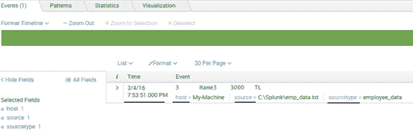
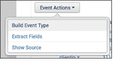
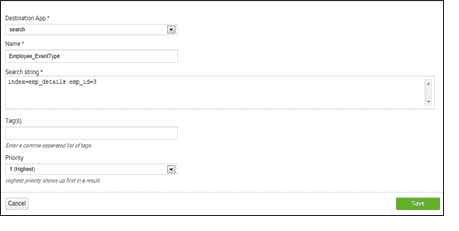
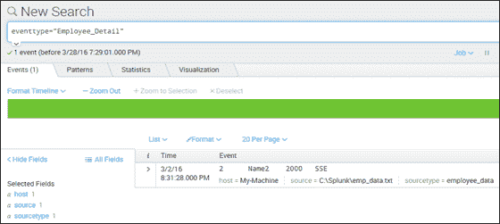
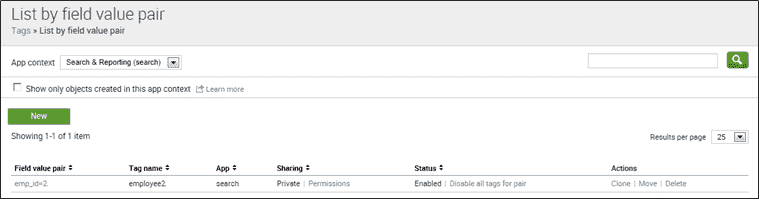
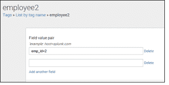
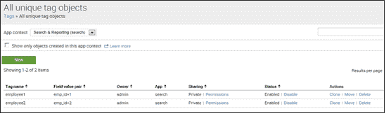

# Splunk 知识对象:Splunk 事件、事件类型和标记

> 原文：<https://www.edureka.co/blog/splunk-events-event-types-and-tags/>

在我之前的博客中，我谈到了 3 个知识对象:[、Splunk 时间表、数据模型和警报](https://www.edureka.co/blog/splunk-timechart-data-models-alert/)，它们都与报告和可视化数据有关。 在这篇博客中，我将解释 Splunk 事件、事件类型和 Splunk 标签。 这些知识对象有助于丰富您的数据，使其更易于搜索和报告。通过 [Splunk 认证](https://www.edureka.co/splunk-certification-training)了解 Splunk 的所有信息。 那么，我们就从 Splunk 事件开始吧。

## **Splunk 事件**

一个事件是指任何一条单独的数据。已经转发到 Splunk 服务器的自定义数据称为 Splunk 事件。这些数据可以是任何格式，例如:字符串、数字或 JSON 对象。

让我向您展示 Splunk 中的事件:

  从上面的截图中可以看出，有一些默认字段(主机、源、源类型和时间)是在索引后添加的。让我们了解一下这些默认字段:

1.  主机:主机是数据来源的机器或设备的 IP 地址名称。以上截图中， My-Machine 为主机。
2.  Source: Source 是主机数据的来源。它是机器中的完整路径名或文件或目录。 例如:C:Splunkemp _ data . txt
3.  Sourcetype: Sourcetype 标识数据的格式，是日志文件、XML、CSV 还是线程字段。它包含事件的数据结构。 例如: employee_data
4.  Index:原始数据被编入索引的索引的名称。如果您没有指定任何内容，它将进入默认索引。
5.  时间:显示事件发生的时间的字段。每个事件都有条形码标记，不能更改。您可以在一段时间内对其进行重命名或切片，以更改其显示方式。 例如: 3/4/16 7:53:51 代表特定事件的时间戳。

现在，让我们了解 Splunk 事件类型如何帮助您对类似事件进行分组。

## **Splunk 事件类型**

假设您有一个包含雇员姓名和 雇员 ID的字符串，并且您想使用单个搜索查询来搜索该字符串，而不是分别搜索它们。Splunk 事件类型可以帮助您。它们将这两个独立的 Splunk 事件分组，您可以将该字符串保存为单个事件类型(Employee_Detail)。

*   Splunk 事件类型是指有助于根据共同特征对事件进行分类的数据集合。
*   这是一个用户定义的字段，它扫描大量数据，并以仪表板的形式返回搜索结果。您还可以根据搜索结果创建通知。

请注意，在定义事件类型时，不能使用管道字符或子搜索。但是，您可以将一个或多个标签与事件类型相关联。 现在，让我们了解一下这些 Splunk 事件类型是如何创建的。创建事件类型有多种方式:

1.  使用搜索
2.  使用构建事件类型实用程序
3.  使用 Splunk 网站
4.  【配置文件(eventtypes.conf)

让我们更详细地了解一下吧:1。 **使用搜索:** 我们可以通过编写简单的搜索查询来创建事件类型。通过以下步骤创建一个: >用搜索字符串 运行搜索例如:index = EMP _ details EMP _ id = 3； >点击另存为，选择事件类型。 你可以参考下面的截图更好的理解:

2。**使用构建事件类型实用程序:** 构建事件类型实用程序使您能够基于搜索返回的 Splunk 事件动态创建事件类型。该实用程序还允许您为事件类型指定特定的颜色。

你可以在你的搜索结果中找到这个实用工具。让我们通过下面的步骤:步骤 1:打开下拉事件菜单   步骤 2:找到事件时间戳旁边的向下箭头   步骤 3:单击构建事件类型 

3。**使用 Splunk Web:** 这是创建事件类型的最简单方法。为此，您可以遵循以下步骤:转到设置导航到 Ev e nt 类型单击新建

为了简单起见，让我举一个同样的员工例子。 搜索查询在这种情况下也是一样:index = EMP _ details EMP _ id = 3

参考下面截图可以更好的理解:

4。**配置文件(eventtypes.conf):** 您可以通过直接编辑＄SPLUNK _ HOME/etc/system/local中的 eventtypes.conf 配置文件来创建事件类型，例如:【Employee _ Detail】参考下面的截图可以更好的理解:

到目前为止，您应该已经了解了事件类型是如何创建和显示的。接下来，让我们了解如何使用 Splunk 标签，以及它们如何让您的数据更加清晰。

**Splunk 标签**你一定清楚一个标签一般意味着什么。我们大多数人都使用脸书的标签功能来给帖子或照片中的朋友添加标签。即使在 Splunk 中，标记也以类似的方式工作。我们用一个例子来理解这个。Splunk 索引有一个 emp_id 字段。现在，您想为 emp_id=2 字段/值对提供一个标记(Employee2)。我们可以为 emp_id=2 创建一个标签，现在可以使用 Employee2 对其进行搜索。

*   Splunk 标签用于为特定字段和值组合指定名称。
*   在搜索时成对得到结果是最简单的方法。任何事件类型都可以有多个标签来快速获得结果。
*   有助于更高效地搜索 组事件数据。
*   标记是在键值对上完成的，这有助于获得与特定事件相关的信息，而事件类型提供与其相关的所有 Splunk 事件的信息。
*   您也可以将多个标签分配给一个值。

查看右侧截图，创建 Splunk 标签。

进入设置- >标签

现在，你可能已经理解了标签是如何创建的。现在让我们了解一下 Splunk 标签是如何管理的。设置下标签页有三个视图: 1。按字段列出值对 2。按标签名称列出 3。所有唯一标记对象

让我们深入了解更多细节，理解管理 的不同方式，并快速访问标签和字段/值对之间的关联。1。**按字段值对列出:** 这有助于您查看或定义字段/值对的一组标签。您可以看到特定标签的这种配对列表。 参考下面截图可以更好的理解:

2。 **按标签名称列出:**它帮助您查看和编辑字段/值对的集合。您可以转到“按标签名称列出”视图，然后单击标签名称，找到特定标签的字段/值配对列表。这会将您带到标签的详细页面。 例:打开员工 2 标签的详情页。 参考下面截图可以更好的理解:

3。**所有唯一标签对象:**它帮助您提供系统中所有唯一标签名称和字段/值配对。您可以搜索特定的标签，以快速查看与其相关联的所有字段/值对。您可以轻松地维护权限，以启用或禁用特定的标签。

参考下面的截图可以更好的理解:

现在，有两种方法可以搜索标签:

*   如果我们需要搜索与任何字段中的值相关联的标记，我们可以使用:tag =<tagname>在上面的例子中，它将是:tag=employee2
*   如果我们正在寻找与指定字段中的值相关联的标记，我们可以使用: 标记::<字段> = <标记名> 在上面的例子中，它将是:tag::emp_id=employee2

在这篇博客中，我解释了三个知识对象(Splunk 事件、事件类型和标签),它们有助于您更轻松地进行搜索。在我的下一篇博客中，我将解释更多的知识对象，如 Splunk 字段、字段提取如何工作以及 Splunk 查找。希望你喜欢阅读我关于知识对象的第二篇博客。

