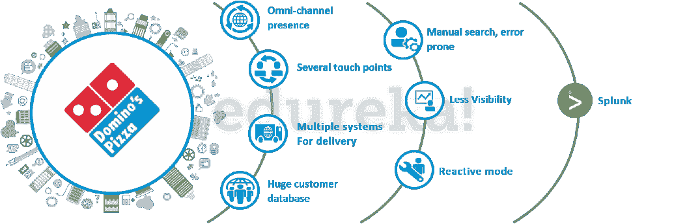
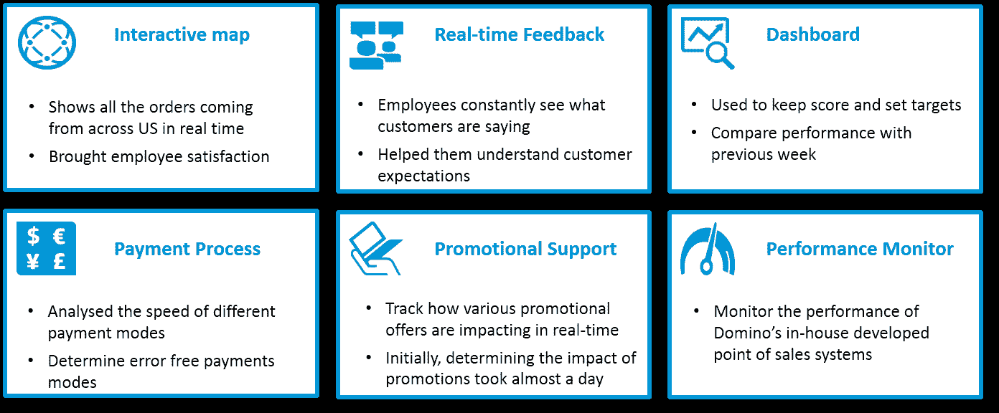
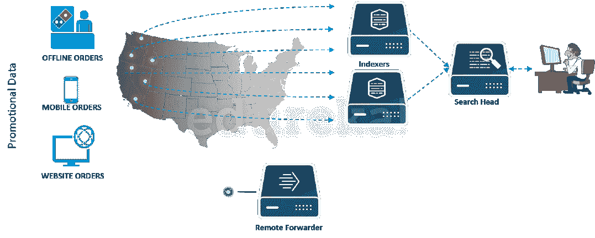
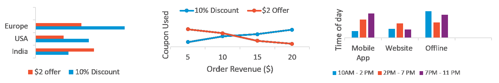

# Splunk 用例:Domino 的成功故事

> 原文：<https://www.edureka.co/blog/splunk-use-case>

虽然许多公司和组织使用 Splunk 来提高运营效率，但在这篇博文中，我将讲述达美乐比萨如何使用 Splunk 来分析消费者行为，以构建数据驱动的业务战略。此 Splunk 使用案例展示了 Splunk 如何广泛应用于任何领域。对 [Splunk 培训的需求](https://www.edureka.co/splunk-certification-training)随着各种规模的公司积极使用 Splunk 并寻求相同的认证专业人员，该行业对技能的需求正在飙升。

## **Splunk 用例:达美乐比萨**

您可能知道达美乐比萨是一家电子商务兼快餐巨头，但您可能不知道他们面临的大数据挑战。他们希望了解客户的需求，并通过使用大数据更有效地满足他们的需求。这就是 Splunk 出手相救的地方。

请看下图，该图描绘了导致达美乐大数据问题的环境。

产生大量非结构化数据的原因是:

*   他们通过全渠道推动销售
*   他们拥有庞大的客户群
*   他们有几个客户服务接触点
*   他们提供了多种交付系统:店内订餐、电话订餐、网站订餐和跨平台移动应用程序订餐
*   他们用一个新工具升级了他们的移动应用程序，以支持“语音订购”并能够跟踪他们的订单

产生的过量数据导致了以下问题:

*   手动搜索繁琐且容易出错
*   对客户需求/偏好变化的了解较少
*   毫无准备，因此以反应模式工作以解决任何问题

达美乐认为这些问题的解决方案在于一种能够轻松处理数据的工具。那时他们实施了 Splunk。

*“Up until implementing Splunk, managing the company’s application and platform data was a headache, with much of its log files in a giant mess” – according to their Site Reliability & Engineering Manager, Russell Turner*

**Turner 提到，使用 Splunk 的运营智能取代传统的 APM 工具帮助他降低了成本，更快地搜索数据，监控性能，并更好地了解客户如何与 Domino 交互。如果您查看下图，您会发现通过实施 Splunk 设置的不同应用程序。**

****

***   互动地图，用于实时显示来自我们各地的订单。这给员工带来了满足感和动力*   实时反馈，让员工不断了解客户的意见并理解他们的期望*   仪表板，用于记录分数和设定目标，将他们的业绩与前几周/前几个月以及其他商店的业绩进行比较*   支付过程，用于分析不同支付方式的速度，并识别无误的支付方式*   促销支持，用于实时识别各种促销优惠的影响。在实施 Splunk 之前，同样的任务通常需要一整天的时间*   性能监控，监控 Domino 内部开发的销售点系统的性能**

**事实证明，Splunk 对 Domino 非常有益，IT 部门以外的团队开始探索使用 Splunk 从他们的数据中获得洞察力的可能性。**

## ****Splunk 获取促销数据洞察****

***我将展示一个假设的 Splunk 使用案例场景，帮助您了解 Splunk 的工作原理。该场景展示了达美乐比萨如何使用促销数据来更清楚地了解不同地区、订单收入规模和其他变量* 中哪种优惠/优惠券最有效。**

***注:所使用的促销数据示例具有代表性，所提供的数据可能不准确。**

**达美乐不清楚哪种优惠最有效，具体体现在:**

***   优惠类型(他们的客户喜欢 10%的折扣还是固定的 2 美元折扣？)*   地区层面的文化差异(文化差异在报价选择中起作用吗？)*   用于购买产品的设备(用于订购的设备在产品选择中起作用吗？)*   购买时间(订单生效的最佳时间是什么时候？)*   订单收入(报价响应会改变订单收入大小吗？)**

**从下图中可以看出，促销数据是从移动设备、网站和达美乐比萨的各个门店(使用 Splunk Forwarders)收集的，并被发送到一个中心位置(Splunk 索引器)。**

****

**Splunk forwarders 会发送实时生成的促销数据。这些数据包含了客户在获得优惠时如何反应的信息，以及其他变量，如人口统计数据、时间戳、订单收入规模和使用的设备。**

**客户被分为两组进行 A/B 测试。每套都有不同的报价:10%的折扣和 2 美元的统一报价。对他们的回答进行分析，以确定客户更喜欢哪种报价。**

**数据还包括顾客做出回应的时间，以及他们是更喜欢在店内购买还是更喜欢在线订购。如果他们是在网上完成的，那么他们用来购物的设备也包括在内。最重要的是，它包含订单收入数据，以了解报价响应是否随订单收入大小而变化。**

**转发原始数据后，Splunk 索引器被配置为提取相关信息并将其存储在本地。相关信息是对优惠做出响应的顾客、他们做出响应的时间以及用于兑换优惠券/优惠的设备。**

**通常，存储以下信息:**

***   基于客户反应的订单收入*   购买产品的时间*   客户首选的下单设备*   使用的优惠券/优惠*   基于地理位置的销售数字**

**为了对索引数据执行各种操作，使用了搜索头。该组件提供了一个图形界面，用于搜索、分析和可视化索引器中存储的数据。达美乐比萨通过使用搜索头提供的可视化仪表盘获得了以下见解:**

****

***   在美国和欧洲，顾客更喜欢 10%的折扣，而不是 2 美元的优惠。而在印度，顾客更倾向于固定的 2 美元报价*   当订单收入规模较大时，10%折扣优惠券使用较多，而当订单收入规模较小时，固定 2 美元优惠券使用较多。*   移动应用是晚上点餐的首选设备，来自网站的订单在中午最多。而上午店内订单量最高**

**达美乐比萨整理了这些结果，根据特定地区客户的订单收入规模定制优惠/优惠券。他们还确定了提供优惠/优惠券的最佳时机，并根据客户使用的设备来锁定客户。**

**还有其他几个 Splunk 使用案例 的故事，展示了各种公司如何从中受益、发展业务、提高生产力和安全性。**

***这篇 Splunk 使用案例博客会让你对 Splunk 的工作原理有一个大致的了解。阅读我关于 Splunk 架构的下一篇博客，了解不同的 Splunk 组件以及它们之间的交互方式。***