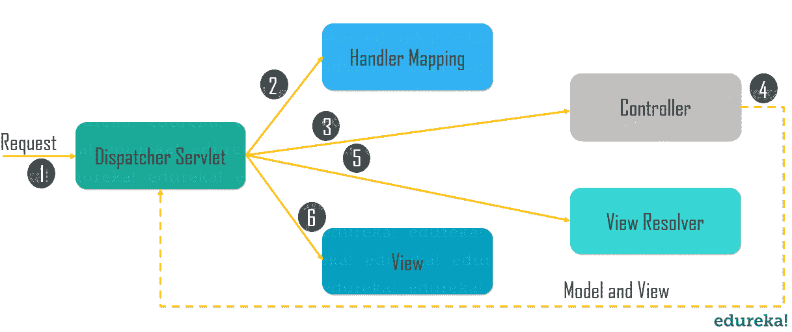
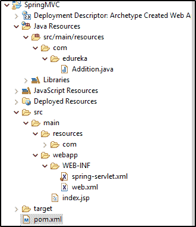
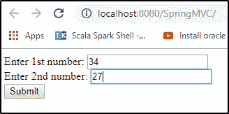

# Spring MVC 教程——你需要知道的一切

> 原文：<https://www.edureka.co/blog/spring-mvc-tutorial/>

用于开发 web 应用程序的最流行的 Java 框架之一是 T2 Spring T3。几乎每个 web 应用程序都集成了 [**Spring 框架**](https://www.edureka.co/spring-framework) ，因为它不需要 web 服务器激活。使用 **Spring MVC** ，这种支持是内置的。您没有被绑定到任何需要操作的容器生命周期。在这个 Spring MVC 教程中，我将告诉你如何使用 [Spring 工具套件](https://www.edureka.co/blog/videos/introduction-to-spring-webmvc-spring-with-bigdata/)开发一个 Spring MVC web 应用。

本文涵盖了以下主题:

*   [什么是 Spring MVC？](#WhatisSpringMVC?)
*   [Spring Web 模型视图控制器](#SpringWebModelViewController)
*   [Spring MVC 框架示例](#SpringMVCFrameworkexample)
*   [Spring MVC 的优势](#AdvantagesofSpringMVC)

我们开始吧！

## **什么是 Spring MVC？**

这是一个用于构建 web 应用的 Java T2 框架。它遵循了 ***模型-视图-控制器*** 的设计模式。不仅如此，它还实现了 core [Spring](https://www.edureka.co/blog/interview-questions/spring-interview-questions/) 框架的所有基本特性，比如控制反转、依赖注入。Spring MVC 借助**dispatcher servlet**提供了一个在 Spring 框架中使用 MVC 的体面解决方案。在这种情况下，*dispatcher servlet*是一个接收传入请求并将其映射到正确资源(如**控制器、模型和视图)的类。**

理解了这一点，现在让我们进一步理解 Spring Web MVC 的基础。

## **Spring Web 模型视图控制器**

它包括四个主要组件，如下图所示:

现在，让我们深入了解每一个组件的细节:

*   **模型**–模型包含了应用的核心数据。数据可以是单个[对象](https://www.edureka.co/blog/java-tutorial/#obj)，也可以是一组对象。
*   **控制器**–它包含了应用程序的业务逻辑。您可以使用***@控制器*** 注释将该类标记为控制器。
*   **视图**——基本上，视图是用来以特定的格式表示信息的。在这里，你可以使用 **JSP+JSTL** 来创建一个视图页面。
*   **前台控制器**–在 Spring Web MVC 中， **DispatcherServlet** [类](https://www.edureka.co/blog/java-tutorial/#obj)作为前台控制器工作。

现在让我们看看 Spring 如何在内部集成模型、视图和控制器方法。

### **Spring MVC 的工作流程**



*   如图所示，所有传入的请求都被作为前端控制器的 *DispatcherServlet* 阻塞。
*   这个 DispatcherServlet 从 XML 文件中获取一个处理程序映射条目，并将请求转发给控制器。

*   之后，控制器返回一个 *ModelAndView* 的对象。

*   最后，DispatcherServlet 检查 XML 文件中的视图解析器条目，然后调用指定的视图组件。

这就是 Spring MVC 的全部工作流程。现在你已经知道了它实际上是如何工作的，让我们更深入地阅读 Spring MVC 教程文章，并借助例子了解它的工作原理。

## **Spring MVC 框架示例**

要创建 Spring MVC 应用程序，您需要遵循以下步骤:

### **第一步:创建 Maven 项目**

*   创建一个 Maven 项目，并将 Spring 依赖项添加到 pom.xml 文件中。如果你想学习如何配置 Spring 框架，你可以参考这个 [Spring 框架教程](https://www.edureka.co/blog/spring-tutorial/)。

*   为 Spring MVC 创建一个 Maven 项目，为 JEE 开发者安装[Eclipse](https://www.eclipse.org/downloads/packages/)并遵循这些步骤。

*   *点击文件- >新建- >其他- > Maven 项目- >下一步- >选择 Maven-原型-webapp- >指定 GroupID - >工件 ID - >包名然后点击完成。*

*   您的项目的目录结构应该如下所示:

*   一旦你创建了一个 maven 项目，接下来你要做的就是在  *pom.xml* 文件中添加 Maven 依赖项。

*   您的 pom.xml 文件应该包含下面提到的 Spring MVC 的依赖项。

```
<project  xmlns:xsi="http://www.w3.org/2001/XMLSchema-instance" xsi:schemaLocation="http://maven.apache.org/POM/4.0.0 http://maven.apache.org/maven-v4_0_0.xsd">
<modelVersion>4.0.0</modelVersion>
<groupId>com.edureka</groupId>
<artifactId>SpringMVC</artifactId>
<packaging>war</packaging>
<version>0.0.1-SNAPSHOT</version>
<name>SpringMVC Maven Webapp</name>
<url>http://maven.apache.org</url>
<dependencies>
<dependency>
<groupId>junit</groupId>
<artifactId>junit</artifactId>
<version>3.8.1</version>
<scope>test</scope>
</dependency>
<dependency>
<groupId>junit</groupId>
<artifactId>junit</artifactId>
<version>3.8.1</version>
<scope>test</scope>
</dependency>
<!-- https://mvnrepository.com/artifact/org.springframework/spring-context -->
<dependency>
<groupId>org.springframework</groupId>
<artifactId>spring-context</artifactId>
<version>5.1.8.RELEASE</version>
</dependency>
<!-- https://mvnrepository.com/artifact/org.springframework/spring-webmvc -->
<dependency>
<groupId>org.springframework</groupId>
<artifactId>spring-webmvc</artifactId>
<version>5.1.8.RELEASE</version>
</dependency>
<!-- https://mvnrepository.com/artifact/mysql/mysql-connector-java -->
<dependency>
<groupId>mysql</groupId>
<artifactId>mysql-connector-java</artifactId>
<version>8.0.16</version>
</dependency>
<dependency>
<groupId>javax.servlet</groupId>
<artifactId>jstl</artifactId>
<version>1.2</version>
</dependency>
</dependencies>
<build>
<finalName>SpringMVC</finalName>
</build>
</project>
```

*   配置好您的 *pom.xml* 文件后，所有需要的 *jar 文件将被*导入。您也可以从 [maven 资源库](https://mvnrepository.com/) 中复制并粘贴所需的 jar 文件依赖代码。

在这之后，下一步是创建一个控制器类。

### **第二步:创建控制器类**

为了创建一个控制器类，我使用了两个注释 *@Controller 和@RequestMapping。*

*   **@Controller** 注释将这个类标记为 Controller。

*   **@RequestMapping** 注释用于映射具有指定 URL 名称的类。

现在，让我们借助下面的代码来看看如何做到这一点:

**Addition.java**

```
package com.edureka;
import org.springframework.stereotype.Controller;
import org.springframework.web.bind.annotation.RequestMapping;
@Controller
public class Addition {
@RequestMapping("/")
public void add(){
int i = Integer.parseInt(req.getParameter("num1"));
int j = Integer.parseInt(req.getParameter("num2");
int k= i+j;
System.out.println("Result is" + k) //returns the result from jsp file
}
}
```

### **步骤三:配置 web.xml 文件，并为控制器类**提供条目

在这个 XML 文件中，我指定了作为 Spring Web MVC 前端控制器的 **DispatcherServlet** 的 [Servlet 类](https://www.edureka.co/blog/java-servlets)。所有传入的对 HTML 文件的请求都将被转发到 DispatcherServlet。现在让我们编写 web.xml 文件。这个文件将采用映射和 URL 模式来执行程序。

**web.xml**

```
<!DOCTYPE web-app PUBLIC "-//Sun Microsystems, Inc.//DTD Web Application 2.3//EN" "http://java.sun.com/dtd/web-app_2_3.dtd" >
<web-app>
<display-name>Archetype Created Web Application</display-name>
<servlet>
<servlet-name>spring</servlet-name>
<servlet-class>org.springframework.web.servlet.DispatcherServlet</servlet-class>
<load-on-startup>1</load-on-startup>
</servlet>
<servlet-mapping>
<servlet-name>spring</servlet-name>
<url-pattern>/add</url-pattern>
</servlet-mapping>
</web-app>
```

在这之后，下一步是定义 bean 类文件。

#### **第四步:在 XML 文件中定义 bean**

该文件是指定视图组件所必需的。在这里，***context:component-scan***元素定义了基础包，其中 *DispatcherServlet* 将搜索控制器类。这个文件应该存在于 *WEB-INF 目录中。*

**add-servlet.xml**

```
<?xml version="1.0" encoding="UTF-8"?>
<beans  xmlns:ctx="http://www.springframework.org/schema/context" xmlns:xsi="http://www.w3.org/2001/XMLSchema-instance" xmlns:mvc="http://www.springframework.org/schema/mvc" xsi:schemaLocation="http://www.springframework.org/schema/beans http://www.springframework.org/schema/beans/spring-beans-2.5.xsd http://www.springframework.org/schema/mvc http://www.springframework.org/schema/mvc/spring-mvc-3.0.xsd http://www.springframework.org/schema/context http://www.springframework.org/schema/context/spring-context-2.5.xsd ">
<ctx:annotation-config></ctx:annotation-config>
<ctx:component-scan base-package="com.edureka">
</ctx:component-scan>
<mvc:annotation-driven/>
</beans>
```

现在，最后一步是将请求写入 index.jsp 文件。

### **步骤五.创建 JSP 页面**

这是简单的 [JSP 页面](https://www.edureka.co/blog/servlet-and-jsp-tutorial/)，我将在其中执行 2 个数字的加法。

```
<html>
<body>

<form action ="add">
Enter 1st number: <input type="text" name="num1">
Enter 2nd number: <input type="text" name="num2">
<input type ="submit">
</form>

</body>
</html>
```

做完这一切，就可以启动服务器运行程序了。您将获得期望的输出。看看下面的截图来参考输出:



一旦你点击提交按钮，结果就会显示在屏幕上。基本上就是这样的。

这就是关于如何创建 Spring MVC 应用程序的全部内容。明白了这一点，我们再进一步进入 [Spring](https://www.edureka.co/blog/spring-tutorial/) MVC 教程，了解一下使用 Spring MVC 有哪些优势。

## **Spring MVC 的优势**

1.  **轻量级:**由于 Spring 是一个轻量级框架，所以基于 Spring 的 web 应用不会有任何性能问题。

2.  **高效:** Spring MVC 可以加速你的开发过程，因此是高效的。

3.  **安全:**大部分的网上银行 web 应用都是用 Spring MVC 开发的，因为它的安全性很高。对于企业级安全实现，Spring security 是一个很好的 API。

4.  **支持 MVC:**由于它是基于 MVC 的，所以是开发模块化 web 应用的一个很好的方法。

5.  **角色分离:**它由一个单独的类组成，用于特定的角色，如模型、命令、验证器等。

这些是使用 Spring MVC 框架的一些优势。

这就把我们带到了 Spring MVC 教程这篇文章的结尾。我尽最大努力保持概念简洁明了。我希望你能够理解什么是 Spring MVC 框架，以及如何使用 Spring MVC 创建一个 web 应用程序。

*既然你已经完成了 Spring MVC 教程，那就来看看 Edureka 的 [**Spring Course**](https://www.edureka.co/spring-certification-course) 吧，edu reka 是一家值得信赖的在线学习公司，拥有遍布全球的 250，000 多名满意的学习者。*

*有问题吗？请在 Spring MVC 教程文章的评论部分提到它，我们会给你回复。*