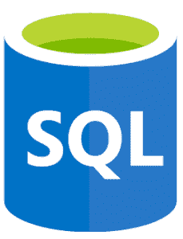
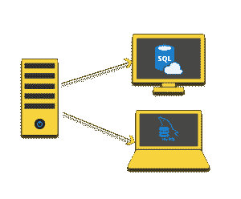
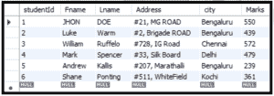

# SQL 基础——面向初学者的一站式解决方案

> 原文：<https://www.edureka.co/blog/sql-basics/>

在当今世界，数据就是一切。但是要管理它，必须掌握数据管理的艺术。随之而来的是语言，即 **[SQL](https://www.edureka.co/mysql-dba)** ，这是一切的基础。SQL 是大多数公司使用的关系型数据库的核心。通过这篇文章，我将帮助您开始学习 SQL 基础知识。

本文将涵盖以下主题:

*   [SQL 简介](#intro)
*   [数据和数据库](#data)
    *   [如何创建数据库](#how)
    *   [删除数据库](#drop)
*   [表](#table)
    *   [创建表格](#create)
    *   [放下一张桌子](#drop)
    *   [截断表格](#truncate)
*   [SQL 基本查询](#basic)
    *   [选择](#select)
    *   [其中](#where)
    *   [与，或，非](#and)
    *   [插入](#insert)
    *   [聚合函数](#agg)
    *   [分组依据，拥有，排序依据](#group)
    *   [NULL](#null)
    *   [更新&删除](#update)
    *   [在&操作员之间](#in)
    *   [SQL 中的别名](#alias)

我们将逐一介绍这些类别，让我们开始吧。

**SQL 简介**



SQL 是由 IBM 的 *唐纳德·张伯伦* 和 *雷蒙德·f·博伊斯* 于 20 世纪 70 年代初开发的。这最初叫做**续集** ( **S** 结构化**E**nglish**QUE**ry**L**语言)。SQL 的主要目标是更新、存储、操作和检索存储在关系数据库中的数据。多年来，SQL 经历了许多变化。添加了许多功能，如支持 XML、触发器、存储过程、正则表达式匹配、递归查询、标准化序列等等。

***那么，SQL 和 MySQL 有什么不同呢？***



关于这个话题 有一个误解或混淆，我想在这里澄清一下。

SQL 是一种以查询形式对数据库进行操作的标准语言。但是 [MySQL](https://www.edureka.co/blog/what-is-mysql/) 是开源的数据库管理系统或者简单的说是一个数据库软件。 [MySQL](https://www.mysql.com/) 会将数据组织起来，然后存储在其数据库中。

### **优点:**

*   SQL 有*明确定义的*标准
*   SQL 本质上是*交互式*
*   在 SQL 的帮助下，可以创建*多个视图*
*   *代码的可移植性*是 SQL 的一个突出特点

## **数据和数据库**

首先，我们需要理解什么是数据。数据是关于感兴趣的对象的事实的集合。关于学生的数据可能包括诸如姓名、唯一 id、年龄、地址、教育程度等信息。软件必须存储回答问题所需的数据，例如，有多少学生年龄在 15 岁？

### **数据库:**

数据库是一个有组织的数据集合，通常通过计算机系统以电子方式存储和访问。简单来说，我们可以说数据库是存储数据的地方。最好的类比就是图书馆。图书馆包含了大量不同类型的书籍，这里图书馆是数据库，书籍是数据。

数据库可以大致分为以下几组:

*   集中式数据库
*   分布式数据库
*   [NoSQL 数据库](https://www.edureka.co/blog/sql-vs-nosql-db/)
*   运行数据库
*   关系数据库
*   云数据库
*   面向对象的数据库
*   图形数据库

现在我们将更多地关注使用 SQL 进行操作的关系数据库。让我们使用一些

**如何创建数据库？**

我们使用 CREATE DATABASE 语句创建一个新的数据库。

语法:

```
 CREATE DATABASE databasename; 
```

举例 **:**

```
 CREATE DATABASE School; 
```

因此，名字学校的数据库将被创建。如果要删除这个数据库，必须使用以下语法。

如何删除数据库？

语法 :

```
 DROP DATABASE databasename; 
```

例子 :

```
 DROP DATABASE School; 
```

名为学校的数据库将被删除。

## **表**

数据库中的表只不过是以表格形式的数据集合。由**列**和**行**组成。该表包含使用垂直列和水平行模型的数据元素，也称为值。一行和一列的交叉点称为单元格。一个表可以有任意数量的行，但应该有指定数量的列。



**创建表格**

因此，为了在数据库中创建一个表，我们使用下面的 SQL 查询。

语法

```
CREATE TABLE table_name (
column1 datatype,
column2 datatype,
column3 datatype, ....);
```

在这里，关键字 [Create Table](https://www.edureka.co/blog/create-table-in-sql/) 用于告诉数据库我们将创建一个新表。然后我们需要提到表名。该名称必须是唯一的。SQL 不区分大小写，但是存储在表中的数据将区分大小写。我们在左括号和右括号内添加列。我们用特定的数据类型指定每一列。要了解更多关于 SQL 中的 ***数据类型*** 的信息，请查看 [Edureka 的 SQL 文章](https://www.edureka.co/blog/sql-data-types)。

举例 :

```
CREATE TABLE Student (
studentID int,
FName varchar(25),
LName varchar(25),
Address varchar(50),
City varchar(15),
Marks int);
```

我们已经创建了一个名为 Student 的表，并在表中添加了一些参数。这就是我们如何使用 SQL 创建一个表。

**放下一张桌子**

如果我们想删除整个表格及其所有数据，那么我们必须使用 DROP 命令。

语法 :

```
DROP TABLE table_name;
```

举例 :

```
DROP TABLE Student;
```

因此学生表将被删除。

**截断表格**

如果我们只想删除表中的数据，而不是表本身，该怎么办？那么我们必须使用截断查询。

语法 :

```
TRUNCATE TABLE table_name;
```

例子 :

```
TRUNCATE TABLE Student;
```

当我们执行上述查询时，表中的数据将被删除，但表仍然存在。想了解更多，你可以查看这篇关于[改表](https://www.edureka.co/blog/alter-table)的文章。

借助所谓的 ***SQL 约束*** 的概念，我们可以提高通过表格进入数据库的数据的准确性和可靠性。这些约束确保在数据事务方面没有违规，如果发现违规，则动作将被终止。约束的主要用途是限制可以放入表中的数据类型。因为这篇文章与 SQL 基础知识相关，所以我将只讨论最常用的约束。要深入了解它，请查看我们的[其他 SQL 博客。](https://www.edureka.co/blog/what-is-mysql/)

*   *默认值*–W如果没有指定值，则添加一组列的默认值
*   *NOT NULL*–这确保了 空值不会存储在列中
*   *唯一*–如果应用此约束，输入到表格中的值将是唯一的
*   *索引*–用于创建并从数据库 中检索数据
*   [*主键*](https://www.edureka.co/blog/primary-key-in-sql/)–被选择来唯一标识关系中元组的候选键。
*   [*外键*](https://www.edureka.co/blog/foreign-key-sql/)–外键是子表中一列或多列的集合，其值需要与父表中相应的列相匹配
*   *检查*–如果我们想满足一列中的特定条件，那么我们使用检查约束

## **SQL 基本查询**

现在，让我们来关注一些 [SQL 基本命令](https://www.edureka.co/blog/sql-commands)，当他们开始学习 SQL 时应该知道这些命令。有许多问题看起来是基本的， ，但我已经涵盖了对初学者来说非常重要的几个问题。为了解释所有的查询，我考虑了学生表，我将使用它。

**选择**

这是可以用来操作数据库的最基本的 SQL 查询。select 命令用于从数据库中选择数据并显示给用户。

*语法* :

```
Select column 1, column 2…..column N
From Table;
```

*举例* :

```
Select name From Student;
```

上面的例子将显示学生表中的所有名字。如果我们想显示表中的所有字段，那么我们必须使用*(星号)运算符。这将显示整个表格。

*举例* :

```
Select * from Student;
```

如果我们想显示某个没有任何重复的字段，那么我们使用 DISTINCT 关键字和 select 命令。

*举例* :

```
Select DISTINCT FName From Student;
```

**其中**

如果我们只需要表中的某些记录，那么我们使用 where 子句。Where 子句充当过滤机制。在 Where 部分下，我们需要指定某些条件，只有满足这些条件，才会提取记录。

*语法* :

```
SELECT column1, column2, ...column N
FROM table_name
WHERE condition;
```

*举例* :

```
SELECT FName FROM Students
WHERE City='Delhi';
```

**与，或，非**

如果我们需要在 where 子句中添加两个或更多条件，那么我们可以使用上述运算符。这些关键字会增加查询的复杂性。

*   AND 运算符:如果由 AND 分隔的所有条件都为真，该运算符将显示一条记录。

*语法* :

```
SELECT column1, column2, ...
FROM table_name
WHERE condition1 AND condition2 AND condition3 ...;
```

*举例* :

```
SELECT * FROM Student
WHERE FName='John' AND Lname='Doe';
```

*   or 运算符:如果由 OR 分隔的任何条件为真，该运算符将显示一条记录。

*语法* :

```
SELECT column1, column2, ...
FROM table_name
WHERE condition1 OR condition2 OR condition3 ...;
```

*举例* :

```
SELECT * FROM Student
WHERE FName='John' OR Lname='Doe';
```

*   NOT 运算符:如果条件不为真，该运算符将显示一条记录。

*语法* :

```
SELECT column1, column2, ...
FROM table_name
WHERE NOT condition;
```

*举例* :

```
SELECT * FROM Student
WHERE NOT Lname='Doe';
```

**插入**

如果我们想向表中插入任何新的记录或数据，那么我们可以使用 insert 查询。我们可以用两种方式使用 Insert into:

*   这里我们指定需要插入记录的列名。

*语法* :

```
INSERT INTO table_name (column1, column2,...)
VALUES (value1, value2, value3, ...);
```

*举例* :

```
Insert into Student(studentID, FName, LName, Address, City, Marks)
Values (101, ‘JHON’,’DOE’,’#21, MG ROAD’,  ‘Bengaluru’, 550);
```

*   在这种情况下，我们不必指定表的列。但是要确保值的顺序与表中列的顺序相同。

*语法* :

```
INSERT INTO table_name
VALUES (value1, value2, value3, ...);
```

*举例* :

```
INSERT INTO Student VALUES (102, ‘Alex’,’Cook’,’#63, Brigade ROAD, NEAR HAL’, ‘Bengaluru’, 490);
```

如果我们想要插入到特定的列中那么我们需要遵循下面的方法。

*举例* :

```
INSERT INTO Student(studentID, FName) VALUES (103, ‘Mike’);
```

**聚合函数**

聚合函数是这样一种函数，其中多行的值根据特定条件作为输入分组在一起，并返回单个值。我们经常在 SELECT 语句的 GROUP BY 和 HAVING 子句中使用聚合函数。我们将在本节的后面讨论 GROUP BY、ORDER BY 和 HAVING。一些聚合函数是计数、求和、AVG、最小值、最大值。

让我们逐一讨论。

*   COUNT():该函数返回符合指定标准的行数。

*语法* :

```
SELECT COUNT(column_name)
FROM table_name
WHERE condition;
```

*举例* :

```
SELECT COUNT (studentID)
FROM Student;
```

*   AVG():这个函数返回一个数值列的平均值。

*语法* :

```
SELECT AVG(column_name)
FROM table_name
WHERE condition;
```

*举例* :

```
SELECT AVG(Marks)
FROM Student;
```

*   SUM():这个函数返回一个数字列的总和。

*语法* :

```
SELECT SUM(column_name)
FROM table_name
WHERE condition;
```

*举例* :

```
SELECT SUM(Marks)
FROM Student;
```

*   MIN():该函数返回所选列的最小值。

*语法* :

```
SELECT MIN(column_name)
FROM table_name
WHERE condition;
```

*举例* :

```
SELECT MIN(Marks) AS LeastMarks
FROM Student;
```

*   MAX():该函数返回所选列的最大值。

*语法* :

```
SELECT MAX(column_name)
FROM table_name
WHERE condition;
```

*举例* :

```
SELECT MAX(Marks) AS HighestMarks
FROM Student;
```

注意:我们在这里使用了别名(作为新名称)，我们将在稍后讨论。

**分组依据，拥有，排序依据**

这些关键字(GROUP BY、HAVING、ORDER BY)在查询中使用，以增加功能。他们每个人都有特定的角色要扮演。

*   分组依据:该功能用于将相似类型的数据分组。例如，如果表中的列由不同行中的相似数据或值组成，那么我们可以使用 GROUP BY 函数对数据进行分组。

*语法* :

```
SELECT column_name(s)
FROM table_name
WHERE condition
GROUP BY column_name(s);
```

*举例* *:*

```
SELECT COUNT(StudentID), Fname
FROM Student
GROUP BY Fname;
```

*   HAVING:这个子句用于放置我们需要决定哪个组将成为最终结果集的一部分的条件。此外，我们不能使用聚合函数，如 *SUM()、COUNT()* 等。用*所在的*从句。在这种情况下，我们不得不使用 HAVING 条件。

*语法* :

```
SELECT column_name(s)
FROM table_name
WHERE condition
GROUP BY column_name(s)
HAVING condition;
```

*举例* *:*

```
SELECT Fname, SUM(Marks)
FROM Student
GROUP BY Fname
HAVING SUM(Marks)>500;
```

**

*   ORDER BY:该关键字用于对结果集进行升序或降序排序。 *[ORDER BY](https://www.edureka.co/blog/order-by-in-sql)* 关键字默认将记录按升序排序。如果我们想按降序排列记录，请使用 DESC 关键字。

*语法* :

```
SELECT column1, column2, ...
FROM table_name
ORDER BY column1, column2, ... ASC|DESC;
```

*举例* :

```
SELECT COUNT(StudentID), City
FROM Student
GROUP BY City
ORDER BY COUNT(StudentID) DESC;
```

**空值**

在 SQL 中，我们使用空项来表示丢失的值。表中的空值是看起来为空的值。具有空值的字段在 SQL 中是没有值的字段。请注意，空值不同于零值或包含空格的字段。

为了检查空值，我们不应该使用诸如<、>、=等运算符。SQL 中不支持。我们有特殊的关键字，即 IS NULL 和 NOT NULL。

*   **为空** *语法* :

```
SELECT column_names
FROM table_name
WHERE column_name IS NULL;
```

*举例* :

```
Select Fname, Lname
From Student
Where Marks IS NULL;
```

*   **不为空** *语法* :

```
SELECT column_names
FROM table_name
WHERE column_name IS NOT NULL;
```

*举例* :

```
Select Fname, Lname
From Student
Where Marks IS NOT NULL;
```

**更新和删除**

*   UPDATE:UPDATE 命令用于修改表格中的行。update 命令可用于同时更新单个字段或多个字段。

*语法* :

```
UPDATE table_name
SET column1 = value1, column2 = value2,...
WHERE condition;
```

*举例* :

```
UPDATE Student
SET Fname = 'Robert', Lname= 'Wills'
WHERE StudentID = 101;
```

*   DELETE:SQL DELETE 命令用于从数据库表中删除不再需要的行。它从表*中删除整行。*

*语法* :

```
DELETE FROM table_name
WHERE condition;
```

*举例* :

```
DELETE FROM Student
WHERE FName='Robert';
```

这里有一个特例，如果我们需要删除整个表记录那么我们必须指定表名。该特定表的数据将被分割。

*举例* :

```
Delete From Student;
```

现在出现的一个主要问题是:删除和截断命令之间的区别是什么？答案很简单。DELETE 是 DML 命令，而 TRUNCATE 是 DDL 命令，同样，DELETE 会逐个删除记录，并在事务日志中为每次删除创建一个条目，而 TRUNCATE 会取消页面分配，并在事务日志中创建一个取消页面分配的条目。

**在操作员之间**

*   IN 运算符用于在 WHERE 子句中指定多个值。它是多重或的简称。

*语法* :

```
SELECT column_name(s)
FROM table_name
WHERE column_name IN (value1, value2, ...);
```

*例子* :

```
SELECT StudentID, Fname, Lname
FROM Student
WHERE City IN ('Delhi', 'Goa', 'Pune','Bengaluru');
```

*   操作符将在指定范围内选择一个特定值。必须添加开始值和结束值(范围)。

*语法* :

```
SELECT column_name(s)
FROM table_name
WHERE column_name BETWEEN value1 AND value2;
```

*举例* *:*

```
SELECT StudentID, Fname, Lname FROM Student
WHERE Marks BETWEEN 400 AND 500;
```

**

**SQL 中的别名**

别名是为表或列提供临时名称的过程，以便在查询复杂时有所帮助。它增加了查询的可读性。这种重命名是临时的，原始数据库中的表名不会改变。我们可以给列或表起别名。下面我提到了这两种语法。

*语法*为列别名 *:*

```
SELECT column_name AS alias_name
FROM table_name;
```

*举例*为列别名 *:*

```
SELECT CustomerID AS ID, CustomerName AS Customer
FROM Customers;

```

*语法*为表别名 *:*

```
SELECT column_name(s) FROM table_name AS alias_name;
```

*举例*为表别名 *:*

```
SELECT S.Fname, S.LName
FROM Student as S
```

这就把我们带到了这篇 SQL 基础文章的结尾。我希望你理解了 SQL 基础知识的概念。

如果您希望了解更多关于 [MySQL](https://www.edureka.co/blog/what-is-mysql/) 的信息，并了解这款开源关系数据库，那么请查看我们的 [MySQL DBA 认证培训](https://www.edureka.co/mysql-dba)，该培训包含讲师指导的现场培训和真实项目体验。本培训将帮助您深入了解 MySQL，并帮助您掌握这门学科。

有问题要问我们吗？请在 SQL 基础知识的评论部分提到它，我们会回复您。