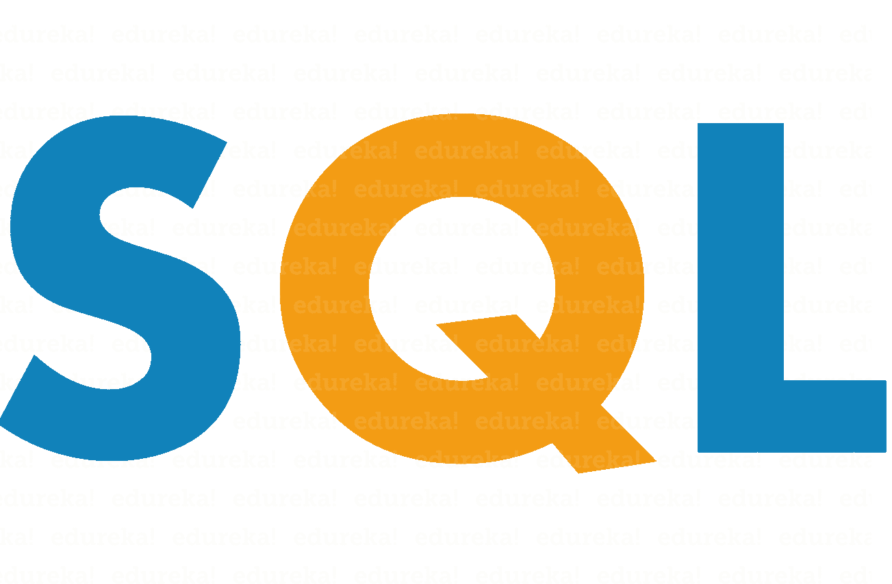

# 理解 SQL 数据类型——关于 SQL 数据类型您需要知道的一切

> 原文：<https://www.edureka.co/blog/sql-data-types/>

面对当今世界的数据量，没有合适的数据库来管理数据几乎是不可能的。SQL 是关系数据库的核心，它为你提供了处理数据的各种选项，因此 [SQL 技能](https://www.edureka.co/mysql-dba) 在大多数工作角色中都是不可或缺的。在这篇关于 SQL 数据类型的文章中，我们将讨论 SQL 中使用的不同数据类型。

本文涵盖了以下内容:

*   [数字数据类型](#Numeric%20Data%20Types)
    *   [精确数值数据类型](#Exact%20Numeric%20Data%20Types)
    *   [近似数值数据类型](#Approximate%20Numeric%20Data%20Types)
*   [字符串数据类型](#Character%20String%20Data%20Types)
    *   [Unicode 字符串数据类型](#Unicode%20Character%20Strings%20Data%20Types)
*   [二进制数据类型](#Binary%20Data%20Types)
*   [日期&时间数据类型](#Date%20and%20Time%20Data%20Types)
*   [其他数据类型](#Other%20Data%20Types)

那么，让我们从每一个开始吧。

## **SQL 数据类型:数值类型**

文章的这一部分将讨论数字数据类型。这些数据类型允许有符号和无符号整数。我将数字数据类型分为以下两部分:

### **精确数值数据类型**

| **数据类型** | **描述/范围** | **储存** |
|  | **描述** | **出自** | **到** |  |
| 少量 | 可以是 0、1 或 NULL 的整数。 | – |
| tinyint | 允许整数 |   0 | Two hundred and fifty-five | 1 字节 |
| 斯莫列特 | 允许整数 | -32768 | 32767 | 2 字节 |
| （同 Internationalorganizations）国际组织 | 允许整数 | -2147483648 | 2147483647 | 4 字节 |
| 比吉斯本 | 允许整数 | -9,223,372,036,854,775,808 | 9223372036854775807 | 8 字节 |
| 数字(p，s) | 允许一个数值。其中' **p** 为**精度值**，' **s** 为**刻度值** | -10^38 +1 | 10^38 一号 | 5-17 字节 |
| 十进制 | 允许十进制值。其中' **p** 为**精度值**，' **s** 为**刻度值** | -10^38 +1 | 10^38 一号 | 5-17 字节 |
| 小额资金 | 允许数据作为货币 | -214,748.3648 | +214748.3647 | 4 字节 |
| 钱 | 允许数据作为货币 | -922，337，203，685，477.5808 | 922，337，203，685，477.5807 | 8 字节 |

现在，让我们看看近似的数字数据类型。

### **近似数值数据类型**

| **数据类型** | **描述/范围** | **储存** |
|  | **描述** | **出自** | **到** |  |
| 浮动 | 允许浮点数数据 | -1.79E + 308 | 1.79E + 308 | 4 或 8 字节 |
| 真实的 | 允许浮点数数据 | -3.40E + 38 | 3.40E + 38 | 4 字节 |

接下来，在本文中，让我们看看 SQL 中使用的字符串数据类型。

## **SQL 数据类型:** **字符串数据类型**

本文的这一节将讨论字符数据类型。这些数据类型允许固定和可变长度的字符。请参考下表。

| **数据类型** | **描述/最大尺寸** | **储存** |
|  | **描述** | **最大尺寸** |  |
| 文本 | 允许一个 v 变长的字符串 | 2GB 的文本数据 | 4 字节+字符数 |
| varchar(最大值) | 允许一个 v 变长的字符串 | 2E + 31 个字符 | 2 字节+字符数 |
| 可变长字符串 | 允许一个 v 变长的字符串 | 8000 字 | 2 字节+字符数 |
| 茶 | 允许固定长度的字符串 | 8000 字 | 定义宽度 |

**注:**

*Ques: Why cannot we declare a value greater than VARCHAR(8000)? Ans: VARCHAR(n) is responsible for storing the data in a row page. Since in every page, the page header occupies the first 96 bytes and only 8096 bytes of data (8192 -96) are available for the row overhead and offsets, you cannot declare a value greater then VARCHAR(8000).*

**此外，我将字符串数据类型部分扩展为 Unicode 数据类型，因为我们的行业在世界上大多数书写系统中使用 Unicode 来一致地表示和处理文本。**

### ****Unicode 字符串数据类型****

| **数据类型** | **描述/最大尺寸** | **储存** |
|  | **描述** | **最大尺寸** |  |
| ntext | 允许可变长度的 Unicode 字符串 | 2GB 的文本数据 | 4 字节+字符数 |
| nvarchar(最大值) | 允许可变长度的 Unicode 字符串 | 2E + 31 个字符 | 2 字节+字符数 |
| nvarchar | 允许可变长度的 Unicode 字符串 | 4000 字 | 2 字节+字符数 |
| nchar | 允许 f 固定长度 Unicode 字符串 | 4000 字 | 定义宽度* 2 |

**接下来，在本文中，让我们看看 SQL 中使用的二进制数据类型。**

## ****SQL 数据类型:** **二进制数据类型****

**文章的这一部分将讨论二进制数据类型。这些数据类型允许固定和可变长度的二进制值。请参考下表。**

| **数据类型** | **描述/最大尺寸** |
|  | **描述** | **最大尺寸** |
| 图像 | 允许可变长度的二进制数据 | 2147483647 字节 |
| varbinary(最大值) | 允许可变长度的二进制数据 | 2E + 31 字节 |
| varbinary | 允许可变长度的二进制数据 | 8000 字节 |
| 二进制的 | 允许 f 定长二进制数据 | 8000 字节 |

**接下来，在本文中，让我们看看 SQL 中使用的日期和时间数据类型。**

## ****SQL 数据类型:**日期&时间 **数据类型****

**本文的这一节将讨论日期和时间数据类型。这些数据类型允许不同的日期和时间格式。请参考下表。**

| **数据类型** | **描述/范围** | **储存** |
|  | **描述** | **出自** | **到** |  |
| 日期 | 以年、月&日的格式存储日期。 | 0001 年 1 月 1 日 | 9999 年 12 月 31 日 | 3 字节 |
| 时间 | 以小时、分钟&秒的格式存储时间。 | 3-5 字节 |
| datetime | 存储日期和时间(精度为 3.33 毫秒) | 1753 年 1 月 1 日 | 9999 年 12 月 31 日 | 8 字节 |
| datetime2 | 存储日期和时间(精度为 100 纳秒) | 0001 年 1 月 1 日 | 9999 年 12 月 31 日 | 6-8 字节 |
| 小型日期时间 | 存储日期和时间(精度为 1 分钟) | 1900 年 1 月 1 日 | 2079 年 6 月 6 日 | 4 字节 |
| datetimeoffset | 与 datetime2 相同，但增加了一个时区偏移量 | 8-10 字节 |
| 时间戳 | 存储一个唯一的数字，每次创建或修改一行时都会更新这个数字。 |  |

**接下来，在本文中，让我们看看 SQL 中可用的各种数据类型。**

## ****SQL 数据类型: 其他** **数据类型****

**本文的这一节将讨论无法归入上述类别的数据类型。请参考下表。**

| **数据类型** | **描述** |
| 表 | 该数据类型存储一个结果集，供以后处理。 |
| xml | 该数据类型存储 XML 格式的数据。 |
| cursor | 此数据类型提供了对游标对象的引用。 |
| 唯一标识符 | 该数据类型存储一个全局唯一标识符(GUID)。 |
| SQL _ variantT2 | 该数据类型存储除 text、ntext 和 timestamp 之外的各种 SQL 支持的数据类型的值。 |

**现在你已经知道了 SQL 中的数据类型，我相信你一定很想了解更多的 SQL。这里有一个你可以开始阅读的文章列表:**

***   [什么是 MySQL？](https://www.edureka.co/blog/what-is-mysql/)*   [MySQL 数据类型](https://www.edureka.co/blog/mysql-data-types)*   [MySQL 工作台](https://www.edureka.co/blog/mysql-workbench-tutorial)*   [Spark SQL](https://www.edureka.co/blog/spark-sql-tutorial/)*   [SQL 面试问题](https://www.edureka.co/blog/interview-questions/sql-interview-questions)**

**所以，乡亲们，这篇文章到此结束。我希望你喜欢阅读这篇文章。我们已经看到了不同的数据类型，它们将帮助您编写查询和处理数据库。 *如果您希望了解更多关于 [MySQL](https://www.edureka.co/blog/what-is-mysql/) 的信息，并了解这款开源关系数据库，请查看我们的 **[MySQL DBA 认证培训](https://www.edureka.co/mysql-dba)** ，该培训包含讲师指导的现场培训和真实项目体验。本培训将帮助您深入了解 MySQL，并帮助您掌握这门学科。***

***有问题吗？请在这篇文章的评论部分提到它，我会回复你。***