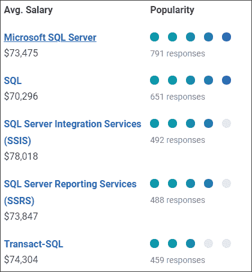
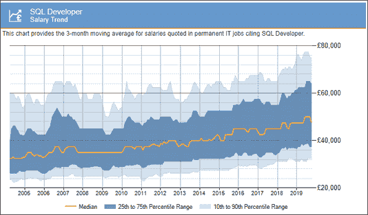
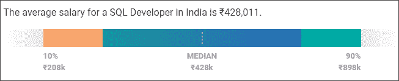
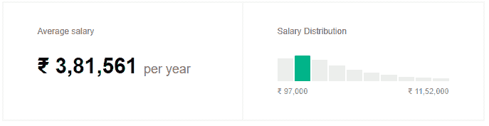
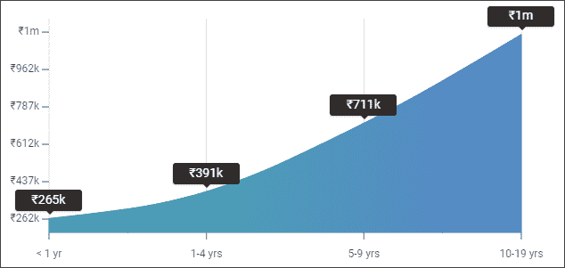
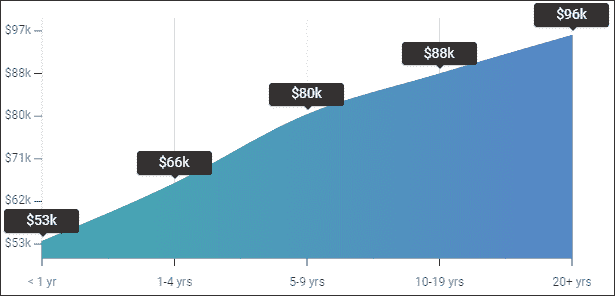

# 一个 SQL 开发人员的平均工资是多少？

> 原文：<https://www.edureka.co/blog/sql-developer-salary/>

[结构化查询语言](https://www.edureka.co/blog/what-is-sql/)是处理**关系数据库**的标准语言。这需要理解各种命令和语言。SQL Developer 处理数据库中存在哪些数据，必须如何操作数据，以及将生成哪些洞察。在本文中，我们将讨论全球 SQL 开发人员的工资，并了解为什么每个企业都需要 SQL 开发人员。根据 PayScale，一名 SQL 开发人员的平均期望工资为 **$72，740(US)** 。

在本文中，我将按以下顺序讨论 SQL 开发人员的工资细节:

*   谁是 SQL 开发人员？
*   [SQL 开发人员工作趋势](#jobtrends)
*   [SQL 开发人员技能](#skills)
*   [SQL 开发人员工资趋势](#salarytrend)
*   [SQL 开发人员工资:公司](#salarybasedoncompany)
*   [SQL 开发人员薪资:地域](#salarybasedongeography)
*   [SQL 开发人员薪资:经验型](#salarybasedonexperience)
*   [SQL 开发人员的常见职业道路](#careerpathforsqldeveloper)

## 谁是 SQL 开发人员？

SQL 开发人员是知道如何使用[结构化查询语言](https://www.edureka.co/blog/sql-tutorial/)访问和管理数据库的专业人员。他们使用表格、[视图、](https://www.edureka.co/blog/sql_view/)[过程、](https://www.edureka.co/blog/procedures-in-sql/)、[索引、](https://www.edureka.co/blog/index-in-sql/)来操作数据。SQL 开发人员还支持定制的 web 应用程序开发，并与团队和其他开发人员协作来审查代码，并改进流程。此外，SQL 开发人员负责开发、修改和组织数据库中的数据。最后，他们还必须能够提供各种信息服务并产生有意义的见解。

如果我必须总结一个 SQL 开发人员的任务，

*   他/她负责测试和记录所需的软件。
*   分析客户的需求并将其转化为技术设计。
*   编码、修改和调试软件
*   从数据库中访问、管理和检索数据
*   设计和开发应用程序组件。

## **SQL 开发人员工作趋势**

下表根据列出了印度不同地区的工作岗位数量。

| **地点** | **岗位数量** |
| 卡纳塔克邦本加卢鲁 | Three thousand eight hundred and nineteen |
| 泰伦加纳海得拉巴 | One thousand eight hundred and thirty-five |
| 马哈拉施特拉邦浦那 | One thousand seven hundred and eighty-four |
| 泰米尔纳德邦钦奈 | One thousand six hundred and thirteen |
| 孟买，马哈拉施特拉邦 | One thousand four hundred and eighty-two |

下表按照列出了美国不同地区的工作岗位数量。

| **地点** | **岗位数量** |
| New York, NY | Four hundred and seventy-nine |
| DC 华盛顿州 | Three hundred and eighty-five |
| 伊利诺伊州芝加哥 | Three hundred and nineteen |
| 佐治亚州亚特兰大 | Three hundred and two |
| 华盛顿州西雅图 | Two hundred and forty-two |

如你所见，这些数字相当不错。SQL 开发人员的职业机会只会越来越多，因为初创公司和成熟的公司都需要专业人员来处理他们的数据库。

现在，您已经知道了 SQL 开发人员的职位空缺，让我们来看看成为 SQL 开发人员所需的技能。

## **SQL 开发人员技能**

[微软 SQL Server](https://www.edureka.co/blog/sql-server-tutorial) 、[SQL Server Integration Services(SSIS)](https://www.edureka.co/blog/ssis-tutorial/)、SQL Server Reporting Services(SSRS)和 Transact SQL 中的技能与高于平均水平的薪酬相关。一些薪酬低于市场平均水平的技能包括 [PL/SQL](https://www.edureka.co/blog/postgresql-tutorial) 和 [SQL](https://www.edureka.co/blog/what-is-sql/) 。

嗯，这些是成为 SQL 开发人员的一些重要技能。但是，我必须告诉你，SQL 是当今市场上几乎所有工作岗位的必备技能。所有行业专业人士都应该至少对 SQL 有一个基本的了解，因为它让他们了解数据是如何在后台处理的。

现在你已经知道了成为一名 SQL 开发人员所需要的顶级技能，让我们来看看 SQL 开发人员的工资趋势。

## **SQL 开发人员工资趋势**

从初创公司到老牌公司，就业市场对 SQL 爱好者来说看起来不错，预计在未来几年将呈指数级增长。SQL 程序员/开发人员在所有地区都有很好的机会。考虑下图中英国 SQL 开发人员的工资趋势。

**来源:**【itjobswatch.co.uk】T4

据《PayScale.com》报道，一名 SQL 开发人员在美国的平均工资是 72，740 美元，在₹428,011 的平均工资是 77 美元。参考下文。

**印度:**

****

**美国: **

在 Indeed.com 进行的另一项调查中，美国的平均工资约为 t1 88000 美元，而₹381k 的平均工资约为 T5。看看下面的图片:

**印度:**

**美国:** 

Glassdoor 给出的 SQL 开发人员的平均基本工资在美国**$ 84，779** 和在印度的 **₹422,532** 。这远高于 PayScale 宣称的中位数**【73，000】美元**和 **₹4,28,000** 。

正如我提到的 SQL 开发人员的平均工资，现在让我们看看工资是如何根据各种因素而变化的。

## **按公司列出的 SQL 开发人员工资**

对于高速增长的公司来说， **SQL 开发人员**的就业率有了巨大的增长。参考下面的顶级公司的列表以及他们对于 SQL 开发人员的平均工资:[来源:PayScale]

**印度**

| **公司** | **平均工资** |
| Tech Mahindra | ₹445k |
| 凯捷 | ₹450k |
| 交通管制站（trafficcontrolstation） | ₹500k |
| 知道的 | ₹559k |
| 新同步技术公司 | ₹768k |

**美国:**

| **公司** | **平均工资** |
| 美国银行(BOFA) | $70k |
| 手术伙伴 | $ 71，000 |
| BCD 旅行 | $88k |
| PLS 金融服务 | 9.4 万美元 |
| 赞美诗 | 10.2 万美元 |

接下来，让我们看看 SQL 开发人员的工资是如何根据地理位置而变化的。

## **SQL 开发人员的地域工资**

我列出了以下主要地理位置的 SQL 开发人员工资:

| **地理位置** | **平均工资** |
| 印度 | ₹428k |
| 美国 | $ 73，000 |
| 联合王国 | 五万 |

在本文中，让我们看看 SQL 开发人员的工资是如何根据地理位置而变化的。

## **基于经验的 SQL 开发人员工资**

SQL 开发人员的薪水根据你的经历而有所不同，从₹的 265，000 美元到₹1m 的 265，000 美元，到美国的 53 到 96 美元。参考下文。

印度:

****

这里列出了不同级别的 SQL 开发人员，基于他们的经验和平均收入。

| **经验水平** | **平均工资** |
| 入门级 SQL 开发人员(< 1 年经验) | ₹265,000 |
| 早期职业 SQL 开发人员(1-4 年经验) | ₹391,048 |
| 中级 SQL 开发人员(5-9 年经验) | ₹710,646 |
| 经验丰富的 SQL 开发人员(10-19 年经验) | ₹1,125,821 |

**美国**:

**

这里列出了不同级别的 SQL 开发人员，基于他们的经验和平均收入。

| **经验水平** | **平均工资** |
| 入门级 SQL 开发人员(< 1 年经验) | $53，435 |
| 早期职业 SQL 开发人员(1-4 年经验) | $65，501 |
| 中级 SQL 开发人员(5-9 年经验) | 79828 美元 |
| 经验丰富的 SQL 开发人员(10-19 年经验) | 88334 美元 |

转到本文的最后一个主题，让我们看看 SQL 开发人员有哪些常见的职业道路。

## **SQL 开发人员的常见职业道路**

软件开发人员的就业趋势一直在不断变化，但对 SQL 开发人员的需求却在持续上升，因为每个组织都会产生大量必须管理的数据。然而，根据我的看法，我不会说只懂 SQL 会让你在职业道路上受益。相反，如果你有各种其他技术的知识或在不同领域工作，通过有 SQL 的实践经验；这绝对会让你鹤立鸡群。

因此，这里有一些 SQL 开发人员的常见职业道路和他们各自的工资范围。

| **相关工作** | **薪资范围** |
| 数据库管理员(DBA) | 4.6 万美元到 10.9 万美元 |
| 信息技术顾问 | 5 万美元到 12.1 万美元 |
| [数据分析师](https://www.edureka.co/blog/data-analyst-roles-and-responsibilities/) | $ 42k-$ 84k |
| 商业智能(BI)开发人员 | 【55000 美元】至109000 美元 |
| 软件开发商 | $ 50k-$ 104k |
| 商业智能(BI)分析师 | $ 49k-$ 94k |
| [数据科学家](https://www.edureka.co/blog/data-scientist-skills/) | $ 65k-$ 134k |
| [大数据工程师](https://www.edureka.co/blog/big-data-engineer-skills/) | 【7 万美元】到 12.5 万美元 |

如果你正在寻找一份有趣的职业，现在是提升技能和利用 SQL 相关职业机会的好时机。

*我希望我写的关于“SQL 开发人员薪水”的文章对你有所帮助。请查看 Edureka 提供的 [MySQL DBA 认证培训](https://www.edureka.co/mysql-dba)，edu reka 是一家值得信赖的在线学习公司，在全球拥有超过 250，000 名满意的学习者。* *本课程培训您掌握管理数据和 MySQL 数据库的核心概念&高级工具和技术。它包括对 MySQL 工作台、MySQL 服务器、数据建模、MySQL 连接器、数据库设计、MySQL 命令行、MySQL 函数等概念的实践学习。培训结束后，您将能够创建和管理自己的 MySQL 数据库并管理数据。*

有问题要问我们吗？请在这篇“SQL Developer Salary *”文章的评论部分提到它，我们会尽快回复您。*