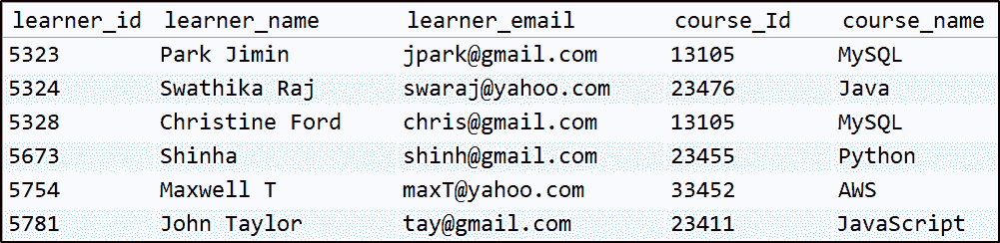

# 什么是 SQL Regex，如何实现？

> 原文：<https://www.edureka.co/blog/sql-regex/>

数据库是巨大的数据转储，数据以有组织的方式存储在其中。但是很多时候我们会遇到这样的情况，我们需要检索一些数据，但是没有足够的信息来过滤掉。对于这样的情况， [SQL](https://www.edureka.co/mysql-dba) 提供了一个惊人的特性，叫做正则表达式。通过这篇文章，我将让您全面了解什么是 SQL 正则表达式以及如何实现它们。

以下是我将在本文中讨论的主题:

*   [什么是 Regex？](#regex)
*   [SQL 正则表达式](#sqlregex)
*   [在 SQL 中使用正则表达式的语法](#syntax)
*   [SQL 正则表达式实现](#implementation)

## **什么是 RegEx？**

正则表达式通常被称为 RegEx，是一种通用表达式，用于匹配具有各种字符序列的模式。正则表达式可以是不同数据类型的组合，如整数、特殊字符、字符串、图像等。通常，这些模式用于字符串搜索算法，以便对字符串执行查找或查找和替换操作，或者用于验证输入。

下面我列出了 SQL Regex 的主要特性:

1.  它提供了强大而灵活的模式匹配。
2.  帮助为数据库系统实现强大的搜索工具
3.  支持许多元字符，以便在执行模式匹配时获得更大的灵活性和控制力。
4.  在 RegEx 中，反斜杠字符被用作转义字符。
5.  正则表达式不区分大小写。

既然您已经知道什么是正则表达式，现在让我们看看 SQL 支持各种正则表达式。

## **SQL**Regex

下面我列出了所有可以在 SQL 中使用的正则表达式。

| **图案** | **描述** |
| ***** | 匹配前面字符串的零个或多个实例 |
| **+** | 匹配前面字符串的一个或多个实例 |
| **。** | 匹配任何单个字符 |
| **？** | 匹配前面字符串的零个或一个实例 |
| **^** | ^匹配字符串的开头 |
| **$** | $匹配字符串的结尾 |
| **【ABC】** | 匹配方括号中列出的任何字符 |
| **【^abc】** | 匹配方括号中未列出的任何字符 |
| **【A-Z】** | 匹配任何大写字母 |
| **【a-z】** | 匹配任何小写字母 |
| **【0-9】** | 匹配 0-9 之间的任何数字 |
| **[[: < :]]** | 匹配单词的开头 |
| **[[: > :]]** | 匹配单词的结尾 |
| **[:class:]** | 匹配任何字符类 |
| **p1&#124;p2&#124;p3** | Mathes 任何指定的模式 |
| **{n}** | 匹配前面元素的 n 个实例 |
| **{m，n}** | 匹配前面元素的 m 到 n 个实例 |

现在让我们更深入一点，看看如何在 [SQL](https://www.edureka.co/blog/sql-tutorial/) 中形成正则表达式。

## **使用 SQL Regex 的语法**

使用 Regex 真的很简单。您需要做的就是遵循下面显示的语法:

```
SELECT statements... WHERE field_name REGEXP 'my_pattern';
```

***解说***

*   `SELECT` –[Select](https://www.edureka.co/blog/sql-select)是从表中检索数据的标准 SQL 关键字
*   `statements`–指定要检索的行
*   `WHERE`–[WHERE 子句](https://www.edureka.co/blog/sql-constraints/)用于指定取数据时的条件
*   `field_name`–表示需要应用正则表达式的列的名称。
*   `REGEXP`–这是正则表达式模式前面的关键字
*   `my_pattern`–这是用户定义的正则表达式模式，用于搜索数据

既然您已经知道了如何形成 RegEx 语句，那么让我展示一下 SQL RegEx 是如何实现的。

## **SQL 正则表达式实现**

对于实际的实现，我将使用下表来执行 RegEx 查询。 

*   *匹配指定的字符串*

```
SELECT * FROM `learnerdetails` WHERE `course_name` REGEXP 'SQL';
```

*   *string(^23 比赛开始)*

```
SELECT * FROM `learnerdetails` WHERE `course_Id` REGEXP '^23';
```

*   匹配它之前的零个或一个字符串实例(Ja？)

```
SELECT * FROM learnerdetails WHERE course_name REGEXP 'Ja?';
```

*   *匹配任何模式‘w | ja’*

```
SELECT learner_name FROM learnerdetails WHERE course_name REGEXP 'w|ja' ;
```

*   *匹配一个字符串的结尾(yahoo.com $)*

```
SELECT learner_name FROM learnerdetails WHERE learner_email REGEXP 'yahoo.com$';
```

我希望这能让您了解如何形成查询。你可以尝试更多的组合。至此，我想结束这篇关于 SQL RegEx 的文章。更多关于 SQL 或者数据库的信息，可以参考我们这里的综合阅读清单: [**数据库 Edureka**](https://www.edureka.co/blog/category/databases/) 。

*如果您希望获得有关 MySQL 的结构化培训，那么请查看我们的 **[MySQL DBA 认证培训](https://www.edureka.co/mysql-dba)** ，它附带有讲师指导的现场培训和真实项目体验。本培训将帮助您深入了解 MySQL，并帮助您掌握这门学科。*

有问题要问我们吗？请在“**SQL**RegEx 的评论区提及，我会回复你。