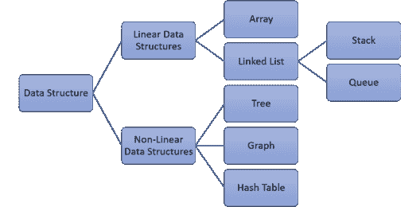
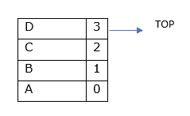
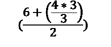
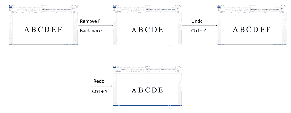

# Python 中的栈数据结构是什么？

> 原文：<https://www.edureka.co/blog/stack-data-structures-in-python/>

数据结构是数据值、数据值之间的关系以及可应用于数据的功能或操作的集合。现在有很多数据结构可用。但是今天我们的重点是堆栈数据结构。我将讨论以下主题:

*   [为什么是数据结构？](#why)
*   [数据结构的类型](#types)
*   [什么是栈数据结构？](#what)
*   [创建堆栈数据结构](#create)
*   [将元素推入堆栈](#push)
*   [从栈中弹出元素](#pop)
*   [栈数据结构的应用](#applications)

## **为什么是数据结构？**

要回答这个问题，你必须站在一个大的高度来思考。想想谷歌地图如何在几秒钟内为你展示最佳路线，如何在几微秒内返回搜索结果。它不仅能处理 100 个网站，还能处理超过 10 亿个网站，而且还能如此快速地向你展示结果。

虽然所用的算法起着至关重要的作用，但数据结构或所用的容器是算法的基础。在任何应用程序中，以最适合其用途的方式或结构组织和存储数据是高效访问和处理数据的关键。

## **数据结构的类型**

有一些标准的数据结构可以用来有效地处理数据。我们甚至可以定制它们或者构建全新的来适应我们的应用。



## **什么是栈数据结构？**

考虑一些现实生活中的例子:

*   货物装运
*   托盘上的盘子
*   一叠硬币
*   一叠抽屉
*   铁路站场中列车的调车


所有这些例子都遵循**后进先出**的策略。考虑托盘上的盘子，当你想拿一个盘子时，你被迫从顶部拿一个盘子，而当盘子放在托盘上时，它们必须是相反的顺序。以上遵循**后进先出(LIFO)** 原则的例子称为**栈**。

除了补充操作之外，我可以说栈上可能的主要操作有:

1.  将一个元素推到或插入栈顶
2.  从堆栈顶部弹出或移除一个元素

## **创建堆栈数据结构**

```
class Stack:
    def __init__(self,max_size):
        self.__max_size=max_size
        self.__elements=[None]*self.__max_size
        self.__top=-1
```

*   **max_size** 是堆栈中预期的最大元素数。
*   堆栈的元素存储在 python 列表中。
*   Top 表示栈的最顶端的索引，最初取-1 来标记空栈。

堆栈的初始状态可以在图中看到，其中 max_size=5


**将元素推入堆栈**

现在，如果你想把元素放入或者压入堆栈，你必须记住

*   顶部将指向元素将被插入的索引。
*   并且当栈满时，即当 max_size=top 时，将不插入任何元素。

那么算法应该是什么呢？？

```
# returns the maximum size of stack
def get_max_size(self):
        return self.__max_size

# returns bool value whether stack is full or not, True if full and False otherwise
def is_full(self):
        return self.get_max_size() - 1==self.__top

#pushes element at the top of stack
def push(self, data):
        if(self.is_full()):
            print("stack is already full")
        else:
            self.__top=self.__top+int(1)
            self.__elements[self.__top]=data

#You can use the below __str__() to print the elements of the DS object while debugging
def __str__(self):
        msg=[]
        index=self.__top
        while(index>=0):
            msg.append((str)(self.__elements[index]))
            index-=1
        msg=" ".join(msg)
        msg="Stack data(Top to Bottom): "+msg
        return msg
```

现在，当您执行以下命令时:

stack1 =堆栈(4)

#推送所有必需的元素。

stack1.push("A ")

stack1.push("B ")

stack1.push("C ")

stack1.push("E ")

print(stack1.is_full())

打印(堆叠 1)



**输出:**

栈已经满了真栈数据(从上到下):D C B A

## **从堆栈中弹出元素**

现在，当您已经将元素插入到堆栈中时，您希望弹出它们，因此您需要注意以下事项:

*   堆栈不为空，即顶部！= -1
*   删除数据时，顶部必须指向堆栈的前一个顶部。

那么，算法会是什么呢？？

```
#returns bool value whether stack Is empty or not, True if empty and False otherwise
def is_empty(self):
        return self.__top==-1

#returns popped value
def pop(self):
         if(self.is_empty()):
            print("nothing to pop, already empty")
        else:
            a=self.__elements[self.__top]
            self.__top=self.__top-1;
            return a

#display all the stack elements from top to bottom
def display(self):
        for i in range(self.__top,-1,-1):
            print(self.__elements[i],end=' ')
        print()
```

现在，考虑以前创建的堆栈，尝试弹出元素

print(stack1.pop())

print(stack1.pop())

打印(堆叠 1)

print(stack1.pop())

print(stack1.pop())

print(stack1.pop())

**输出:**

D

C

堆栈数据(从上到下):B A

B

A

没什么可爆的，已经空了

## **栈数据结构的应用**

*   **例 1:**

堆栈用于实现算术表达式求值的括号匹配算法，也用于实现方法调用。



答案是 5。

*   **例 2:**

**Windows 中的剪贴板**使用两个栈来实现撤销-重做(ctrl+z，ctrl+y)操作。你会使用 Windows word 编辑器，如 MS-Word、记事本等。这里有一篇文字是用 MS-Word 写的。观察文本在点击 Ctrl-Z 和 Ctrl-Y 时是如何变化的。



下面是模拟撤销-重做操作的代码。浏览代码，观察在这个实现中如何使用堆栈。

```
#creating class stack
class Stack:
    def __init__(self,max_size):
        self.__max_size=max_size
        self.__elements=[None]*self.__max_size
        self.__top=-1

    def is_full(self):
        if(self.__top==self.__max_size-1):
            return True
        return False

    def is_empty(self):
        if(self.__top==-1):
            return True
        return False

    def push(self, data):
        if(self.is_full()):
            print("The stack is full!!")
        else:
            self.__top+=1
            self.__elements[self.__top]=data

    def pop(self):
        if(self.is_empty()):
            print("The stack is empty!!")
        else:
            data= self.__elements[self.__top]
            self.__top-=1
            return data

    def display(self):
        if(self.is_empty()):
            print("The stack is empty")
        else:
            index=self.__top
            while(index>=0):
                print(self.__elements[index])
                index-=1

    def get_max_size(self):
        return self.__max_size

    #You can use the below __str__() to print the elements of the DS object while debugging
    def __str__(self):
        msg=[]
        index=self.__top
        while(index>=0):
            msg.append((str)(self.__elements[index]))
            index-=1
        msg=" ".join(msg)
        msg="Stack data(Top to Bottom): "+msg
        return msg    

#function to implement remove or backspace operation
def remove():
    global clipboard,undo_stack
    data=clipboard[len(clipboard)-1]
    clipboard.remove(data)
    undo_stack.push(data)
    print("Remove:",clipboard)

#function to implement undo operation
def undo():
    global clipboard,undo_stack,redo_stack
    if(undo_stack.is_empty()):
        print("There is no data to undo")
    else:
        data=undo_stack.pop()
        clipboard.append(data)
        redo_stack.push(data)
    print("Undo:",clipboard)

#function to implement redo operation
def redo():
    global clipboard, undo_stack,redo_stack
    if(redo_stack.is_empty()):
        print("There is no data to redo")
    else:
        data=redo_stack.pop()
        if(data not in clipboard):
                print("There is no data to redo")
                redo_stack.push(data)
        else:
            clipboard.remove(data)
            undo_stack.push(data)
    print("Redo:",clipboard)

clipboard=["A","B","C","D","E","F"]
undo_stack=Stack(len(clipboard))
redo_stack=Stack(len(clipboard))
remove()
undo()
redo()
```

**输出:**

删除:['A '，' B '，' C '，' D '，' E']

撤消:['A '，' B '，' C '，' D '，' E '，' F']

重做:[，∨年，∤年，∤年]

至此，我们结束了 Python 文章中的堆栈数据结构。如果你自己成功地理解并运行了代码，你就不再是栈数据结构的新手了。

*有问题吗？请在这篇文章的评论部分提到它，我们会尽快回复你。*

*要深入了解 Python 及其各种应用，您可以注册参加实时 **[Python 在线培训](https://www.edureka.co/python)** ，该培训提供全天候支持和终身访问。*