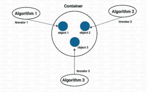
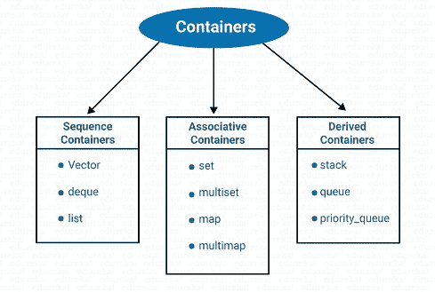
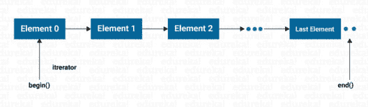

# c++中的 STL:你需要知道的一切

> 原文：<https://www.edureka.co/blog/stl-in-cpp/>

标准模板库(STL)是一组 C++模板类，用于提供常见的编程数据结构和函数，如列表、堆栈、数组等。在这篇 STL in C++文章中，我们将讨论以下指针:

*   [C++模板](#C++Templates)
*   [c++中的通用函数和 STL](#GenericfunctionsandSTL)
*   [集装箱](#Containers)
*   [算法](#Algorithms)
*   [迭代器](#Iterators)

继续这篇关于 C++中 STL 的文章

## **C++模板**

C++为我们提供了一个模板特性，允许函数和类操作泛型类型。这允许函数或类的可重用性，并允许它处理许多不同的数据类型，而无需为每一个数据类型重写。

继续这篇关于 C++中 STL 的文章

## **通用函数和 STL**

在编程时，很多时候需要创建执行相同操作但处理不同数据类型的函数。因此，为了克服这个问题，C++提供了一个特性来创建一个单一的通用函数，而不是许多可以使用模板参数处理不同数据类型的函数。这些通用类和函数的集合称为标准模板库(STL)

STL 的组件现在是标准 C++库的一部分，在命名空间 std 中定义。因此，我们必须使用 using namespace 指令将它们导入我们的程序。

**语法:**

使用命名空间 std

STL 有三个组成部分

*   容器

*   算法

*   迭代程序

这三个组件协同工作，为各种编程解决方案提供支持。算法使用迭代器来执行存储在容器中操作。

容器是以有组织的方式在内存中存储数据的对象。STL 中的容器是由模板类实现的，因此可以很容易地修改和定制来保存不同类型的数据。

用于处理容器中包含的数据的过程被定义为算法。STL 包括许多不同种类的算法，为初始化、搜索、复制、排序和合并、复制、排序和合并等任务提供支持。算法由模板函数实现。

迭代器可以定义为指向容器中元素的对象。迭代器可以用来遍历容器的内容。迭代器就像指针一样被处理。我们可以增加或减少它们。迭代器将算法与容器联系起来，并在操作存储在容器中的数据时发挥关键作用。

继续这篇关于 C++中 STL 的文章

## **集装箱**

STL 定义了十个容器，分为三类。

| 容器 | 描述 | 头文件 | 迭代程序 |
| 矢量 | 它可以被定义为一个动态数组。它允许直接访问任何元素。 |  | 随机存取 |
| 目录 | 这是一个双向线性列表。它允许在任何地方插入和删除 |  | 双向的 |
| 双端队列 | 这是一个双端队列。允许在两端插入和删除。允许直接访问任何元素。 |  | 随机存取 |
| 设置 | 它是用于存储唯一集合的关联容器。允许快速查找。 |  | 双向的 |
| 多组 | 它是用于存储非唯一集合的关联容器。 |  | 双向的 |
| 地图 | 它是一个关联容器，用于存储唯一的键/值对。每个键只与一个值相关联。 |  | 双向的 |
| 多地图 | 它是一个关联容器，用于存储键/值，其中一个键可以与多个值相关联(一对多映射)。它允许基于关键字的查找。 |  | 双向的 |
| 堆 | 标准堆栈遵循后进先出(LIFO) |  | 没有迭代器 |
| 长队 | 标准队列遵循先进先出(FIFO) |  | 没有迭代器 |
| 优先队列 | 第一个输出的元素总是优先级最高的元素 |  | 没有迭代器 |

### **序列容器**

序列容器以线性顺序存储元素。所有元素通过它们在直线上的位置相互关联。它们允许插入元素，且都支持对元素进行多种操作。

STL 提供了三种类型的序列元素:

*   矢量
*   目录
*   双端队列

### **关联容器:**

它们被设计成可以支持使用键直接访问元素。它们不是连续的。有四种类型的

关联容器:

1.  一组
2.  多组
3.  地图
4.  多地图

上述所有容器都将数据存储在一个称为树的结构中

不同于顺序的搜索、删除和插入。容器集或多重集可以存储各种项目，并提供使用值作为键来操作它们的操作。

map 或 Multimap 用于成对存储项目，一个称为键，另一个称为

叫做价值。

### **派生容器:**

STL 提供了三个派生容器，即堆栈、队列和 priority_queue。这些也被称为容器适配器。

有三种类型的派生容器:

1.堆

2.长队

3.优先级 _ 队列

堆栈、队列和优先级队列可以很容易地从不同序列容器中创建。派生容器不支持迭代器，因此我们不能使用它们进行数据操作。但是，它们支持两个成员函数 pop()和 push()来实现删除和插入操作。

继续这篇关于 C++中 STL 的文章

## **算法**

算法是可以在各种容器中通用的函数，用于处理它们的内容。尽管每个容器都为其基本操作提供了函数，但 STL 提供了 60 多种标准算法来支持更多的扩展或复杂操作。标准算法也允许我们同时处理两种不同类型的容器。

STL 算法强化了可重用性的理念。通过使用这些算法，程序员可以节省大量的时间和精力。要访问 STL 算法，我们必须在程序中包含<algorithm>。</algorithm>

STL 算法，基于它们执行的操作的性质，可以分类为:

*   非变异算法

*   变异算法

*   排序算法

*   设置算法

*   关系算法

继续这篇关于 C++中 STL 的文章

## **迭代器:**

迭代器的作用类似指针，用于访问容器的元素。我们使用迭代器来遍历容器的内容。迭代器就像指针一样被处理。我们可以根据需要增加或减少它们。迭代器将容器与算法连接起来，在操作存储在容器中的数据时扮演着重要的角色。它们通常用于从一个元素传递到另一个元素，这个过程被称为遍历容器。

迭代器有五种类型:

1.投入

2.输出

3.向前

4.双向的

5.随意

| 迭代程序 | 存取方法 | 运动方向 | 输入输出能力 | 注意 |
| 投入 | 线性的 | 仅向前 | 只读 | 无法保存 |
| 输出 | 线性的 | 仅向前 | 只写 | 无法保存 |
| 向前 | 线性的 | 仅向前 | 读/写 | 可以保存 |
| 双向的 | 线性的 | 向前和向后 | 读/写 | 可以保存 |
| 随意 | 随意 | 向前和向后 | 读/写 | 可以保存 |

不同类型的迭代器必须与不同类型的容器一起使用

序列和关联容器允许遍历迭代器。每种类型的迭代器都用于执行特定的功能。输入和输出迭代器支持最少的函数。它们只能在容器中通过。前向迭代器支持输入和输出迭代器的所有操作，并保留其在容器中的位置。双向迭代器在支持所有正向迭代器操作的同时，还提供了在容器中反向移动的能力。

就这样，我们结束了这篇关于“C++中的 STL”的文章。如果你想了解更多，请查看由 Edureka(一家值得信赖的在线学习公司)提供的  [Java 培训](https://www.edureka.co/java-j2ee-soa-training)。Edureka 的 Java J2EE 和 SOA 培训和认证课程旨在培训您掌握核心和高级 Java 概念以及各种 Java 框架，如 Hibernate & Spring。

有问题要问我们吗？请在这个博客的评论部分提到它，我们会尽快回复你。