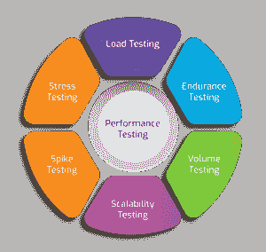
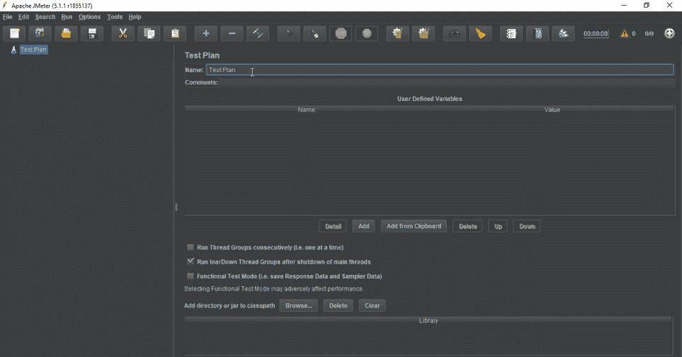
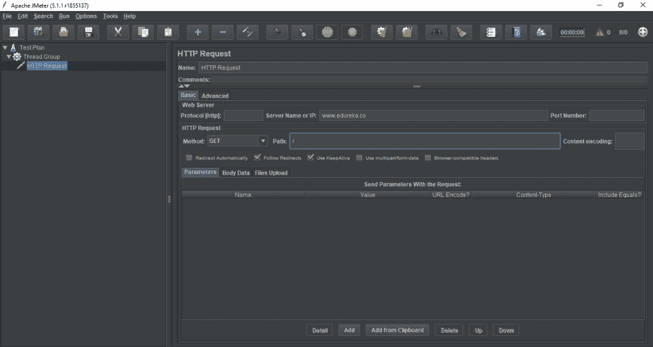
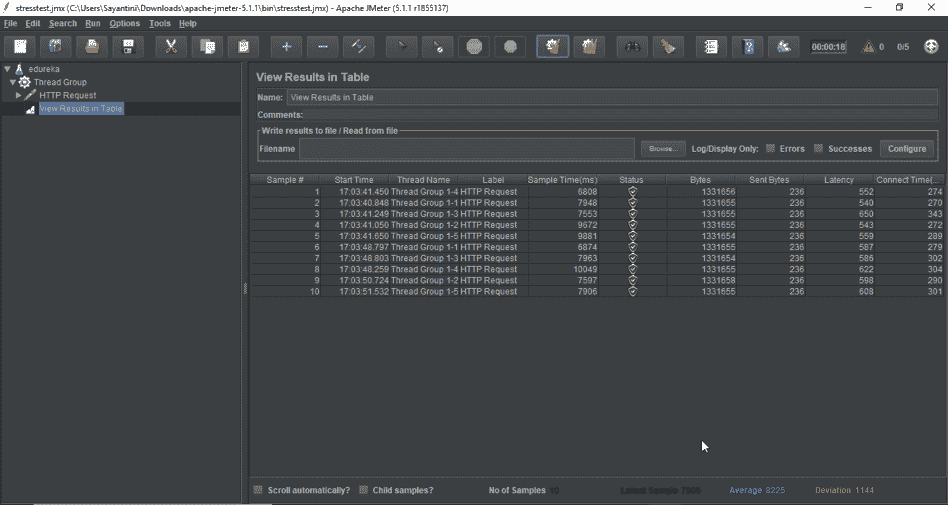
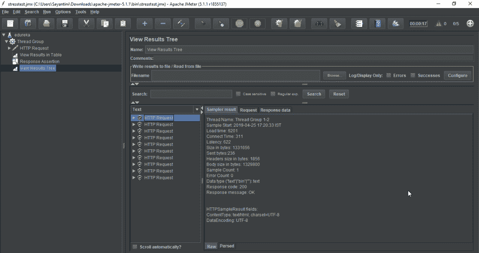

# 知道如何在网站上使用 JMeter 进行压力测试

> 原文：<https://www.edureka.co/blog/stress-testing-using-jmeter/>

大多数系统都是在正常操作条件下开发的。重要的是确保它在重载下不会损坏。软件测试确保系统在紧急情况下不会崩溃。这篇使用 JMeter 进行压力测试的文章将指导你如何按照以下顺序进行压力测试:

*   [性能测试简介](#performancetesting)
*   [什么是压力测试？](#stresstesting)
*   [为什么我们需要压力测试？](#whystresstesting)
*   [执行压力测试的步骤](#stresstestingsteps)
*   [压力测试类型&工具](#stresstestingtypes)
*   [压力测试使用 JMeter](#stresstestingjmeter)

## **性能测试简介**

软件测试为我们所有关于机器按照我们希望的方式运行的问题提供了解决方案。不同的[类型的软件测试](https://www.edureka.co/blog/types-of-software-testing/)帮助测试人员为应用程序确定正确的测试选择。

[性能测试](https://www.edureka.co/blog/performance-testing-tutorial/)是一种软件测试，确保应用程序在工作负载下运行良好。它又分为六种不同的类型，如:

本文关注压力测试，我们将看看如何使用 JMeter 执行压力测试。

**压力测试使用 JMeter | edu reka**

[//www.youtube.com/embed/O61k_Wz0gW0?rel=0&showinfo=0](//www.youtube.com/embed/O61k_Wz0gW0?rel=0&showinfo=0)

## **什么是压力测试？**

压力测试是一种验证系统的**稳定性** & **可靠性**的软件测试。该测试主要确定系统在极端负载条件下的健壮性和错误处理能力。

压力测试确保系统在紧急情况下不会崩溃。它在正常工作点之外进行测试，并评估系统在这些极端条件下的工作情况。它还检查系统是否表现出有效的错误管理。

## **为什么我们需要压力测试？**

每当出现**高峰**或**流量突然激增**时，对网站进行压力测试是很重要的。如果你不能适应这种突然的交通，它可能会导致收入和声誉的损失。出于以下原因也需要进行压力测试:

*   检查系统是否在**异常**条件下工作。
*   当系统处于压力状态时，显示相应的**错误信息**。
*   极端条件下的系统故障可能导致巨大的**收入损失**。
*   通过执行压力测试，为网站应对极端条件做好准备。

## **执行压力测试的步骤**

在任何网站上进行压力测试时，你需要遵循 5 个步骤:

**1。计划压力测试—**在这一步中，您收集系统数据，分析系统并定义压力测试的目标。 **2。创建自动化脚本–**这里，您需要创建压力测试自动化脚本，并为压力场景生成测试数据。 **3。脚本执行—**在第三步**，**中，您运行压力测试自动化脚本并存储压力结果。 **4。结果分析—**存储结果后，现在您需要分析压力测试结果并识别瓶颈。 **5。调整和优化—**在最后一步，您微调系统，更改配置，并优化代码以满足期望的基准。

现在你知道了压力测试过程中的不同步骤。那么，让我们继续，看看不同类型的压力测试和所需的工具。

## **压力测试类型&工具**

不同类型的压力测试包括:

*   **分布式压力测试—**在分布式客户端-服务器系统中，您可以从服务器对所有客户端执行测试。压力服务器的作用是向所有压力客户端分发一组压力测试，并跟踪客户端的状态。
*   **应用压力测试—**该测试用于发现应用中与数据锁定和阻塞、网络问题和性能瓶颈相关的缺陷。

****

*   **事务性压力测试—**您需要此测试来对两个或更多应用程序之间的大量事务执行压力测试。它用于微调和优化系统。
*   **系统压力测试—**这种测试是集成的，可以跨运行在同一服务器上的多个系统进行测试。您还可以发现一个应用程序数据阻碍另一个应用程序的缺陷。
*   **探索性压力测试—**这用于使用不寻常的参数或条件测试系统，这些参数或条件在真实场景中不太可能发生。你可以在任何危急的情况下发现缺陷。

这些是不同类型的压力测试。现在，要执行这些测试，您需要一些工具。那么，让我们来看看一些用于压力测试的重要工具。

### **用于压力测试的工具**

[测试工具](https://www.edureka.co/blog/performance-testing-tools/)确保您的应用在高峰流量和极端压力条件下运行良好。下面是一些最常用的压力/web 测试工具:

****

*   **Apache JMeter—**JMeter 是一个开源测试工具。这是一个用于压力和性能测试的纯 Java 应用程序。
*   **LoadRunner—**惠普的 LoadRunner 是一款广泛使用的测试工具。Loadrunner 提供的压力测试结果被视为基准。
*   **neo load—**该工具用于模拟成千上万的用户，以评估应用程序在压力下的性能并分析响应时间。

你可能会感到困惑，因为有很多工具可以用于压力测试。但是 **JMeter** 是在网站上进行压力测试的最受欢迎的工具之一。那么，我们来看看使用 JMeter 进行压力测试的过程中需要的步骤。

## **压力测试使用 JMeter**

关于 [Apache JMeter](https://www.edureka.co/blog/jmeter-tutorial/) ，以及 JMeter 的[安装步骤，我在之前的文章中已经详细讨论过。因此，让我们从执行压力测试的步骤开始。](https://www.edureka.co/blog/how-to-install-jmeter/)

**第一步**——首先，你必须**在 JMeter 中创建**你自己的**测试计划**。

**第二步**——插入一个**线程组**，并添加一个 **HTTP 请求**，其中包含您想要执行压力测试的**网站**的服务器名称。

**第三步——**接下来，需要在线程组内部添加一个**监听器**，查看**测试结果**。它将显示已经进行的测试的状态。

**步骤 4—**现在您需要在线程组中添加一个**响应断言**。这是最重要的元素之一，因为它帮助你在你的软件负载测试计划中断言请求的**响应。**

我们将使用响应断言为**响应代码 200** 断言。响应代码 200 表示您的 HTTP 请求成功。如果您将该值从 200 更改为任何其他数字，测试的状态将更改为不成功。

现在你可以添加一些用户或线程，并增加循环次数。所以这会增加你服务器的压力。但是你可以继续进行测试并查看结果，以便在一定的压力下检查你的网站的状态。

*既然你已经理解了什么是压力测试，那就来看看 Edureka 的 [**性能测试使用 JMeter 课程**](https://www.edureka.co/jmeter-training-performance-testing) 吧，该课程旨在向你介绍完整的软件测试生命周期。您将学习不同级别的测试、测试环境设置、测试用例设计技术、测试数据创建、测试执行、错误报告、DevOps 中的 CI/CD 管道以及软件测试的其他基本概念。有问题吗？请在“使用 JMeter 进行压力测试”的评论部分提到它，我们会回复您。*