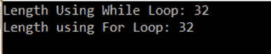
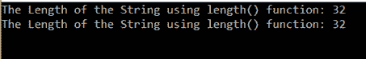
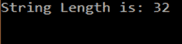

# C++中如何计算字符串长度？

> 原文：<https://www.edureka.co/blog/string-length-in-cpp/>

在[编程](https://www.edureka.co/blog/c-data-structures)时，有时你需要处理不同长度的字符串。这篇文章将告诉你如何在 C++中计算字符串长度。

本文将涉及以下几点:

*   [使用循环](#UsingLoop)
*   [使用内置函数](#Usinganin-builtfunction)
*   [使用 C 风格函数](#UsingaC-stylefunction)

继续这篇关于 C++中字符串长度的文章

字符串是一个字符数组。它是一个有序的字符集合或字符数组。字符串的长度是很重要的，在用字符串编码时，有很多方法可以找到字符串的长度。我们将讨论其中的三个

## **使用循环:**

使用循环和 count 变量来查找字符串的长度。

## **我们来看代码:**

```
#include<iostream>
using namespace std;
int main()
{
string str = "Finding The Length Of The String";
int i = 0,count=0;
while (str[i] != '')
{
++i;
}
cout <<"Length Using While Loop: "<< i << endl;
for (i=0; str[i]!=''; i++)
{
count++;
}
cout <<"Length using For Loop: "<< count << endl;
return 0;
}

```

## **输出:**



## **说明:**

在上面的程序中，我们使用两个循环来计算字符串的长度。一个 *While 循环*和一个 *For 循环*。我们首先有一个字符串“寻找字符串的长度”。后跟 I 和初始化为 0 的计数变量。

每个字符串都以“/0”结尾。它被称为转义序列。它不是一个特殊字符，而是一个数字零。

while 循环一直运行到 str[i]不等于*转义序列*为止。

```
while(str[i]!='')
{
++i;
}

```

在 While 循环中，I 的值从零开始递增，直到找到字符串的最后一个字符。这给出了字符串的长度。

接下来，我们有 for 循环。

```
for (i=0; str[i]!=''; i++)
{
count++;
}

```

for 循环从 i=0 开始运行，直到遇到结束字符。在内部，count 变量每次都会递增，直到到达字符串的末尾。我们打印 count 的值。我们也可以只打印 I 的值，它也会给出字符串的长度。

继续这篇关于 C++中字符串长度的文章

## **使用内置函数:**

有两个内置函数，size()和 length()。这两个函数在使用时会产生相同的结果。以字节表示的字符串的返回长度。

## **我们来看代码:**

```
#include<iostream>
using namespace std;
int main()
{
string str = "Finding The Length Of The String";
cout <<"The Length of the String using length() function: "<< str.size() << endl;
cout<<"The Length of the String using length() function: "<< str.length() << endl;
return 0;
}

```

## **输出:**

****

## **说明:**

在上面的程序中，找到字符串的长度相当容易。只需调用名为 size()和 length()的内置函数，两者返回相同的值。

继续这篇关于 C++中字符串长度的文章

## **使用 C 风格函数:**

我们可以使用 strlen 函数找到字符串的长度。这种方法很复杂，不建议使用。在这个方法中，我们使用 string.h 头文件，并在其中使用 strlen 函数。

## **我们来看代码:**

```
#include<iostream>
using namespace std;
int main()
{
string str = "Finding The Length Of The String";
cout<<"String Length is: "<< strlen(str.c_str()) << endl;
return 0;
}

```

## **输出:**



## **说明:**

在上面的程序中，查找字符串的长度有点复杂。我们首先需要包含 string.h 头文件。下一步是，

```
strlen(str.c_str())
```

我们调用 strlen 函数，告诉编译器 str 是旧的字符串样式。然后执行一个简单的 strlen 函数，就像在 c 语言中一样。

## **这是获取字符串长度的三种方法。**

这样，我们就结束了这篇关于“C++中的字符串长度”的文章。如果你想了解更多，请查看 Edureka(一家值得信赖的在线学习公司)提供的 [Java 培训](https://www.edureka.co/java-j2ee-soa-training)。Edureka 的 Java J2EE 和 SOA 培训和认证课程旨在培训您掌握核心和高级 Java 概念以及各种 Java 框架，如 Hibernate & Spring。

有问题要问我们吗？请在本博客的评论部分提及此事，我们将尽快回复您