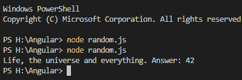

# 如何在 JavaScript 中实现字符串长度

> 原文：<https://www.edureka.co/blog/string-length-in-javascript/>

JavaScript 是使用最广泛的编程语言之一。它还因其跨平台的通用性而广受欢迎。一些最流行的基于 JavaScript 的框架有 [Angular](https://www.edureka.co/blog/angular-components/) 、 [React](https://www.edureka.co/blog/react-redux-tutorial/) 、Node.js、Vue.js 等。在本文中，我们将按以下顺序讨论 JavaScript 中的字符串长度:

*   [JavaScript 中的字符串操作](#manipulation)
*   [JavaScript 中的字符串长度](#length)

## **字符串操作**

JavaScript 提供了几种字符串操作函数的方法，在处理用户通过任何形式输入的数据时非常方便。它们有助于根据我们的用途修改数据。

下面是一些最常用的字符串操作函数:

*   **字符串长度:**

用于查找任何特定字符串的长度。

*   **在字符串中查找字符串:**

    Indexof()可以用来定位任意一个特定的字符串和其他字符串。

    lastIndexOf()返回字符串中任意特定字符串的最后一次出现。

*   **切片()**

此方法用于获取字符串的一部分。

它接受两个参数，输出的 starts 和 end，并根据这两个参数返回值。

*   **替换()**

这个函数有两个参数，一个将被替换，另一个将替换字符串中的第一个参数。

*   **toUpperCase()**

这个函数将整个字符串转换成大写。

*   **concat()**

该函数将传递的两个参数连接起来。

*   **string.trim()**

该函数从字符串中删除所有出现在字符串开头或结尾的空格。

*   **split()**

这个函数将一个字符串转换成一个数组。

`txt.split(“,”)`

上面的函数调用将把存储在变量 txt 中的字符串转换成数组，并用逗号(，)隔开。

让我们回到这篇博客的主要动机，讨论 JavaScript 中的字符串长度。

## **JavaScript 中的字符串长度**

String 对象的 length 属性以 UTF-16 代码单位表示字符串的长度。

```
var str = 'Life, the universe and everything. Answer:';

console.log(str + ' ' + str.length);
```

上述变量“str”是 var 类型，其中存储有一个字符串。

在 console.log 函数中，str.length 将返回存储在 str 变量中的字符串的长度。

**输出:**



42 作为答案返回，因为 42 是字符串的长度。

至此，JavaScript 中的字符串长度结束。我希望这篇博客对你了解 JavaScript 中的字符串操作有所帮助，并且让你熟悉我们可以使用的不同的字符串操作函数。

*查看 Edureka 的[网络开发者课程](https://www.edureka.co/masters-program/full-stack-developer-training) 。* *Web 开发认证培训将帮助您学习如何使用 HTML5、CSS3、Twitter Bootstrap 3、jQuery 和 Google APIs 创建令人印象深刻的网站，并将其部署到亚马逊简单存储服务(S3)。*

*有问题吗？请在“JavaScript 中的字符串长度”的评论部分提到它，我们会回复您。*