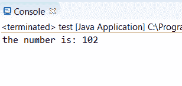
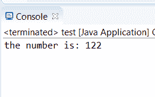
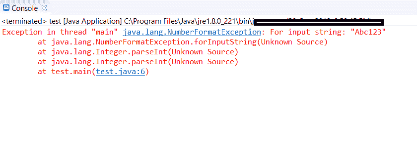

# 如何在 Java 中将字符串转换为 Int:方法和示例

> 原文：<https://www.edureka.co/blog/string-to-int-in-java/>

在 [Java](https://www.edureka.co/blog/java-tutorial/) 中有很多方法将一个字符串转换成整数。最常用的方法是 pareseInt()方法。有多种方法可以将字符串转换成整数。在这篇文章中，我们将看看在 Java 中把一个字符串转换成 int 的所有可能的方法

三种主要方法是:

1.  [parseInt()方法](#parseint)
2.  [valueOf()方法](#vaalueof)
3.  [NumberFormatException 方法](#exception)

## **Java 中 parseInt()方法将字符串转换为 Int**

在这个方法中，字符串被转换成一个原始的 int。

**语法:** `int dtypename = Integer.parseInt(string);`

**举例:** `int res = Integer.parseInt(str);`

**考虑代码:**

```
public class test {
                        public static void main(String args[])
                        {
                                    String str = "102";
                                    int res = Integer.parseInt(str);                                  
                                    System.out.println("the number is: "+ res);
                         }
}
```

**输出:**

## ****

**说明:**

在上面的代码中，我们有一个字符串变量“102”。我们声明了另一个变量 res. 这是一个整型变量。因此，使用 parseInt()方法将字符串变量转换为整数。

## **valueOf()方法:Java 中的 String to Int**

在此方法中，字符串被转换为整数对象。

**语法:** `Integer dtypename = Integer.valueOf(string);`

**示例:**Integer RES = Integer . value of(str)；

**考虑代码:**

```
public class test {
                        public static void main(String args[])
                        {
                                    String str = "102";
                                    int res = Integer.parseInt(str);                                  
                                    System.out.println("the number is: "+ res);
                         }
}
```

**输出:**

## ****

**说明:**

在上面的代码中，我们有一个字符串变量“122”。我们将另一个变量 result 声明为 res，这是一个整型变量。所以使用 valueOf()方法将字符串变量转换为整数。

注意:parseInt()返回一个原始的 Int，而 valueOf()返回一个新的 Integer()对象。

## **NumberFormatException 方法**

当字符串不可解析时，将引发 NumberFormatException。

**考虑代码:**

```
public class test {
                        public static void main(String args[])
                        {
                                    String str = "102";
                                    int res = Integer.parseInt(str);                                  
                                    System.out.println("the number is: "+ res);
                         }
}
```

**输出:**

## ****

**说明:**

当字符串不可解析时，会生成异常。

这样，我们就结束了这篇 Java 文章中的 String to Int。我希望您已经了解了在 Java 中将字符串转换为 int 的所有三种方法。

*查看 Edureka 的 **[Java 培训](https://www.edureka.co/java-j2ee-soa-training)** ，edu reka 是一家值得信赖的在线学习公司，在全球拥有超过 250，000 名满意的学习者。我们在这里帮助你的旅程中的每一步，为了成为一个除了这个 java 面试问题，我们提出了一个课程，这是为学生和专业人士谁想要成为一个 Java 开发人员设计的。*