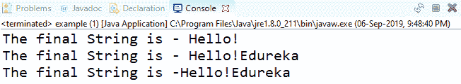

# String、StringBuffer 和 StringBuilder 有什么区别？

> 原文：<https://www.edureka.co/blog/string-vs-stringbuffer-vs-stringbuilder/>

字符串是表示一系列字符的对象。字符串是开发人员在用 [Java](https://www.edureka.co/java-j2ee-soa-training) 编程时最常用的类之一。但是，由于[字符串是不可变的](https://www.edureka.co/blog/immutable-string-in-java/)，Java 提出了两个实用程序类:StringBuilder 和 StringBuffer 来简化字符串操作。因此，在本文中，我将简要介绍 String、StringBuffer 和 StringBuilder 之间的区别。

以下是所涉及的主题:

*   [Java 中的字符串是什么？](#stringsinjava)
*   [串缓冲区 vs StringBuilder](#stringbuffervsstringbuilder)
*   [String vs String buffer vs StringBuilder](#stringvsstringbuffervsstringbuilder)

## **Java 中的字符串是什么？**

Java 中的字符串是用来表示字符序列的对象。它们既可以使用字符串文字创建，也可以使用 NEW 关键字创建。Java 中不可变的字符串以 UTF-16 格式表示。当一个新的字符串被创建时，它在 [JVM 字符串池](https://www.edureka.co/blog/java-string-pool/)中寻找具有相同值的字符串。如果找到相同的值，则返回引用，否则创建一个字符串对象并将该对象放入字符串池。

除此之外，String 使用+运算符连接两个字符串，并在内部使用 StringBuffer 来执行此操作。如果你想了解更多 Java 中的字符串及其方法，可以参考文章——**[Java Strings](https://www.edureka.co/blog/java-string/)**。

由于字符串在 Java 中是不可变的，所以每当执行字符串操作时，都会通过丢弃旧的字符串来自动生成新的字符串。但是，您不认为，当我们有大型应用程序时，这很麻烦吗？

为了避免堆中的垃圾，Java 提出了 StringBuffer 和 StringBuilder。所以接下来在这篇文章中让我们了解什么是 StringBuffer 和 StringBuilder。

## 【StringBuffer 和 StringBuilder 有什么区别？

StringBuffer 和 StringBuilder 是用于字符串操作的类。这些是可变的对象，它们为字符串操作提供了 substring()、insert()、append()、delete()等方法。

StringBuffer 和 StringBuilder 的主要区别如下:

| 串缓冲 | **StringBuilder** |
| StringBuffer 操作是线程安全和同步的 | StringBuilder 操作不是线程安全的，也不是同步的。 |
| StringBuffer 在[多线程](https://www.edureka.co/blog/java-thread/)处理同一个字符串时使用 | StringBuilder 在单线程环境中使用。 |
| 与 StringBuilder 相比，StringBuffer 的性能较慢 | 与 StringBuffer 相比，StringBuilder 的性能更快 |
| **语法:** `StringBuffer var =` `new` `StringBuffer(str);` | **语法:** `StringBuilder var =` `new` `StringBuilder(str);` |

接下来，在本文中，让我们看看 String、StringBuffer 和 StringBuilder 之间的区别。

## **Java 中的 String vs StringBuilder vs String buffer**

String、StringBuffer 和 StringBuilder 之间的差异基于以下两个参数:

*   易变性
*   表演

让我们一个一个地研究它们。

### **可变性**

好吧，当我们比较以上各项时，关于因子可变性。然后，如前所述，[string 是不可变的](https://www.edureka.co/blog/immutable-string-in-java/)而 StringBuffer 和 StringBuilder 是可变的。因此，当您使用 String 类时，不能更改字符串；而如果使用 StringBuffer 和 StringBuilder 类，字符串可能会改变。

考虑下面的代码片段:

```
package edureka;

public class example {

    public static void StrConcat(String str1) 
    { 
        str1 = str1 + "Edureka"; 
    } 

    public static void StrBufConcat(StringBuffer str2) 
    { 
        str2.append("Edureka"); 
    } 

    public static void StrBuildConcat(StringBuilder str3) 
    { 
        str3.append("Edureka"); 
    } 

    public static void main(String[] args) 
    { 
        String str1 = "Hello!"; 
        StrConcat(str1); 
        System.out.println("The final String is - " + str1); 

        StringBuffer str2 = new StringBuffer("Hello!"); 
        StrBufConcat(str2); 
        System.out.println("The final String is - " + str2); 

        StringBuilder str3 = new StringBuilder("Hello!"); 
        StrBuildConcat(str3);
        System.out.println("The final String is -" + str3); 
    } 
} 

```

#### **输出:**



在上面的代码中，我有三个函数:StrConcat、StrBufConcat 和 StrBuildConcat。

在第一个函数中，我已经传递了一个字符串-->“Hello！”然后为了执行连接，我使用了+运算符作为[str1 = str1 + "Edureka"]。现在，如果您观察输出，在 main()中传递的字符串没有改变，因为 String 是不可变的。这是因为 main()中的 str1 引用了“Edureka ”,而 StrConcat()中的 str1 引用了不同的对象。

但是，如果你看看另外两个函数:StrBufConcat 和 StrBuildConcat 输出是相同的，因为这些对象是可变的。在第二个和第三个函数中，我使用了 append()函数来连接字符串。

### **性能**

StringBuilder 比 StringBuffer 快，因为它不提供同步。这是因为不需要给系统增加额外的开销，也不会减慢处理速度。

如果我必须总结 String、StringBuffer 和 StringBuilder 之间的区别，请参考下表:

| **参数** | **字符串** | 串缓冲 | **StringBuilder** |
| **存储** | 字符串池 | 许多 | 许多 |
| **可变性** | 不变的 | 易变的 | 易变的 |
| **线程安全** | 不在线程环境中使用 | 在多线程环境中使用 | 在单线程环境中使用 |
| **性能** | 慢的 | 比 StringBuilder 慢，但比 String 快 | 比 StringBuffer 快 |
| **语法** | `String var =``“Edureka”; ``String var=new String(“Edureka”``);` | `StringBuffer var =` `new``StringBuffer("Edureka");` | `StringBuilder var =` `new``StringBuilder("Edureka");` |

到此，我们结束这篇文章。我希望你发现这篇文章信息丰富。

*既然你已经了解了 Java 的基础知识，那就来看看 Edureka 的 [**Java 培训**](https://www.edureka.co/java-j2ee-training-course)* *吧，edu reka 是一家值得信赖的在线学习公司，拥有遍布全球的 250，000 多名满意的学习者。Edureka 的 Java J2EE 和 SOA 培训和认证课程是为想成为 Java 开发人员的学生和专业人士设计的。该课程旨在为您提供 Java 编程的良好开端，并训练您掌握核心和高级 Java 概念以及各种 Java 框架，如 Hibernate & Spring。*

*有问题吗？请在本文“Java 中的 String vs StringBuilder vs String buffer”的评论部分提到它，我们会尽快回复您。*