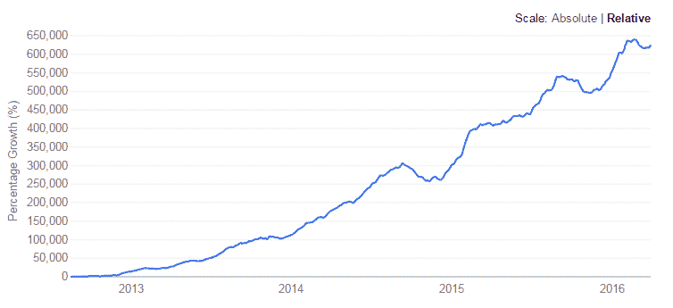
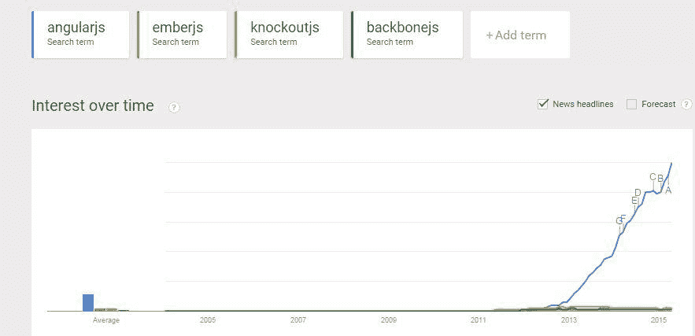
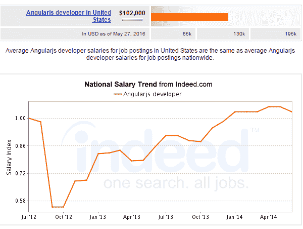
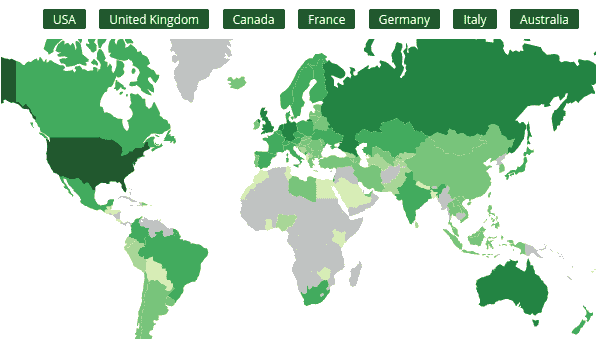
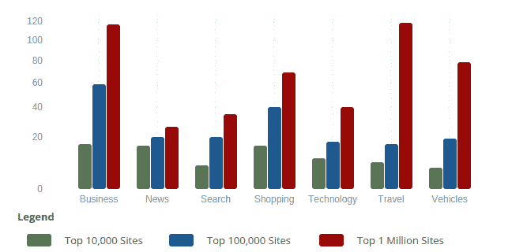

# AngularJS 成功的 Web 开发生涯:获得报酬最高的 AngularJS 工作！

> 原文：<https://www.edureka.co/blog/successful-web-development-career-with-angularjs>

UX 设计初创公司 Hanno 称 AngularJS 为当今开发者的“瑞士军刀”。这是理所当然的，因为开发框架已经看到了指数级的增长，这完全是因为它能够创建包含三个关键组件的单页面 web 应用程序——速度、敏捷性和强大的社区支持。AngularJS 的工作处于历史最高水平，机会承诺只会变得更好！

随着越来越多的功能转移到网上，网络浏览器成为新的计算节点，用户希望浏览器的行为像网络应用程序一样。AngularJS 允许浏览器动态呈现和显示内容，减少了服务器的负载，同时为 UI 开发人员提供了更大的灵活性，以提供直观的页面设计。随着对单页面应用程序和具有引人注目内容的直观 UI 的需求不断增长，AngularJS 正在成为资金雄厚的企业和自举创业公司等首选的开发平台。

AngularJS 已经从一个拥有粉丝的花哨框架发展成为一种推动业务增长的 web 技术。AngularJS 现在被那些核心业务依赖于强大的网络存在的组织自上而下地授权。因此，新的工作机会正在出现，安古拉杰的工作如今是收入最高的工作之一。在印度和美国，Angular JS 在所有其他[网络开发课程](https://www.edureka.co/complete-web-developer)中需求量很大。

## AngularJS Jobs:你通往成功的网络开发职业的大门

*让我们来看看如何使用 AngularJS 学习 web 开发并拥有成功的 web 开发职业生涯。*

AngularJS 是一个 JavaScript 框架，专为 web 开发人员和设计人员设计，他们寻求对 web 应用程序的更多控制。对于 web 开发人员来说，这意味着拥有一个直观的特性，允许他们为应用程序的客户端添加更多的价值。AngularJS 通过采用 HTML、JavaScript 和 CSS 完成了很多工作。

JavaScript 框架有很多选择，但 AngularJS 似乎已经颠覆了所有的选择，并取得了令人垂涎的领先地位。几年前，Backbone 似乎是一个明确的赢家，甚至击败了 Dojo 等更成熟的框架，保留了 Knockout 和 Ember 等新贵。

随着 AngularJS 教程和认证的出现，情况发生了彻底的转变。AngularJS 在 Javascript 框架领域占据主导地位，并且由于其与其他工具和框架集成的能力而继续保持这种地位。AngularJS 的集成是预先构建在 Kendo UI、Ionic、Famo.us、Wijmo 等框架中的。集成特性是其成功背后的一个巨大原因，并使其成为一个受欢迎的选择。也是其忠实用户持续使用的原因之一。

## 棱角的重要特征:

*   模块
*   指令
*   模板
*   范围
*   公式
*   数据绑定
*   MVC(模型、视图、控制器)
*   确认
*   过滤
*   服务
*   按指定路线发送
*   依赖注入
*   测试

## 安古拉工作收入丰厚！

上图(来源:事实上是就业趋势)清楚地表明，尽管在 2015 年经历了短暂的低谷期，AngularJS 仍取得了巨大的增长。专家预测，这股热潮只会在接下来的几个月里持续下去。

谷歌趋势图描绘了同样的画面，人们对 AngularJS 的兴趣程度更高，并且还在继续增长。

## **安古拉杰斯的知名度:**

AngularJS 的流行很清楚地表明了对技能的需求。美国劳工统计局报告称，2014 年，网络开发人员的失业率降至 0.7%，远低于所有 IT 岗位的 2.7%。网站开发人员的招聘比例也随之飙升。

科技人才中介公司 Mondo 的招聘主管马特·雷顿(Matt Leighton)观察到，网络开发是最难找到的技能之一。他还指出，对这项技能的需求没有得到满足，因为没有足够的人才来满足这一要求。根据新英格兰 Eliassen 集团副总裁 Tom Renda 的说法，网络开发人员需求量很大。除了 AngularJs，如果专业人士的简历中有 Hadoop 技能，他们将在大数据和分析领域受到高度追捧。

## **AngularJS 网站开发者薪酬包:**

以下是英国各地的薪资报告:

以上英国薪资报告由 itjobswatch 提供。工资同比变化很大(+156%)，显示出积极的趋势，以及对 AngularJS 技能的渐进需求。

就美国而言，平均薪酬为每年 102，000 美元(实际上是薪资趋势)。目前，大约有 6，340 个工作列在“AngularJS”下，这个数字还在继续增长。其中大约有 1326 个职位的年薪超过 15 万美元。

AngularJS 的流行导致了全球范围内的广泛使用。根据 Builtwith 的一份报告，该公司专注于网站分析器、线索生成、竞争分析和商业智能工具，为互联网提供技术采用、电子商务数据和使用分析。

在同一份报告中，他们还提到了 AngularJS 主要应用的领域。

*参考:*

## 为什么要学 AngularJS？

AngularJS 是 Javascript 库的一部分，致力于使 web 开发人员更容易编程。除了 AngularJS 的令人敬畏的特点、高工作需求和积极的预测之外，还有更多学习 AngularJS 的理由:

**更多控制:** AngularJS 拥有众多特性，允许它扩展基本 HTML、CSS 和 Javascript 之外的 web 应用功能。凭借双向数据绑定、自定义指令和服务以及客户端验证等功能，AngularJS 更加动态和灵活。

**简洁:** AngularJS 干净好用。AngularJS 的主要目标是简化 web 开发体验。尽管 AngularJS 具有重型能力，但它看起来非常简单和容易。

测试:AngularJS 的重点是可测试性。AngularJS 借助 MVC 框架和高效的开发方法，解决了代码单元测试的困难。这个工具还包括一个端到端的场景运行器，用于使用最少的代码进行自动化单元测试脚本。

**灵活且可扩展:** AngularJS 在与现有技术堆栈集成方面非常灵活。作为一个 JavaScript 客户端工具，它可以与任何正在使用的服务器端技术一起使用。它还可以与其他客户端技术兼容，并且可以在不干扰现有设置的情况下进行定制。

**受欢迎程度:** AngularJS 自 2010 年开始被广泛使用，其使用率和受欢迎程度持续增长。众多财富 500 强公司和初创公司都在实施 AngularJS。对 AngularJS 的需求变得如此之高，以至于成为了开发者的必备技能。

## 谁可以学习 AngularJS？

任何渴望通过使用 REST APIs 获得构建 SPAs(单页应用程序)和富客户端应用程序的专业知识的人都将从学习 AngularJS 中受益。当熟练掌握 AngularJS 时，像 Web 开发人员、项目经理、软件架构师和测试专业人员这样的角色也是一些关键的受益者。

## 谁在寻找这项技能？

全球各地都有公司在寻找 AngularJS 专业人士。一些流行的名字是:

*   太达因
*   ClientSolv 技术公司
*   战利品箱
*   Unity 技术公司
*   大联盟游戏
*   我的梦想
*   国际商用机器公司
*   摩根大通
*   Elance
*   Tech Mahindra 有限公司
*   兰斯塔德印度有限公司
*   iGate 全球解决方案
*   Wipro
*   凯捷

## 角度作业的标题:

在寻找安古拉工作机会时，以下是一些值得考虑的职位:

*   Web 开发人员
*   网络应用开发者
*   UI 开发人员
*   UI 工程师
*   MVC web 开发人员
*   前端开发人员
*   前端 web 开发人员
*   JavaScript 开发人员

## 为你的简历增加更多价值的工具:

AngularJS 将是 2015 年最热门的技能之一，并且肯定是一项你需要获得那些基于网络的趋势角色的技术。这里列出了一些对 Web 开发人员来说最好的 AngularJS 工具。掌握这些工具中的一些知识会让你比你的同龄人更有优势。

1.Jasmine: Jasmine 是一个面向 JavaScript 用户的测试框架。这个工具是一个无 DOM 框架，并且与 Node.js 项目兼容。使用该工具，您可以创建网站、简单的 web 应用程序和 Node.js 项目。

2.angular js–Karma:angular js Karma 是一个强大的 Javascript 应用测试框架。这个工具为开发人员提供了一个测试环境。

3.SublimeText: 这个工具是 web 开发人员最喜欢的工具之一。它是 cod、标记和散文最复杂的文本编辑器。该工具的用户界面具有非凡的功能和惊人的性能。

4.Webstorm: WebStorm 是一个代码编辑器，提供对 JavaScript、Node.js、HTML 和 CSS 的顶级支持。这个工具是一个强大的 IDE，能够用 Node.js 处理复杂的客户端开发和服务器端开发。

5.AngularFire: AngularFire 是一套可以用来轻松构建 web 和移动应用程序的库。它强大的框架为 JavaScript 用户提供了所需的功能。

6.量角器:这是测试角度的最好工具之一。量角器可用作 AngularJS 应用的端到端测试框架。这个工具运行在真实的浏览器中，以其特定角度的定位器策略而闻名。

7.Angular deck grid:Angular deck grid 是一种轻质的类似砖石的格子。该工具的指令不依赖于视觉表示。

8.Mochajs: Mocha 是一个特性丰富的 Javascript 库。该工具使用基于 node.js 的测试框架，并使用浏览器实时运行测试。这也使得异步测试变得简单有趣。这个工具可以用来创建多个 Mocha 测试并同时运行它们。

9.Restangular: Restangular 非常适合任何使用 RESTful API 数据的 web 应用程序。它用最少的客户机代码简化了常见的 GET、POST、DELETE 和 UPDATE 请求。

10.DjAngular: DjAngular 是一个可重用的应用程序，它提供了与 AngularJS 的高效应用程序集成。该工具允许您为每个应用程序创建 AngularJS 内容，而不是在 Django 内部创建一个大规模的 AngularJS 应用程序。

## 结论:

AngularJS 已经证明了自己是 web 开发人员的一项有价值的投资，对于拥有这项技能的专业人员来说，它仍然是一笔宝贵的资产。现在是利用积极趋势学习 AngularJS 的最佳时机。。从这个[网络开发实习](https://www.edureka.co/internship/full-stack-web-development)项目开始你的职业生涯，今天就学习 AngularJS。

有问题要问我们吗？请在评论区提及它们，我们将会回复您，或者今天就加入我们的[角度认证](https://www.edureka.co/angular-training)课程。

**相关帖子:**

[你驾驭安古拉吉斯浪潮了吗？](https://www.edureka.co/blog/videos/are-you-riding-the-angularjs-wave-yet/ "are you riding the angularjs wave yet")

[网络开发者在线课程](https://www.edureka.co/masters-program/full-stack-developer-training)