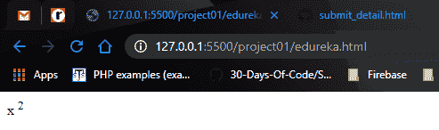

# 如何在 HTML 中最好地使用上标标签？

> 原文：<https://www.edureka.co/blog/superscript-tag-in-html/>

这篇文章将帮助你探索一个简单而有趣的概念，即 [HTML](https://www.edureka.co/blog/what-is-html/) 中的上标标签。本文将涉及以下几点:

*   [HTML 中的上标标签](#SuperscriptTaginHTML)
*   [HTML 中的标签和属性](#TagsAndAttributesinHTML)
*   [上标](#Superscript)

让我们从这篇文章开始吧，

## **HTML 中的上标标签**

很明显，听到 Www 这个术语后，人们首先想到的是 HTML。基本上，它是你今天访问的每一个网站背后的东西。

单靠 HTML 无法公正地处理我们今天看到的一些最受欢迎的设计。它需要帮助，这是由 **CSS** 或 **级联样式表** 提供的。HTML & CSS 可以一起使用，创建一些有吸引力的网页。

继续这篇关于 HTML 上标标签的文章

## **标签【HTML 中的 属性**

这两者都是 HTML 的基础，它们一起工作，但执行不同的功能。

**标签:**标签用来标记 HTML 元素的开始，用尖括号括起来。

**举例:** < h1 >

上面的标签是 HTML 中的 heading 标签。

属性:这些是关于标签的附加信息，在标签中指定。

**例子**

<imgsrc=" hello _ world . jpg "alt="我的 第一个 程序 >

上面的标签是图片标签< img >，alt 是标签的属性，提供图片 hello_world.jpg 的描述

我们已经讨论了我们需要的基础知识，所以现在我们可以继续讨论这篇文章的主题，一些高级的 HTML 和 CSS 标签。

继续这篇关于 HTML 上标标签的文章

## **上标**

所以，我们所有人都在许多地方、多次见过变量或数字的幂。这就是所谓的上标，这个值比正文高了一点。为此，我们使用了< sup >标签。上标值包含在< sup >标签中。

**举例:**假设我们需要在网页中写 x 的平方，那么它会如下完成。

<p>x<sup>2</sup></p>

**GitHub 要点链接:**

<script src = " https://gist . github . com/snehs eel/f 821842 ad 8 b 8 c 722 c 3d 87 DC 60 a1 b 657d . js "></script>

这里的< p >标签用于段落，而< sup >标签内的文本将被上标，x 2 将显示在网页上。



2 上标在 x 上

上标标签的 CSS 元素如下:

```
<style>
Sup
{
Vertical-align: super;
Font-size: smaller;
}
</style>
```

**GitHub 要点链接:**

src = " https://gist . github . com/snehsel/3b 0886247 a 7 DCC 3fc 9 D6 f 509635 CBE 7 . js "></script>

大多数浏览器会显示带有上述 CSS 和默认值的上标文本< sup >。

这就把我们带到了本文的结尾

*查看我们的  [全栈 Web 开发人员硕士课程](https://www.edureka.co/masters-program/full-stack-developer-training) ，该课程包含讲师指导的现场培训和真实项目体验。本培训使您精通使用后端和前端 web 技术的技能。它包括关于 Web 开发、jQuery、Angular、NodeJS、ExpressJS 和 MongoDB 的培训。*

有问题要问我们吗？请在文章的评论部分提到它，我们会给你回复。