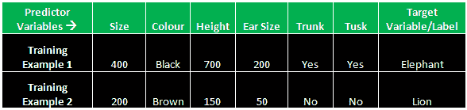

# Apache Mahout 中的监督学习

> 原文：<https://www.edureka.co/blog/supervised-learning-technique-in-mahout/>

[//www.youtube.com/embed/m7F6-5Bbz4c](//www.youtube.com/embed/m7F6-5Bbz4c)

监督学习是一种方法，其中训练数据包括输入和期望的结果。用例子训练系统叫做监督学习。或者，用老师训练算法也可以被视为监督学习。在用所有样本数据或标记数据训练该算法之后，可以训练该算法并使用看不见的例子进行进一步分类，其中所述样本数据或标记数据具有关于目标变量的两个预测器。

以下是 Mahout 中监督学习的一些重要特性:

*   构建适当的培训、验证和测试集(Bok)至关重要。
*   这些方法通常又快又准确。
*   监督学习方法必须能够推广。
*   当输入中给出新数据而不知道一个先验目标时，它们给出正确的结果。
*   在某些情况下，正确的结果(目标)是已知的，并在学习过程中输入到模型中。

## **监督学习的例子**

## 

如果你想训练一个任务，你会得到两组不同的图像和标签数据，例如，在上图中，一组是大象的图像，另一组是狮子的图像。标记数据意味着每个数据集都有一个目标值。在上面的例子中，数据集是大象的图像，而赋予它的标签，即“大象”是数据集的目标值。这种标记的数据集用于训练过程，使得训练算法可以利用该数据集并建立某种模型，该模型可以进一步用于对没有标记数据或目标变量的看不见的例子进行分类。

让我们确定有助于识别物体是大象还是狮子的特征:

特征可以是**–**大小、颜色、身高、耳朵大小、躯干、长牙

这可以称为特征集，将用于训练目的。该特性集将影响最终目标变量。这些变量被称为**预测变量**，因为它们帮助我们确定**最终目标变量**。最后一个变量也可以称为标签。最后一个变量**这里的 T5 是大象/狮子。**

在这个例子中，类别、大小、颜色、高度、耳朵大小、鼻子和象牙中的每个记录都是预测变量，而大象和狮子是目标变量。这些变量可以分别被视为训练样本和训练数据集。

因此，监督学习是一种方式，通过这种方式，你可以与标签一起训练，其中你要求算法从中提取某些特征，基于此，每当你看到一个看不见的例子，算法就能够将其分类到正确的类别中。

有问题要问我们吗？在评论区提到它们，我们会给你回复。

**相关帖子:**

[在看象人](https://www.edureka.co/mahout-self-paced "Learn Machine Learning in Mahout") 中学习机器学习