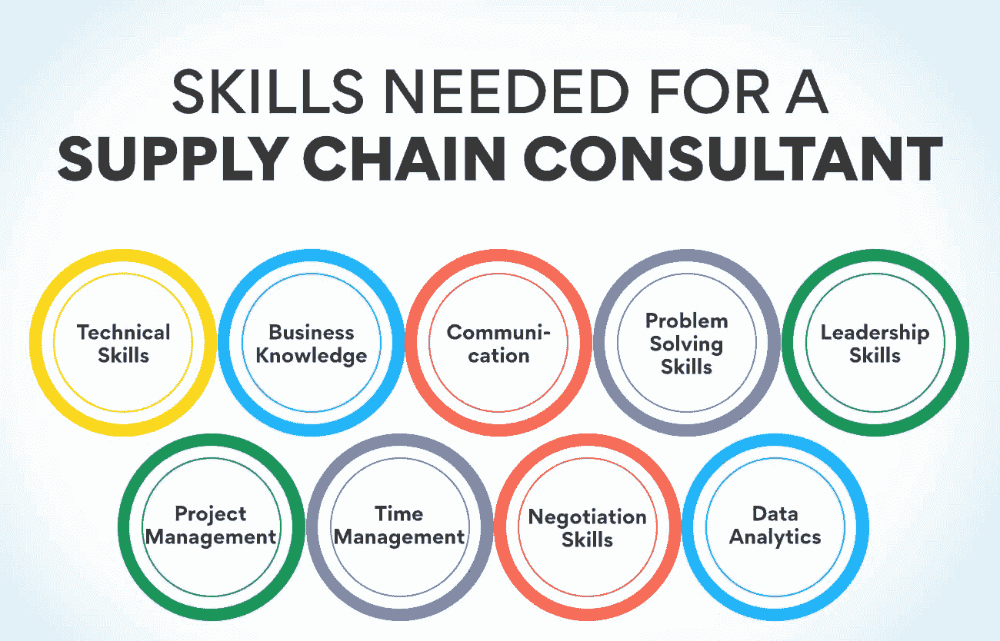
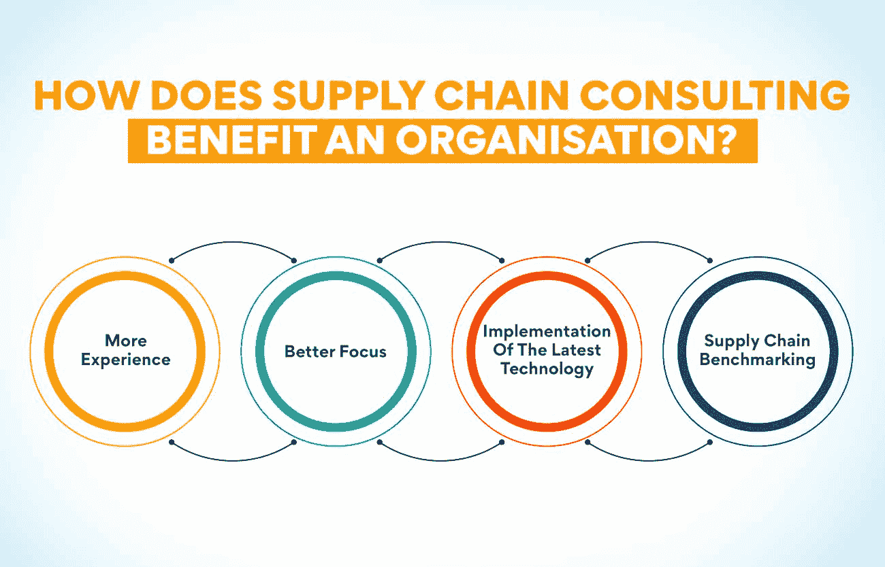

# 什么是供应链咨询？意义和框架

> 原文：<https://www.edureka.co/blog/supply-chain-consulting/>

你不能否认供应链是一个组织的关键职能之一，它将产品交付给客户。高效的供应链将赢得客户忠诚度和更高的利润。拥有优化的供应链将确保减少浪费和提高效率。这一职能由不同的部门、人员和工具组成，很难管理。供应链咨询是确保供应链效率最大化的绝佳方式。对于那些不熟悉这个主题的人，让我们先来看看供应链管理。

学习供应链管理的一个好方法是参加运营、供应链和项目管理高级证书课程。访问我们的网站会让你对这门课程及其好处有更多的了解。

**了解供应链管理**

供应链是一种功能，包括产品制造和交付中涉及的人员、机器和流程。它涉及内部和外部实体。它包括供应商、制造商、储存设施、运输商、分销商和零售商。这就是高效管理 it 非常重要的原因。供应链管理是监督供应链中所有任务并确保其最佳运行的过程。公司的各个部门都包括在这个过程中。当公司发现供应链需要改进时，它将这项工作交给供应链咨询的专家。

良好的供应链管理寻求系统的持续改进。公司总是在寻找降低成本和减少浪费的方法。当供应链高效时，它将提高客户满意度和组织的利润。管理良好的供应链中的各种实体相互协作。供应链经理定期寻找可以改进流程的工具。他们还采取措施帮助员工评估他们的表现。执行供应链咨询是优化流程的绝佳方式。

**也读:[什么是供应链控制塔？种类&用途](https://www.edureka.co/blog/supply-chain-control-tower/)**

**什么是供应链咨询？**

有时，公司需要一名专家来深入研究他们的供应链流程，并探索可能改进的领域。这些专家确定了供应链中提供优化空间的各个领域。这个过程叫做供应链咨询，而做这个的人叫做供应链顾问。这些顾问大多专注于供应链的一个方面，如采购、生产、计划或[库存管理](https://www.edureka.co/blog/inventory-management/)。但是也可以找到能够指导所有供应链功能的多面手。

供应链咨询是一份既需要技术和人际交往技能，也需要其他能力的工作。他们必须具备关于产品如何从原材料阶段转移到客户手中的技术知识。他们还必须熟悉流程中使用的各种技术。许多供应链使用 RFID 标签等跟踪方法。其他应用程序用于库存管理。一个好的供应链顾问应该熟悉所有这些技术。他们还必须具备出色的人际交往技能，因为他们要与不同供应链职能部门的各种官员打交道。

**供应链顾问的职责**

供应链咨询的专家将履行一系列职责，帮助提高客户的供应链效率。他们必须制定提高库存周转率、降低库存水平和降低运输成本的策略。分析过去的销售数据、经济趋势和其他影响销售的因素，并准确预测需求也是他们的职责之一。这些专家定期进行供应链审计，以确定需要改进的地方。他们还使用计算机建模软件来开发和测试新的供应链模型。

他们还使用成本效率和生产率等方法来评估供应链的绩效。供应链咨询的专家利用新技术来改善供应链的结果。公司还可以从供应链顾问那里获得关于仓储和库存管理[策略的指导。这些顾问还就运输方式和定价模式提供宝贵的建议。顾问还与供应商保持密切关系，以确保订单的及时执行。既然我们已经了解了供应链顾问的职责，那么让我们来看看这个人必须具备什么样的品质。](https://www.edureka.co/blog/how-to-formulate-advanced-supply-chain-strategy/)

**供应链顾问所需的技能**

**技术技能**

供应链中使用了各种技术和软件应用。这些有助于该过程平稳高效地运行。信息是该过程的一个重要方面，软件程序有助于信息在两个方向的顺畅流动。如此多的小玩意和机器的存在使得那些在供应链咨询的人有必要拥有良好的技术技能。这种能力允许人们更好地理解过程，并确定需要改进的地方。数据分析是在供应链管理中广泛使用的另一项技术，用于更好的销售预测。

**商业知识**

供应链咨询的目标是为企业降低成本和提高利润。这意味着对公司及其业务的了解对顾问来说非常重要。他们必须知道企业的目标以及短期和长期的目标。并非所有的公司都有相同的[目标](https://www.edureka.co/blog/objectives-of-supply-chain-management-explained/)，这是供应链顾问必须了解的事情。研究雇佣他们的公司的业务有助于实现预期的目标。这些专家必须熟悉业务运营、财务、营销和其他公司职能。

**通信**

对于供应链咨询专家来说，这是一项重要的技能，因为他们必须与供应链中的各种人沟通。供应链由公司内外的人组成。供应商、运输运营商、分销商和零售商也是供应链的一部分。顾问必须与组织中不同部门的不同层次的人互动。拥有良好的沟通技巧有助于他们非常清楚地传达自己的建议和想法。指令的清晰传达导致工作的正确执行。

运营、供应链和项目管理高级证书课程教授沟通技巧等。这些课程对于获得咨询师所需的各种能力非常有用。你可以从我们的网站上了解更多关于这门课程的信息。

**解决问题的技巧**

供应链由不同部门的各种功能组成。这意味着任何试图改进流程的人都将面临多重挑战。当你试图通过一份供应链咨询的工作来改善供应链时，你可能会面临各种需要立即解决的问题。在与来自不同背景的人一起工作时，顾问可能会面临多种问题。获得解决问题的技能对于高效完成这项工作至关重要。

**领导技能**

顾问的工作包括让人们遵循指示来改善供应链。供应链咨询的领导者必须得到组织中不同部门人员的支持和追随。顾问必须与采购经理、生产经理等专业人士合作。让所有这些人遵循提供的指导并不是一件容易的事情。只有与他们合作，你才有希望在这个行业取得成功。你必须拥有优秀的领导技能来鼓励和激励这些人听从你的命令。

**也可理解为:[什么是供应链优化？](https://www.edureka.co/blog/supply-chain-optimisation/)概述**

**项目管理**

供应链咨询不是日常工作的一部分。它是专门为了提高供应链的绩效，使其更有效率。这项工作就像一个项目，涉及使用各种资源来实现一个目标。像任何项目经理一样，顾问也使用各种工具、技术、资金和人员。许多顾问都有需要管理的团队。拥有优秀的项目管理技能有助于成功完成工作。

**时间管理**

与正在进行的工作不同，供应链咨询是一项受时间限制的任务。雇佣顾问的公司希望供应链在一定时间内得到优化。有各种各样的任务需要完成来改进这个过程。供应链中有不同的功能需要评估。顾问必须为供应链各阶段的所有问题找到解决方案，并在期限内实施。这些都需要咨询师很好的管理时间。良好的时间管理技巧会帮助你按时完成一个项目，然后进入下一个项目。

**谈判技巧**

当你从事供应链咨询时，你经常与一家公司合作，你必须说服这家公司按照你的指示来改进它的流程。如果你建议的改变涉及额外的开支，让管理层执行你的指示就不容易了。要说服公司老板同意这些改变可能需要很大的努力。顾问也和公司的各个部门一起工作。他们可能需要公司员工的帮助和支持。得到这个需要和部门领导协商。

**数据分析**

供应链顾问将需要分析大量数据，以得出能够改善流程的解决方案。有关过去销售和市场状况的数据有助于他们做出更好的销售预测。分析技能也帮助他们找到改善运输和降低成本的方法。挖掘数据有助于他们找到见解，从而为公司所有者提供正确的建议。分析有关库存水平和成本的信息有助于他们找到优化库存和降低成本的解决方案。数据分析是执行供应链咨询**的一项非常有用的技能。**

供应链咨询如何让组织受益？

**更多经历**

公司在供应链运作中只会遇到一两次问题。但是供应链咨询公司(T2)的专家会发现同样的问题发生在不同的公司。这种经历给了他们更好的知识来找到正确的解决方案。他们还会探索各种解决方案，并得出最佳方案。这种经验是公司在聘请顾问时可以获得的好处。

**更好的聚焦**

供应链经理有许多职责要履行，每天都面临着组织中的挑战。这使得他们无法专注于那些阻碍供应链实现最佳绩效的问题。当你打电话给外部机构寻求供应链咨询时，他们只负责一项任务——优化供应链。他们可以专注于手头的问题，并迅速找到解决方案。

**实施最新技术**

新技术以难以跟上的速度出现。供应链管理也是如此。仓库管理系统、运输管理系统和基于 RFID 的跟踪解决方案是有助于大大改善供应链流程的技术之一。对于一家必须考虑业务各个方面的公司来说，可能很难决定采用何种技术来改善供应链。但是供应链咨询公司的专家可以建议有助于优化公司供应链流程的技术。

**供应链标杆管理**

这是一种检查供应链、设定目标和填补缺口的方法。订单履行率、供应链成本、客户满意率和供应商绩效等各种指标被用来衡量供应链的绩效。执行供应链咨询有助于识别业务的正确指标，并找出性能下降的地方。顾问们找到了改善这些领域的解决方案。

我们已经看到了任命顾问的一些好处。人们可以通过报名参加[运营、供应链和项目管理](https://www.edureka.co/highered/advanced-program-in-operations-supply-chain-project-management-iitg)高级证书课程来了解更多信息，并学习如何成为供应链顾问。我们的网站上有这门课程的详细信息。

**结论**

越来越多的公司意识到优化供应链的好处。当客户满意度和降低成本至关重要时，唯一的解决方案就是改进供应链流程。大多数公司没有专业知识或技术人员来正确识别流程中的不足并找到正确的解决方案。这就是供应链顾问大有帮助的地方。这个职业有很大的发展空间，对于那些精通供应链管理的人来说，这可能是一个有回报的职业。

## **更多信息:**

[供应链管理的主要决策领域](https://www.edureka.co/blog/major-decision-areas-in-supply-chain-management/)

[了解供应链管理的基本要素](https://www.edureka.co/blog/components-of-supply-chain-management/)

绿色供应链管理:它是什么，为什么重要？

[什么是绿色供应链？概述](https://www.edureka.co/blog/green-supply-chain)