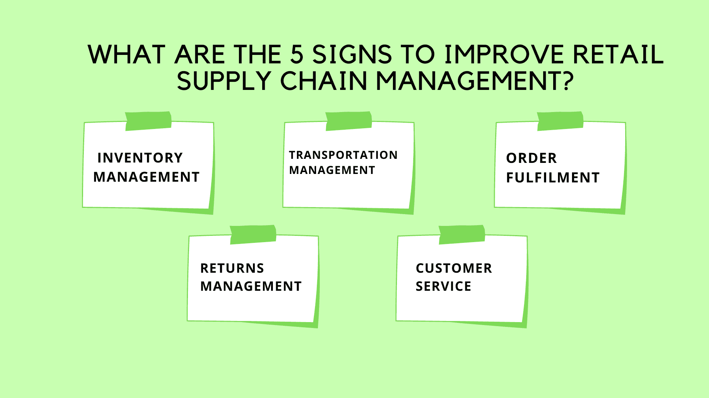
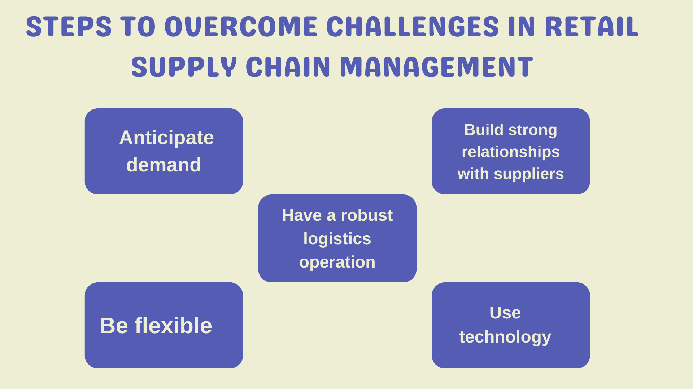

# 供应链管理与零售业:一个重要的关系

> 原文：<https://www.edureka.co/blog/supply-chain-management-retail/>

零售业是世界上最重要的行业之一。它是制造商和消费者之间的纽带，负责向人们提供他们需要的所有需要的商品和服务。因此，零售企业的供应链管理(SCM)至关重要。

供应链管理就是处理从供应商到客户的货物和资源的流动，它包括从采购和物流到仓储和库存管理的一切。一个管理良好的供应链可以成就一个零售企业，也可以毁掉一个零售企业，因此正确处理供应链至关重要。这篇博客文章将着眼于供应链管理在零售业中的重要性以及一些相关的挑战。

## **什么是零售供应链管理？**

零售商面临着持续的压力，要跟上最新的潮流，储备最热门的商品，并快速高效地发货。为了满足这些需求，零售商依靠供应链管理(SCM)来简化他们的运营，并确保货物从供应商到客户的稳定流动。

供应链管理是一个宽泛的术语，涵盖了将产品从供应商处运送到客户处的所有活动，包括采购、采购、制造、仓储、运输和客户服务。通过优化供应链的每个阶段，零售商可以提高效率和响应能力，同时降低成本。

运行良好的零售供应链必须能够满足每个零售商的独特需求。例如，一个时装零售商将有不同于杂货店的供应链管理要求。然而，所有零售商都面临一些共同的供应链管理挑战，如管理库存水平、应对季节性和处理退货/换货。

库存管理是零售供应链管理的重要组成部分。零售商必须在库存过多(这会占用资金并产生存储成本)和库存过少(会导致缺货和销售损失)之间找到平衡。季节性是零售商必须应对的另一个挑战；例如，12 月份对冬装的需求通常高于 1 月份。最后，退货/换货对零售商来说可能是一笔很高的成本。

## **解释零售供应链管理的 3 大优势**

在零售行业，供应链管理(SCM)管理着商品和服务从供应商到客户的流动。零售供应链管理包括计划、采购、制造、交付以及向零售商返还产品和服务的所有活动。

零售供应链管理旨在以最有效的方式为顾客提供合适的产品。要做到这一点，零售商必须有一个高效的供应链。

拥有一个完善的零售供应链管理系统有很多好处。下面是其中的三个:

1.  **提高效率和生产力:** 管理良好的供应链有助于提高整个组织的效率和生产力。它可以为公司节约成本，提高客户满意度。通过简化流程和加强不同部门之间的沟通，每个人都可以朝着共同的目标更有效地工作。
2.  **改善库存管理:** 良好的库存管理对任何企业都至关重要，但在零售行业更是如此，因为零售行业必须持续监控库存水平。管理良好的供应链有助于确保库存水平保持在最佳水平，以便客户在需要时总能找到他们需要的产品。
3.  **降低成本:** 高效的供应链有助于降低整个组织的成本。当流程得到简化，沟通得到改善时，企业可以在运输、仓储和员工开支等方面节省资金。

## **如何改善零售供应链管理？**

供应链管理是关于组织整个公司的货物和资源的流动。在零售行业，供应链管理对于确保产品及时有效地交付给商店和客户至关重要。

有几种方法可以改善零售供应链管理，包括:

1.  改善供应链不同部分之间的沟通和协调。
2.  利用技术跟踪整个供应链中的库存水平和产品流动。
3.  与供应商合作，简化运营并降低成本。
4.  实施即时制造和交付方法，最大限度地降低库存成本。
5.  使用精益制造技术来减少整个生产过程中的浪费。

## **改善零售供应链管理的 5 个标志是什么？**

1.  **库存管理:** 库存过多会束缚营运资金，导致存储成本，而库存不足会导致销售损失，客户受挫。在两个极端之间取得平衡的理想方法。
2.  **运输管理:** 高效的运输系统对于迅速将货物从供应商处运送到零售店至关重要。
3.  **订单履行:** 确保准确高效地履行订单对于客户满意度至关重要。
4.  **退货管理:** 有效的退货管理流程可确保快速高效地处理退货，最大限度地减少对供应链其他部分的影响。
5.  **客户服务:** 卓越的客户服务是让顾客开心并确保他们不断回来的关键。

## 供应链管理是如何帮助零售业发展的？

“供应链管理”一词在当代商界已经变得相当流行。它被定义为一种战略性的、有组织的方法来管理一个组织或公司的不同部分之间的货物、服务和信息的流入和流出。

换句话说，它整合并协调所有关于原材料采购、转换成成品以及分销给客户的活动。供应链管理的主要目的是降低成本和时间，同时确保符合质量标准。

零售业是一个大规模采用供应链管理实践来保持竞争力和发展的行业。零售商为顾客提供物有所值、高质量的产品和令人满意的购物体验的压力从未像现在这样大。为了应对这些挑战，零售商必须拥有高效的供应链。

高效的供应链使零售商能够以合适的价格从能够按时交货的供应商那里采购商品。它还能让零售商快速高效地将产品送到商店，让顾客在需要时就能买到。此外，有效的供应链使零售商能够对客户需求的变化做出快速反应，以便随时储备合适的产品。

供应链管理给零售企业带来的好处数不胜数。通过建立高效的供应链，零售商可以节省资金，改善客户服务，并快速响应客户需求的变化。

## **零售供应链管理软件的重要性是什么？**

1.  零售供应链管理软件有助于简化和自动化库存管理、订单履行和其他关键供应链流程。
2.  通过优化这些流程，零售商可以提高运营效率，更好地满足客户需求。
3.  此外，零售供应链管理软件可以提供对趋势和模式的宝贵见解，帮助零售商对其库存水平和库存策略做出更明智的决策。
4.  此外，优秀的零售供应链管理系统有助于改善不同供应链成员之间的沟通和协作，如供应商、制造商、物流供应商和零售商。
5.  最终，使用零售供应链管理软件可以帮助零售商节省时间和金钱，同时提供更好的客户体验。

## **零售供应链管理的挑战**

零售业是世界上最重要的行业之一，供应链管理至关重要。零售供应链包括将产品从供应商处运送到客户处的所有活动。

零售供应链管理的主要挑战是保持低库存水平，同时仍能满足客户需求。这是因为过多的库存会占用资金，导致存储和处理成本，而过少的库存会导致缺货和销售损失。

另一个挑战是管理零售环境中常见的大量 SKU(库存单位)。这是因为需要单独跟踪每个 SKU，这会导致系统的复杂性和误差。

另一个挑战是处理退货和退款，因为这些需要快速有效地处理，以让客户满意。最后，还有应对季节性需求高峰的挑战，比如节假日期间。

## **克服零售供应链管理挑战的步骤**

1.  **预测需求:** 为了应对零售供应链管理中的挑战，预测消费者需求至关重要。这可以通过有效的市场研究和分析来实现。
2.  **与供应商建立稳固的关系:** 与供应商建立稳固的关系对于确保可靠的商品供应至关重要。与供应商建立信任和沟通有助于避免供应链中断。
3.  **拥有强大的物流运作:** 运作良好的物流运作对成功的零售供应链管理至关重要。拥有高效的订购、仓储和运输系统有助于避免中断，并确保及时将商品交付给消费者。
4.  灵活应变: 在零售供应链管理中，适应不断变化的环境至关重要。例如，根据需求变化快速调整生产计划或改变运输路线有助于避免缺货或其他中断。
5.  **利用技术:** 技术可以用来提高整个零售供应链的可视性和协调性。例如，使用条形码和 RFID 标签可以帮助跟踪库存水平和位置，而软件工具可以自动化许多活动，如订单下达和跟踪。

## 零售供应链管理的未来是什么样的？

零售供应链管理的未来在于能够高效和有效地满足客户需求。为了做到这一点，零售商需要准确预测客户需求，并拥有一个组织良好的供应链，能够对需求的变化做出快速反应。此外，零售商需要了解他们的供应链，以便发现问题并做出必要的调整。

技术将在帮助零售商应对这些挑战方面发挥重要作用。例如，人工智能(AI)可以用于需求预测，而区块链可以提供供应链的可见性。此外，3D 打印可以按需创建定制产品，这可以进一步帮助缩短交付时间和提高响应能力。

随着零售业的不断发展，零售商必须通过投资尖端技术来保持领先地位，从而更好地满足客户的需求。

零售行业供应链管理的未来令人振奋。近年来，我们看到技术在管理和监控库存水平、跟踪货运和优化路线方面的使用大幅增加。这使得零售商变得更有效率，对顾客需求的反应更快。

在未来几年，我们将见证更多的技术进步，进一步提高供应链的效率。例如，RFID 标签将变得更加普遍，允许零售商跟踪从生产到销售点的整个供应链中的单个商品。这将使零售商能够更好地管理他们的库存水平，并确保他们总是有正确的产品库存。

此外，我们将看到零售供应链管理中越来越多地使用数据分析。数据分析可以识别客户行为的模式和趋势，从而做出关于从哪里采购产品以及如何最好地满足客户订单的明智决策。这将有助于零售商降低成本，提高客户满意度。

总的来说，零售供应链管理的前景非常光明。随着技术和数据分析的不断进步，我们可以期待更多的效率收益，这将使零售商和消费者受益。

## **结论**

零售行业在不断发展，供应链管理是其中至关重要的一部分。通过了解零售行业的需求和挑战，供应链管理有助于确保零售商能够满足客户需求并在竞争中保持领先地位。通过合作，零售和供应链组织可以确保他们提供的产品和服务是最高质量的，并满足其客户的需求。

零售行业的供应链管理正在不断发展，现在是开始你职业生涯的时候了。我们的[运营、供应链和项目管理高级证书](https://www.edureka.co/highered/advanced-program-in-operations-supply-chain-project-management-iitg)是你详细了解供应链管理的最佳起点。查看课程，让你的职业生涯朝着最好的方向发展。