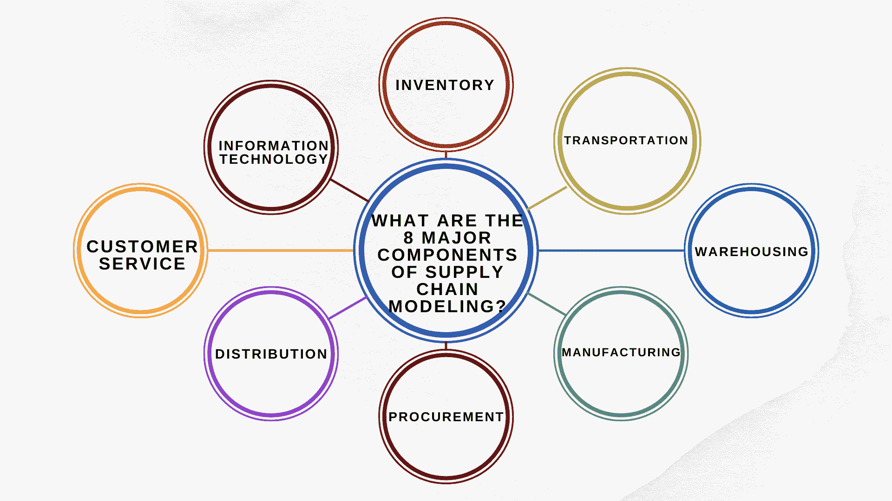
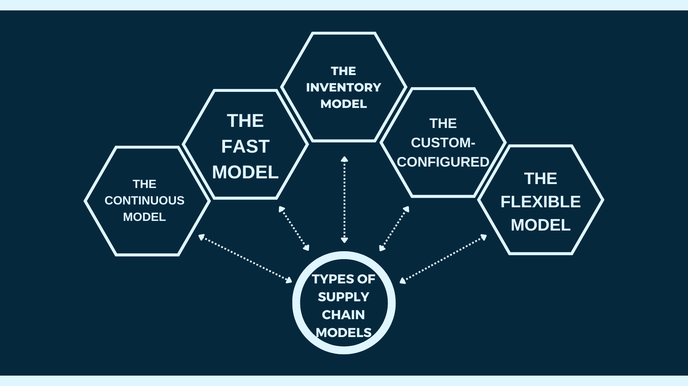

# 供应链建模:类型、模型和最佳实践

> 原文：<https://www.edureka.co/blog/supply-chain-modeling/>

供应链建模是用于评估和优化供应链中货物、信息和货币流动的过程。它可以用来发现瓶颈，优化运输路线，并确定节约成本的机会。有不同类型的供应链模型，每一种都有其优点和缺点。最流行的模型是牛鞭效应、啤酒游戏和报童模型。这篇博文将探讨这些模型，并探索供应链建模的一些最佳实践。

## **什么是供应链建模？**

供应链建模是设计和分析供应链，以确定潜在的改进。供应链模型可用于模拟不同的场景，以确定最有效或最实用的行动方案。

有许多供应链模型，包括静态、动态和蒙特卡罗模拟模型。特定情况下最合适的模型取决于业务的特定目标和约束。

供应链建模的一些好处包括:

*   降低成本
*   效率提高
*   提高客户满意度

要了解供应链建模的更多信息，请查看我们的运营、供应链和项目管理高级证书课程，了解供应链管理的更多信息。

## 供应链建模的 8 个主要组成部分是什么？

1.  **库存:** 这是供应链建模中最关键的[组成部分，因为它直接影响底线。](https://www.edureka.co/blog/components-of-supply-chain-management/)
2.  **交通** :包括公路、铁路、航空、水路等所有交通方式。
3.  仓储: 这对于成品和原材料都很重要。它包括存储、检索和包装。
4.  **制造业:** 这是将原材料转化为成品。它包括装配、测试和质量控制等过程。
5.  **采购:** 这包括从供应商处采购原材料和零部件。还包括合同谈判和管理。
6.  分销: 这包括通过批发商、零售商或直销渠道将成品交付给客户。
7.  **客户服务:** 包括接订单、开发票、退货处理和售后服务等活动。
8.  **信息技术:** 从计划到执行，信息技术在供应链管理的各个方面都至关重要。

## **供应链建模的意义是什么？**

在任何业务中，供应链管理的目标都是在最大化客户服务的同时最小化成本。为了实现这一点，管理者必须计划和控制整个供应链上的材料、信息和资金的流动——从供应商到制造商到批发商到零售商再到顾客。

供应链建模是一种工具，可以帮助管理者就如何运营供应链做出更好的决策。通过创建供应链模型，经理们可以尝试不同的场景，看看它们会对成本和客户服务产生什么影响。

供应链建模有许多不同类型的模型。最受欢迎的类型是线性规划模型，这是一种数学模型，可以帮助管理者找到分配资源以实现特定目标的最佳方式。其他类型的模型包括模拟模型、排队模型和统计模型。

选择模型的最佳方式是首先确定你试图解决的具体问题。一旦您知道您想要优化什么，您就可以选择最能帮助您找到解决方案的模型类型。

## **供应链模式的类型** 

**连续模式**

供应链被定义为从供应商处接收货物并将产品交付给客户的设施和分销系统。供应链管理(SCM)的主要目标是在最大化客户服务水平的同时最小化总拥有成本。

连续模式是一种供应链，其中物料在生产过程中持续不断地流动。这种类型的供应链通常用于对产品有很高需求并需要稳定产出的制造业。

连续生产模式的一个优势是它允许即时生产，这可以节省库存成本。这种生产方式也消除了浪费，因为材料只在需要时才生产。这种模式的一个缺点是，如果需求发生突然变化，改变或调整生产流程可能会很困难。

如果你正考虑在你的业务中使用连续模式，权衡利弊，看看这种类型的供应链是否适合你是至关重要的。

**快速模式**

快速模型是一种供应链模型，旨在帮助企业快速做出决策。该模型基于这样一个原则，即企业决策越快，情况就越好。Fast 模型旨在帮助公司做出有关库存、生产和其他运营方面的决策。

**也读:[运营管理的范围是什么？](https://www.edureka.co/blog/what-is-the-scope-of-operations-management/)**

**库存模型**

在商业中,“供应链”这个术语指的是将原材料转化为成品，然后将这些成品送到客户手中。供应链包括从原材料的采购到产品的制造，再到这些产品的分销和交付。

根据企业的具体需求和目标，企业可以使用各种库存供应链模型。三种最常见的供应链模式是按库存生产(MTS)、按订单生产(MTO)和按订单装配(ATO)。

按库存生产(MTS)模式是最常见的供应链类型。在这种模式下，成品的生产和储存是根据客户需求的预期进行的。当顾客下订单时，成品就被简单地从货架上拉下来并运出去。这种类型的模型通常用于快速消费品(FMCG ),如食品和饮料，其中客户需求相对容易预测。

按订单生产(MTO)模式类似于 MTS，但企业只储存原材料或组件，而不储存成品。当客户下订单时，从库存中取出必要的组件，组装成成品，然后运出。这种类型的模型通常用于定制产品或交付周期长的产品，如家具或大件商品。

**自定义配置的**

定制配置的供应链模型是专为公司的个人需求而设计的。这种类型的模型考虑了公司使用的特定产品、服务和材料，以及其供应链运作的独特方式。定制配置的模型通常用于具有非常复杂或独特供应链的公司，例如汽车或航空航天工业。

使用定制配置的供应链模型有几个好处:

1.  它确保公司的供应链专门针对其产品和流程进行优化。
2.  它允许公司考虑其业务环境的变化，如新的立法或市场条件。
3.  定制配置的模型可以随着时间的推移进行调整，以反映公司业务模式或运营的变化。

定制配置模型的缺点是开发起来非常昂贵和耗时。此外，它们需要建模团队和公司决策者之间的密切合作才能成功。

**灵活模式**

柔性模式是一种供应链模式，旨在适应不断变化的条件。这种模式侧重于供应链所有方面的灵活性，从制造到分销。这种灵活的模式旨在提供更高水平的客户服务，同时仍然能够快速响应需求的变化。

许多企业使用灵活模式作为他们的主要供应链模式。这种灵活的模式允许企业保持较低的库存水平，从而降低成本，增加利润。这种模式在需求可能快速变化的行业中特别受欢迎，比如时装业。

灵活模型的最大优势是它能够适应不断变化的条件。这种灵活性可以帮助企业避免缺货和供应链中断。这种灵活的模式还可以通过减少对安全库存的需求来帮助公司节省资金。

使用灵活模式作为主要供应链模式存在一些挑战:

1.  这种模式需要所有供应链成员之间的密切协调。这可能很难实现，尤其是如果你的供应商遍布全球。
2.  与其他模式相比，这种模式需要更多的资源和基础设施，因此实施起来可能会非常昂贵。
3.  灵活的模式不一定适合所有类型的产品或业务；例如，对于交付周期长或定制程度高的产品，它可能不太适用。

## 供应链建模的最佳实践是什么？

供应链建模的最佳实践因所使用的具体模型而异。但是，一些通用的最佳实践适用于所有模型。

创建供应链模型时，首先必须了解企业的具体需求以及他们希望通过该模型实现的目标。一旦理解了这一点，下一步就是选择合适的建模方法和技术。

创建模型后，根据准确的数据对其进行验证是非常重要的。这将有助于确保模型准确地代表企业供应链的现实。

最后，一旦模型得到验证，就应该用它来测试不同的场景和“假设”情况。这将有助于企业在未来对其供应链做出更好的决策。

## 供应链建模的挑战是什么？

与供应链建模相关的主要挑战是各种供应链元素之间关系的复杂性。例如，一个要素(如生产)的变化会在供应链中产生连锁反应，影响其他方面，如运输和库存。

另一个挑战是用于建立模型的数据通常不完美或不完整。这使得准确捕捉不同供应链元素之间的所有相关关系变得非常困难。此外，真实世界的数据可能会有噪声，并且可能包含会影响结果的异常值。

最后，另一个挑战是在设计供应链时经常需要优化多个目标(例如，在最大化客户满意度的同时最小化成本)。找到一个满足所有目标的最佳解决方案会很有挑战性。

**也读:[如何制定先进的供应链战略？](https://www.edureka.co/blog/how-to-formulate-advanced-supply-chain-strategy/)**

## **如何成为供应链经理？**

没有放之四海而皆准的答案；成为供应链经理的最佳方式可能因你之前的经历和教育而异。然而，你可以采取一些基本的步骤来增加你成为一名成功的供应链经理的机会。

1.  首先，获得供应链管理领域的经验至关重要。这可以通过在一家公司的相关职位上工作或完成实习或培训项目来实现。
2.  其次，获得供应链管理或相关领域的学位，比如商业管理或物流，会有所帮助。虽然不是必需的，但拥有高学历可能会让你在求职时比其他候选人更有优势。
3.  第三，考虑通过知名机构获得专业认证。这将使你在竞争中处于优势。这些证书可以证明你对职业发展的承诺，并为雇主提供你的知识和技能的证据。
4.  最后，人脉是成为一名成功供应链经理的另一个关键因素。参加行业活动，通过在线论坛和 LinkedIn 等社交媒体平台与其他专业人士联系，建立有价值的联系，帮助你拓展知识。

## **结论**

建立供应链模型是经营成功企业的关键部分。您使用的模型类型将取决于您业务的特定需求，但是有一些所有公司都应该遵循的最佳实践。通过了解不同类型的模型以及如何最好地实施它们，您可以确保您的供应链尽可能高效和有效。

供应链管理的确是一个蓬勃发展的领域，在这个领域开始职业生涯将是最好的决定。无论你是想提高自己的专业技能，还是想以行业新人的身份开始，我们都有符合你要求的课程。查看我们的[供应链运营高级证书](https://www.edureka.co/highered/advanced-program-in-operations-supply-chain-project-management-iitg)了解更多！

## **更多信息:**

[什么是绿色供应链？概述](https://www.edureka.co/blog/green-supply-chain)

绿色供应链管理:它是什么，为什么重要？

[什么是供应链控制塔？类型&用途](https://www.edureka.co/blog/supply-chain-control-tower/)

什么是供应链管理，为什么它很重要？