# R 中的支持向量机:利用 SVM 预测心脏病

> 原文：<https://www.edureka.co/blog/support-vector-machine-in-r/>

## **支持向量机 R:**

随着人工智能的指数增长，机器学习正在成为最热门的领域之一。顾名思义，机器学习是通过使用各种机器学习算法使机器通过数据进行学习的能力，在这篇关于 R 中支持向量机的博客中，我们将讨论 SVM 算法如何工作，SVM 的各种功能以及它在现实世界中的使用情况。

要获得关于数据科学和各种机器学习算法的深入知识，您可以报名参加 Edureka 提供的实时 ***[数据科学认证培训](https://www.edureka.co/data-science)*** ，该培训提供全天候支持和终身访问。

在我们继续之前，让我列出我将涉及的主题:

## **机器学习简介**

[机器学习](https://www.edureka.co/blog/what-is-machine-learning/)是一门通过向计算机提供数据并让它们自己学习一些技巧来让它们行动的科学，而无需明确的编程来这样做

机器学习的关键是数据。机器像我们人类一样学习。我们人类需要收集信息和数据来学习，同样，机器也必须输入数据才能学习和做出决策。

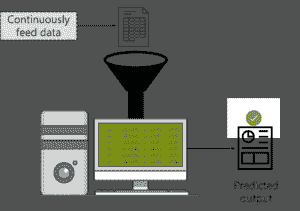

*机器学习介绍——R 中的支持向量机*

为了理解机器学习，我们来考虑一个例子。假设你想要一台机器来预测一只股票的价值。在这种情况下，你只需向机器输入相关数据。之后，您必须创建一个用于预测股票价值的模型。

需要记住的一点是，你给机器提供的数据越多，它学习得越好，做出的预测也就越准确。

显然，ML 不是这么简单的。对于一台分析数据并从中获得有用见解的机器来说，它必须通过对数据运行不同的算法来处理和研究数据。在这篇博客中，我们将讨论一种被称为 SVM 的最广泛使用的算法。

以上是对机器学习的简单介绍，如果你想让了解更多关于机器学习的知识，请观看我们的专家制作的视频

## **机器学习教程|爱德华卡**


[//www.youtube.com/embed/Pj0neYUp9Tc?rel=0&showinfo=0](//www.youtube.com/embed/Pj0neYUp9Tc?rel=0&showinfo=0)

这个关于“什么是机器学习”的 Edureka 视频介绍了机器学习及其各种类型。

## **机器学习的类型**

现在你对机器学习有了一个简单的概念，让我们来看看机器学习的不同方式。

### **1。监督学习**

被监督的意思是监督或指导某项活动，并确保它正确完成。在这种学习中，机器在指导下学习。

在学校，我们的老师指导我们，教导我们，类似地，在监督学习中，你向模型输入一组数据，称为训练数据，其中包含输入数据和相应的预期输出。训练数据就像一个老师，教授模型特定输入的正确输出，以便它在以后出现新数据时可以做出准确的决策。

### 2。 **无监督学习**

无监督的意思是在没有任何人的监督或指导下行动。

在无监督学习中，给定模型一个既没有标记也没有分类的数据集。该模型探索数据并从数据集中进行推断，以从未标记的数据中定义隐藏结构。

无监督学习的一个例子是像你我这样的成年人。我们不需要向导来帮助我们的日常活动，我们在没有任何监督的情况下自己解决问题。

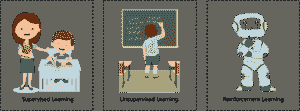

*机器学习的类型——R 中的支持向量机*

### 3。 **强化学习**

强化意味着建立或鼓励一种行为模式。假设你被丢在一个孤岛上，你会怎么做？

最初，你会感到恐慌，不知道该做什么，从哪里获得食物，如何生活等等。但是过一段时间后你将不得不适应，你必须学会如何在岛上生活，适应变化的气候，学会吃什么和不吃什么。

你正在遵循所谓的“打探”概念，因为你对这个环境不熟悉，唯一的学习方法是体验，然后从你的体验中学习。

这就是强化学习。这是一种学习方法，其中一个代理(你，被困在一个孤岛上)通过产生动作与它的环境(孤岛)进行交互，并发现错误或奖励。

如果你想获得关于支持向量机的深入解释，请查看我们的机器学习专家录制的视频。

## **支持向量机教程使用 R | edu reka**


[//www.youtube.com/embed/RKZoJVMr6CU?rel=0&showinfo=0](//www.youtube.com/embed/RKZoJVMr6CU?rel=0&showinfo=0)

本课程致力于介绍 SVM 是如何工作的，SVM 的各种功能以及它在现实世界中的应用。

## **什么是 SVM？**

SVM (Support Vector Machine)是一种有监督的机器学习算法，主要用于将数据分类到不同的类别中。与大多数算法不同，SVM 利用了一个超平面，它的作用就像不同类别之间的决策边界。

SVM 可以用来生成多个分离超平面，使得数据被分成段，每个段只包含一种数据。

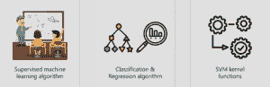

*什么是 SVM？–R 中的支持向量机*

在继续之前，我们先来讨论一下 SVM 的特色:

1.  SVM 是一种监督学习算法。这意味着 SVM 在一组标记数据上训练。SVM 研究带标签的训练数据，然后根据它在训练阶段学到的知识对任何新的输入数据进行分类。
2.  SVM 的一个主要优点是它可以用于分类和回归问题。虽然 SVM 主要以分类闻名，但支持向量回归机(SVR)用于回归问题。
3.  通过使用核技巧，SVM 可用于对非线性数据进行分类。内核技巧意味着将数据转换到另一个维度，在数据类别之间有明确的划分界限。之后你可以很容易地在不同的数据类别之间画一个超平面。

## SVM 是如何工作的？

为了理解 SVM 是如何工作的，让我们考虑一个场景。

假设你拥有一个农场，你遇到了一个问题——你需要建立一个栅栏来保护你的兔子免受狼群的攻击。但是你在哪里建围栏呢？

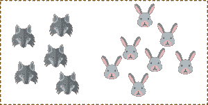

SVM 是如何工作的？–R 中的支持向量机 

解决这个问题的一个方法是根据兔子和狼在你的牧场上的位置建立一个分类器。

所以，如果我这样做，试着在兔子和狼之间画一个决策界限，它看起来就像这样。现在你可以清楚地沿着这条线建一个围栏。

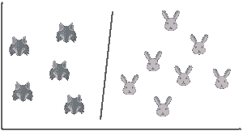

SVM 是如何工作的？–R 中的支持向量机 

简单来说，这正是 SVM 的工作方式。它绘制一个决策边界，即任意两个类之间的超平面，以便将它们分开或分类。

我知道你在想，你怎么知道在哪里画一个超平面？

SVM 背后的基本原理是画一个超平面来最好的区分这两类。在我们的例子中，这两个类是兔子和狼。在我们继续之前，让我们试着理解什么是支持向量。

## **什么是 SVM 的支持向量？**

因此，你首先绘制一个随机超平面，然后检查该超平面和每个类中最近的数据点之间的距离。这些最接近超平面的数据点被称为支持向量。这就是支持向量机这个名字的由来。

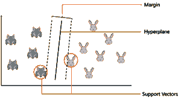

SVM 是如何工作的？–R 中的支持向量机 

基于这些支持向量来绘制超平面，并且最佳超平面将具有与每个支持向量的最大距离。并且超平面和支持向量之间的距离被称为边缘。

综上所述，SVM 通过使用超平面对数据进行分类，使得超平面和支持向量之间的距离最大。

好吧，现在让我们试着解决一个问题。

假设我输入了一个新的数据点，现在我想画一个超平面，这样它就能最好地分开这两个类。

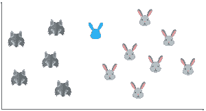

SVM 是如何工作的？–R 中的支持向量机 

因此，我从画一个超平面开始，然后检查超平面和支持向量之间的距离。在这里，我基本上是要检查这个超平面的边缘是否最大。

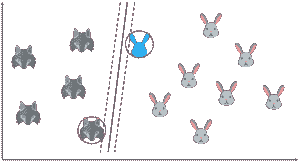

SVM 是如何工作的？–R 中的支持向量机 

但是如果我把超平面画成这样呢？这个超平面的余量明显大于前一个。这是我的最优超平面。

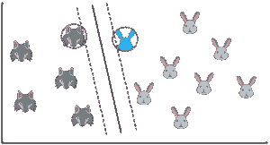

SVM 是如何工作的？–R 中的支持向量机 

到目前为止，这很简单，我们的数据是线性可分的，这意味着你可以画一条直线来区分这两个类！

但是如果数据集是这样的你会怎么做？

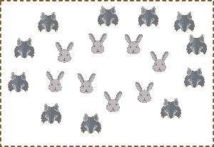

SVM 是如何工作的？–R 中的支持向量机 

你可能无法画出这样的超平面！它没有把两个阶级分开。

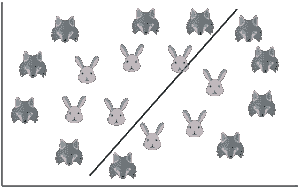

SVM 是如何工作的？–R 中的支持向量机 

这是实施非线性 SVM 的地方。

## **【SVM】非线性支持向量机**

在这篇博客的早些时候，我提到了如何使用内核将数据转换到另一个维度，在数据类别之间有一个清晰的分界。

内核函数为用户提供了将非线性空间转换成线性空间的选项。

到目前为止，我们一直在二维空间上绘制数据。所以，我们只有两个变量，x 和 y

一个简单的技巧是将两个变量 x 和 y 转换到一个包含新变量 z 的新特征空间。基本上，我们是在一个三维空间中可视化数据。

当你将 2D 空间转换成三维空间时，你可以清楚地看到两类数据之间的分界。现在，您可以通过在这两个类之间绘制最佳的超平面来将它们分开。

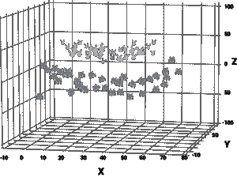

*非线性支持向量机——R 中的支持向量机*

这总结了非线性 SVM 背后的思想。为了理解支持向量机的实际应用，让我们看一个用例。

## **用例——SVM**

自 21 世纪初以来，SVM 作为分类器一直用于癌症分类。

一群专业人士进行了一项实验，用 SVM 对结肠癌组织进行分类。数据集由大约 2000 个跨膜蛋白样本组成，只有大约 50-200 个基因样本被输入到 SVM 分类器中。输入到 SVM 的样本既有结肠癌组织样本又有正常结肠组织。

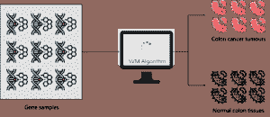

*SVM 用例——R 中的支持向量机*

这项研究的主要目的是根据基因样本是否是癌性的来对它们进行分类。因此，SVM 使用 50-200 个样本进行训练，以便从肿瘤样本中区分非肿瘤。即使对于很小的数据集，SVM 分类器的性能也非常准确，并且其性能与其他分类算法(如朴素贝叶斯)进行了比较，在每种情况下，SVM 都优于朴素贝叶斯。

因此，在这次实验之后，很明显，SVM 对数据进行了更有效的分类，并且在小数据集上表现得非常好。

## **支持向量机演示**

好吧，现在让我们进入实际部分。我们将运行一个演示来更好地理解如何将 SVM 用作分类器。

很多人都有这个疑问，

## **R 中的 SVM 是什么？**

答案是，R 基本上是一个开放的源统计，主要用于数据科学领域的编程语言。在我们的演示中，我们将使用 R 编程语言来构建一个 SVM 分类器，所以如果你对 R 没有很好的理解，我建议你看一下我们的专家录制的视频:

## **R 编程初学者|爱德华卡**


[//www.youtube.com/embed/fDRa82lxzaU?rel=0&showinfo=0](//www.youtube.com/embed/fDRa82lxzaU?rel=0&showinfo=0)

这本面向初学者的 Edureka R 编程教程将帮助您理解 R 的基础知识，并帮助您打下坚实的 R 基础。

你也可以参考这个 [R for Data Science](https://www.edureka.co/blog/r-for-data-science/) 的博客，了解更多关于如何使用 R 实现整个数据科学工作流程的信息。

### **问题陈述:**

研究心脏病数据集并建立分类器模型，用于预测患者是否患有任何心脏病。

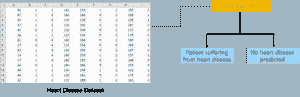

*SVM 演示问题陈述——R 中的支持向量机*

在这个演示中，我们将使用插入符号包。caret 软件包也被称为分类和回归训练，有大量的功能，有助于建立预测模型。它包含用于数据分割、预处理、特征选择、调整、无监督学习算法等的工具。

因此，要使用它，我们首先需要使用以下命令安装它:

```
install.packages(“caret”)

```

caret 软件包非常有用，因为它为我们提供了直接访问各种函数的途径，以便用各种机器学习算法(如 KNN、SVM、决策树、线性回归等)来训练我们的模型。

安装完成后，我们只需要将软件包加载到我们的控制台中，为此我们有以下代码:

```
library('caret')

```

我们的下一步是加载数据集。

在这个演示中，我们将使用一个心脏病数据集，该数据集包含各种属性，如人的年龄、性别、胆固醇水平等。在同一数据集中，我们将有一个目标变量，用于预测患者是否患有任何心脏病

简而言之，我们将使用 SVM 来对一个人是否容易患心脏病进行分类。

数据集看起来是这样的:

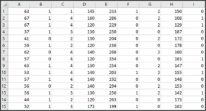

*心脏数据集——R 中的支持向量机*

这个数据集大约有 14 个属性，最后一个属性是我们将使用 SVM 模型预测的目标变量。

现在是加载数据集的时候了:

```
heart <- read.csv("/Users/zulaikha/Desktop/heart_dataset.csv", sep = ',', header = FALSE)

```

在上面的代码行中，我们正在读取以 CSV 格式存储的数据集，这就是为什么我们使用 read.csv 函数从指定的路径读取它。

‘sep’属性表示数据存储在 CSV 或逗号分隔版本中。

现在我们已经导入了数据集，让我们检查数据集的结构:

为了检查数据帧的结构，我们可以调用函数 str():

```
str(heart)

```


*数据集的结构——R 中的支持向量机*

输出显示我们的数据集由 300 个观察值组成，每个观察值有 14 个属性。

如果想显示数据集的前 5-6 行，使用 head()函数:

```
head(heart)

```

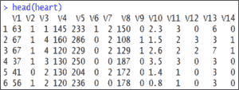

*头数据集——R 中的支持向量机*

我们的下一步是将数据分成训练集和测试集，这也称为数据拼接。

我们将使用专门用于模型构建的训练集和用于评估模型的测试集:

```
intrain <- createDataPartition(y = heart$V14, p= 0.7, list = FALSE)
training <- heart[intrain,]
testing <- heart[-intrain,]

```

caret 包提供了一个 createDataPartition()方法，主要用于将我们的数据分成训练集和测试集。

我们已经向 createdatapartition()函数传递了 3 个参数:

*   “y”参数取变量的值，根据需要对哪些数据进行分区。在我们的例子中，目标变量在 V14，所以我们正在传递 heart$V14
*   “p”参数保存 0-1 范围内的十进制值。这是为了显示分割的百分比。我们使用 p=0.7。这意味着数据分割应以 70:30 的比例进行。因此，70%的数据用于训练，剩下的 30%用于测试模型。
*   “列表”参数用于决定是返回列表还是矩阵。我们因为没有返回列表而传递 FALSE

现在这个 createDataPartition()方法正在返回一个矩阵“intrain”。这个 intrain 矩阵有我们的训练数据集，我们将它存储在“训练”变量中，其余的数据，即其余 30%的数据存储在测试变量中。

接下来，为了检查我们的训练数据帧和测试数据帧的尺寸，我们可以使用这些:

```
dim(training); 
dim(testing);

```

我们的下一步是清理数据，因此如果有任何缺失值或不一致的值，必须在我们建立训练模型之前处理它们

我们将使用 anyNA()方法，该方法检查任何空值:

```
anyNA(heart)

```

在运行时，我们得到的返回值为 false，这意味着在我们的数据集中没有丢失的值。

接下来，我们将使用 summary()函数检查我们的数据汇总

```
summary(heart)

```

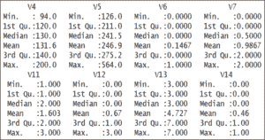

*汇总数据集——R 中的支持向量机*

输出显示各种变量的值没有标准化。

例如，V14 变量，这是我们的目标变量，它只保存 2 个值，要么是 0，要么是 1。

相反，这应该是一个分类变量。要将这些转换成分类变量，我们需要对它们进行因式分解:

```
training[["V14"]] = factor(training[["V14"]])

```

上面的代码将把训练数据帧的“V14”列转换成一个因子变量。

我们的下一步是训练我们的模型。

在训练我们的模型之前，我们将首先实现 trainControl()方法。这将控制所有的计算开销，以便我们可以使用 caret 包提供的 train()函数。训练方法将在不同的算法上训练我们的数据。

首先，让我们关注一下 traincontrol()方法:

```
trctrl <- trainControl(method = "repeatedcv", number = 10, repeats = 3)

```

这里的 trainControl()方法有 3 个参数。

*   “method”参数定义了重采样方法，在本演示中，我们将使用 repeatedcv 或重复交叉验证方法。
*   下一个参数是“number ”,这基本上包含了重采样迭代的次数。
*   参数“repeats”包含为我们的重复交叉验证计算的集合。我们使用设置数=10，重复次数=3

这个 trainControl()方法返回一个列表。我们将在我们的 train()方法中传递它。

```
svm_Linear <- train(V14 ~., data = training, method = "svmLinear",
trControl=trctrl,
preProcess = c("center", "scale"),
tuneLength = 10)

```

train()方法应通过“method”参数作为“svmLinear”传递。我们正在传递我们的目标变量 V14。“V14~”表示使用分类器中所有属性的公式，并将 V14 作为目标变量。“trControl”参数应该与我们的 trianControl()方法的结果一起传递。“预处理”参数用于预处理我们的训练数据。

我们在“预处理”参数“中心”&“刻度”中传递 2 个值。

这两个有助于数据的居中和缩放。

经过预处理后，这些将我们的训练数据转换为平均值约为“0 ”,标准差约为“1”。“tuneLength”参数包含一个整数值。这是为了调整我们的算法。

您可以查看我们的 train()方法的结果。我们将其结果保存在 svm_Linear 变量中。

```
svm_Linear

```

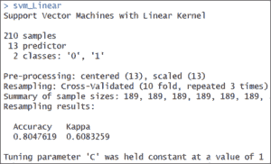

*SVM 线性输出——R 中的支持向量机*

这是一个线性模型，因此，它只是在值“C”= 1 时进行测试。

现在，我们的模型用 C 值为 1 进行训练。我们已经准备好为我们的测试集预测类。我们可以使用 predict()方法。

caret 包提供了预测结果的 predict()方法。我们传递两个参数。它的第一个参数是我们的训练模型，第二个参数“newdata”保存我们的测试数据框架。predict()方法返回一个列表，我们将它保存在一个 test_pred 变量中。

```
test_pred <- predict(svm_Linear, newdata = testing)
test_pred

```

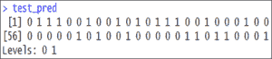

*测试 pred 输出-R 中的支持向量机*

现在让我们检查一下模型的准确性。我们将使用混淆矩阵来预测准确度:

```
confusionMatrix(table(test_pred, testing$V14))

```

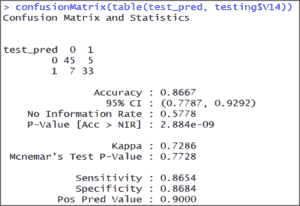

*混淆矩阵输出 1-R 中的支持向量机*

输出显示我们的模型对测试集的准确率为 86.67%。

按照上述步骤，我们可以构建我们的支持向量线性分类器。

对于线性分类器中 C 值(代价)的选取，我们也可以做一些定制。这可以通过在网格搜索中输入值来完成。

下一段代码将向您展示，使用不同的 c 值构建&调整 SVM 分类器

我们将使用 expand.grid()将 C 的一些值放入“grid”数据帧中。下一步是使用这个数据帧在特定的 C 值下测试我们的分类器。它需要放入带有 tuneGrid 参数的 train()方法中。

```
grid <- expand.grid(C = c(0,0.01, 0.05, 0.1, 0.25, 0.5, 0.75, 1, 1.25, 1.5, 1.75, 2,5))
svm_Linear_Grid <- train(V14 ~., data = training, method = "svmLinear",
trControl=trctrl,
preProcess = c("center", "scale"),
tuneGrid = grid,
tuneLength = 10)
svm_Linear_Grid
plot(svm_Linear_Grid)

```

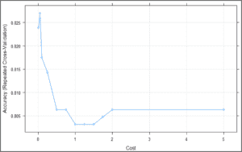

*SVM 图——R 中的支持向量机*

上面的图显示了我们的分类器在 C = 0.05 时给出了最好的准确度。让我们尝试使用这个模型为我们的测试集进行预测。

```
test_pred_grid <- predict(svm_Linear_Grid, newdata = testing)
test_pred_grid

```

让我们用混淆矩阵来检查它的准确性。

```
confusionMatrix(table(test_pred_grid, testing$V14))

```

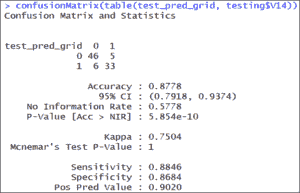

*混淆矩阵 2——R 中的支持向量机*

混淆矩阵的结果显示，这次在测试集上的准确率为 87.78 %，比我们之前的结果更准确。

到此，我们结束了这篇博客。我希望你发现这是有益的，请继续关注更多关于机器学习的教程。

*要深入了解不同的机器学习算法及其各种应用，您可以[在此](https://www.edureka.co/data-science)注册参加实时在线培训，24/7 全天候支持和终身访问。*

*有问题吗？在评论区提到它们。*