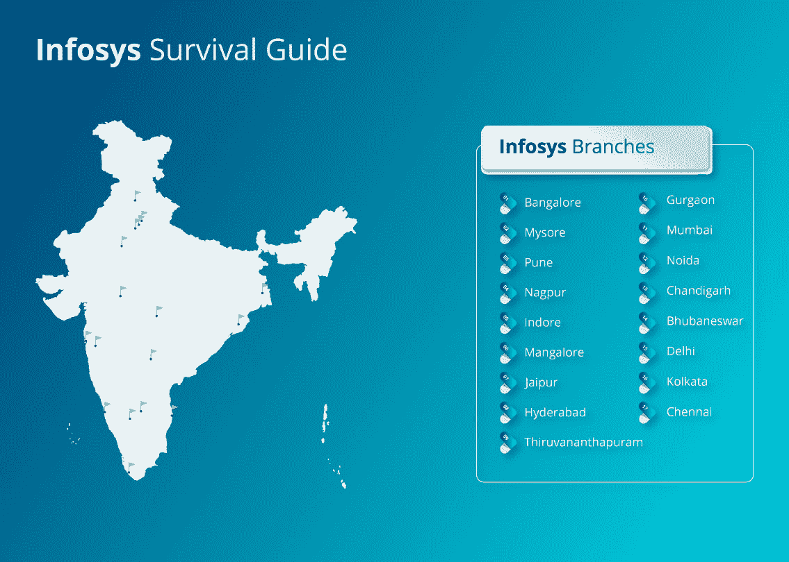
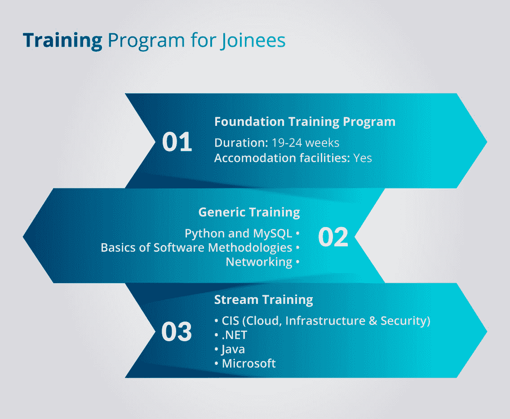
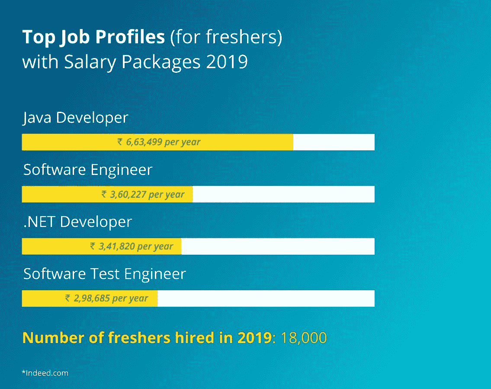
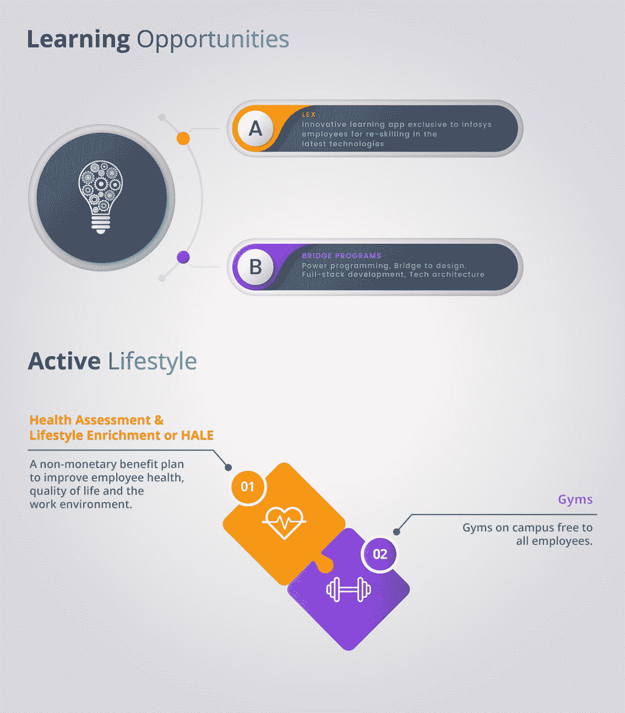
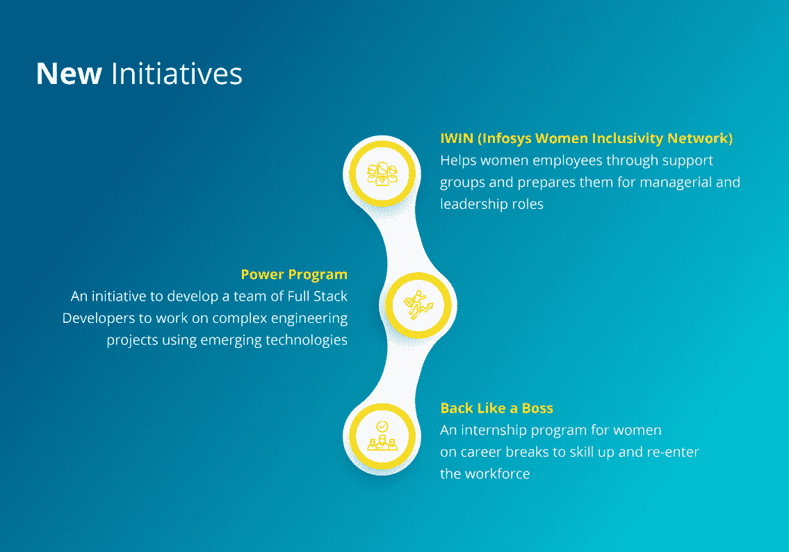
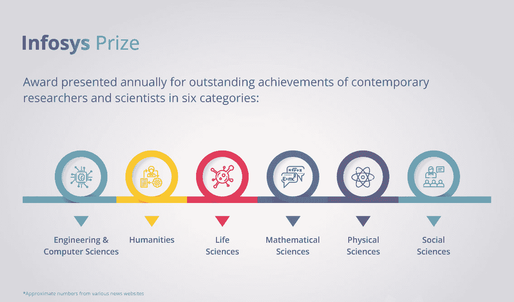
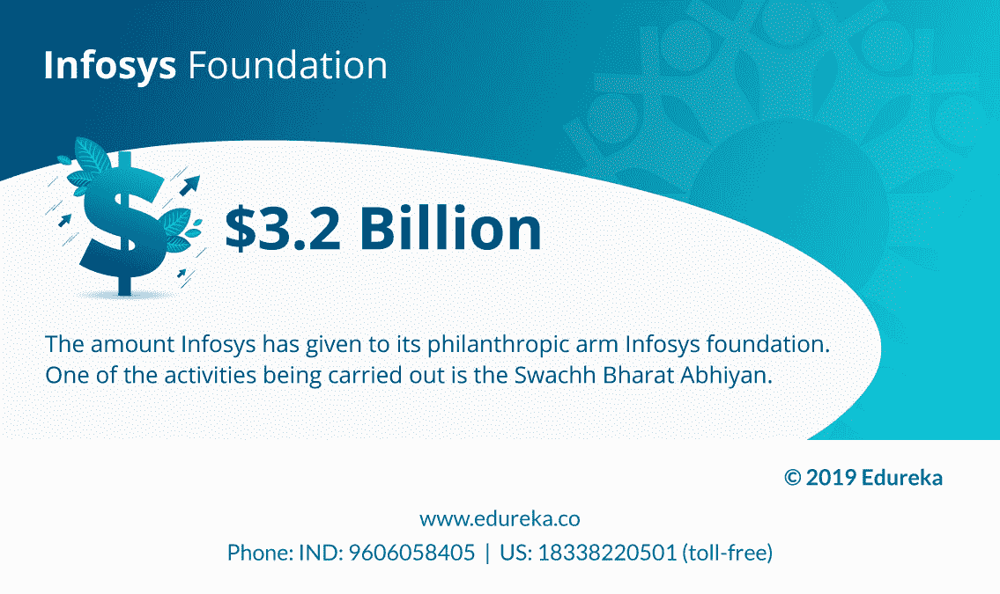

# 信息图表:在印孚瑟斯工作的生存指南

> 原文：<https://www.edureka.co/blog/survival-guide-working-at-infosys/>

Infosys 是印度最大的科技巨头之一。它是技术、咨询和外包解决方案的全球领导者。该公司拥有 2，28123 名员工，按收入计算是全球第 596 大公共领域公司。Infosys 已经成长为世界各地的 IT 专业人士梦寐以求的公司之一。作为新生，人们总是关心开始一个富有成效的职业生涯，这将在未来对他们有所帮助。大一新生会遇到很多情况，他们可以选择加入不同的公司。印孚瑟斯是一家大规模招聘公司，不仅从 CS/IT 背景，也从非 CS/IT 背景招聘大量新生。这份关于在印孚瑟斯工作的生存指南信息图表是为新员工和求职者准备的，它将帮助他们对公司文化、发展机会以及如何成为印孚瑟斯的一员有所了解。

       

这张信息图是基于在线研究，并通过与 Infosys 的现任和前任员工取得联系而制作的。我们希望这份在印孚瑟斯工作的生存指南能帮助你更容易地进入公司，并让你更清楚地了解你在印孚瑟斯的经历。

在这个系列中，我们将推出更多关于顶级 IT 公司的生存指南。所以，如果你有任何建议或信息想要分享，请在下面留下评论，我们会尽快回复你。或者，你可以在脸书、LinkedIn、Twitter 或 Instagram 上给我们发收件箱。祝你好运！