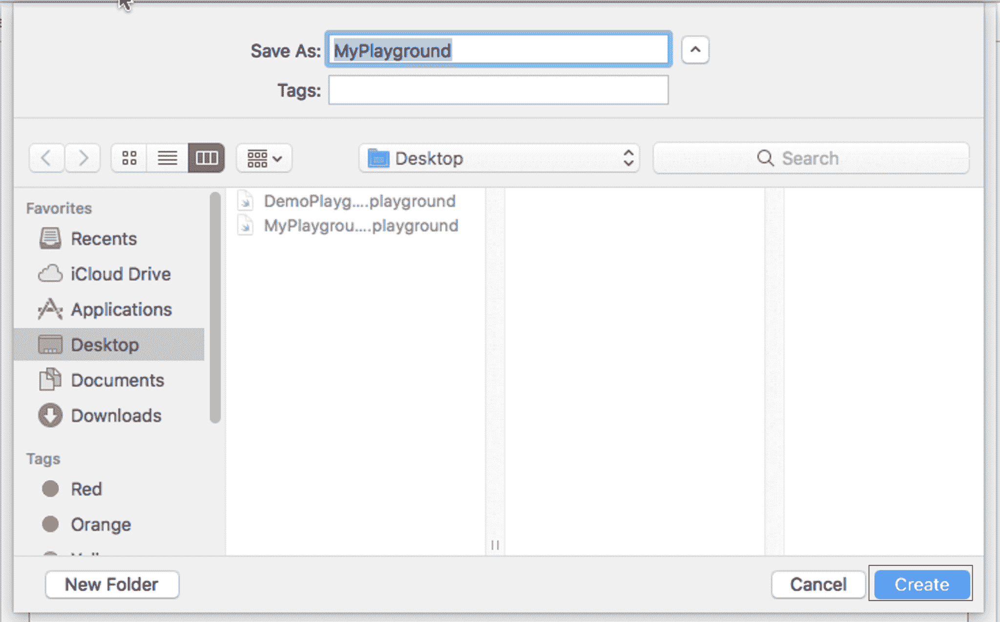
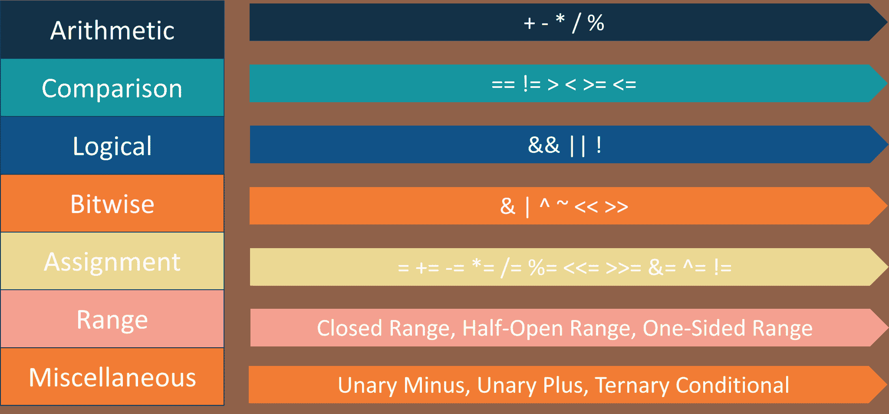
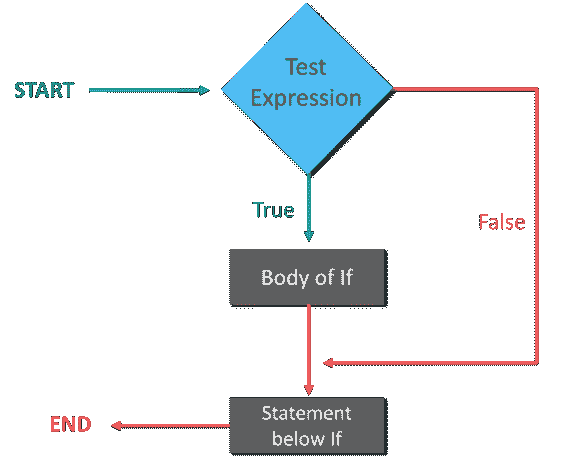
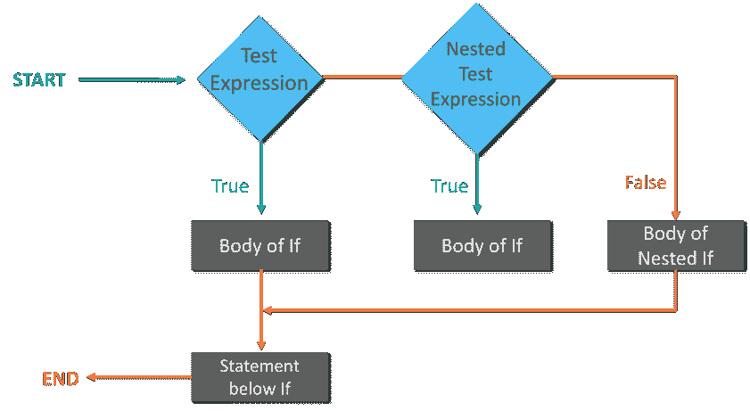
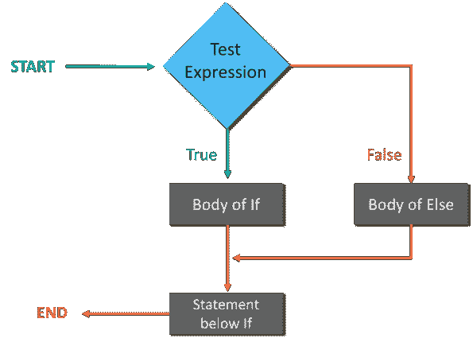
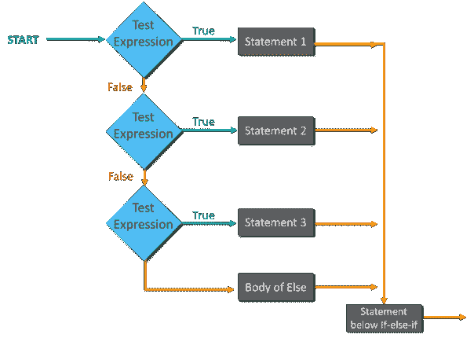
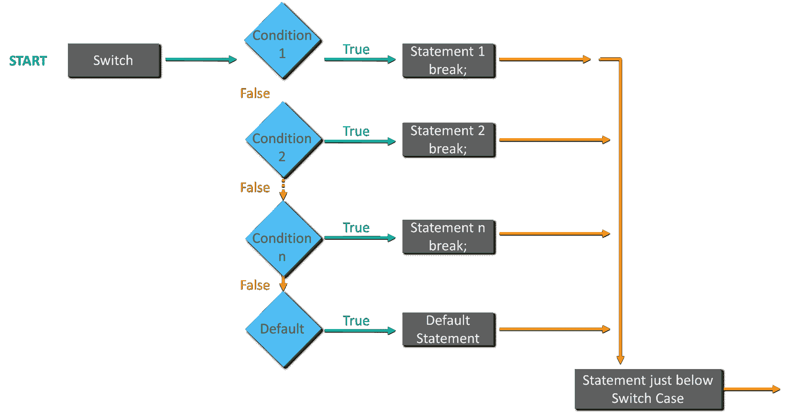
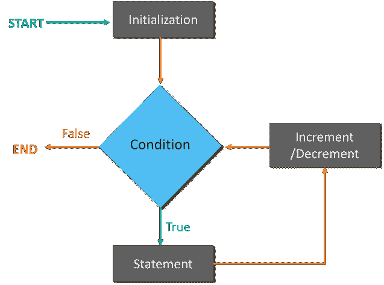
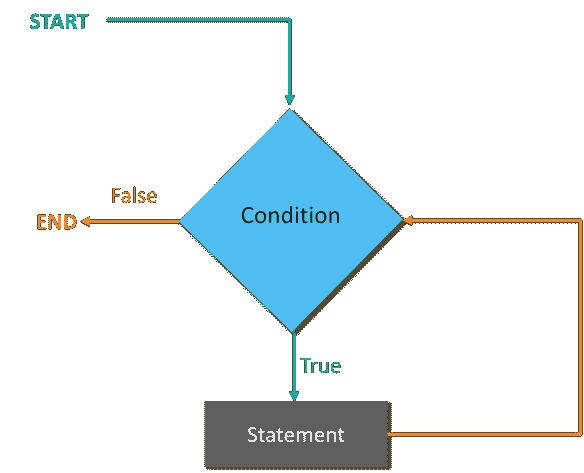
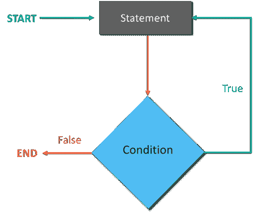

# Swift 教程:使用 Swift 开始 iOS 开发

> 原文：<https://www.edureka.co/blog/swift-tutorial>

在这篇 Swift 教程博客中，我将向您介绍 Swift 的一些基本概念。但是，在继续之前，我想让你们熟悉一下“什么是 Swift”&如何在你的系统上安装 Swift。所以，现在就开始吧！！

在这个关于 Swift 教程的博客中，我将涉及以下主题:

*   [什么是雨燕？](#What%20is%20Swift?)
*   [如何安装 Swift？](#How%20to%20install%20Swift?)
*   [基本语法](#Basic%20Syntax)
*   [变量，数据类型&类型转换](#Variables,%20Datatypes%20&%20TypeCasting)
*   [操作员](#Operators)
*   [条件语句](#Conditional%20Statements)
*   [迭代循环](#Iterative%20Loops)
*   [数组&元组](#Arrays%20&%20Tuples)
*   [集&辞书](#Sets%20&%20Dictionaries)
*   [功能](#Functions)
*   [闭包&结构体](#Closures%20&%20Structures)
*   [类&传承](#Class%20&%20Inheritance)
*   [协议](#Protocols)
*   [分机](#Extensions)
*   [仿制药](#Generics)
*   [枚举](#Enumerations)

## **Swift 教程:什么是 Swift？**

Swift 是一种编程语言，它采用了 C 和 Objective-C 的精华，由苹果公司为 iOS/OS X 开发而开发，可以在许多现有的 iOS 6 和 OS X 10.8 平台上运行。

## **Swift 教程:** **如何安装 Swift？**

要使用 Swift，您需要 Xcode 软件在操场上运行您的 Swift 编码，一旦您熟悉 Swift，您就可以使用 Xcode IDE 进行 iOS/OS x 应用程序开发。

所以，假设你在苹果开发者网站有账号，你只要去[苹果开发者下载。](https://idmsa.apple.com/IDMSWebAuth/login?appIdKey=891bd3417a7776362562d2197f89480a8547b108fd934911bcbea0110d07f757&path=%2Fdownload%2Fmore%2F&rv=1)

进入链接后，选择最新版本的 Xcode，点击光盘映像附近的链接下载。

下载 dmg 文件后，只需双击即可安装。

好吧！！所以，一旦你有了 xCode，只需双击打开它，然后进入**文件- >新**，选择**游乐场**。然后选择 iOS，提到游乐场的名字。完成后，点击**创建。**



**图 1:** 在 Xcode IDE 中创建游乐场——Swift 教程

现在，你的游乐场已经准备好了，让我们开始编码吧！

那么，首先让我们从基本语法开始，然后让我们编写一个 hello world 程序。

## **雨燕教程:** **基本语法**

*   **令牌—**令牌是关键字**、**标识符、常量、字符串或符号。
*   **分号—**在 Swift 中你不必键入分号(；)放在代码中的每条语句之后。只有在同一行中使用多个语句的情况下，才会使用分号作为分隔符。
*   **关键字—**关键字是编码语言中的保留字，除非用反斜杠(`……`)转义，否则不能用作常量、变量或任何其他标识符名称。
*   **文字—**文字主要是整数、浮点数或字符串类型的值的源代码表示。因此，字面值可以是整数字面值、浮点字面值、字符串字面值或布尔字面值。
*   **注释—**注释帮助编译器忽略不需要编译的文本。多行注释以 **/*** 开始，以 ***/** 结束，而单行注释在注释的开始使用 **//** 来编写。
*   **标识符—**Swift 是一种区分大小写的语言，不允许在标识符中使用特殊字符，如@、$和%。标识符以字母 A 到 Z 或 A 到 Z 或下划线开始，后面是更多的字母、下划线和数字(0 到 9)。
*   **空格—**空格在 Swift 中用于描述空格、制表符、换行符、注释，也用于分隔语句的不同部分。这有助于编译器识别语句中一个元素的结束位置和下一个元素的开始位置。

### **你好世界节目**

```
/*Hello World Program */
import UIKit // Since we are creating the program for iOS playground, we have to import UiKit
var myString ="Hello World!";print (myString)// Semicolon used since 2 statements are used together

```

**输出** :

```
Hello World!
```

现在，你已经编写了你的第一个程序，让我们了解更多关于变量和数据类型的知识。

Get Certified With Industry Level Projects & Fast Track Your Career [<button>Take A Look!</button>](https://www.edureka.co/ios-development)

## **Swift 教程:** **变量，数据类型&类型化**

### **变量**

变量不过是用来存储值的保留内存位置。这意味着当你创建一个变量时，你在内存中保留了一些空间。

```
var a = 42 //Declaring variable
var a: Int = 42 // You can also declare variable by specifying the data type.
let b = 32 // Declaring a constant
print(varA)

```

### **数据类型**

与任何其他编程语言一样，swift 提供内置数据类型，您可以在下表中参考:

| **式** | **典型位宽** | **典型范围** |
| **int 8** | 1 字节 | –127 至 127 |
| **UInt8** | 1 字节 | 0 到 255 |
| **Int32** | 4 字节 | -2147483648 转 2147483647 |
| **UInt32** | 4 字节 | 0 到 4294967295 |
| **Int64** | 8 字节 | -9223372036854775808 转 9223372036854775807 |
| **UInt64** | 8 字节 | 0 到 18446744073709551615 |
| **浮动** | 4 字节 | 1.2E-38 到 3.4E+38(~6 位数) |
| **双** | 8 字节 | 2.3E-308 到 1.7E+308(~ 15 位) |

现在，让我告诉你一个有趣的事实。

在 Swift 中，当你声明一个变量时，你不必定义数据类型。

所以，假设你声明了一个变量 **var b = "Hi"** ，那么 Swift 会自动理解 **b** 是一个 **String** 类型的变量，基于你给的输入。

### **型铸造**

现在你甚至可以执行类型转换或类型转换。

例如，您可以将整数值转换为浮点值，反之亦然。

下面考虑一下 ex 的充足:

```
let a: Int = 5679 // Declare 2 constants
let b: Float = 2.9999
//Converting Float to Int
print(“This number is an Int now (Int(b))”) 
//Converting Int to Float
print(“This number is a Float now (Float(a))”) 

```

**输出:**

```
This number is an Int now 2
This number is a Float now 5679.0
```

## 

## **雨燕教程:** **运算符**

运算符是可以操作操作数值的结构。考虑表达式 7 + 3 = 10，这里 7 和 3 是操作数，+称为运算符。 Swift 支持以下类型的操作员:



**图 2:**Swift 中的不同运营商——Swift 教程

现在，我不打算深入探讨，但让我向你们展示 Swift 中的一些简单操作。考虑下面的例子:

```

print(" 5 + 3 = (5 + 3 ) ") // Addition
print(" 5 - 3 = (5 - 3 ) ") // Subtraction
print(" 5 * 3 = (5 * 3 ) ") // Multiplication
print(" 5 / 3 = (5 / 3 ) ") // Division
print(" 5 % 3 = (5 % 3 ) ") // Modulus

```

**输出:**

```
5 + 3 = 8
5 - 3 = 2
5 * 3 = 15
5 / 3 = 1
5 % 3 = 2.3

```

好吧！！现在，你们已经知道了基本的操作符，让我们从条件语句开始。

## **雨燕教程:** **条件语句**

条件语句用于在某些条件为真时执行一条或一组语句。 即有三种条件语句——**If、**If-Else 和 **Switch** 语句。

那么，现在让我们从 If 语句开始。

### **If 语句**

一个 if 语句可以是简单的 if 语句，也可以是嵌套的 if 语句。

所以，一个简单的 **If** 语句是决定某个语句或语句块是否执行的最简单的决策语句。



**图 3:**If 条件语句流程图——Swift 教程

考虑下面的例子:

```
var x:Int = 10
if x < 20 { 
print("x is less than 20") } 
print("Value of variable x is (x)")

```

**输出:**

```
x is less than 20
Value of variable x is 10 
```

### **嵌套——如果**

现在，**嵌套 if** 是 if 语句或者 if 语句内的 if-else 语句。



**图 4:** 嵌套 If 条件语句流程图——Swift 教程

考虑下面的例子:

```

var x:Int = 100 
var y:Int = 200  
if x == 100 { 
print("First condition is satisfied") 
if y== 200 { 
print("Second condition is also satisfied") } 
} 
print("Value of variable x is (x)") 
print("Value of variable y is (y)")

```

**输出:**

```
First condition is satisfied
Second condition is satisfies
Value of variable x is 100
Value of variable y is 200
```

### **If-Else 语句**

If-else 语句测试条件，如果条件为假，则执行‘else’语句。



**图 5:**If-Else 条件语句 Swift 教程流程图

考虑下面的例子:

```
var x:Int = 10
if x < 20 { 
print("x is less than 20") } 
else {
print("x is not less than 20")}
print("Value of variable x is (x)")

```

**输出:**

```
x is less than 20
```

### **If-else..**

现在，你也可以有一个 **if-else** 阶梯。 因此，If-else-if 梯形允许用户在一个循环中使用许多 if else 语句，并且在其中一个条件成立的情况下，其余的循环被绕过。



**图 6:**If-Else 梯形条件语句 Swift 教程流程图

考虑下面的例子:

```
var x: Int = 100
var y:Int = 200 
if x < y { 
/* If condition is true then print the following */ 
print("x is less than y") } 

else if x > y { 
/* If condition is true then print the following */ 
print("x is greater than y") } 

else { 
/* If condition is false then print the following */ 
print("x is equal to y") }

print("Value of variable x and y are:(x) and (y)")

```

**输出:**

```
x is less than y
Value of variable x and y are: 100 and 200 
```

### **S** **女巫**

switch 语句提供了一种简单的方法来对代码的不同部分执行条件。

**图 7:**Switch 条件语句流程图——Swift 教程

考虑下面的例子:

```

var a = 20 
switch index { 
case 10 :
               print( "Value of index is 10")
                     fallthrough 
case 15,20 :                      
               print( "Value of index is either 15 or 20")
                     fallthrough
case 30 :
               print( "Value of index is 30") 
default : 
               print( "default case") }

```

**输出:**

```
Value of index is either 15 or 20
Value of index is 30
```

现在，如果您观察输出，即使我们的条件得到满足，我们也会打印下一条语句。那是因为我们使用了**失败**的说法。所以，如果不使用 **fallthrough** 语句，那么程序将在执行匹配的 case 语句后从 **switch** 语句中出来。

Interested In Building Your Own iOS Apps?? [<button>Learn Now!</button>](https://www.edureka.co/ios-development)

现在，让我们继续讨论迭代循环。

## **雨燕教程:** **迭代循环**

一般来说，语句是按顺序执行的。首先执行函数中的第一条语句，然后执行第二条语句，依此类推。 可能会出现需要多次执行一段代码的情况。

循环语句允许我们多次执行一条或一组语句。所以，迭代循环主要是 **For-In** 、 **While** 和 **Do-While** 循环。

### **For-In 循环**

for-in 循环遍历项目集合，例如数字范围、数组中的项目或字符串中的字符。



**图 8:**For-In 循环流程图 Swift 教程

考虑下面的例子:

```
for i in 1...3 { 
print("Hello world! and Value of i is (i)")
}

```

**输出:**

```
<samp>Hello world! and Value of i is 1</samp>
<samp>Hello world! and the Value of i is 2</samp> <samp></samp> <samp>Hello world! and Value of i is 3</samp>
```

### **而循环**

只要给定的条件为真，Swift 编程语言中的 while 循环语句就重复执行目标语句。



**图 9:**While 循环流程图 Swift 教程

考虑下面的例子:

```
var current: Int = 0 //Initialize variables
var final: Int = 3
let Completed = true 
while (current <= final) // condition
{ //play game if Completed
        { 
print("You have passed the level (current)") 
current = current + 1 //statement to be executed if the condition is satisfied 
     }
} 
print("The while loop ends") //Statement executed after the loop ends

```

**输出:**

```
<samp>You have passed the level 0</samp> 
<samp>You have passed the level 1</samp> 
<samp>You have passed the level 2</samp> 
<samp>You have passed the level 3</samp> 
<samp>The while loop ends</samp>
```

### **Do-while/ Repeat while 循环**

与在循环顶部测试循环条件的 for 和 while 循环不同，repeat…while 循环在循环底部检查其条件。



**图 10:**Do-While 循环流程图 Swift 教程

考虑下面的例子:

```
var val = 5 repeat {
print( "Value is (val)") 
val = val + 1 } 
while index < 10

```

**输出:**

```
Value is 5
Value is 6
Value is 7
Value is 8
Value is 9
```

好吧，伙计们！循环到此结束，现在让我们快速进入数组&元组。

## **雨燕教程:** **数组&元组**

### **阵列**

数组是包含一系列元素的数据结构。这些元素都是相同的数据类型，如整数或字符串。 所以，假设你想存储你朋友的名字。你可以写一个程序如下:

```
var friends: Array <String> = ["Akash", "Sanjana", "Avinash", "Swatee"]

```

还可以使用 append()方法向数组中添加新元素。参考下面的例子:

```
friends.append("Aayushi")
print(friends)

```

**输出:**

```
Akash Sanjana Avinash Swatee Aayushi
```

**元组**

元组用于将多个值组合成一个复合值。考虑下面的例子:

```
var failure404 = (404, “Gateway not found”)
print(“The code is(failure404.0)”)
print(“The definition of error is(failure404.1)”)
var failure404 = (failureCode: 404, description: “Gateway not found”)
print(failure404.faliureCode)   // prints 404.

```

**输出**

```
The code is 404
The definition of error is Gateway not found
404
```

好了，现在你们已经理解了数组，是时候开始学习集合和字典了。

Want To Get Certified In iOS Development?? [<button>Take A Look!</button>](https://www.edureka.co/ios-development)

## **雨燕教程:** **集&辞典**

### **集**

集合用于存储相同类型的不同值，不像数组那样有任何确定的顺序。因此，如果您想确保没有重复的值，或者如果元素的排序不是问题的话，您可以使用集合而不是数组*。* 集合是通过将所有项目(元素)放在花括号[]内，用逗号分隔而创建的。考虑下面的例子:

```
let evenNumber: Set = [2,4,6,8,12]

```

现在，让我告诉你，你还可以执行集合运算，如并、交、减。

**并:**A 和 B 的并是两个集合中所有元素的集合。使用*执行联合。*法盟()。

**I****Intersection:**A 和 B 的交集是两个集合中共有的元素的集合。使用*执行相交。*交集()【法。

**减法:**A 和 B 的差(A–B)是一组只在 A 中而不在 B 中的元素，同理，B–A 是一组元素，即在 B 中而不在 A 中 参考下面的代码:

```
let evenNumber: Set = [10,12,14,16,18,20]
let oddNumber: Set = [5,7,9,11,13,15]
let primeNumber: Set =  [2,3,5,7,13,17,19]
oddNumber.union(evenNumber).sorted()
oddNumber.intersection(evenNumber).sorted()
oddNumber.subtracting(primeNumber).sorted()

```

**输出:**

```
[5,7,9,10,11,12,13,14,15,16,18,20]
[]
[9, 11, 15]
```

### **字典**

字典用于存储相同类型的无序值列表，Swift 不允许您在字典中输入错误的类型。 考虑下面的例子。

```
var exampleDict:[Int:String] = [1:"One", 2:"Two", 3:"Three"] //Creating Dictionaries 
var accessval = exampleDict[1] //Accessing Dictionary Values 
print( "Value of key = 1 is (accessVal" ) 
print( "Value of key = 2 is (exampleDict[2])" ) 
print( "Value of key = 3 is (exampleDict[3])" )

```

**输出:**

```
Value of key = 1 is Optional("One")
Value of key = 2 is Optional("Two")
Value of key = 3 is Optional("Three")
```

## 

## **雨燕教程:** **功能**

函数基本上是一组组织在一起执行特定任务的语句。您可以调用函数，拥有带/不带参数的函数，拥有带/不带返回值的函数，拥有函数类型，还可以使用嵌套函数。 参考下面的例子，了解如何定义和调用函数。考虑下面的例子:

```
func Employee(empname: String) -> String { 
//Defining a function 
return empname } 
print(Employee(empname: "Sayantini")) //Calling a function 
print(Employee(empname: "Kislay"))

```

**输出:**

```
Sayantini
Kislay
```

现在，让我们进入博客的下一部分，即闭包&结构。

## **雨燕教程:** **闭包&结构**

### **关闭**

闭包通常会让每个人感到困惑，但它们只是自包含的代码，就像组织成块的函数一样。它们可以是匿名的，而函数必须有一个函数名。考虑下面的例子。

```
let name = { print("Welcome to Swift Closures") } 
name()

```

**输出:**

```
Welcome to Closures
```

### **构筑物**

Swift provides a flexible building in any coding platform block of making use of constructs as Structures. By making use of these structures once can define constructs methods and properties. Consider the example below.

```
struct employeeDetails { //Defining a Structure
var name = "Bob"
var id = 11021
varphonenumber= 9876543210
}
let details = employeeDetails()  //Accessing the structure and properties
print("Name of employee is (details.name)")
print("Id of employee is (details.id)")
print("Phone number of employee is (details.phonenumber)")

```

**输出:**

```
Name of employee is Bob
Id of employee is 11021
Phone number of employee is 9876543210
```

现在，你们已经理解了结构，让我们来理解类&的继承。

## **雨燕教程:** **跟班&传承**

### **类**

Swift 中的类基本上是灵活结构的构建模块。因此，类似于常量、变量和函数，用户可以定义类的属性和方法。

```
class DetailsStruct { //Defining a class
var id:Int
init(id:Int) {
self.id= id }
}
class studentDetails {
var id = 125612
}
let studentid = studentDetails()
print("Student id is (studentid.id)")

```

**输出:**

```
Student id is 125612
```

**传承**

继承是从现有类创建新类的过程。派生类**继承了**基类的所有功能，也可以添加自己的功能。

类可以进一步分为**子类**和**超类**。

**子类:**如果一个类继承了另一个类的属性、方法、函数，那么就称为子类。

**超类**:包含属性、方法和函数让其他类继承自己的类称为超类。考虑下面的例子。

```
class EmployeeDetails{
var id:Int;
var number:Int;
init(detail1:Int, detail2:Int) {
id = detail1;
number = detail2;
} 
func print() {
print("Employee id is :(id), employee phone number is :(number)")
}
}
class display : EmployeeDetails {
init() { 
super.init(detail1:94567, detail2: 9876543210) //super keyword is used to call the parameters & methods from super class
}
}
let employeeinformation = display() 
employeeinformation.print()

```

**输出:**

```
Employee id is 94567, employee phone number is 9876543210
```

现在，你们已经了解了 Swift 的主要概念。现在让我们开始学习扩展主题，如协议、扩展、泛型和枚举。

## **Swift 教程:** **协议**

Protocols are like interfaces in other languages for Methods, properties, and other requirements functionalities.Consider the example below:

```
protocol Fly {
var flies: Bool { get set }
func flyable(milesCovered: Double) -> String
}
class Vehicle : Fly{
var flies: Bool = false
var name: String = "Default name"
func flyable(milesCovered: Double) -> String {
if(self.flies){
return "(self.name) flies (milesCovered) miles"
}
else {
return "(self.name) cannot fly"
}
}
}
var BMWX1 = Vehicle()
BMWX1.name = "BMW X1"
BMWX1.flies = false
print(BMWX1.flyable(34))

```

**Output:**

```
BMW X1 cannot fly
```

## 

## **迅捷教程:** **扩展**

扩展基本上是用来增加现有类、结构或枚举类型的功能。使用扩展，您可以添加计算属性和计算类型属性，定义和使用新的嵌套类型，定义实例和类型方法，提供新的初始值设定项，定义下标，以及使现有类型符合协议。

考虑下面的例子:

```
extension Int{
var add:Int{returnself+10}
varsubtract:Int{returnself- 34}
var multiply:Int{returnself* 5}
var divide:Int{returnself/5}
}
let addition = 3.add
print("The value after adding is (add)")
let subtraction = 120.subtract
print("The value after subtracting is (subtraction)")
let multiplication = 25.multiply
print("The value is mutiplying is (multiplication)")
let division = 55.divide
print("The value after division is (division)")
let mix = 10.add+34.subtract
print("Value calculated is (mix)")

```

**输出:**

```
The value after adding is 13
The value after subtracting is 86 
The value is multiplying is 125 
The value after division is 11
Value calculated is 20
```

## 

## **雨燕教程:** **泛型**

泛型用于编写灵活的、可重用的函数和类型。所以，基本上可以使用泛型来避免重复。考虑下面的例子:

```
func swap<T>(x: inout T, y: inout T){
let temp = x 
x = y
y= temp 
}
var str1 ="Hello"
var str2 ="Edureka"
print("Before Swapping String values are: (str1) and (str2)")
swap(x:&str1, y:&str2)
print("After Swapping String values are: (str1) and (str2)")
var num1 = 1996
var num2 = 1865
print("Before Swapping Int values are: (num1) and (num2)")
swap(x:&num1, y:&num2)
print("After Swapping Int values are: (num1) and (num2)")

```

**输出:**

```
Before Swapping String values are: Hello and Edureka
After Swapping String values are: Edureka and Hello
Before Swapping String values are: 1996 and 1865
After Swapping String values are: 1865 and 1996
```

## 

## **雨燕教程:** **枚举**

简单来说，枚举是由一组相关值组成的用户定义的数据类型。关键字 **enum** 用于定义枚举的数据类型。考虑下面的例子:

```
enum Color: Int {
case blue
case green
case red
case yellow
init() {
self = .red
}
func getDetails() -> String {
switch(self){
case .blue: return "Color is blue"
case .green: return "Color is green"
case .red: return "Color is red"
case .yellow: return "Color is yellow"
default: return "Color not found" }
}
}
var chooseColor = Color
print(chooseColor.rawValue)
var favColor = Color.green
print(favColor.rawValue)
if(favColor == Color.green)
{
print("Favourite color is green")
}
print(favColor.getDetails())

```

**输出:**

```
2
1
Favourite color is green
green
```

我希望你喜欢阅读这个 Swift 教程。我们已经介绍了 Swift 的所有基础知识，因此您现在可以开始练习了。

*要深入了解 Swift 及其各种应用程序，您可以 [**在此**](https://www.edureka.co/ios-development) 报名参加实时在线培训，24/7 全天候支持和终身访问。*

Learn From Industry Level Experts [<button>View Batches Now!</button>](https://www.edureka.co/ios-development)

*有问题吗？在“ **Swift 教程**的评论区提及它们，我们将会回复你。*