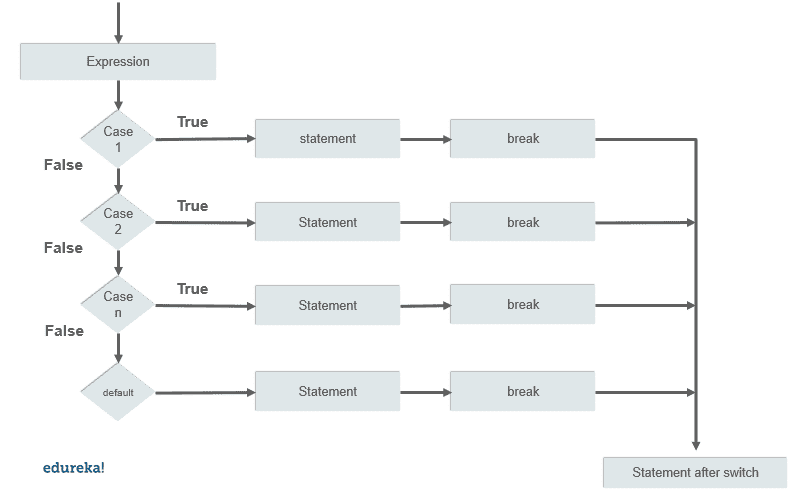

# Java 中的 Switch Case 是什么？

> 原文：<https://www.edureka.co/blog/switch-case-in-java/>

Java 编程语言有条件和[控制语句](https://www.edureka.co/blog/java-tutorial/#control)，可以在编写程序时优化逻辑。使用开关盒的自由逻辑构建提高了效率。在处理多个测试表达式时，在 java 中使用 switch case 可以优化代码的可读性。在本文中，您将通过各种例子了解到 [java](https://www.edureka.co/java-j2ee-training-course) 中的 switch case。以下是本文中讨论的主题:

*   [Java 中的 Switch Case 是什么？](#switchcase)
*   [要记住的规则](#rules)
*   [流程图](#flowchart)
*   [例题](#examples)
    *   [开关情况下的中断语句](#break)
    *   [嵌套开关案例](#nested)
    *   [跌落开关盒](#fallthrough)
    *   [开关情况下的枚举](#enum)
    *   [开关盒中的字符串](#string)

## **Java 中的 Switch Case 是什么？**

Java switch 语句类似于一个条件语句，它测试多个值并给出一个输出。这些被测试的多个值被称为案例。它就像一个多分支语句。在 java 7 发布后，我们甚至可以在案例中使用字符串。下面是在 [Java](https://www.edureka.co/blog/what-is-java/) 中使用 switch case 的语法。

```

switch(expression)
{
case value:
      //statement
      break;
case value n :
     //statement
     break;
default:
     //statement
}

```

## **规则要记住**

在 java 中声明 switch case 时，必须记住一些规则。以下是用 java 编写切换用例时需要记住的一些要点。

1.  在 switch 情况下，我们不能声明重复的值。

2.  case 中的值和 switch case 中变量的[数据类型](https://www.edureka.co/blog/data-types-in-java/)必须相同。

3.  case 中不允许有变量，它必须是常量或文字。

4.  break 语句实现了在执行过程中终止序列的目的。

5.  没有必要包含 break 语句，如果缺少 break 语句，执行将移到下一条语句。

6.  default 语句也是可选的，它可以出现在块中的任何地方。

## **流程图**

## ****

## **例子**

### **开关情况下的断开语句**

Break 语句用于控制执行流程，一旦表达式得到满足，执行就会移出 switch case 块。

```
public class Example{
public static void main(String args[]){
int month= 7;

switch(month){
case 1 :
      System.out.println("january");
      break;
case 2:
      System.out.println("february");
      break;
case 3:
      System.out.println("march");
      break;
case 4:
      System.out.println("april");
      break;
case 5:
      System.out.println("may");
      break;
case 6:
      System.out.println("june");
      break;
case 7:
      System.out.println("july");
      break;
case 8:
      System.out.println("august");
      break;
case 9:
      System.out.println("september");
      break;
case 10:
      System.out.println("October");
      break;
case 11:
     System.out.println("november");
     break;
case 12:
     System.out.println("december");
     break;
default:
     System.out.println("not valid");
}
}
}

```

**产量:**七月

## **嵌套开关案例**

嵌套开关盒将另一个开关盒合并到现有开关盒中。下面是一个显示嵌套开关情况的示例。

```
public class Example{
public static void main(String args[]){
int tech = 2;
int course = 2; 

switch(tech){
case 1:
      System.out.println("python");
      break;
case 2: 
      switch(course){
      case 1:
             System.out.println("J2EE");
             break;
      case 2:
            System.out.println("advance java");
             }
  }
}
}      

```

**输出:**高级 java

## **落历开关案**

只要 switch case 块中没有 break 语句。即使满足测试表达式，也会执行所有语句。下面是一个开关脱落的例子。

```
public class Example{
public static void main( String args[])
{
int courses = 2;

switch(courses){
case 1:
      System.out.println("java");
case 2:
      System.out.println("python");
case 3:
      System.out.println("Devops");
case 4:
      System.out.println("Automation testing");
case 5:
      System.out.println("Hadoop");
case 6:
      System.out.println("AWS");
default:
      System.out.println("check out edureka.co for more");
}
}
}

```

```
Output: java
              python
              Devops
              Automation testing
              Hadoop
              AWS
              check out edureka.co for more
```

### **开关箱中的枚举**

开关盒也允许枚举。 [Enum](https://www.edureka.co/blog/enumeration-in-java/) 基本上就是一个命名常量的列表。下面是在开关情况下使用 enum 的示例。

```
public class Example{
public enum day { s , m , t , w , th, fr, sa };
public static void main(String args[]){
course[] c = day.values();
 for(day today : c)
{
  switch (today){
 case s :
        System.out.println("Sunday");
        break;
case m:
        System.out.println("Monday");
        break;
case t:
        System.out.println("Tuesday");
        break;
case w:
        System.out.println("Wednesday");
        break;
case th:
        System.out.println("Thursday");
        break;
case fr:
        System.out.println("Friday");
        break;
case sa:
        System.out.println("Saturday");
        break;
     }
  }
}
} 

```

```
Output: Sunday
               Monday
               Tuesday
               Wednesday
               Thursday
               Friday
               Saturday
```

### 开关盒中的 **串**

Java 7 发布后，一个 switch case 可以有[个字符串](https://www.edureka.co/blog/java-string)作为 case。下面是在 switch 语句中使用 string 作为 cases 的示例。

```
public class Example{
public  static void main(String args[]){
String player = "batsmen";

switch(player){
case "batsmen":
       System.out.println(" Batsmen are players who plays with a bat");
       break;
case "bowler":
       System.out.println("who throws the ball");
       break;
case "wicket-keeper":
       System.out.println("who keeps the ball behind the wickets");
       break;
case "fielder":
       System.out.println("who fields in the ground");
       break;
default:
       System.out.println("no entry present");
}
}
}

```

```
Output: Batsmen are players who play with a bat
```

在本文中，我们已经通过各种例子讨论了如何在 java 中使用 switch case。通过使用条件语句，一次测试多个条件变得更加容易，并且还可以生成相当困难问题的优化解决方案。Java 编程语言中有大量这样的概念，这使得开发人员的生活变得更加轻松和自由。开始学习，掌握成为 java 开发人员所需的所有技能。报名参加 Edureka 的 [Java 认证](https://www.edureka.co/java-j2ee-training-course)项目，释放你的潜能，开发一流的应用程序。

有问题要问我们吗？请在这篇“Java 中的 Switch Case”文章的评论部分提到这一点，我们会尽快回复您。