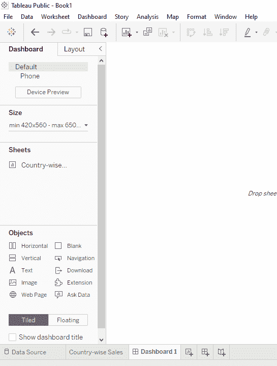
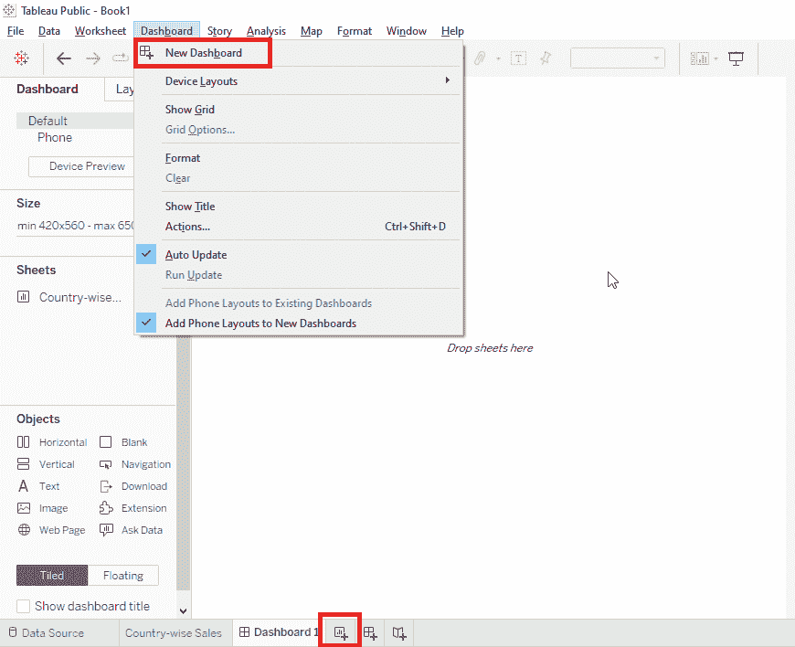
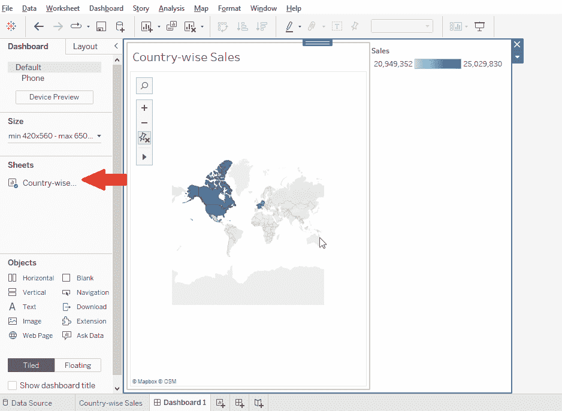
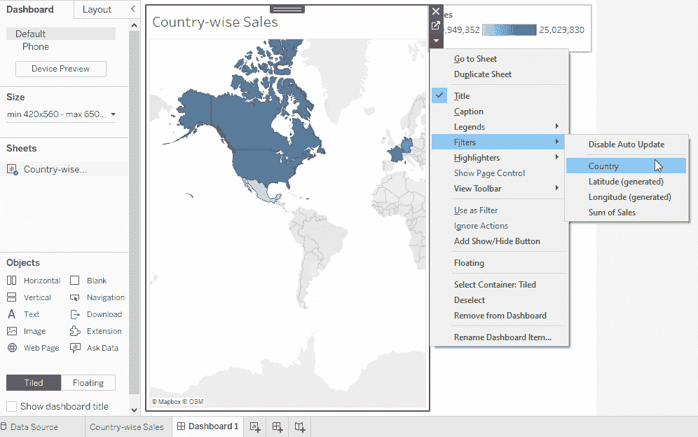
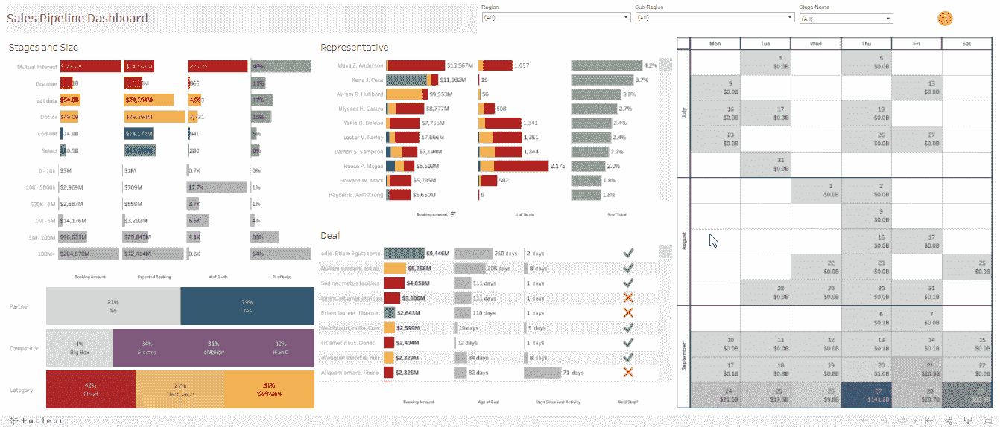
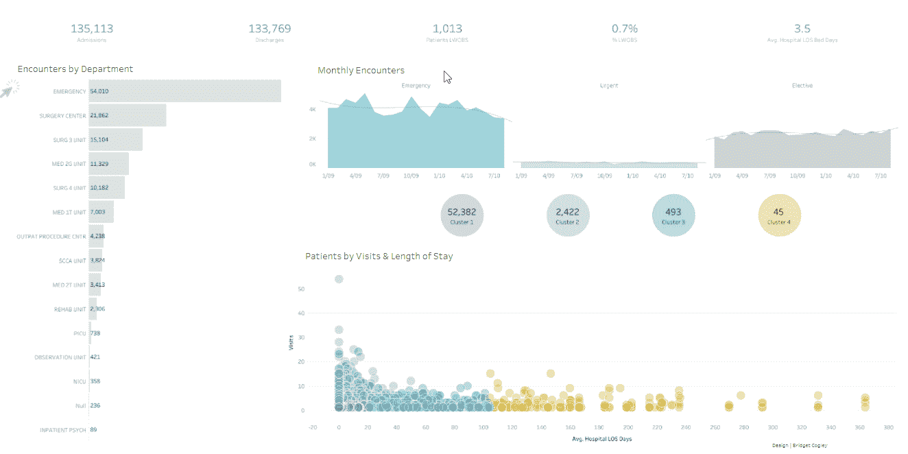

# Tableau Dashboards–如何在 Tableau 中创建 Dashboard，并提供示例

> 原文：<https://www.edureka.co/blog/tableau-dashboards/>

数据分析最重要的一个方面就是***数据可视化*** 。以一种既易懂又赏心悦目的方式传达信息一直是至关重要的。为了更有效地与最终用户联系，数据科学家必须掌握的技能之一是数据可视化。 ***Tableau*** 是当你想到数据可视化时第一个跃入脑海的术语。我假设你听说过 Tableau 的好处和它是如何工作的，这就是为什么你来到这里阅读 Tableau 仪表盘上的这篇博客。因此，没有任何进一步的拖延，让我们开始什么是 Tableau 仪表板。通过这个 Tableau Dashboard 博客，我希望你会喜欢学习制作用于数据可视化的 Tableau Dashboard。 本 Tableau Dashboard 博客将涵盖以下主题:

[**什么是 Tableau 仪表盘？**](#tableaudashboard) [**如何创建一个 Tableau 仪表盘？**](#create) [**Tableau 仪表盘示例**](#examples)

## **什么是 Tableau 仪表盘？**

仪表板是许多电子表格和相关数据在一个位置的集中展示。它用于同时比较和跟踪各种数据。许多数据视图都是同时呈现的。仪表板是电子表格底部的选项卡，通常使用来自数据源的最新数据进行更新。您可以将工作簿中任何工作表的视图添加到仪表板，以及各种支持对象，包括文本区域、网页和照片。添加到仪表板的每个视图都链接到它所属的工作表。因此，如果您更改工作表，仪表板会更新，如果您更改仪表板的视图，工作表也会更新。

在今天的市场上，Tableau 是一个常用的商业智能解决方案。它的吸引力来自于它处理大量数据的能力，同时还非常容易部署、理解和利用。Tableau 获取原始数据，并将其转化为可视化杰作，帮助组织做出数据驱动的选择。Tableau 仪表板提供了一个简单的界面，带有自我解释的向导，使非技术用户可以轻松地构建可视化效果。要进行分析，只需将维度和图表拖放到绘图空间即可。

Tableau 仪表板是不同视图或可视化的集合，每个视图或可视化显示不同类型的数据。它在一个屏幕上为客户提供了所有数据的综合画面。这就像将视图从 sheets 部分拖到可视化区域来创建仪表板一样简单。

创建或构建仪表板需要的不仅仅是使用 Tableau 的可视化工具。仪表板应该提供最相关的事实，允许用户快速使用信息。Tableau 有许多交互功能，如工具提示和过滤器，可以在不扰乱可视空间的情况下使用，从而带来愉快的仪表板体验。

如需 tableau 的详细教程，请观看此视频:

[https://www.youtube.com/embed/9OX9ohTcC1w](https://www.youtube.com/embed/9OX9ohTcC1w)

## **如何创建 Tableau 仪表盘？**

开始之前，让我们快速了解一下 Tableau 中导航可用的不同选项:

#### ****

#### **仪表板/布局**

默认情况下，您将在 Tableau Dashboard 选项卡上工作，通过该选项卡，您可以对 Dashboard 的几乎每个方面进行个性化设置。布局选项卡允许您更改单个仪表板组件的比例和位置。“布局”标签中的所有尺寸都以像素为单位。

#### **设备预览**

设备预览选项允许您查看仪表板在各种设备上的显示方式，您甚至可以存储仪表板的备用版本，以便根据设备的不同显示不同的仪表板。

#### **尺寸**

您可以在这里以像素为单位设置仪表板的高度和宽度。您可以选择各种标准尺寸或指定定制尺寸。如果您选择自动，仪表板将自动修改各种组件，以适应屏幕上显示它的所有可用空间。从表面上看，这个选择看起来是一个很好的匹配，但是请记住，它不是真正的“响应”，并且显示可能不一致。

#### **张**

在这里，您可以找到工作簿中可以上传到仪表板的单个工作表的列表。上面显示的示例是使用工作簿中的三个页面创建的:地图、趋势和条形图。给工作表起一个有意义的名字是个好主意，这样它们很容易被发现，但是你也可以通过将鼠标悬停在左侧菜单中的名称上来查看缩略图预览。

#### **物体**

**Horizontal:** 添加一个可以添加其他项目的水平布局容器。 **垂直:**添加一个垂直布局容器，可以添加其他项目。 **Text:** 该命令启动一个迷你文字处理器，你可以在其中键入和格式化你选择的任何文本。 **图片:**将电脑中的图片添加到仪表盘中。 **网页:**向仪表板添加网页链接(需要互联网连接才能显示网页)。 **空白:**用空白空间填充仪表板，当平铺布局中的仪表板项目靠得太近时，这可能很方便。

#### **平铺**

平铺仪表板元素时，它们会占据每个平铺的整个可用区域。当仪表板对象浮动时，您可以自定义它们的确切大小和位置。每种布局都有自己的优点和缺点，您选择哪种布局主要受您的特定用例的影响。大多数 Tableau 用户喜欢平铺布局带来的自动缩放；我们更喜欢浮动元素带来的可预测性和精确性。

## **创建仪表板的步骤**

在这里，我们将讨论在 Tableau 上创建仪表板的逐步过程

**1。新仪表板** 点击菜单栏上的仪表板选项选择新仪表板根据需要更改仪表板名称

#### **2。向仪表板添加工作表**

从左侧面板中，拖动仪表板上的工作表选择工作表并添加数据，开始创建可视化效果

#### **3。向您的仪表板添加另一张工作表**

将第二张工作表拖动到您的仪表板上您可以使用交换按钮在工作表之间交换工作表您可以根据需要添加多张工作表

#### **4。通过交互式添加进行定制**

您可以添加过滤器、切片器、图表、形状、饼图和不同的选项来自定义您的仪表板。您可以添加文本，以提供更多关于您的定制和标题的信息。网页链接和图片也可以通过仪表盘上的更多信息进行添加

#### **查看您的仪表板**

自定义完仪表板后，您可以通过按 F7 快捷键全屏查看，也可以在演示模式下查看。在这里，您可以看到您的仪表板最终呈现给观众的样子。

## **Tableau 仪表盘示例**

*   **销售渠道仪表板**使用此仪表板了解您渠道的健康状况和状态。能够按机会阶段、KPI、大小时段、时间线和销售代表划分数据和查看渠道，意味着您可以发现需要您快速转向的机会(如有必要)。全面、准确地了解销售渠道的状态意味着您可以评估销售线索的来源，并尽早采取措施帮助团队完成配额。

 [来源链接](https://www.tableau.com/learn/articles/sales-dashboards-examples-and-templates)

*   **医疗保健仪表板**在 Bridget Cogley 的可视化(viz)中，您可以按部门查看患者的人口统计数据和趋势。这种可视化利用 Tableau 的聚类工具从医院数据中收集见解，突出常见的短期住院患者与长期住院患者。

 [来源链接](https://www.tableau.com/learn/articles/business-intelligence-dashboards-examples)

这篇博客应该已经让你对“ ***有了很好的认识，什么是 Tableau Dashboard？*** “你还想了解更多吗？别担心， ***Tableau 教程*** 会帮助你更好的理解这个工具。为此，我们在 YouTube 上有视频，你可以通过它来更好地理解 Tableau。如果你有兴趣成为 Tableau 认证，点击下面的链接了解更多关于 Edureka 的 ***[Tableau 培训](https://www.edureka.co/tableau-certification-training?gclid=Cj0KCQiAmpyRBhC-ARIsABs2EAqXrunq6pa2u_TRrFmssRv1_nu3aqMbMWGHICxVM_-BB8OSq6QWUqYaAlZ-EALw_wcB)*** 。您也可以通过订阅我们的 YouTube 频道获得更多免费的 Edureka 资料。

有问题要问我们吗？请在评论区提到它，我们会尽快回复您。