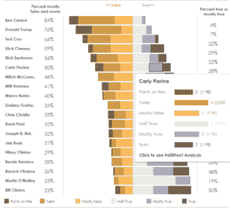
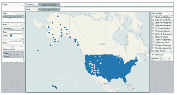
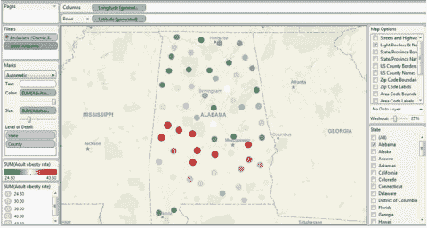
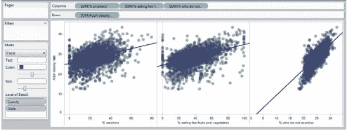
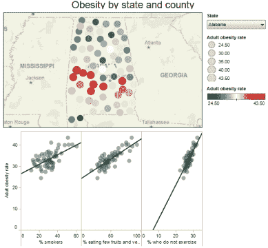
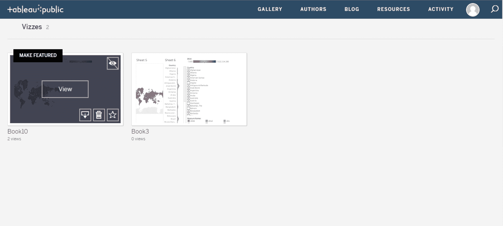

# 循序渐进指南学习 Tableau 公共

> 原文：<https://www.edureka.co/blog/tableau-public/>

Tableau 是商业智能行业中使用的强大且发展最快的数据可视化工具之一。它有助于将原始数据简化为非常容易理解的格式。然而，对于一个刚刚开始探索这个工具的人来说，支付它所需要的钱是不现实的。于是，我们有了 ***的画面** **的公开*** 。

现在，由于它对初学者的实用性，它成为大多数***[Tableau 培训课程](https://www.edureka.co/tableau-certification-training)*** 中非常重要的模块。在这个博客中，我们将讨论以下概念:

*   [**画面公**](#tableaupublic)
*   [**打开、创建和共享**](#usingtableaupublic)
*   [**公表对比**](#tableauvstableaupublic)

## **画面公** 

使用 [***Tableau***](https://www.edureka.co/blog/what-is-tableau/) 进行数据分析非常快速，并且创建的可视化是仪表板和工作表的形式。组织中任何级别的专业人员都可以理解使用 Tableau 创建的数据。它甚至允许非技术用户创建定制的仪表板。这正好增加了 ***[你应该学习 Tableau](https://www.edureka.co/blog/tableau-career-opportunities-101)*** 的理由。

Tableau Public 很像 Tableau，是一个简单易用的工具，可以在网上讲述视觉互动故事，唯一的例外是它完全免费！

例如,《纽约时报》在 2015 年 12 月发表了一篇文章，其中包含一张信息图，显示了政客说谎或说真话的倾向，该图基于 PolitiFact 的调查结果。我重新设计了图形，以更好地显示这些倾向，并添加了链接到 PolitiFact 调查结果的功能。

Tableau Public 非常擅长构建这样的可视化效果，我们只需几个简单的步骤就可以重新创建这一个。

## **开放、创造、分享**。

### **第一步:数据**

*   打开***USDA _ activity _ dataset . xls***。我将把 [***源文件***](https://drive.google.com/file/d/1iWwoSkXVZ9Ufn2SME95QSQ07bIwYDUYe/view?usp=sharing) 放在给大家。
*   该数据在近 100 列、3000 多行中详细描述了身体活动、肥胖和其他健康信息，美国每个县一行。

### **第二步:连接数据源**

*   将数据集拖放到桌面上的 **Tableau 公共图标**上即可打开。
*   在对话框中，点击**确定**进行连接。

Tableau 自动识别**分类字段**，如**【州】**，以及**【成人肥胖率】**等数值度量。

### **步骤 3:创建第一个视图**

*   双击**【州】**和**【县】**。Tableau Public 识别出它们是地理字段，**据此对它们进行地理编码**。您可能会收到一条警告消息；如果是这样，检查一下，这样就不会再看到了。
*   请注意，在经纬度 0 度处有一个点。这些是空值。通过单击点的一侧来选择它们，按住鼠标按钮在其上绘制一个矩形，然后松开。右击选中的空值，选择**排除**。
*   右键单击过滤器中的排除项，并选择 **Make Global** ，以便将其应用于所有后续视图。现在您有了一张地图，其中显示了您有记录的每个县的点。
*   将**“成人肥胖率”**从测量面板拖到**颜色**中，并复制到**大小**架子中，根据这些值对各县进行编码。把颜色换成自己喜欢的。
*   现在添加一个过滤器来选择各个州。单击并拖动“状态”到过滤器架，在对话框中单击确定。
*   在**滤镜架**中右键点击**“状态”**，选择**显示快速滤镜**。取消全选，然后选择**阿拉巴马**。
*   右键单击底部的选项卡，重命名工作表**“Map View”**。第一个视图的完成状态如下所示。

### **步骤 4:添加第二个视图**

添加新工作表。

*   将**【成人肥胖率】**拖到行上，将 **"%吸烟者"**、 **"%少吃水果和** **蔬菜"**、 **"%不运动者"**"拖到列上。
*   拖动**【县】****【州】**到 ***[明细级别](https://www.edureka.co/blog/tableau-lod/)*** 。如果没有这一步，Tableau 的默认行为是对所有县和州的值求和，这将为每个图形提供单个数据点，而不是所需的散点图。
*   将**颜色**改为紫色，打开**【自动】**旁边的下拉菜单，选择**圆形**，然后向左移动下面的滑块增加点的透明度。
*   在顶部菜单中选择分析，并检查**趋势线**。
*   右键单击底部的选项卡，将工作表重命名为“散点图视图”。第二个视图的完成状态如下所示。

### **第五步:创建带有两个视图的仪表板 **

*   双击每个视图，将两者都显示到 [***仪表盘***](https://www.edureka.co/blog/tableau-dashboards/) 。选择**状态** **过滤>压缩列表**。
*   再次右击该过滤器，并选择 **Make Global** 。这将确保选择一个州同时改变两个视图。

在这一步之后，剩下的都是你要做的自定义决定。

*   第三次右键点击该过滤器，选择**自定义**，取消选择**显示“全部”**值。这使得用户无法看到整个国家的全部数据。
*   右键单击每个视图的标题，然后选择隐藏标题。
*   将仪表板**重命名为“各州和县的肥胖情况”**。
*   双击**对象**下的**标题**。仪表板现在应该是这样的。

### **第六步:保存到网页**

*   转到**尺寸>编辑**。
*   选择最适合您网站的大小和布局。
*   点击顶部菜单上的文件并选择**保存到网络**。

系统会提示您使用 tableau 公共凭据登录。如果您没有帐户，您可以点击此处免费创建一个。登录后，给你的工作簿命名，tableau public 将发布你的 ***[可视化](https://www.edureka.co/blog/tableau-charts/) s*** 你到底是如何在桌面上构建它的

### **第七步:嵌入你的网站/博客**

*   在已经打开的**保存到网络结果**窗口中，向下滚动到可视化下方，并点击**共享**。
*   将嵌入代码复制并粘贴到网页的 HTML 中。

这种可视化现在完全是实时的。

这意味着观众可以看到工具提示，使用过滤器或任何其他功能，你已经建立到仪表板。为了分享我们的可视化效果，您可以使用**社交媒体按钮**或**分享**来获得您仪表板的直接 URL。

您也可以通过将嵌入代码直接复制并粘贴到我们的网页中，将仪表盘嵌入到我们的网站或博客中。这使得你的视觉效果可以紧邻任何图形或文本。

[https://www.youtube.com/embed/EpXPemL8qeU](https://www.youtube.com/embed/EpXPemL8qeU)

## **公表对比**

Tableau Desktop 和 Tableau Desktop Public 有一些比较。我将提到我认为最重要的:

*   Tableau Desktop Public 只允许您将**连接到本地数据**，并且您必须将**公共工作簿**提取到 **Tableau 服务器公共**。
*   Tableau 的付费版本在当前财年的定价如下。
    *   **Tableau 桌面个人版:35 美元**
    *   **Tableau 桌面专业版:70 美元**
    *   **Tableau 服务器:35 美元**
    *   **Tableau Online:42 美元**
    *   在旧模式下，一个许可证，每年维护，桌面个人花费**999 美元，桌面专业**花费**1999 美元** **。**
*   Tableau desktop Public **不允许您将工作簿本地保存到您的 PC 上**，您必须将其保存到 Tableau server Public，而您可以为付费版本保存。
*   您的数据源中的行数有限制，最近在 Tableau Public 上增加到了**100 万行**，对于 Tableau 的付费版本没有限制。