# Talend 大数据教程——大数据革命

> 原文：<https://www.edureka.co/blog/talend-big-data-tutorial/>

最近的科技市场发生了很多革命和变化。随着人们对大数据和分析越来越感兴趣，开源软件的受欢迎程度飙升，这已经不是什么新闻了。在市场上出现的所有开源 ETL 软件中，Talend 使用得相当普遍。如前所述，Talend 为大数据、云存储、数据集成等提供各种开源集成软件和服务。在这个 Talend 大数据教程博客中，我将讲述如何将 Talend 与各种大数据技术结合使用，如 HDFS、Hive、Pig 等。您可以从 [Hadoop 培训](https://www.edureka.co/big-data-hadoop-training-certification)中更好地理解这些概念。

以下是我将在这个 Talend 大数据教程博客中讨论的主题:

*   [大数据](#BigData)
*   [大数据人才](#TalendForBigData)
*   [大数据组件简介](#IntroductionToBigDataComponents)
*   [TOS 安装](#TOSInstallation)
*   [Talend 如何让处理大数据变得更简单？](#HowTalendMakesWorkingWithBigDataEasier)

为了更好地了解 Talend 如何处理大数据，让我们从大数据本身的基础知识开始。您也可以浏览一下这份 Talend 大数据教程的录音，我们的 ***[Talend 培训](https://www.edureka.co/talend-for-big-data)*** 专家 已经用实例详细地解释了这些主题。

**Talend 大数据教程| edu reka**


[https://www.youtube.com/embed/AueBJP5n-jc?rel=0&showinfo=0](https://www.youtube.com/embed/AueBJP5n-jc?rel=0&showinfo=0)*This video will help you in understanding the basic concepts of Talend and getting familiar with the Talend Open Studio for Big Data which is an open-source software provided by Talend to easily communicate with Big Data technologies like HDFS, Hive, Pig, etc.*

## **大数据——Talend 大数据教程**

大数据是极其庞大和复杂的数据集，无法使用任何常规数据管理工具进行处理。这些庞大的数据集可以以结构化、半结构化或非结构化的格式呈现。这些通常是数据流，可以由自动生成的报告、日志、客户行为分析结果或各种数据源的组合组成。下图显示了大数据的主要特征。他们更普遍地被称为大数据的 5 V。 **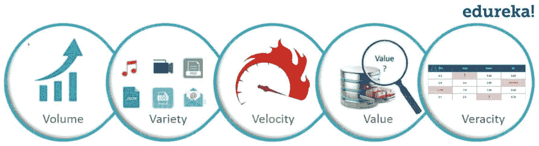**

为了分析这种海量的数据集，你需要一千多台计算机的分布式计算能力，这些计算机可以并行分析这些数据并集中存储结果。 **Hadoop** ，一个开源软件框架，完美的满足了这个需求。它是一个分布式文件系统，将收集到的信息分成许多数据块，这些数据块又分布在网络上的多个系统中。 它为几乎所有的数据类型提供了巨大的存储空间，巨大的处理能力以及处理几乎无限的任务或同时执行的工作的能力。

在 Talend 大数据教程博客的下一部分，我将讨论如何将大数据和 Talend 结合使用。

## **Talend For Big Data——Talend Big Data 教程**

用于大数据的 Talend Open Studio (TOS)构建在 Talend 的数据集成解决方案之上。它是一个开源软件，为用户提供了一个易于使用的图形开发环境。这是一个强大的工具，它利用 *Apache Hadoop 大数据*平台，帮助用户访问、转换、移动和同步大数据。它使用户与大数据源和其他目标的交互变得非常简单，因为他们不必学习或编写任何复杂的代码来使用它。

您需要做的只是配置大数据连接，然后执行简单的拖放操作。用于大数据的 Talend Open Studio (TOS)位于后端，将自动生成底层代码。现在，您可以轻松地将它们部署为服务或独立作业，在 HDFS、Hive、Pig 等大数据集群上运行。成为数据工程师 si 的最佳途径在海德拉巴 接受 [数据工程培训。](https://www.edureka.co/microsoft-azure-data-engineering-certification-course-hyderabad-city)

以下是 Talend 大数据功能架构的图示。

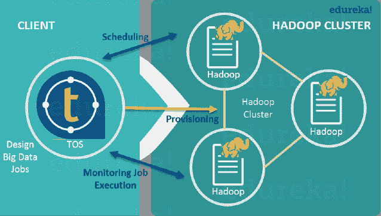

但是，在我介绍 Talend Open Studio 之前，让我先解释一下 HDFS 和 MapReduce，以及它们在没有 Talend 的情况下是如何工作的。

## **大数据组件介绍——Talend 大数据教程**

如上所述，Hadoop 是处理大数据的强大工具。但是您是否想知道它是如何处理这些庞大的数据集的？Hadoop 由两个核心模块提供支持，这两个模块可以非常高效地处理大数据。他们是:

1.  HDFS (Hadoop 分布式文件系统)
2.  MapReduce

从亚特兰大的 [Hadoop 培训中了解有关大数据的更多详情。](https://www.edureka.co/big-data-and-hadoop-atlanta)

我们一个一个来说:

### **【HDFS(Hadoop 分布式文件系统)**

HDFS 是 Hadoop 平台的文件管理系统，用于跨集群中的多个服务器存储数据。在这种情况下，数据集被分解为许多块，并分布在整个集群的各个节点上。除此之外，为了保持数据的持久性，HDFS 在不同的节点上保存这些数据块的副本。因此，在一个节点出现故障的情况下，其他活动节点仍将保存数据块的副本。

MapReduce 是 Hadoop 的一个数据处理框架。它用于创建应用程序，这些应用程序可以利用存储在分布式环境(如 HDFS)中的不同文件。MapReduce 应用程序主要有两个功能，它们作为任务在集群中的不同节点上运行。这两个功能是:

1.  **映射器:**这些函数读取并处理数据块，生成键值对作为中间输出。然后，这些输出作为输入被输送到减速器。
2.  **还原器:**这些函数从多个映射器函数接收键值对输出。然后，这些键值对被聚合成一个更小的键值对集合，这些键值对被算作最终输出。

让我们看一个简单的例子，如何使用 HDFS 和 MapReduce 从文件中提取唯一值:

这里我们有一个文本文件，其中有些单词是重复的。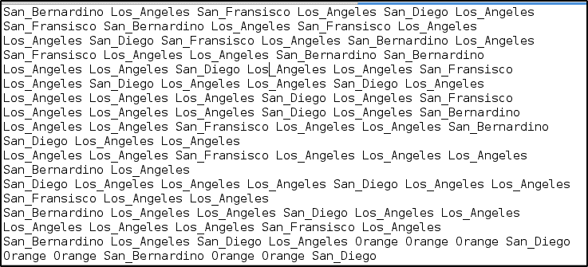

使用 MapReduce，我们将尝试计算这些单词在文件中出现的次数，并将结果存储在一个新文件中。为此，您需要很好地了解 Java 编程语言。

```
package co.edureka.mapreduce;
import java.io.IOException;
import java.util.StringTokenizer;
import org.apache.hadoop.io.IntWritable;
import org.apache.hadoop.io.LongWritable;
import org.apache.hadoop.io.Text;
import org.apache.hadoop.mapreduce.Mapper;
import org.apache.hadoop.mapreduce.Reducer;
import org.apache.hadoop.conf.Configuration;
import org.apache.hadoop.mapreduce.Job;
import org.apache.hadoop.mapreduce.lib.input.TextInputFormat;
import org.apache.hadoop.mapreduce.lib.output.TextOutputFormat;
import org.apache.hadoop.mapreduce.lib.input.FileInputFormat;
import org.apache.hadoop.mapreduce.lib.output.FileOutputFormat;
import org.apache.hadoop.fs.Path;

public class WordCount
{
public static class Map extends Mapper<LongWritable,Text,Text,IntWritable> {
public void map(LongWritable key, Text value,Context context) throws IOException,InterruptedException{
String line = value.toString();
StringTokenizer tokenizer = new StringTokenizer(line);
while (tokenizer.hasMoreTokens()) {
value.set(tokenizer.nextToken());
context.write(value, new IntWritable(1));
}
}
}

public static class Reduce extends Reducer<Text,IntWritable,Text,IntWritable> {
public void reduce(Text key, Iterable<IntWritable> values,Context context) throws IOException,InterruptedException {
int sum=0;
for(IntWritable x: values)
{
sum+=x.get();
}
context.write(key, new IntWritable(sum));
}
}

public static void main(String[] args) throws Exception {

Configuration conf= new Configuration();
Job job = new Job(conf,"Counting Unique Words In A File");
job.setJarByClass(WordCount.class);
job.setMapperClass(Map.class);
job.setReducerClass(Reduce.class);
job.setOutputKeyClass(Text.class);
job.setOutputValueClass(IntWritable.class);
job.setInputFormatClass(TextInputFormat.class);
job.setOutputFormatClass(TextOutputFormat.class);
Path outputPath = new Path(args[1]);
//Configuring the input/output path from the filesystem into the job
FileInputFormat.addInputPath(job, new Path(args[0]));
FileOutputFormat.setOutputPath(job, new Path(args[1]));
//deleting the output path automatically from hdfs so that we don't have to delete it explicitly
outputPath.getFileSystem(conf).delete(outputPath);
//exiting the job only if the flag value becomes false
System.exit(job.waitForCompletion(true) ? 0 : 1);
}
}
```

呜啊！！现在你需要做大量的编码工作。尤其是如果你不熟悉编码，这可能会成为一个大问题。此外，在编码和调试这个程序时需要花费大量的精力和时间。但是不用担心！Talend 可以让您不用编写所有这些代码，并且让您的工作变得更加容易，因为您只需要在 Talend 的工作空间中拖放组件。在后端，Talend 会自动为你生成这段代码。但为此，您需要安装 Talend for Big Data。

在本博客关于 Talend 大数据教程的下一部分，我将展示如何一步步地为 BD 安装 TOS。

## **TOS 安装–Talend 大数据教程**

**步骤一:【https://www.talend.com/products/talend-open-studio】走** 到。

**第二步:**点击‘下载免费工具’。

**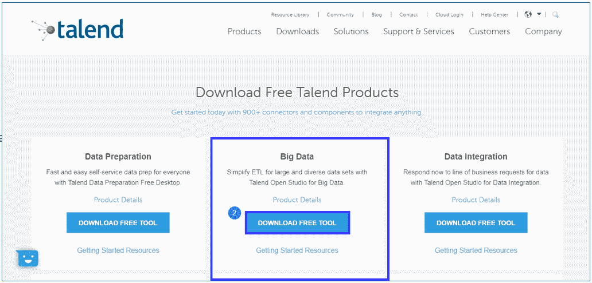第三步:**如果下载没有开始，点击‘重启下载’。

**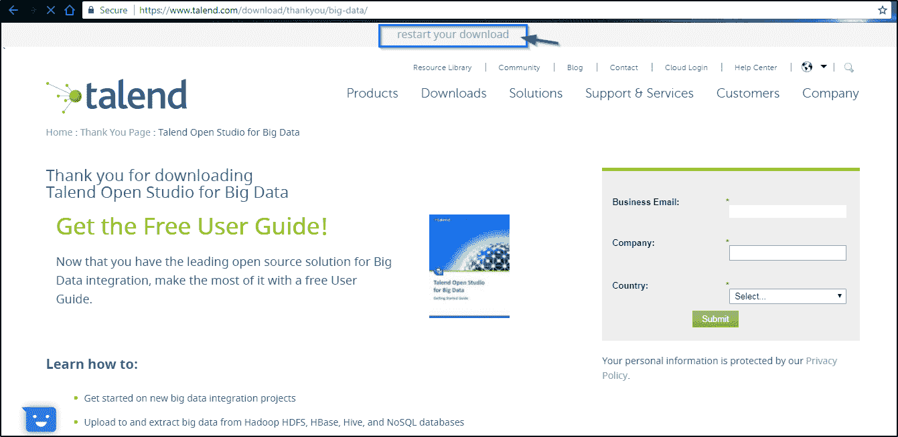第四步:**现在解压 zip 文件。

**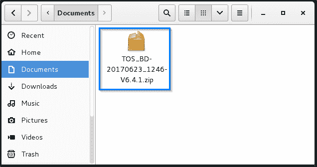第五步:**现在进入解压后的文件夹，双击 **TOS_BD-linux-gtk-x86_64** 文件。

**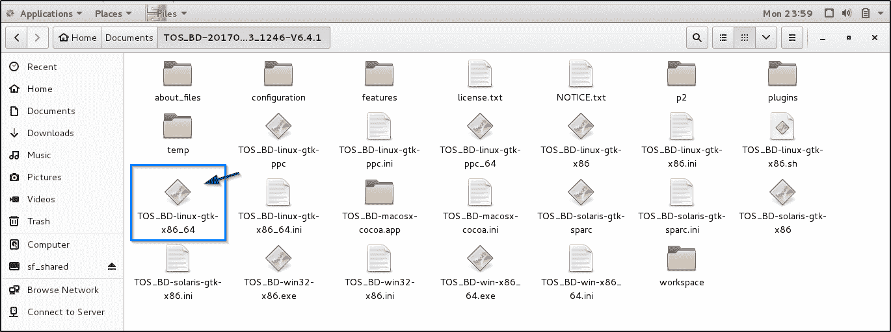第六步:**让安装完成。

**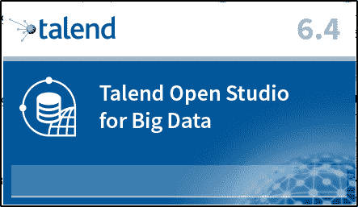第七步:**点击‘创建新项目’并为你的项目指定一个有意义的名字。

**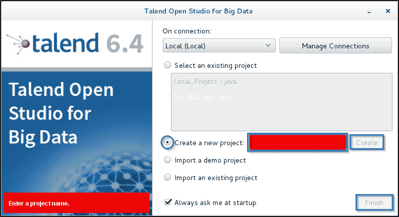第 8 步:**点击“完成”进入打开的 Studio GUI。

**第九步:**右键点击*欢迎标签*，选择‘关闭’。

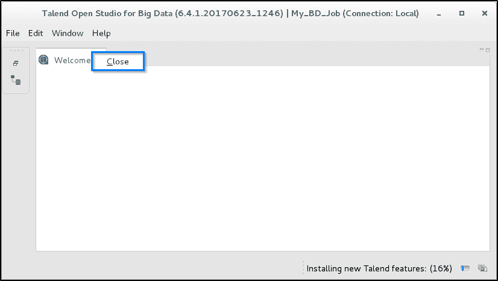

**第十步:**现在你应该可以看到 TOS 的主页面了。

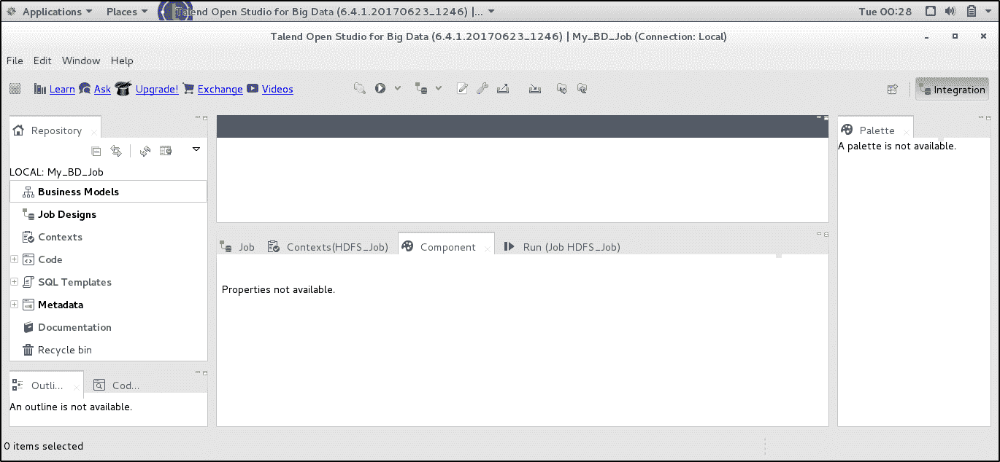

## **大数据组件在 Talend - Talend 大数据** **教程**

Talend 提供了大量的组件，你可以用它们来与 HDFS 和 MapReduce 交互。 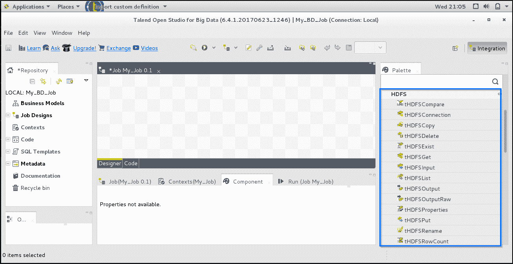

在这篇 Talend 大数据教程博客中，我将解释属于大数据家族的最重要的组成部分:你甚至可以通过 [数据工程课程](https://www.edureka.co/microsoft-azure-data-engineering-certification-course) 查看大数据的细节。

*   ***tHDFSConnection:***该组件帮助 连接到给定的 HDFS，以便其他 Hadoop 组件可以重用该连接来与 HDFS 通信。
*   ***tHDFSPut:***该组件帮助 从用户定义的目录中复制文件并粘贴到 HDFS 中，并且还能够对它们进行重命名。
*   ***tHDFSGet:***该组件帮助从 HDFS 复制文件，并将其粘贴到用户自定义的目录中，还可以对其进行重命名。
*   ***tHDFSInput:***该组件帮助提取 HDFS 文件中的数据，以便其他组件可以处理它。
*   ***tHDFSOutput:***该组件帮助将数据流传输到给定的 HDFS 文件系统中。

#### **蜂巢**

*   ***tHiveConnection:***该组件帮助建立一个配置单元连接，以便它可以被其他配置单元组件重用。
*   ***tHiveInput:*** 该组件帮助执行选择查询，提取相应的数据并将数据发送给后面的组件。
*   ***tHiveLoad:*** 该组件帮助将不同格式的数据写入给定的配置单元表，或将数据从配置单元表导出到特定的目录。
*   ***tHiveCreatetable:***该组件帮助连接到正在使用的配置单元数据库，并创建一个配置单元表，该表将专用于指定格式的数据。
*   ***tHiveClose:*** 该组件帮助关闭与 Hive 数据库的连接。

#### **猪**

*   ***tPigLoad:*** 该组件有助于在数据经过验证后，通过单个事务将原始输入数据加载到输出流中。
*   ***tPigMap:*** 该组件帮助转换来自一个或多个源的数据，然后将其路由到一个或多个目的地。
*   ***TPI aggregate:***该组件帮助将一个或多个附加列添加到分组数据的输出中，以生成可由 Pig 使用的数据。
*   ***tPigJoin:*** 该组件根据连接键帮助执行两个文件的内部连接和外部连接，以创建 Pig 使用的数据。

## **Talend 如何让处理大数据变得更简单？- Talend 大数据教程**

现在让我们试着用 Talend 执行同样的程序，看看 Talend 是如何帮助我们轻松执行这个程序的。

**第一步:**打开 Talend Studio For Big Data，创建一个新工作。

**第二步:** 添加 tHDFSConnection 组件，并在其组件选项卡中提供必要的细节来设置连接。

**步骤 3:** 现在添加一个 tHDFSPut 组件，以便在 HDFS 上上传您的文件。转到其组件选项卡，指定必要的详细信息，如下所示:

**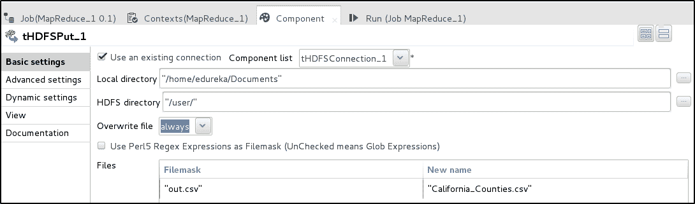 第四步: ** 现在添加其余的组件，并将它们链接在一起，如图所示:

**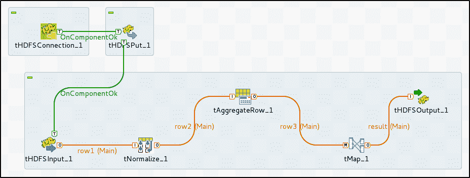第五步:**转到 tHDFSInput 组件的组件选项卡，输入所需的详细信息。

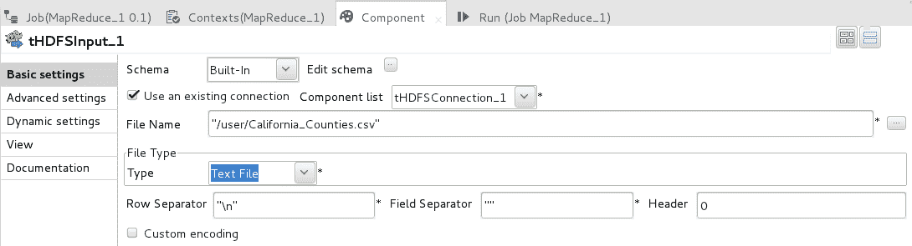

**第六步:**在规范化组件的组件页签中，指定详细信息，如图: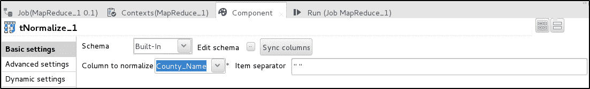

**第 7 步:**转到 tAggregate 组件的组件选项卡，提供如下所示的详细信息:


**第 8 步:**双击 tMap 组件，在弹出的窗口中，将输入表映射到所需的输出表，如下图:

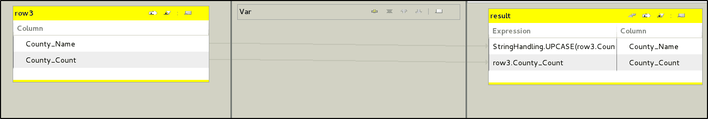

**第 9 步:**在 tHDFSOutput 组件的组件标签中指定所需的细节。

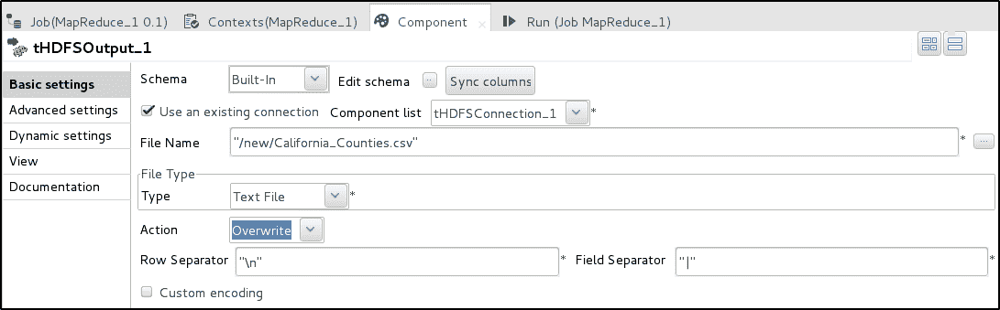

**第 10 步:**在运行选项卡中，点击运行执行作业。成功执行的作业将如下所示:

**第十一步:** 它的 会给你 HDFS 上的输出:

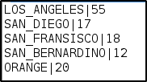

所以，这就把我们带到了这个关于 Talend 大数据教程的博客的结尾。我尽最大努力保持概念简洁明了。希望它能帮助您理解 Talend 以及它如何处理大数据。

*现在您已经看完了这篇博客，请查看 Edureka 在芝加哥举办的 [Hadoop 培训](https://www.edureka.co/big-data-and-hadoop-chicago)，edu reka 是一家值得信赖的在线学习公司，在全球拥有超过 250，000 名满意的学习者。*

*有问题吗？请在评论区提到它，我们会给你回复。*