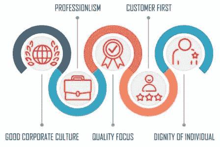
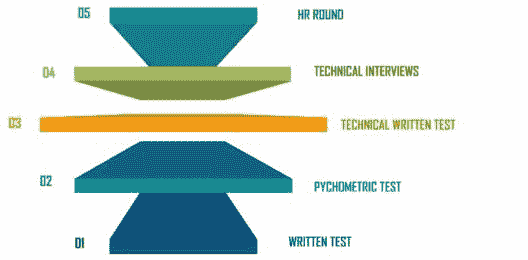

# 2023 年 Tech Mahindra 面试问答

> 原文：<https://www.edureka.co/blog/tech-mahindra-interview-questions/>

Tech Mahindra 是 Corporate Knights 报告的全球 100 家最具可持续性的公司之一。Tech Mahindra 共有 125，236 名员工在 90 个国家工作。根据现有员工的说法，Tech Mahindra 的工作和生活平衡得非常好，员工可以享受健康、交通、现场机会等诸多福利。为什么要等呢？让我们来看看 Tech Mahindra 的面试问题。

## **关于理工大的**马恒达

Tech Mahindra 是一家印度跨国科技公司，专注于信息技术(IT)和业务流程外包(BPO)。该公司是 Mahindra 集团的子公司，总部设在浦那，注册办事处设在孟买。作为马恒达集团的一部分，该公司总部位于浦那，拥有 it 技术。马恒达是一家市值 52 亿美元的公司，在 90 个国家拥有 125，236 名员工。 为了让马恒达科技达到他们已经达到的高度，他们让员工遵守某些价值观。它们被称为核心价值观。这些价值观是什么？让我们看看，去看看吧。

## **理工核心价值观**马恒达

## ****

*   ## **良好的企业文化:**

    与过去一样，Tech Mahindra 将继续寻求长期成功，这符合我们所服务国家的需求。他们非常小心谨慎，恪守商业道德标准，不惜任何代价都不会妥协。

*   ## **专业性:**

    在 Tech Mahindra，主要关注点一直是自由和发展机会。这些候选人在被录用时会关注这一点。展望未来，他们也会一直支持创新和合理的冒险，但会要求业绩。

*   ## **质量焦点:**

    质量是向客户提供物有所值服务的关键。他们将使质量成为我们工作、产品以及与他人互动的驱动价值。他们会“一次做对”。

*   ## **顾客至上:**

    Tech Mahindra 的存在和繁荣仅仅是因为他们的客户。他们将快速、礼貌、有效地响应客户不断变化的需求和期望。

*   ## **个人尊严:**

    他们会重视个人尊严，维护表达不同意见的权利，并尊重他人的时间努力&。通过他们的行动，他们将培养公平、信任和透明度。

在继续这篇科技 Mahindra 访谈问题博客之前，如果你想用视频总结这篇博客，下面是你的一个选择:

[//www.youtube.com/embed/wzf7zEHvmz8](//www.youtube.com/embed/wzf7zEHvmz8)

## **理工大学马恒达面试流程**

这是一张标准表，通过它你可以了解你申请科技 Mahindra 工作的资格。

| **毕业标准** | **详情** |
| **研究部门/分支** | Bachelors of Engineering (B.E.) / Bachelor’s of Technology(技术)以下学科之一:CSE/ECE/IT/EEE/电信/EI。运筹学米（meter 的缩写））计算机科学与信息技术理学硕士。 |
| **学习方式** | Full-Time courses recognized by the Central or State governments of India.(不提供非全日制或函授课程。) |
| **需要完成毕业的百分比** | 最低 60% |
| **积压** | 在 Tech Mahindra 招聘过程中，没有积压的工作。 |

**面试流程:**

## **理工大学马恒达技术面试题**

在基于职位和工作角色的技术面试中，你将在很多方面接受面试。以下是 Tech Mahindra 技术面试中涉及最多的一些技术概念。

你对结构化编程有什么理解？

结构化编程是一种编程范例，它包含了完全结构化的控制流。结构是指一个块，例如(if/then/else)、(while 和 for)、块结构和子例程，它包含一组规则并具有已定义的控制流。几乎所有的编程范例都使用结构化编程，包括 OOPs 模型。

数据库管理系统中的检查点意味着什么？

回答:

*   数据库管理系统(DBMS)中的检查点是一种从系统中删除所有以前的日志并将它们永久存储在存储驱动器上的技术。
*   保留每个事务的日志和维护影子页面是两种可以帮助 DBMS 恢复和维护 ACID 属性的方法。
*   对于基于日志的恢复系统，检查点是必要的。
*   检查点是数据库引擎在崩溃后可以恢复的最小点，作为事务日志记录可以用来恢复到崩溃时刻为止的所有提交数据的指定最小点。

**3)在 Java 中，局部变量的默认值是什么？**

Ans: 局部变量、原语和对象引用在 Java 中没有初始化为任何默认值。下面给出了说明这一点的代码片段:

`public class LocalVariablesExample{``  public void foo() {``     int localVariable;``     localVariable = localVariable * 10;``     System.out.println("Local Variable value is : " + localVariable);``  }``  public static void main(String args[]) {``     LocalVariablesExample obj = new LocalVariablesExample();``     obj.foo();``  }``}`**4) What is reentrancy in multiprogramming time sharing systems?**

对于多道程序分时系统，重入是一种非常有效的内存节省策略。它具有允许几个用户同时共享一个程序副本的能力。它的两个主要特点如下:

*   程序代码不能自我修改。
*   每个用户进程的本地数据必须单独保存。

破解技术面试的技巧:

*   每天测试你的编码知识:为了看看你能多快解决一组编码任务，测试一下你自己。这将有助于发展你解决问题的能力以及你的逻辑框架。
*   了解自己的优势和劣势:认识到自己的优势和不足，以及让你适合这个职位的技能和经验。考虑用一个独特的例子来帮助你脱颖而出。面试官想知道你的动力是什么，你为什么对这个组织感兴趣，以及你之前的经历如何让你为这个职位做好准备。
*   注意 Tech Mahindra 的面试模式:考察组织的面试经验文章。这会让你对实际的面试有一个大致的了解。
*   参加模拟面试:考虑进行一次模拟面试。这会让你知道面试将如何进行。

## **理工大学马恒达行为面试试题**

**1。说说你自己？**

确保关注你的优势、技能、品质和经验，这些都将与你申请的职位相匹配。TECH MAHINDRA 是一个高成就的组织，所以积极热情的回答证明你可以为他们已经建立的团队增加价值。示例回答:*“我是一个积极向上、目标明确的人，我坚信只有团队中的每个人都朝着同一个方向努力，才能在 TECH MAHINDRA 这样的组织中取得重大进展。另外，在我以前的经历中，我学到并理解了完全符合职位描述的技能。加上我以前的经理对我的绩效的评估，表明我是一个合适的候选人，愿意为 Tech Mahindra 这样一个成熟且成就卓著的组织做出最大贡献。”*

**2。是什么让你想在马恒达科技工作？**

Tech Mahindra 通过提供基于数字学习环境的整体长期职位来吸引和培养顶尖人才，这种环境可以在任何时间、任何地点和任何设备上访问。作为一名新员工，Tech Mahindra 是一个开始职业生涯的绝佳场所。它提供了一个出色的工作环境，以及一个积极的氛围，有利于个人和企业的进步。****

**3。你为什么适合这个角色？**

当你被问到这样的问题时，你应该提到你适合这个职位的优势和技能。示例回答:*“我确信我适合这个角色，原因有很多，但最重要的是因为我坚持不懈的承诺。为了在这个职位上取得成功，我具备了所有必需的技能。我正在努力为自己学习。我的技能和能力完全符合这个职位的要求。最重要的是，我的沟通和领导技能使我成为该职位的有力候选人。”*

**4。你愿意搬到印度的不同地方吗？**

不要给出否定的答案。一般来说，如果有项目要求，你会被要求搬迁。因此，询问有关项目的信息会对你有所帮助。准备好给出肯定的回答，让他们知道你对招聘人员的担忧。****

**5。你认为你的工资会是多少？**

回答这个问题很有挑战性。这是大多数有经验的员工都会被问到的问题。你可以询问公司员工的标准加薪。

**破解理工大马恒达面试加分题:**

*   准备好详细的例子
*   让回答简洁、有条理、清晰。
*   了解 Tech Mahindra 的核心价值观
*   给出的答案要快且切中要点。

最后，我们已经结束了这里的内容。当你一直在思考面试过程时，任何面试都可能看起来很难。诀窍是从你的准备开始。一旦你开始了，你甚至不知道你什么时候会成功。 希望这些信息能涵盖你对科技马恒达面试问题的所有疑问，我们祝你面试顺利。查看马欣德拉科技大学的[职业页面。快乐学习！](https://careers.techmahindra.com/)