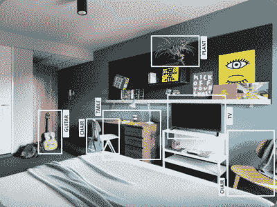
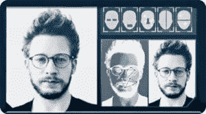
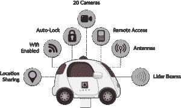
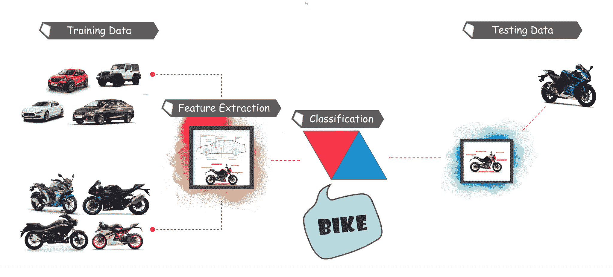
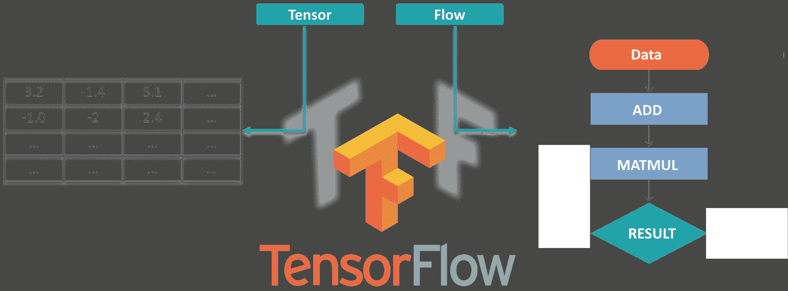
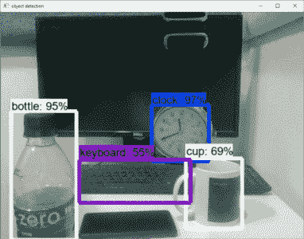

# TensorFlow 中的对象检测教程:实时对象检测

> 原文：<https://www.edureka.co/blog/tensorflow-object-detection-tutorial/>

创建能够在单个图像中识别和定位多个对象的精确机器学习模型仍然是计算机视觉的核心挑战。但是，随着最近在**深度学习方面的进步，物体检测**应用程序比以往任何时候都更容易开发。TensorFlow 的对象检测 API 是一个基于 TensorFlow 构建的开源框架，可以轻松构建、训练和部署对象检测模型。

Edureka 2019 Tech Career Guide is out! Hottest job roles, precise learning paths, industry outlook & more in the guide. [***Download*** ](http://bit.ly/2KmDS3b)now. 

所以，伙计们，在这个物体检测教程中，我将涵盖以下主题:

### **用 TensorFlow 进行实时物体检测| Edureka**


[//www.youtube.com/embed/wh7_etX91ls?rel=0&showinfo=0](//www.youtube.com/embed/wh7_etX91ls?rel=0&showinfo=0)

*这段 Edureka 视频将为您提供详细全面的 TensorFlow 物体检测知识及其工作原理。它还将为您提供如何使用 Tensorflow 在深度学习方法中检测对象的详细信息。*

## **什么是物体检测？**

对象检测是在静止图像或视频中寻找真实世界对象实例的过程，如汽车、自行车、电视、花和人。它允许识别、定位和检测图像中的多个对象，这为我们提供了对图像整体的更好理解。它通常用于图像检索、安全、监控和高级驾驶辅助系统(ADAS)等应用。

物体检测可以通过多种方式进行:

*   基于特征的物体检测
*   维奥拉·琼斯物体探测
*   具有猪特征的 SVM 分类
*   深度学习对象检测

在本对象检测教程中，我们将重点关注**深度学习对象检测**，因为 Tensorflow 使用深度学习进行计算。



让我们继续我们的目标检测教程，了解一下  在行业中的各种应用 。

## **物体检测的应用**

### **面部识别:**



一个名为“ **DeepFace** 的深度学习面部识别系统由**、**脸书的一组研究人员开发，它可以非常有效地识别数字图像中的人脸。**谷歌**在 Google Photos 中使用自己的面部识别系统，该系统会根据图像中的人自动隔离所有照片。面部识别涉及各种组件，如眼睛、鼻子、嘴和眉毛。

### **人数统计:**


物体检测也可用于人数统计，用于分析店铺业绩或**节日期间的人群统计**。随着人们快速移出画面，这些往往变得更加困难。

这是一个非常重要的应用，因为在人群聚集期间这个功能可以有多种用途。

### **工业质量检查:**


物体检测也用于工业过程中识别产品。通过视觉检测找到特定的物体是一项基本任务，涉及分拣、库存管理、加工、质量管理、包装等多个工业过程。

库存管理可能非常棘手，因为物品很难在**实时跟踪。**自动物品计数和定位有助于提高库存准确性。

### **自动驾驶汽车:**



毫无疑问，无人驾驶汽车是未来的趋势。但其背后的工作非常棘手，因为它结合了多种技术来感知周围环境，包括雷达，激光，GPS，里程计和计算机视觉。

先进的控制系统解释传感信息，以识别适当的导航路径以及障碍物，一旦图像传感器在其路径上检测到任何生物的迹象，它就会自动停止。这种情况发生的速度非常快，是向无人驾驶汽车迈出的一大步。

### **安全:**


目标检测在安全中起着非常重要的作用。无论是苹果的 face ID 还是所有科幻电影中使用的视网膜扫描。

政府也用它来访问安全信息，并将其与现有的数据库进行匹配，以找到任何罪犯或检测劫匪的车辆。

应用是无限的。

## **物体检测工作流程**

每种目标检测算法都有不同的工作方式，但它们都基于相同的原理。

**特征提取:**他们从手头的输入图像中提取特征，并利用这些特征来确定图像的类别。无论是通过 MatLab、Open CV、Viola Jones 还是深度学习。



现在你已经了解了物体检测的基本工作流程，让我们继续学习物体检测教程，了解 Tensorflow 是什么，它的组成部分是什么？

## **什么是 TensorFlow？**

Tensorflow 是谷歌的开源机器学习框架，用于跨一系列任务的数据流编程。图中的节点表示数学运算，而图边表示它们之间通信的多维数据数组(**张量**)。



张量只是多维数组，是二维表向更高维数据的扩展。Tensorflow 有许多特性，这使它适合深度学习。因此，不浪费任何时间，让我们看看如何使用 Tensorflow 实现对象检测。

## **物体检测教程**

### **获取先决条件**

*   在开始演示之前，我们先来看看先决条件。我们将需要:
    *   Python
    *   TensorFlow
    *   张量板
    *   [Protobuf v3.4 或以上](https://github.com/google/protobuf/releases)

### **设置环境**

*   现在，要下载 TensorFlow 和 TensorFlow GPU，您可以使用 pip 或 conda 命令:

```
# For CPU
pip install tensorflow
# For GPU
pip install tensorflow-gpu

```

*   对于所有其他的库，我们可以使用 pip 或 conda 来安装它们。代码如下:

```
pip install --user Cython
pip install --user contextlib2
pip install --user pillow
pip install --user lxml
pip install --user jupyter
pip install --user matplotlib

```

*   接下来，我们有 Protobuf: **协议缓冲区** (Protobuf)是 Google 的语言中立、平台中立、可扩展的机制，用于序列化结构化数据，就像 XML 一样，但是更小、更快、更简单。你需要 [***下载 proto buf***](https://github.com/google/protobuf/releases)3.4 版或以上版本进行本演示并解压。
*   现在你需要从 [***Github***](https://github.com/tensorflow/models) 克隆或者下载 TensorFlow 的模型。一旦 *d 下载* 和 *e 提取* 将“模型-主控器”重命名为“**模型**”。
*   现在为了 s 隐含性，我们将把“模型”和“protobuf”放在一个文件夹下“ **Tensorflow** ”。
*   接下来，我们需要进入 Tensorflow 文件夹，然后进入 research 文件夹中的，并从那里使用以下命令运行 protobuf】

```
"path_of_protobuf's bin"./bin/protoc object_detection/protos/

```

*   为了检查这是否有效，你可以进入模型>对象检测>原型中的**原型**文件夹，在那里你可以看到每个原型文件都有一个 python 文件被创建。

### **主代码**


设置好环境后，需要转到“ **object_detection** 目录，然后新建一个 python 文件。你可以使用 **Spyder** 或者 **Jupyter** 来编写你的代码。

*   首先，我们需要导入所有的库

```
import numpy as np
import os
import six.moves.urllib as urllib
import sys
import tarfile
import tensorflow as tf
import zipfile

from collections import defaultdict
from io import StringIO
from matplotlib import pyplot as plt
from PIL import Image

sys.path.append("..")
from object_detection.utils import ops as utils_ops

from utils import label_map_util

from utils import visualization_utils as vis_util

```

接下来，我们将下载在 [***COCO 数据集***](http://cocodataset.org/#home) 上训练好的模型。COCO 代表**上下文中的公共对象，**该数据集包含大约 33 万张带标签的图像。现在，型号选择很重要，因为您需要在**速度和精度**之间做出重要的权衡。根据您的要求和系统内存，必须选择正确的型号。

内*车型>研究>object _ detection>g3doc>detection _ model _ zoo*包含了所有不同速度和精度的车型(地图)。


*   接下来，我们提供所需的模型 和由 Tensorflow 生成的冻结的 推理图来使用。

```
MODEL_NAME = 'ssd_mobilenet_v1_coco_2017_11_17'
MODEL_FILE = MODEL_NAME + '.tar.gz'
DOWNLOAD_BASE = 'http://download.tensorflow.org/models/object_detection/'

PATH_TO_CKPT = MODEL_NAME + '/frozen_inference_graph.pb'

PATH_TO_LABELS = os.path.join('data', 'mscoco_label_map.pbtxt')

NUM_CLASSES = 90

```

*   这段代码将从互联网上下载那个模型，并提取那个模型的冻结推理图。

```
opener = urllib.request.URLopener()
opener.retrieve(DOWNLOAD_BASE + MODEL_FILE, MODEL_FILE)
tar_file = tarfile.open(MODEL_FILE)
for file in tar_file.getmembers():
  file_name = os.path.basename(file.name)
  if 'frozen_inference_graph.pb' in file_name:
    tar_file.extract(file, os.getcwd())

detection_graph = tf.Graph()
with detection_graph.as_default():
  od_graph_def = tf.GraphDef()
  with tf.gfile.GFile(PATH_TO_CKPT, 'rb') as fid:
    serialized_graph = fid.read()
    od_graph_def.ParseFromString(serialized_graph)
    tf.import_graph_def(od_graph_def, name='')

```

*   接下来，我们将加载所有标签

```

label_map = label_map_util.load_labelmap(PATH_TO_LABELS)
categories = label_map_util.convert_label_map_to_categories(label_map, max_num_classes=NUM_CLASSES, use_display_name=True)
category_index = label_map_util.create_category_index(categories)

```

*   现在我们将把图像数据转换成一个 numPy 数组进行处理。

```
def load_image_into_numpy_array(image):
  (im_width, im_height) = image.size
  return np.array(image.getdata()).reshape(
      (im_height, im_width, 3)).astype(np.uint8)

```

*   用于测试目的的图像路径在此定义。这里我们对(1 到 n+1)中的 i 有一个命名约定“ **image[i]** ，n 是提供的图像数量。

```
PATH_TO_TEST_IMAGES_DIR = 'test_images'
TEST_IMAGE_PATHS = [ os.path.join(PATH_TO_TEST_IMAGES_DIR, 'image{}.jpg'.format(i)) for i in range(1, 8) ]

```

*   这段代码对单个图像进行推理，检测对象，制作盒子，并提供该特定对象的类别和类别分数。

```

def run_inference_for_single_image(image, graph):
  with graph.as_default():
    with tf.Session() as sess:
    # Get handles to input and output tensors
      ops = tf.get_default_graph().get_operations()
      all_tensor_names = {output.name for op in ops for output in op.outputs}
      tensor_dict = {}
      for key in [
          'num_detections', 'detection_boxes', 'detection_scores',
          'detection_classes', 'detection_masks'
     ]:
        tensor_name = key + ':0'
        if tensor_name in all_tensor_names:
          tensor_dict[key] = tf.get_default_graph().get_tensor_by_name(
            tensor_name)
      if 'detection_masks' in tensor_dict:
        # The following processing is only for single image
        detection_boxes = tf.squeeze(tensor_dict['detection_boxes'], [0])
        detection_masks = tf.squeeze(tensor_dict['detection_masks'], [0])
        # Reframe is required to translate mask from box coordinates to image coordinates and fit the image size.
        real_num_detection = tf.cast(tensor_dict['num_detections'][0], tf.int32)
        detection_boxes = tf.slice(detection_boxes, [0, 0], [real_num_detection, -1])
        detection_masks = tf.slice(detection_masks, [0, 0, 0], [real_num_detection, -1, -1])
        detection_masks_reframed = utils_ops.reframe_box_masks_to_image_masks(
            detection_masks, detection_boxes, image.shape[0], image.shape[1])
        detection_masks_reframed = tf.cast(
            tf.greater(detection_masks_reframed, 0.5), tf.uint8)
        # Follow the convention by adding back the batch dimension
        tensor_dict['detection_masks'] = tf.expand_dims(
            detection_masks_reframed, 0)
        image_tensor = tf.get_default_graph().get_tensor_by_name('image_tensor:0')

        # Run inference
        output_dict = sess.run(tensor_dict,
            feed_dict={image_tensor: np.expand_dims(image, 0)})

        # all outputs are float32 numpy arrays, so convert types as appropriate
        output_dict['num_detections'] = int(output_dict['num_detections'][0])
        output_dict['detection_classes'] = output_dict[
          'detection_classes'][0].astype(np.uint8)
        output_dict['detection_boxes'] = output_dict['detection_boxes'][0]
        output_dict['detection_scores'] = output_dict['detection_scores'][0]
        if 'detection_masks' in output_dict:
          output_dict['detection_masks'] = output_dict['detection_masks'][0]
return output_dict

```

*   我们的最终循环将调用上面定义的所有函数，并将对所有输入图像逐一进行推理、，这将为我们提供图像输出，其中检测到带有标签的对象，并且该对象的百分比/分数与训练数据类似 。

```

for image_path in TEST_IMAGE_PATHS:
  image = Image.open(image_path)
  # the array based representation of the image will be used later in order to prepare the
  # result image with boxes and labels on it.
  image_np = load_image_into_numpy_array(image)
  # Expand dimensions since the model expects images to have shape: [1, None, None, 3]
  image_np_expanded = np.expand_dims(image_np, axis=0)
  # Actual detection.
  output_dict = run_inference_for_single_image(image_np, detection_graph)
  # Visualization of the results of a detection.
  vis_util.visualize_boxes_and_labels_on_image_array(
      image_np,
      output_dict['detection_boxes'],
      output_dict['detection_classes'],
      output_dict['detection_scores'],
      category_index,
      instance_masks=output_dict.get('detection_masks'),
      use_normalized_coordinates=True,
      line_thickness=8)
plt.figure(figsize=IMAGE_SIZE)
plt.imshow(image_np)

```


现在，让我们继续学习对象检测教程，看看如何在实时视频中检测对象。

## **使用 Tensorflow 检测活体物体**

对于这个演示，我们将使用相同的代码，但是我们将做一些调整。这里我们将使用 ***OpenCV*** 和摄像头模块来使用网络摄像头的实时馈送来检测对象。

*   添加 OpenCV 库和用于捕捉图像的相机。只需将下面几行添加到导入库部分。

```
import cv2
cap = cv2.VideoCapture(0)

```

*   接下来，我们不需要从目录中加载图像并将其转换为 numPy 数组，因为 OpenCV 会为我们完成这项工作

**去掉这个**

```
for image_path in TEST_IMAGE_PATHS:
image = Image.open(image_path)
# the array based representation of the image will be used later in order to prepare the
# result image with boxes and labels on it.
image_np = load_image_into_numpy_array(image)

```

**同**

```
while True:
ret, image_np = cap.read()

```

*   我们将不会使用 matplotlib 进行最终的图像显示，我们也将使用 OpenCV。现在，为此，

**去掉这个**

```

plt.figure(figsize=IMAGE_SIZE)
plt.imshow(image_np)

```

**同**

```
cv2.imshow('object detection', cv2.resize(image_np, (800,600)))
if cv2.waitKey(25) & 0xFF == ord('q'):
  cv2.destroyAllWindows()
  break

```

这段代码将使用 OpenCV，OpenCV 将依次使用之前初始化的 camera 对象来打开一个名为“ **Object_Detection** ”的大小为“800×600”的新窗口。它将等待 25 毫秒让摄像机显示图像，否则，它将关闭窗口。

### **最终代码全部修改:**

```

import numpy as np
import os
import six.moves.urllib as urllib
import sys
import tarfile
import tensorflow as tf
import zipfile

from collections import defaultdict
from io import StringIO
from matplotlib import pyplot as plt
from PIL import Image

import cv2
cap = cv2.VideoCapture(0)

sys.path.append("..")

from utils import label_map_util

from utils import visualization_utils as vis_util

MODEL_NAME = 'ssd_mobilenet_v1_coco_11_06_2017'
MODEL_FILE = MODEL_NAME + '.tar.gz'
DOWNLOAD_BASE = 'http://download.tensorflow.org/models/object_detection/'

# Path to frozen detection graph. This is the actual model that is used for the object detection.
PATH_TO_CKPT = MODEL_NAME + '/frozen_inference_graph.pb'

# List of the strings that is used to add correct label for each box.
PATH_TO_LABELS = os.path.join('data', 'mscoco_label_map.pbtxt')

NUM_CLASSES = 90

opener = urllib.request.URLopener()
opener.retrieve(DOWNLOAD_BASE + MODEL_FILE, MODEL_FILE)
tar_file = tarfile.open(MODEL_FILE)
for file in tar_file.getmembers():
  file_name = os.path.basename(file.name)
  if 'frozen_inference_graph.pb' in file_name:
    tar_file.extract(file, os.getcwd())

detection_graph = tf.Graph()
with detection_graph.as_default():
  od_graph_def = tf.GraphDef()
  with tf.gfile.GFile(PATH_TO_CKPT, 'rb') as fid:
    serialized_graph = fid.read()
    od_graph_def.ParseFromString(serialized_graph)
    tf.import_graph_def(od_graph_def, name='')

label_map = label_map_util.load_labelmap(PATH_TO_LABELS)
categories = label_map_util.convert_label_map_to_categories(label_map, max_num_classes=NUM_CLASSES, use_display_name=True)
category_index = label_map_util.create_category_index(categories)

with detection_graph.as_default():
  with tf.Session(graph=detection_graph) as sess:
    while True:
    ret, image_np = cap.read()
    # Expand dimensions since the model expects images to have shape: [1, None, None, 3]
    image_np_expanded = np.expand_dims(image_np, axis=0)
    image_tensor = detection_graph.get_tensor_by_name('image_tensor:0')
    # Each box represents a part of the image where a particular object was detected.
    boxes = detection_graph.get_tensor_by_name('detection_boxes:0')
    # Each score represent how level of confidence for each of the objects.
    # Score is shown on the result image, together with the class label.
    scores = detection_graph.get_tensor_by_name('detection_scores:0')
    classes = detection_graph.get_tensor_by_name('detection_classes:0')
    num_detections = detection_graph.get_tensor_by_name('num_detections:0')
    # Actual detection.
    (boxes, scores, classes, num_detections) = sess.run(
      [boxes, scores, classes, num_detections],
      feed_dict={image_tensor: image_np_expanded})
    # Visualization of the results of a detection.
    vis_util.visualize_boxes_and_labels_on_image_array(
        image_np,
        np.squeeze(boxes),
        np.squeeze(classes).astype(np.int32),
        np.squeeze(scores),
        category_index,
        use_normalized_coordinates=True,
        line_thickness=8)

    cv2.imshow('object detection', cv2.resize(image_np, (800,600)))
    if cv2.waitKey(25) 0xFF == ord('q'):
      cv2.destroyAllWindows()
      break

```



现在到此，我们结束了这个对象检测教程。我希望你们喜欢这篇文章，并理解 Tensorflow 的力量，以及在图像和视频中检测对象是多么容易。所以，如果你读到这里，你就不再是物体检测和张量流的新手了。尝试这些例子，如果您在部署代码时遇到任何挑战，请告诉我。

*现在您已经了解了**物体检测**的基础知识，请查看 Edureka 的 [**Tensorflow 认证**](https://www.edureka.co/ai-deep-learning-with-tensorflow)* *，edu reka 是一家值得信赖的在线学习公司，拥有遍布全球的 250，000 多名满意的学习者。该认证培训由行业专业人士根据行业要求&的需求进行策划。您将掌握 SoftMax 函数、Autoenc 或神经网络、受限玻尔兹曼机(RBM)等概念，并使用 Keras & TFLearn 等库。*

【Edureka 与 E & ICT 学院、瓦朗加尔国家技术学院合作，提供人工智能和机器学习方面的研究生课程，保持技术领先。这门[人工智能课程](https://www.edureka.co/executive-programs/machine-learning-and-ai)旨在提供最好的结果。

*有问题吗？请在“物体检测教程”的评论部分提到它，我们会给你回复。*