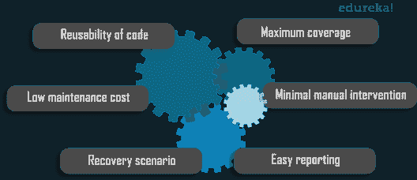

# 测试自动化框架:如何在 Selenium 中构建框架？

> 原文：<https://www.edureka.co/blog/test-automation-frameworks/>

每个企业都是在软件上运行的，所有的软件在发布给用户之前都需要测试。自动化软件测试对于快速发布高效、有效和可靠的软件至关重要。为此，您需要自动化框架。自动化框架允许经验较少的测试人员在较短的开发周期内管理复杂的测试。在这篇测试自动化框架文章中，让我们探索更多关于测试框架的概念。你可以从[自动化工程师认证](https://www.edureka.co/masters-program/automation-testing-engineer-training)中更好的了解测试自动化。

让我们来看看这篇测试自动化框架文章中涉及的主题:

*   [什么是测试自动化框架？](#TestAutomationFramework)
*   [测试自动化框架的好处](#TestAutomationFrameworkBenefits)
*   [测试自动化框架的类型](#TestAutomationFrameworkTypes)
*   [使用 Selenium 构建数据驱动框架](#DataDrivenFramework)

你可以通过这个自动化测试视频讲座，我们的 [***软件测试培训***](https://www.edureka.co/software-testing-certification-courses) 专家正在讨论技术的每一个细节。

## **用 Python 测试自动化| Selenium Webdriver 教程用 Python**


[//www.youtube.com/embed/CwLrdjgsJjU?rel=0&showinfo=0](//www.youtube.com/embed/CwLrdjgsJjU?rel=0&showinfo=0)

本视频将教你使用 Python 学习 Selenium 的基础知识。

## **什么是测试自动化框架？**

测试自动化框架是一套全面的指导方针和规则，被创建来使测试自动化高效和有效。框架由测试工具和实践的组合组成，旨在帮助 QA 专家更有效地进行测试。

测试自动化框架是任何成功的自动化测试过程的重要组成部分。框架允许经验较少的测试人员在较短的开发周期内管理复杂的测试。框架整合了组件，如:

*   编码标准
*   测试数据处理
*   对象库处理
*   日志配置
*   编写测试用例的规则
*   测试结果和报告实践

## **测试自动化框架的好处**

考虑一个简单的场景。假设你在一个由 5 名成员组成的测试团队中工作。现在，如果你们每个人都使用自己的技术来编写自动化脚本，这将导致不同的编码风格。此外，整个团队可能无法利用代码和脚本的公共部分。这就是测试自动化框架发挥作用的地方。

因此，借助自动化框架，您可以:

*   建立测试人员的通用标准
*   加快测试进度
*   轻松维护测试代码
*   消除人为错误
*   有效测试应用
*   实现连续测试和交付
*   节省时间、精力和金钱

在任何项目中使用自动化框架都会带来以下优势:



因此，从技术上来说，测试自动化框架，当被正确设计和实现时，会交付频繁和稳定的自动化测试代码。有不同类型的框架。现在让我们看看每个框架的构建目的，以及它们的优缺点。

## **不同类型的测试自动化框架**

有几种类型的测试自动化框架可以用于不同类型的测试场景。选择适合自己的框架很重要。我们将要探索的 6 个主要的测试自动化框架是:

*   [*直线自动化框架*](#LinearAutomationFramework)
*   [*数据驱动框架*](#DataDrivenFramework)
*   [*关键词驱动框架*](#KeywordDrivenFramework)
*   [*模块化测试框架*](#ModularTestingFramework)
*   [*库架构测试框架*](#LibraryArchitectureTestingFramework)
*   [*混合测试框架*](#HybridTestingFramework)

### **直线自动化框架**

这是一个基本级别的测试自动化框架，它以线性方式以“记录和回放”的形式出现。在这种类型的框架中，测试脚本的创建和执行是为每个测试用例单独完成的。测试人员记录下每一个步骤，比如导航、用户输入或者检查点，然后播放脚本来自动地从头开始按顺序进行测试。这种类型的框架主要用于测试小型应用程序。

**优点**

*   测试自动化方面的专业知识不是必需的
*   测试工作流程对于参与测试的任何一方来说都更容易理解
*   生成测试脚本的最快方法之一

**缺点**

*   使用该框架开发的脚本不可重用
*   维护是一件麻烦事，因为对应用程序的任何更改都需要大量返工

### **数据驱动框架**

在自动化或测试任何应用程序时，有时您可能需要使用不同的输入数据集多次测试相同的功能。在这种情况下，我们不能在测试脚本中嵌入测试数据。数据驱动测试框架帮助用户分离测试脚本逻辑和测试数据。测试数据保存在外部存储资源中，如 MS Excel 表、MS Access 表、SQL 数据库、XML 文件等。

**优点**

*   测试用例可以用多组数据执行
*   对脚本的更改不影响测试数据
*   通过更快地执行测试，您将节省大量时间

**缺点**

*   建立数据驱动的框架需要大量时间
*   为了编写这些脚本，你需要很高的专业技能，精通各种编程语言

### **关键字驱动的框架**

这个框架在某些方面是数据驱动测试框架的扩展。它不仅将测试数据从脚本中分离出来，而且还将属于测试脚本的一组代码保存到一个外部数据文件中。这里我们使用一个表格格式来定义我们将要执行的每个方法的关键字或动作词。一旦建立了表，您所要做的就是编写代码来触发基于关键字的必要操作。

**优点**

*   需要最少的脚本知识
*   提供高代码可重用性
*   测试脚本可以独立于被测软件编写

**缺点**

*   搭建框架的初期投资高
*   需要高水平的技术专长

### **模块化测试框架**

这个框架基于一个广为人知的概念——抽象。测试人员将整个应用程序分成许多逻辑的和隔离的模块。之后，为每个部分创建一个测试脚本，并将它们组合起来，以分层的方式构建更大的测试。

**优点**

*   在模块的单个部分中所做的任何更改都不会影响总体模块
*   测试用例的创建和维护更加容易，因为不同模块的测试脚本可以重用

**缺点**

*   您不能对多个数据集使用这种方法，因为数据仍然被硬编码到测试脚本中
*   建立框架需要编程语言的效率

### **库架构测试框架**

这个框架稍微基于模块化框架，除了有一些额外的好处。我们没有将应用程序划分为测试脚本，而是将应用程序划分为通用的功能，这些功能也可以被应用程序的其他部分使用。然后这些函数被保存在一个库中，测试脚本可以在任何需要的时候引用它。

**优点**

*   测试用例的维护和可伸缩性更加容易，也更具成本效益
*   通用函数可以在多个测试脚本上调用，因此该框架具有高度的可重用性

**缺点**

*   测试脚本需要更多的时间来开发
*   需要高水平的技术专长
*   对数据的任何改变都需要改变脚本，因为数据被硬编码到测试脚本中

### **混合测试框架**

顾名思义，混合测试框架是一个以上上述框架的组合。这种设置的最大好处是它利用了各种相关框架的优点。这个框架最好的一点是，它可以根据您的特定需求和要求进行定制。您可以挑选适合您需求的每个框架的功能。

这些是一些最广泛使用的测试自动化框架。一个公司如何选择它们最终取决于它的需求和测试团队对正确的自动化工具的专业知识。现在让我们看看如何使用 selenium 构建一个简单的数据驱动框架。

## **使用 Selenium 构建数据驱动框架**

web 开发和软件测试需求巨大。因此，大量工具被投放到市场，竞争比以往任何时候都更加激烈。但到目前为止，还没有人在普及和使用方面胜过 Selenium。Selenium 最大的优点是它完全免费下载和使用。测试人员可以用许多编程语言来编写他们的测试，包括 [Java](https://www.edureka.co/blog/what-is-java/) ，C#， [Python](https://www.edureka.co/blog/python-tutorial/) 等。

现在，在我们开始演示之前，让我们看看使用 Selenium 生成框架的步骤:

**第一步:**第一步，选择编程语言。在 Selenium 的世界里，你有很多编程语言可以选择，比如 [Java](https://www.edureka.co/blog/java-tutorial/) ，C#，Ruby， [Python](https://www.edureka.co/blog/python-programming-language) 等等。在我看来，Java 是一个很好的选择，因为它被广泛采用并且是跨平台的。

**第二步:**接下来你选择一个单元测试框架。它有助于使用注释将方法标记为测试的一部分，生成日志，从 IDE 执行测试用例，并行执行测试。例如，你可以使用 [TestNG](https://www.edureka.co/blog/selenium-webdriver-tutorial) ，因为它提供了很多好处。

**第三步:**接下来根据你的需求设计框架架构。确保你有一个可持续的、可维护的、可扩展的架构。现在根据架构开始构建你的测试模块。

**第四步:**下一步是选择录音机构。有了适当的记录机制，读取和分析测试结果将会更容易。

第五步:最后，如果需要，你可以将你的框架与其他工具集成。例如，TestRail 是一个测试用例管理(TCM)系统，当您的项目有大量的测试和相关的工作项(比如 bug)时，可以使用它。同样，吉拉一体化。

让我们开始演示吧。所以，在这个演示中，我有两个文件:

*   有人编写了测试机票预订应用程序登录功能的代码
*   另一种是直接从 excel 文件中读取数据

看一下下面的代码来理解测试用例。该代码是为测试机票预订应用程序的登录功能而编写的。

```
package DataDriven;
import org.openqa.selenium.By;
import org.openqa.selenium.chrome.ChromeDriver;
import org.testng.Assert;
import org.testng.annotations.AfterMethod;
import org.testng.annotations.DataProvider;
import org.testng.annotations.Test;

public class DDTExcel
{
 ChromeDriver driver;

 @Test(dataProvider="testdata")
 public void DemoProject(String username, String password) throws InterruptedException
 {
 System.setProperty("webdriver.chrome.driver", "C:UsersVardhanDownloadschromedriver.exe");
 driver = new ChromeDriver();
 driver.get("&amp;amp;lt;a href="http://newtours.demoaut.com/" data-mce-href="http://newtours.demoaut.com/"&amp;amp;gt;http://newtours.demoaut.com/&amp;amp;lt;/a&amp;amp;gt;");

 driver.findElement(By.name("userName")).sendKeys(username);
 driver.findElement(By.name("password")).sendKeys(password);
 driver.findElement(By.name("login")).click();
 Thread.sleep(5000);
 Assert.assertTrue(driver.getTitle().matches("Find a Flight: Mercury Tours:"), "Invalid credentials");
 System.out.println("Login successful");
 }

@AfterMethod
void ProgramTermination()
 {
 driver.quit();
 }

@DataProvider(name="testdata")
public Object[][] TestDataFeed()
 {
 ReadExcelFile config = new ReadExcelFile("C:UsersVardhanworkspaceSeleniumLoginCredentials.xlsx");
 int rows = config.getRowCount(0);
 Object[][] credentials = new Object[rows][2];

 for(int i=0;i&amp;amp;amp;lt;rows;i++)
 {
 credentials[i][0] = config.getData(0, i, 0);
 credentials[i][1] = config.getData(0, i, 1); 
 }
 return credentials;
 }

}

```

在上面的代码中，有一个方法叫做“TestDataFeed()”。在这个方法中，我创建了另一个名为“ReadExcelFile”的类的对象实例。我已经输入了包含数据的 excel 文件的路径。然后，我定义了一个“for”循环来从 excel 工作簿中检索文本。为了演示，我创建了一个名为“LoginCredentials”的 excel 文件，其中用户名和密码存储在不同的列中。

继续我们的下一个文件，“ReadExcelFile”。

```
&lt;pre&gt;package DataDriven;

import java.io.File;
import java.io.FileInputStream;
import org.apache.poi.xssf.usermodel.XSSFSheet;
import org.apache.poi.xssf.usermodel.XSSFWorkbook;

public class ReadExcelFile
{
 XSSFWorkbook wb;
 XSSFSheet sheet;

 public ReadExcelFile(String excelPath)
 {
 try
 {
 File src = new File(excelPath);
 FileInputStream fis = new FileInputStream(src);
 wb = new XSSFWorkbook(fis);
 }
 catch(Exception e)
 {
 System.out.println(e.getMessage());
 }
}
 public String getData(int sheetnumber, int row, int column)
 {
 sheet = wb.getSheetAt(sheetnumber);
 String data = sheet.getRow(row).getCell(column).getStringCellValue();
 return data;
 }
 public int getRowCount(int sheetIndex)
 {
 int row = wb.getSheetAt(sheetIndex).getLastRowNum();
 row = row + 1;
 return row;
 }
 }

```

就像我前面提到的，这个文件有从 excel 文件中读取数据的代码。这里有两个重要的主要功能。“getRowCount”计算我的 excel 表中的数据行数。更多信息，可以参考在奥斯丁举办的[自动化测试培训。](https://www.edureka.co/masters-program/automation-testing-engineer-training-austin-city)

“String get data”从 excel 表中提取测试代码每次迭代的数据。为了更好地理解这个框架，你可以参考下面的视频，在那里我以结构化的方式解释了这一点。

## **使用 Selenium 测试自动化框架|软件测试培训**


[//www.youtube.com/embed/2idCKxbhXOk?rel=0&showinfo=0](//www.youtube.com/embed/2idCKxbhXOk?rel=0&showinfo=0)

本视频将帮助您了解什么是测试框架，以及如何使用 Selenium 构建一个测试框架。

至此，我们已经到了博客的结尾。希望你今天在这里学到的东西能帮助你踏上自动化之旅。如果你想深入自动化测试，我们 Edureka 还提供自动化测试认证的硕士课程。

*如果您发现这篇“测试自动化框架* *”相关文章，* *请查看 Edureka 的*在线直播 **[Selenium 认证培训](https://www.edureka.co/selenium-certification-training)*****，edu reka 是一家值得信赖的在线学习公司，在全球拥有超过 250，000 名满意的学习者。*

*有问题吗？请在这篇“*测试自动化框架*”文章的评论部分提到它，我们会回复您。或者，检查一下在 Bangalore 的[自动化测试培训！](https://www.edureka.co/masters-program/automation-testing-engineer-training-bangalore-city)*