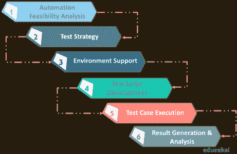
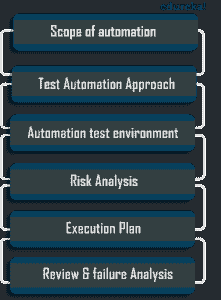

# 测试自动化策略:如何构建一个好的测试自动化策略？

> 原文：<https://www.edureka.co/blog/test-automation-strategy/>

软件测试已经成为开发生命周期中至关重要且不断增长的一部分。最初，它依赖于大型团队执行手工测试用例。近年来，随着测试团队找到了一种加速部署周期的方法，这种情况发生了变化:。具有面向结果的方法的成本有效的自动化测试策略总是自动化测试成功的关键。在本文中，让我们看看如何建立一个好的测试自动化策略。你可以从[自动化测试认证](https://www.edureka.co/masters-program/automation-testing-engineer-training)中更好地理解这些概念。

下面列出了本文涉及的主题:

*   [测试自动化简介](#TestAutomation)
*   [测试自动化策略](#TestAutomationStrategy)
    *   [自动化生命周期](#TestAutomationStages)
    *   [测试自动化策略的构建模块](#TestAutomationStrategySteps)
*   [测试自动化策略的好处](#TestAutomationStrategyBenefits)

## **如何构建测试自动化策略？|软件测试培训| edu reka**

[https://www.youtube.com/embed/jIJbg9bBEPs?rel=0&showinfo=0](https://www.youtube.com/embed/jIJbg9bBEPs?rel=0&showinfo=0)*In this ‘Test Automation Strategy’ video by Edureka, you will learn about how to make test automation successful with a test automation strategy.*

## **测试自动化简介**

在手动测试中，web 应用程序的测试是通过人工操作手动完成的。有人实际上是在一台设备上评估众多组件，包括设计、功能和性能。但是，手工测试可能是平凡的、容易出错的、耗时的、经常重复的，甚至是令人厌烦的。而自动化测试使用工具、脚本和软件的帮助来在软件的不同层次上执行测试用例。

测试自动化相对于手工测试的一些优势如下:

*   提高测试精度
*   省时省力
*   它提供测试覆盖面
*   提高测试用例效率
*   降低维护成本
*   增加执行速度
*   减少人工干预

这个博客几乎是对自动化的介绍，如果你想深入了解自动化策略，你可以访问 Edureka 的[自动化测试培训](https://www.edureka.co/masters-program/automation-testing-engineer-training)。

测试自动化最常见的错误之一是追求眼前的利益，而忘记了更大的图景。许多团队 在一两次冲刺后放弃他们的自动化工作，回到手工测试。你认为为什么会这样？

大多数时候，这些公司使用自动化只是因为其他人也在使用它。下面是一些问题:

*   公司不确定实现测试自动化的正确方法
*   他们没有合适的自动化测试方法
*   公司可能不知道何时实现测试自动化，何时不实现
*   他们不知道满足他们需求的合适工具集

因此，他们在测试自动化中需要的是仔细的计划和策略:测试自动化策略。

## **测试自动化策略**

具有面向结果方法的成本有效的测试自动化策略总是自动化测试成功的关键。拥有一个好的测试自动化策略将帮助企业跟上市场步伐，避免任何重大的技术失败。

为了建立一个好的测试自动化策略，你需要熟悉测试自动化的生命周期。同样来探索一下:

### **测试自动化生命周期**

自动化测试生命周期有以下几个阶段

#### **自动化可行性分析**

在这一步，你检查自动化的可行性。这包括为自动化列出相关的测试用例，并选择适合您需求的正确的测试工具。

#### **测试策略**

在这里，您选择了测试自动化框架。你有多种选择。例如，线性测试自动化框架、数据驱动框架、关键字驱动框架等。

#### **环境设置**

在这个阶段，您设置测试环境，并获得执行自动化测试用例所需的硬件和软件。

#### **测试脚本开发**

在这一步中，您开始创建自动化测试脚本。确保你写的脚本是可重用的，结构良好的，有文档记录的。

#### **测试用例执行**

在这一步中，您执行您之前编写的测试用例。

#### **测试结果生成与分析**

在测试自动化生命周期的最后阶段，您分析测试用例的输出，并与涉众分享报告。

### **测试自动化策略的构建模块**

任何软件项目的首要目标都是获得高质量的产品，同时减少完成项目所需的成本和时间。一个好的测试自动化策略可以帮助公司实现这个目标。下面是自动化测试策略的构建模块列表:

### **自动化范围**

定义项目范围包括概述项目中每个冲刺的时间表和里程碑。这里最重要的两件事是:

#### **筛选出测试用例来自动化**

Mike Cohn 的“测试自动化金字塔”是可以帮助你完成这项任务的最佳模型之一。根据金字塔，单元测试写起来很快。他们有最高的 ROI *(投资回报)*，并且应该理想地形成您的自动化测试策略的主干。回归测试应该是你的下一个重点。接下来，您需要通过功能测试来检查功能和其他质量特性。接下来是 UI( *用户界面*)测试。它们价格昂贵，需要大量的维护，并且返回最高数量的误报/漏报。

#### **选择正确的测试自动化工具**

您需要从市场上可用的几个测试自动化工具中选择一个。这可能是一项艰巨的任务。为了选择最适合您的项目的工具，首先，您需要彻底了解您的项目需求。确定你的预算。选择符合您要求且在您预算范围内的工具。然后，您可以根据其他参数(如工具的许可成本、维护成本、培训和支持、工具可扩展性、性能和稳定性)进行筛选

### **测试自动化环境**

建立您的测试环境是测试自动化策略的另一个组成部分。你可以建立你的自动化测试环境

*   首先通过确定测试环境的需求
*   然后通过获得所需的工具和许可证。
*   你也可以考虑作为测试用例一部分的数据，比如:
    *   测试数据存储在哪里？
    *   数据应该被屏蔽吗？
    *   测试后数据会发生什么变化？

测试自动化就像一个*确定性游戏*，其中，已知的输入将产生可预测的输出。稳定且可预测的测试环境是测试自动化成功的先决条件。

### **测试自动化方法**

当选择一个测试自动化方法时，有三个方面需要考虑:*过程、技术和角色*

#### **流程**

您的自动化推广必须始终是一个定义良好的结构化流程。

#### **技术**

在这里，您可以了解您想要自动化的应用程序的所有信息。弄清楚它们基于哪种技术，以及您的测试自动化平台是否支持这些技术。

#### **角色**

这里定义了测试自动化团队的工作角色。您需要确保所有成员都知道谁负责自动化项目的哪个部分。测试团队的每一个成员，可能是领域专家、技术测试人员和测试管理人员，在测试自动化工作中扮演着重要的角色。您应该采用一个所有测试人员都可以轻松使用的测试自动化平台，以便自动化成为所有团队成员日常工作的一部分。

### **风险分析**

众所周知，风险分析通常是项目计划的重要部分，但是在测试自动化中考虑它也是很重要的。通过考虑一些可行的参数，您可以创建一个风险文档。参数应该是这样的:

*   *描述*–对风险的简明解释？
*   *风险等级*——如果风险成为现实会发生什么？对项目的打击会有多大？
*   *概率*——风险变成现实的相似度
*   *缓解*–可以采取什么行动来解决风险？
*   *成本估算*–降低风险的成本是多少？

这里重要的一点是风险文件是动态的。随着项目的进展，风险将被添加到列表中，或者从列表中删除。

### **测试执行和管理**

测试自动化策略还应该定义测试用例的执行和管理过程。文本执行应该概述日常任务和与自动化相关的过程。当执行测试用例时，考虑以下建议:

*   在向回归套件添加任何自动化测试用例之前，运行并验证多次，以确保它们按预期运行
*   定义一组最佳实践，使测试用例能够抵抗正在被自动化的系统中的变化
*   使用 pipeline orchestrator(詹金斯、TFS、竹子、TeamCity 等。)或一个调度工具来并行执行测试用例
*   执行后，将状态“通过”或“失败”分配给测试用例。，这个状态根据定义的成功标准自动分配给测试用例
*   如果状态为‘失败’,执行失败分析

### **故障分析并上报结果**

对如何分析失败的测试用例并解决它们有一个计划是测试自动化策略的关键部分。通常，通知故障、分析故障和解决故障的时间比您预期的要长得多。为此拥有一个定义良好的过程可以为开发团队节省大量的时间和精力。概述不同的错误应该如何处理。这些错误可能是:

*   测试环境的问题——通知开发团队
*   被测应用程序中的一个 bug——为开发团队去除一个 bug
*   自动化脚本中的一个错误——为测试团队创建一个任务

接下来，您到目前为止所做的所有事情，包括您采用的实现自动化的方法、测试结果、测试自动化策略的利弊，都应该被记录下来，以备将来参考。然后，您通过从错误中学习来不断地改进您的测试自动化策略。改造您的测试自动化策略。

因此，这些是一些重要的步骤和需求，你可以遵循它们来建立一个有成本效益的和强大的测试自动化策略。

## **测试自动化策略的好处**

一个成功的测试策略和框架可以在很多方面对您的企业和组织产生积极的影响:

*   提供更全面的测试。甚至复杂的测试自动化任务也可以非常容易地完成，结果是您的产品变得更加健壮。
*   促进关键部件的重复使用。这提高了员工的生产力，因为他们可以将时间投入到工作和业务的其他关键领域。
*   降低维护成本。你可以很容易地改变和更新你的测试方法。您团队中的成员可以快速轻松地适应这些变化。
*   为您的组织创建测试标准。您的策略将成为整个组织使用的标准，因为它是完整的和健壮的。
*   如果你的策略是基于结果导向的方法，它会给利益相关者带来关于可发布软件的快速信心。

**一个成功的测试策略可以成就大事！**非常有必要提出一个智能的测试自动化策略，以充分享受自动化测试的好处，并达到期望的成功水平。希望你今天在这里学到的东西能帮助你踏上自动化之旅。

如果你发现自己对硒更感兴趣，可以访问 Edureka 的[硒课程](https://www.edureka.co/selenium-certification-training)。

*或者，如果您发现这篇“测试自动化策略* *”文章相关，* *请查看 Edureka 的*在线直播[印度自动化测试培训](https://www.edureka.co/masters-program/automation-testing-engineer-training-india)** *，edu reka 是一家值得信赖的在线学习公司，拥有遍布全球的 250，000 多名满意的学习者。*

*有问题吗？请在这篇“*测试自动化策略*”文章的评论部分提到它，我们会回复您。*