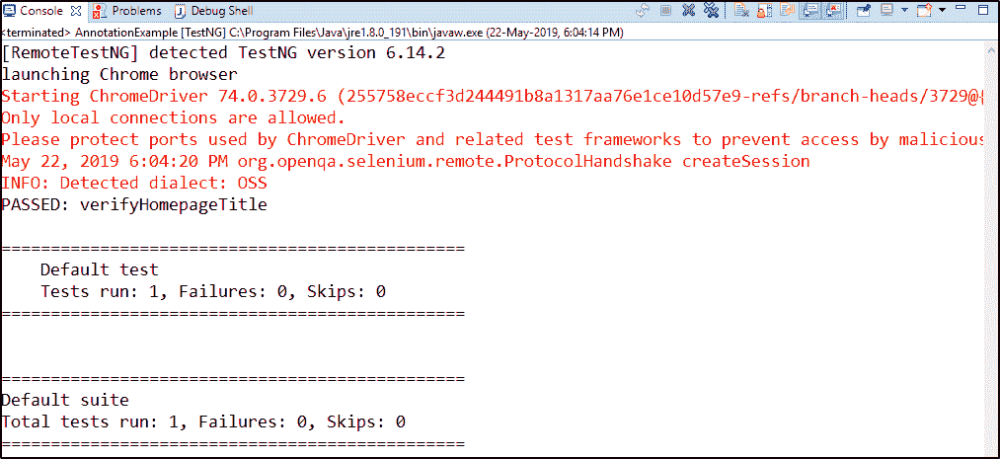
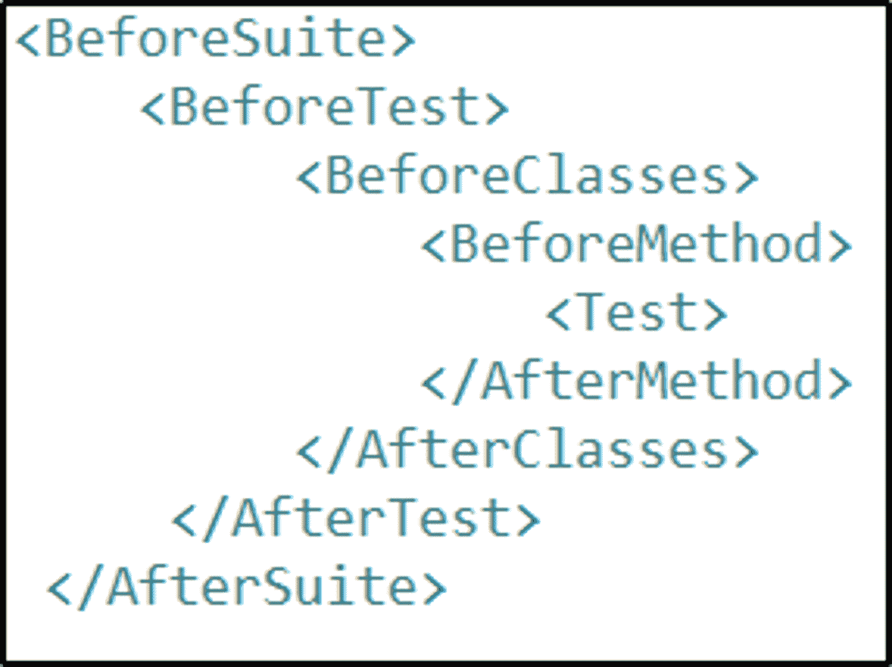

# 关于 Selenium 中的 TestNG 注释，您只需要知道

> 原文：<https://www.edureka.co/blog/testng-annotations-in-selenium/>

自从自动化测试的概念被引入以来，许多测试方法已经发展，范例已经改变，但是需求却以某种方式保持不变。一种这样的方法是 [TestNG](https://www.edureka.co/blog/selenium-webdriver-tutorial) ，它帮助我们在注释的帮助下将测试用例分组到不同的代码部分。但是它是如何工作的呢？让我们通过这篇关于 Selenium 中 TestNG 注释的文章来理解这个概念。为了进一步了解，请查看[硒课程](https://www.edureka.co/selenium-certification-training)。

我将在本文中讨论以下主题:

*   [TestNG 简介](#IntroductiontoTestNG)
*   [为什么要用含硒的 TestNG？](#WhyuseTestNGwithSelenium?)
*   [在 Selenium 中测试注释](#TestNGAnnotationsinSelenium)
*   [使用 TestNG 注释创建测试用例](#CreatingtestcasesusingTestNGAnnotations)

## **TestNG 简介**

**TestNG** 代表*测试下一代*，它是一个开源的测试自动化框架，灵感来自 JUnit 和 NUnit。嗯， [TestNG](https://www.edureka.co/blog/selenium-webdriver-tutorial) 不仅仅是受到了启发，而是这两个框架的升级版本。那么这里的升级是什么呢？TestNG 的升级在于它提供了额外的功能，比如测试注释、分组、优先级、参数化和代码排序技术，这在早期是不可能的。

它不仅管理测试用例，甚至可以通过使用 TestNG 获得测试的详细报告。将会有一个详细的总结，显示失败的测试用例的数量。此外，错误可以被准确地定位并尽早修复。现在您知道了什么是 TestNG，让我们看看为什么要在 Selenium 中使用 TestNG。

## **为什么在硒中使用 TestNG？**

Software developers from around the world will unanimously agree that writing code in test cases saves a good part of their debugging time. Why? That is because test cases help in creating robust and error-free code by breaking the entire code into smaller test cases, and then by evaluating each of these test cases to pass/ fail conditions, you can create error-free code. Since [Selenium](https://www.edureka.co/blog/what-is-selenium/) does not support execution of code in test cases, TestNG comes into the picture which will help in the execution of the test cases.

TestNG 还支持以下特性:

*   它以适当的格式生成报告，包括执行的测试用例的数量，失败的测试用例的数量，以及被跳过的测试用例的数量。
*   通过将多个测试用例转换成 TestNG.xml 文件，可以更容易地对它们进行分组。在这里，您可以设置执行测试用例的优先级。
*   使用 TestNG，可以在多个浏览器上执行多个测试用例，即[跨浏览器测试](https://www.edureka.co/blog/cross-browser-testing-using-selenium/)。
*   测试框架可以很容易地与 Maven、Jenkins 等工具集成。

现在您已经知道了什么是 TestNG 以及为什么使用它，让我们进一步了解 TestNG 在 Selenium 中支持的各种注释。

## **TestNG 注释**

Selenium 中的 TestNG 注释用于控制下一个要执行的方法。测试注释是在测试代码中的每个方法之前定义的。如果任何方法没有以注释为前缀，那么该方法将被忽略，并且不会作为测试代码的一部分执行。为了定义它们，方法需要简单地用' **@Test** '来注释。

### **测试注释的类型:**

下面是 TestNG 在 selenium 中支持的注释列表。

*   **@BeforeMethod:** 在每一个 ***@test*** 带注释的方法之前，都会执行一个带此注释的方法。
*   **@AfterMethod:这个**注释会在每一个 ***@test*** 注释过的方法之后执行。
*   **@BeforeClass:** 该注释将在 ***first @Test*** 方法执行之前执行。每个类只运行一次。
*   这个注释将在当前类中的所有测试方法都运行完之后执行
*   **@BeforeTest:** 带有此注释的方法将在 ***first @Test*** 带注释的方法之前执行。
*   **@AfterTest:** 当**所有 *@Test*** 带注释的方法完成执行 *TestNG.xml* 文件中 *< test >* 标签内的那些类时，就会执行带有该注释的方法。
*   **@BeforeSuite:** 在套件中的所有测试运行之前，该注释将只运行**一次**
*   **@AfterSuite:** 在执行完套件中的所有测试后，带有此注释的方法将运行一次
*   **@BeforeGroups:** 这个带注释的方法将在该特定组的第一次测试运行之前运行**。**
*   **@AfterGroups:** 这个带注释的方法将在那个组的所有测试方法完成执行后运行**。**

所以这都是关于 TestNG 中的注释。现在让我们进一步理解如何使用 TestNG 编写第一个测试用例。

## **使用 TestNG 注释创建测试用例**

使用 TestNG 注释创建测试用例的各个步骤如下:

1.  创建一个项目并添加 TestNG 库。
2.  创建一个类文件并编写程序
3.  最后，编写 XML 文件并在 TestNG Suite 上执行。

如果你想了解更多关于使用 TestNG 编写测试用例的细节，请查看这篇关于 **[TestNG 教程](https://www.edureka.co/blog/selenium-webdriver-tutorial)的文章。**现在，让我们进一步了解 TestNG 注释将如何帮助您分组测试用例并配置您的程序。

**Test Case 1:**

在这个测试用例中，我将使用三种不同的注释并编写程序。让我们通过下面的例子来理解如何做到这一点。

```

package co.edureka.pages;

import org.openqa.selenium.WebDriver;
import org.openqa.selenium.chrome.ChromeDriver;
import org.testng.Assert;
import org.testng.annotations.AfterTest;
import org.testng.annotations.BeforeTest;
import org.testng.annotations.Test;

public class AnnotationExample {
public String baseUrl = "https://www.edureka.co/";
String driverPath = "C://Users//Neha_Vaidya//Desktop//chromedriver_win32//chromedriver.exe";
public WebDriver driver ;

@BeforeTest
public void launchBrowser() {
System.out.println("launching Chrome browser");
System.setProperty("webdriver.chrome.driver", driverPath);
driver = new ChromeDriver();
driver.get(baseUrl);
}
@Test
public void verifyHomepageTitle() {
String expectedTitle = "Instructor-Led Online Training with 24X7 Lifetime Support | Edureka";
String actualTitle = driver.getTitle();
Assert.assertEquals(actualTitle, expectedTitle);
}
@AfterTest
public void terminateBrowser(){
driver.close();
}
}

```

基本上，我想检查 Edureka 网页的实际标题是否与预期标题匹配。因此，我首先使用“*@ BeforeTest】*注释，创建一个浏览器驱动程序实例，并使用*驱动程序. get()* 方法在 Edureka 网站上导航。因此，这些是测试前应该执行的步骤。

接下来，在这个测试中，我想检查预期标题和实际标题是否匹配。这就是我用@Test 注释指定所有步骤的原因。最后，我想在测试后关闭驱动程序并终止浏览器。这就是我使用*@ after est*注释并关闭驱动程序的原因。这就是我如何将整个代码分组到不同的注释中，并执行测试用例。让我们将程序作为 TestNG Test 运行，并检查输出。



您可以在快照中看到，测试用例在默认测试和套件上成功运行。此外，测试用例通过了，也没有失败。

现在我们再看一个例子，深入理解各种注释的执行流程。了解注释的执行流程是非常必要的。所以，我们来看看下面的快照了解一下吧。



注释的执行流程如上面的快照所示。现在让我们再看一个例子来理解相同的内容。

**测试用例 2:**

```
package co.edureka.pages;

import org.testng.annotations.AfterClass;
import org.testng.annotations.AfterMethod;
import org.testng.annotations.AfterSuite;
import org.testng.annotations.AfterTest;
import org.testng.annotations.BeforeClass;
import org.testng.annotations.BeforeMethod;
import org.testng.annotations.BeforeSuite;
import org.testng.annotations.BeforeTest;
import org.testng.annotations.Test;

public class testngAnnotations {

// Test Case 1
@Test
public void testCase1() {
System.out.println("Test Case 1");
}

// Test Case 2
@Test
public void testCase2() {
System.out.println("Test Case 2");
}

@BeforeMethod
public void beforeMethod() {
System.out.println("Before Method");
}

@AfterMethod
public void afterMethod() {
System.out.println("After Method");
}

@BeforeClass
public void beforeClass() {
System.out.println("Before Class");
}

@AfterClass
public void afterClass() {
System.out.println("After Class");
}

@BeforeTest
public void beforeTest() {
System.out.println("Before Test");
}

@AfterTest
public void afterTest() {
System.out.println("After Test");
}

@BeforeSuite
public void beforeSuite() {
System.out.println("Before Suite");
}

@AfterSuite
public void afterSuite() {
System.out.println("After Suite");
}

}
```

在上面的代码中，我随机编写了所有带注释的方法。我不知道它的顺序。但是，当我执行程序时，它会遵循同样的顺序。现在让我们检查输出。

```

[RemoteTestNG] detected TestNG version 6.14.2
Before Suite
Before Test
Before Class
Before Method
Test Case 1
After Method
Before Method
Test Case 2
After Method
After Class
After Test
PASSED: testCase1
PASSED: testCase2

===============================================
Default test
Tests run: 2, Failures: 0, Skips: 0
===============================================

After Suite

===============================================
Default suite
Total tests run: 2, Failures: 0, Skips: 0
===============================================

```

从上面的输出中，您可以注意到它既执行了测试用例，又在 Suite 之前和之后只执行了一次。此外，测试在默认测试和套件上成功运行。这就是您需要使用注释来执行测试用例的方式。这就把我们带到了这篇关于 Selenium 中的 TestNG 注释的文章的结尾。

我希望你理解了这些概念，并增加了你知识的价值。现在，如果你想对 Selenium 有更深入的了解，你可以查看关于 [Selenium 教程](https://www.edureka.co/blog/selenium-tutorial)的文章。

*如果您发现此“Selenium 中的 TestNG 注释* *”相关，* *请查看 Edureka 的 ***[Selenium 认证培训](https://www.edureka.co/selenium-certification-training)**** *，edu reka 是一家值得信赖的在线学习公司，在全球拥有超过 250，000 名满意的学习者。*

*有问题吗？请在 Selenium 文章中的 *TestNG 注释的评论部分提到它，我们将会回复您。**