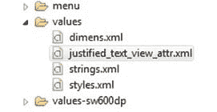

# Android 中的文本视图对齐

> 原文：<https://www.edureka.co/blog/textview-justification/>

Android 中的 **TextView** 是一个完整的 ***文本编辑器*** 帮助我们*向用户显示文本*。TextView 也可选地允许用户*编辑*文本*文本*，尽管基类被配置为不允许编辑。

**对齐**文字是指*从两边对齐*文字，即 ***左手边*** 和 ***右手边*** 。

## **Android 中 TextView 对齐步骤:**

**第一步**

创建一个 XML 文件，拖动*文本视图*并在其中保存一些文本。

```
</p>
<p>&lt;LinearLayout&nbsp;xmlns:android=&lt;i&gt;&quot;http://schemas.android.com/apk/res/android&quot;&lt;/i&gt;</p>
<p>xmlns:myapp=&lt;i&gt;&quot;http://schemas.android.com/apk/res/com.example.justifysampleapp&quot;&lt;/i&gt;</p>
<p>android:layout_width=&lt;i&gt;&quot;match_parent&quot;&lt;/i&gt;</p>
<p>android:layout_height=&lt;i&gt;&quot;match_parent&quot;&lt;/i&gt;</p>
<p>android:orientation=&lt;i&gt;&quot;vertical&quot;&lt;/i&gt;&gt;</p>
<p>&lt;LinearLayout</p>
<p>android:layout_width=&lt;i&gt;&quot;wrap_content&quot;&lt;/i&gt;</p>
<p>android:layout_height=&lt;i&gt;&quot;wrap_content&quot;&lt;/i&gt;</p>
<p>android:orientation=&lt;i&gt;&quot;vertical&quot;&lt;/i&gt;</p>
<p>&lt;TextView</p>
<p>android:layout_width=&lt;i&gt;&quot;wrap_content&quot;&lt;/i&gt;</p>
<p>android:layout_height=&lt;i&gt;&quot;wrap_content&quot;&lt;/i&gt;</p>
<p>android:gravity=&lt;i&gt;&quot;center&quot;&lt;/i&gt;</p>
<p>android:layout_marginTop=&lt;i&gt;&quot;10dp&quot;&lt;/i&gt;</p>
<p>android:background=&lt;i&gt;&quot;#ffb100&quot;&lt;/i&gt;</p>
<p>android:text=&lt;i&gt;&quot;The Google Directions API is a service that calculates directions between locations using an HTTP request. You can search for directions for several modes of transportation, include transit, driving, walking or cycling. Directions may specify origins, destinations and waypoints either as text strings or as latitude/longitude coordinates. The Directions API can return multi-part directions using a series of waypoints.&quot;&lt;/i&gt;/&gt;</p>
<p>&lt;/LinearLayout&gt;<br />

```

**第二步**

在主活动中定义 XML 以显示主屏幕。

```
<br />
&lt;b&gt;package&lt;/b&gt; com.example.textviewjustification;<br />
&lt;b&gt;import&lt;/b&gt; android.os.Bundle;<br />
&lt;b&gt;import&lt;/b&gt; android.app.Activity;<br />
&lt;b&gt;import&lt;/b&gt; android.view.Menu;<br />
&lt;b&gt;public class&lt;/b&gt; MainActivity &lt;b&gt;extends&lt;/b&gt; Activity<br />
{<br />
&lt;strong&gt;@Override&lt;/strong&gt;<br />
&lt;b&gt;protected void&lt;/b&gt; onCreate(Bundle savedInstanceState)<br />
{<br />
&lt;b&gt;super&lt;/b&gt;.onCreate(savedInstanceState);<br />
setContentView(R.layout.&lt;i&gt;main&lt;/i&gt;);<br />
}<br />
}<br />

```

**第三步**

在“值”文件夹中创建一个名为***justified _ text _ view _ attr . XML***的 *XML* 文件，用于对齐属性。它将包含以下几点:

*   文本
*   TextColor
*   背景颜色
*   文本大小



#### 

**第四步**

在 ***Main 中定义对齐的 XML 代码。XML*T3。**

```
<br />
&lt;RelativeLayout</p>
<p>android:layout_width=&lt;em&gt;&quot;match_parent&quot;&lt;/em&gt;</p>
<p>android:layout_height=&lt;i&gt;&quot;wrap_content&quot;&lt;/i&gt;&gt;</p>
<p>&lt;com.example.textviewjustification.Justification</p>
<p>android:id=&lt;i&gt;&quot;@+id/justifiedTextView1&quot;&lt;/i&gt;</p>
<p>android:layout_width=&lt;i&gt;&quot;wrap_content&quot;&lt;/i&gt;</p>
<p>android:layout_height=&lt;i&gt;&quot;wrap_content&quot;&lt;/i&gt;</p>
<p>android:layout_alignParentLeft=&lt;i&gt;&quot;true&quot;&lt;/i&gt;</p>
<p>android:layout_below=&lt;i&gt;&quot;@+id/justifiedTextView1&quot;&lt;/i&gt;</p>
<p>app:backgroundColor=&lt;i&gt;&quot;#ADD8E6&quot;&lt;/i&gt;</p>
<p>app:text=&lt;i&gt;&quot;The Google Directions API is a service that calculates directions between locations using an HTTP request. You can search for directions for several modes of transportation, include transit, driving, walking or cycling. Directions may specify origins, destinations and waypoints either as text strings or as latitude/longitude coordinates. The Directions API can return multi-part directions using a series of waypoints.&quot;&lt;/i&gt;/&gt;</p>
<p>&lt;com.example.textviewjustification.Justification</p>
<p>android:id=&lt;i&gt;&quot;@+id/justifiedTextView1&quot;&lt;/i&gt;</p>
<p>android:layout_width=&lt;i&gt;&quot;wrap_content&quot;&lt;/i&gt;</p>
<p>android:layout_height=&lt;i&gt;&quot;wrap_content&quot;&lt;/i&gt;</p>
<p>android:layout_alignParentLeft=&lt;i&gt;&quot;true&quot;&lt;/i&gt;</p>
<p>android:layout_alignParentTop=&lt;i&gt;&quot;true&quot;&lt;/i&gt;</p>
<p>android:layout_marginTop=&lt;i&gt;&quot;16dp&quot;&lt;/i&gt;</p>
<p>app:text=&lt;i&gt;&quot;Justified Text&quot;&lt;/i&gt;</p>
<p>app:textColor=&lt;i&gt;&quot;#1a0edb&quot;&lt;/i&gt;</p>
<p>app:textSize=&lt;i&gt;&quot;15&quot;&lt;/i&gt;/&gt;</p>
<p>&lt;View</p>
<p>android:layout_width=&lt;i&gt;&quot;fill_parent&quot;&lt;/i&gt;</p>
<p>android:layout_height=&lt;i&gt;&quot;2dp&quot;&lt;/i&gt;</p>
<p>android:layout_below=&lt;i&gt;&quot;@+id/justifiedTextView1&quot;&lt;/i&gt;</p>
<p>android:background=&lt;i&gt;&quot;#e00707&quot;&lt;/i&gt;/&gt;</p>
<p>&lt;/RelativeLayout&gt;</p>
<p>
```

**第五步**

创建另一个类，命名为-。

该类用于在 HTML 的帮助下实现对齐代码，以获取数据并在 TextView 中设置对齐格式。

```
<br />
&lt;b&gt;private&lt;/b&gt;&nbsp;String htmlcode =&nbsp;&quot;&lt;html&gt;&lt;body style='textalign:justify;color:rgba(%s);font-size:%dpx;margin: 10px 10px 10px 10px;'&gt;%s&lt;/body&gt;&lt;/html&gt;&quot;;</p>
<p>&lt;b&gt;private&lt;/b&gt;&nbsp;String justifytextview;</p>
<p>&lt;b&gt;private int&nbsp;&lt;/b&gt;justifycolortextview;</p>
<p>&lt;b&gt;private int&nbsp;&lt;/b&gt;justifycolorbackground;</p>
<p>&lt;b&gt;private int&nbsp;&lt;/b&gt;JustifytextSize;</p>
<p>&lt;b&gt;public&lt;/b&gt;&nbsp;Justification(Context context, AttributeSet attributes)</p>
<p>{</p>
<p>&lt;b&gt;super&lt;/b&gt;(context, attributes);</p>
<p>&lt;strong&gt;init&lt;/strong&gt;(attributes);</p>
<p>}</p>
<p>&lt;b&gt;public&lt;/b&gt;&nbsp;Justification(Context context, AttributeSet attributes,&nbsp;&lt;b&gt;int&lt;/b&gt;&nbsp;x) {</p>
<p>&lt;b&gt;super&lt;/b&gt;(context, attributes, x);</p>
<p>&lt;strong&gt;init&lt;/strong&gt;(attributes);</p>
<p>}</p>
<p>&lt;b&gt;private void&lt;/b&gt;&nbsp;init(AttributeSet attributes)</p>
<p>{</p>
<p>TypedArray array = getContext().obtainStyledAttributes(attributes, R.styleable.&lt;i&gt;JustifiedTextView&lt;/i&gt;);</p>
<p>justifytextview = array.getString(R.styleable.&lt;i&gt;JustifiedTextView_text&lt;/i&gt;);</p>
<p>&lt;b&gt;if&lt;/b&gt;&nbsp;(justifytextview&nbsp;==&nbsp;&lt;b&gt;null&lt;/b&gt;)</p>
<p>justifytextview =&nbsp;&quot;&quot;;</p>
<p>justifycolortextview = array.getColor(R.styleable.&lt;i&gt;JustifiedTextView_textColor&lt;/i&gt;,Color.&lt;i&gt;BLACK&lt;/i&gt;);</p>
<p>justifycolorbackground = array.getColor(R.styleable.&lt;i&gt;JustifiedTextView_backgroundColor&lt;/i&gt;,Color.&lt;i&gt;TRANSPARENT&lt;/i&gt;);</p>
<p>JustifytextSize = array.getInt(R.styleable.&lt;i&gt;JustifiedTextView_textSize&lt;/i&gt;, 14);</p>
<p>array.recycle();</p>
<p>&lt;b&gt;this&lt;/b&gt;.setWebChromeClient(&lt;b&gt;new&lt;/b&gt;&nbsp;WebChromeClient()</p>
<p>{</p>
<p>});</p>
<p>reloadData();</p>
<p>}</p>
<p>&lt;b&gt;public void&lt;/b&gt;&nbsp;setText(&lt;strong&gt;String&lt;/strong&gt;&nbsp;s)</p>
<p>{</p>
<p>&lt;b&gt;if&lt;/b&gt;&nbsp;(s ==&nbsp;&lt;b&gt;null&lt;/b&gt;)</p>
<p>&lt;b&gt;this&lt;/b&gt;.justifytextview =&nbsp;&quot;&quot;;</p>
<p>&lt;b&gt;else&lt;/b&gt;</p>
<p>&lt;b&gt;this&lt;/b&gt;.justifytextview = s;</p>
<p>reloadData();</p>
<p>}</p>
<p>&lt;strong&gt;@SuppressLint&lt;/strong&gt;(&quot;NewApi&quot;)</p>
<p>&lt;b&gt;private void&lt;/b&gt;&nbsp;reloadData()</p>
<p>{</p>
<p>&lt;b&gt;if&lt;/b&gt;&nbsp;(justifytextview&nbsp;!=&nbsp;&lt;b&gt;null&lt;/b&gt;)</p>
<p>{</p>
<p>&lt;strong&gt;String&lt;/strong&gt;&nbsp;data = String.&lt;i&gt;format&lt;/i&gt;(htmlcode, toRgba(justifycolortextview),&nbsp;JustifytextSize,&nbsp;justifytextview);</p>
<p>Log.&lt;i&gt;d&lt;/i&gt;(&quot;test&quot;, data);</p>
<p>&lt;b&gt;this&lt;/b&gt;.loadDataWithBaseURL(&lt;b&gt;null&lt;/b&gt;, data,&nbsp;&quot;text/html&quot;,&nbsp;&quot;utf-8&quot;,&nbsp;&lt;b&gt;null&lt;/b&gt;);</p>
<p>}</p>
<p>// set WebView's background color *after* data was loaded.</p>
<p>&lt;b&gt;super&lt;/b&gt;.setBackgroundColor(justifycolorbackground);</p>
<p>// Hardware rendering breaks background color to work as expected.</p>
<p>&lt;b&gt;if&lt;/b&gt;&nbsp;(android.os.Build.VERSION.&lt;i&gt;SDK_INT&lt;/i&gt;&gt;= 11)</p>
<p>&lt;b&gt;this&lt;/b&gt;.setLayerType(WebView.&lt;i&gt;LAYER_TYPE_SOFTWARE&lt;/i&gt;,&nbsp;&lt;b&gt;null&lt;/b&gt;);</p>
<p>}</p>
<p>&lt;b&gt;public void&lt;/b&gt;&nbsp;setTextColor(&lt;b&gt;int&lt;/b&gt;&nbsp;valuehex)</p>
<p>{</p>
<p>justifycolortextview&nbsp;= valuehex;</p>
<p>reloadData();</p>
<p>}</p>
<p>&lt;b&gt;public void&lt;/b&gt;&nbsp;setBackgroundColor(&lt;b&gt;int&lt;/b&gt;&nbsp;valuehex)</p>
<p>{</p>
<p>justifycolorbackground&nbsp;= valuehex;</p>
<p>reloadData();</p>
<p>}</p>
<p>&lt;b&gt;public void&lt;/b&gt;&nbsp;setTextSize(&lt;b&gt;int&lt;/b&gt;&nbsp;textSize)</p>
<p>{</p>
<p>&lt;b&gt;this&lt;/b&gt;.JustifytextSize&nbsp;= textSize;</p>
<p>reloadData();</p>
<p>}</p>
<p>&lt;b&gt;private&lt;/b&gt;&lt;strong&gt;&nbsp;String&lt;/strong&gt;&nbsp;toRgba(&lt;b&gt;int&lt;/b&gt;&nbsp;values)</p>
<p>{</p>
<p>&lt;strong&gt;String&lt;/strong&gt;&nbsp;get = Integer.&lt;i&gt;toHexString&lt;/i&gt;(values);</p>
<p>&lt;b&gt;int&lt;/b&gt;&nbsp;M = Integer.&lt;i&gt;parseInt&lt;/i&gt;(get.substring(0, 2), 16);</p>
<p>&lt;b&gt;int&lt;/b&gt;&nbsp;N = Integer.&lt;i&gt;parseInt&lt;/i&gt;(get.substring(2, 4), 16);</p>
<p>&lt;b&gt;int&lt;/b&gt;&nbsp;O = Integer.&lt;i&gt;parseInt&lt;/i&gt;(get.substring(4, 6), 16);</p>
<p>&lt;b&gt;int&lt;/b&gt;&nbsp;P = Integer.&lt;i&gt;parseInt&lt;/i&gt;(get.substring(6, 8), 16);</p>
<p>&lt;b&gt;return&lt;/b&gt;&nbsp;String.&lt;i&gt;&nbsp;format&lt;/i&gt;(&quot;%d,%d,%d,%d&quot;, M, N, O, P);</p>
<p>}</p>
<p>}</p>
<p>
```

有问题要问我们吗？在评论区提到它们，我们会给你回复。

**相关帖子:**

[Android SDK 安装](https://www.edureka.co/blog/android-sdk-installation/)

[开始你的安卓开发历程](https://www.edureka.co/android-development-certification-course)