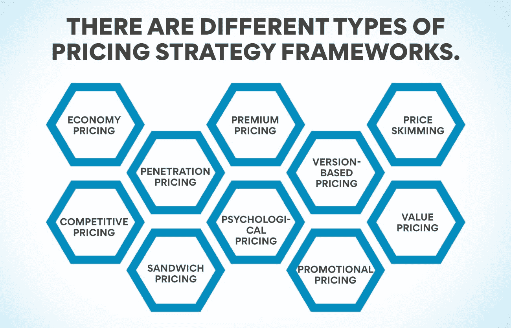
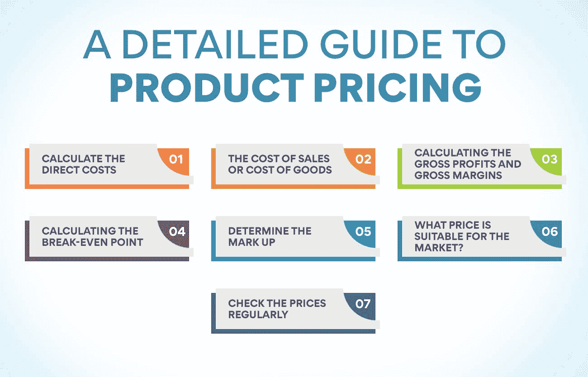

# 产品定价和成本理论:含义、原理和框架

> 原文：<https://www.edureka.co/blog/theory-of-product-pricing/>

也许市场营销最重要的“P”是对顾客和销售者的价格。给[产品](https://www.edureka.co/blog/product)正确定价为公司赚取利润。顾客也关心他们购买的物品的价格。没有人不询问价格就买东西，包括销售产品的公司。他们也非常关心他们购买的原材料的价格。如果它如此重要，公司必须花很多心思。让我们来理解指导公司为其产品定价的产品定价理论。

产品管理高级管理人员证书课程广泛涉及这一主题，以及公司必须如何为其产品定价以实现最大销售额和利润。如果你想获得有关本课程的信息，请访问我们的网站。

**产品定价理论**

公司如何给产品定价？这肯定有一个公式。这个公式是基于[产品定价](https://www.edureka.co/blog/product-line-pricing/)、的理论，即产品或服务的价格取决于当时的供求关系。大家都知道，当需求大于供给时，价格就会上涨，当情况相反时，价格就会下跌。据说，当顾客可以消费市场上所有的产品时，产品就达到了最优价格。

在当今世界大部分地区普遍存在的自由市场经济中，消费者希望以尽可能低的价格购买一件商品，而卖家则希望获得更高的价格。产品定价理论根据市场条件为变化做准备。供应和需求都可能由于各种原因而波动，有时超出了生产者和购买者的控制。当任一价格过高或过低时，市场力量就会对其产生作用，从而达到一种平衡状态。

**什么是定价框架？**

为一家公司生产的产品定价需要考虑几个方面。一个成功的定价框架允许公司实现收入增长和盈利。当根据产品定价理论正确制定定价策略时，可以肯定产品将满足消费者需求，击败竞争对手并获得利润。有必要了解各种定价框架，以及一个组织必须如何创建正确的产品定价框架。

定价框架是企业用来为其产品或服务定价的模型。一个适合公司的好框架可以帮助促进销售，赚取更多利润，满足消费者不断变化的需求。组织在定价框架中考虑各种因素，以确保他们的定价对顾客有吸引力，并促使他们购买该商品。该公司考虑各种因素，如竞争对手的价格、产品的感知价值、市场需求和公司的总体目标。有不同类型的定价策略框架。

**经济定价**—根据产品定价理论，这种模式侧重于低销售价格和低制造和分销成本。

**溢价定价**——制造和分销奢侈品的公司大多采用这种模式。溢价定价框架用于产品的感知价值。

价格撇取——这是一种允许公司以高价推出产品，但随后随着竞争对手进入市场而降低价格的框架。

**渗透定价**–在这种模式中，公司以低价进入市场，这将有助于他们进入新的市场或新的客户群。随着时间的推移，这些公司将提高产品的价格，以反映更好的质量和价值。

**基于版本的定价**–这是一种定价框架，公司以不同的价格提供各种产品版本，通常具有不同的功能。这有助于他们迎合不同经济背景的顾客。

**竞争性定价**–这种定价方法常见于服务行业，在这种行业中，公司为其服务定价，以匹配竞争对手的服务，并提供一定会击败竞争对手的质量。

**心理定价**——根据产品定价理论，这种方法通过将产品定价在购买者认为过高的价格以下来帮助吸引客户的注意力。

**价值定价**——这些公司了解买家愿意为特定产品或服务支付的价格。他们生产符合消费者价值标准的产品。

**三明治定价**——在这种定价模式中，公司为类似的产品设定低、中、高价格，以吸引顾客购买中档产品。

**促销价格**——这种价格只提供一次或在特定时期内提供，以吸引顾客购买产品。它是以折扣、减价或限时优惠的形式出现的。

**也可理解为: [11 个关键产品管理指标和 KPI](https://www.edureka.co/blog/product-management-metrics)**

客户如何看待你的价格？

对产品定价来说，不仅仅是生产商的角度很重要。公司必须考虑购买者会如何看待产品的价格。要知道这一点，把客户分成不同的类型就好了。

完美主义者——这些人寻求他们购买的东西的长期价值。他们在购买商品时可能会花更多的钱，但他们的目标是从产品中获得最大价值。他们对如何看待定价非常理性。

注重形象的买家——这些人购买价格较高的产品，仅仅因为它们贵。他们想通过购买一些独一无二的东西来使自己与众不同。

享乐主义者——他们购买物品是为了娱乐。他们购买商品只是因为他们买得起或者因为他们想买。他们不是想炫耀。

节俭的买家——这些是享乐主义者的对立面。他们购买价格最低的产品，即使这并没有给他们带来多少价值。

新奇购买者——他们会购买任何能提供新体验的东西。他们不介意为此多付钱。他们不想炫耀，但也不介意支付高价，即使产品从长远来看不会给他们带来价值。

冲动型购物者——顾名思义，他们在购买一件商品之前不会思考。他们被价格在卢比左右的产品所吸引。99/-.公司竭尽全力确保他们的定价策略不会让冲动购物者改变主意。

困惑的买家——他们被做出购买决定的想法淹没了。他们可能会为一个知名品牌支付更多的价格，因为这给了他们熟悉的舒适感。他们不会理性地思考这些钱的价值。

忠诚的顾客——这些顾客不断购买相同的产品，因为这给他们带来熟悉的舒适感。与困惑的买家不同，这些人不会逃避做出决定。他们以理性的态度考虑价格。

一个有抱负的产品经理可以在[产品经理](https://www.edureka.co/blog/product-management/)的高级经理证书课程中学到很多关于不同类型买家的知识。你可以从我们的网站上了解更多关于该课程的信息。既然我们已经了解了不同的定价模式和客户类型，现在还不是了解逐步定价流程的时候。

**产品定价的详细指南**

1.  **计算直接成本**

这是一个简单的步骤，因为所有的数字对你都是可见的。直接成本包括原材料成本、税收和其他法定费用、运输费用以及制造货物的劳动力成本。

2.  **销售成本或商品成本**

根据 **的产品定价理论** ，商品或销售的成本代表了准备出售的物品的成本。对于零售商或制造商而言，商品成本将包括直接成本和其他费用，如制造商品和交付给客户所产生的劳动力成本、运费和工厂管理费用。另一个要包括的组成部分是摊销费用或更普遍地称为折旧。这涉及到设备和设施的成本。

对于分销商或批发商，这将包括直接成本加上运输、储存、设备、供应和劳动力成本。摊销费用也必须包括在销售成本中。在这种情况下，直接成本意味着批发商从制造商那里购买商品的成本。

3.  **计算毛利和毛利率**

在计算毛利和毛利率时，商品或销售成本非常重要。毛利是通过从销售产品的收入中减去商品或销售的成本而得到的。这个数额是你的收入中剩下的营销、销售和管理费用。你的利润也来源于这个数额。毛利是毛利的百分比表示。

毛利=总收入-商品或销售成本

毛利率=毛利/总收入 X 100

4.  **计算盈亏平衡点**

大多数商人都知道制造或采购产品的主要成本。但它们不包括侵蚀利润的管理费用。这些管理费用包括企业经营和进入市场所产生的固定成本。这些不会随着产量或销量而改变。在产品定价理论中，这些被称为固定成本。在计算盈亏平衡点时，这些成本必须包括在内，盈亏平衡点是公司在不赚取任何利润的情况下，为照顾所有直接和间接成本而必须赚取的收入。 间接固定成本包括:

*   支付给员工的工资和福利
*   营销和广告费用
*   租金和维护费
*   办公设备折旧
*   保险和专业费用

5.  **确定加价**

提价通常是指商品或销售成本的百分比。它以这样一种方式固定，即公司赚取毛利，使其能够支付间接固定成本并赚取利润。一旦企业知道了商品的成本和盈亏平衡点，就很容易确定一个加价。在设定加价之前，公司必须对他们将要销售的产品数量有一个相当好的概念，并得出每单位的平均成本。

**也可阅读:[产品管理学习-重点领域](https://www.edureka.co/blog/product-management-learning)**

6.  **什么价位适合市场？**

一家企业不能仅仅通过计算来确定价格。他们必须考虑一个非常重要的因素。市场会接受这个价格吗？如果竞争对手以较低的价格销售，而你为了赚取更多的利润而设定了较高的价格，你可能会卖出较少的数量。一家公司可以决定以更高的价格卖出更少的数量，并使其成为优质产品。另一方面，它可以以更低的价格卖出更多的号码。这种定位必须由公司作为一项政策来决定。

产品定价理论认为，竞争性定价对公司如何给产品定价有着巨大的影响。公司必须了解竞争对手的一切，以及他们的要价。这将让你知道，你是否可以收取更高的价格，但仍能卖出足够的数量来赚取利润。如果能提供一些额外的功能，公司可以比竞争对手收取更高的费用。

8.  **定期查看价格**

公司必须定期检查价格。市场不断变化。商品和其他组成部分的价格也随着时间而变化。组织必须看到他们是否仍在赚取他们想要的利润。对于公司来说，看看他们是否还能通过降低价格和销售更多的数量来获得丰厚的利润也是有好处的。

您可以通过报名参加由知名机构提供的[产品管理高级执行官证书课程](https://www.edureka.co/highered/advanced-executive-program-in-product-management-iitg)来了解整个定价过程。关于这个项目的更多细节可以在我们的网站上找到。

**结论**

定价是任何产品的一个非常重要的方面。除非公司可以通过销售产品来获利，否则它们不会从任何方面受益。他们必须给产品正确定价，以确保企业从中获利。理解定价过程和影响定价的因素对[产品经理](https://www.edureka.co/blog/product-manager)来说非常重要，因为他们负责产品的性能。定价也是增强客户体验和让他们相信他们的钱花得值的一个关键因素。

**更多信息:**

[每个 PM 都必须知道的产品管理框架](https://www.edureka.co/blog/product-management-frameworks)

[品牌管理 v/s 产品管理:了解关键差异](https://www.edureka.co/blog/brand-and-product-management/)

[创建成功上市战略的步骤](https://www.edureka.co/blog/go-to-market-strategy/)

[制定优秀产品战略的指南](https://www.edureka.co/blog/product-strategy/)