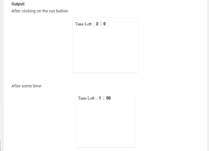
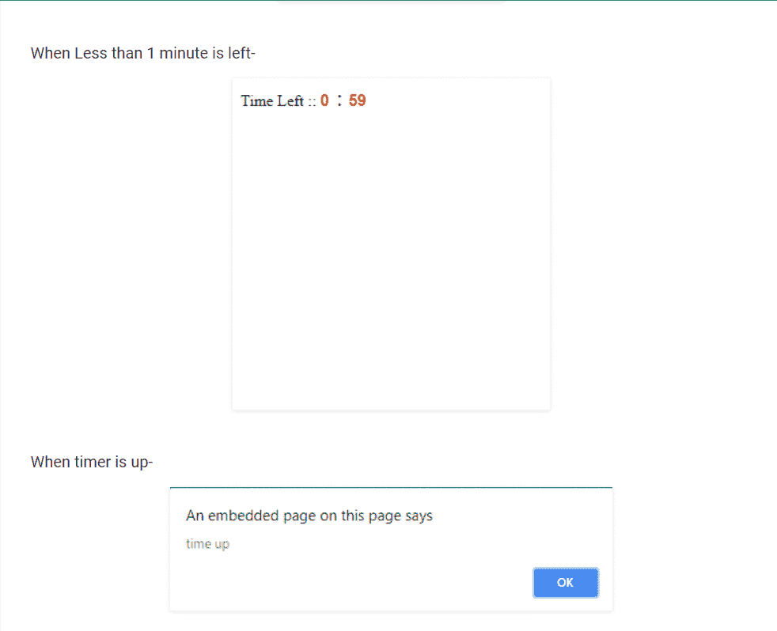

# 关于 JavaScript 中的计时器，您只需要知道

> 原文：<https://www.edureka.co/blog/timer-in-javascript/>

定时器是任何编程语言的一个重要方面。众所周知，时间就是金钱。因此，在本文中，我们将看到如何用 JavaScript 实现和使用计时器:

*   [在 JavaScript 中使用计时器](#working)
*   [Window setTimeout()方法](#window)
*   [代码:JavaScript 中的计时器](#code)

## **在 JavaScript 中使用计时器**

定时器是一种功能，它使我们能够在特定的时间执行某项功能。 使用定时器你可以延迟代码的执行，这样它就不会在事件被触发或者页面被加载的时候完成。例如，您可以使用计时器定期更改网站上的广告横幅，或者显示实时时钟等。

JavaScript 中有一个定时器函数: `setTimeout()`

下一节将向您展示如何创建定时器来延迟代码的执行，以及如何使用 JavaScript 中的 theis 函数重复执行一个或多个动作。

## **Window setTimeout()方法**

**定义和用法:**

setTimeout()方法在指定的毫秒数后调用函数或计算表达式。

**提示:**

*   1000 毫秒= 1 秒。
*   该功能只执行一次。如果需要重复执行，使用`setInterval()`方法。
*   使用`clearTimeout()`方法阻止功能运行。

该函数接受两个参数:一个 *函数* ，它是要执行的函数；一个可选的 *延迟* 参数，它是表示在执行函数之前等待的时间的毫秒数(1 秒= 1000 毫秒)。

**返回值:** 返回一个数字，代表所设置的定时器的 ID 值。

## **代码:JavaScript 中的计时器**

这里是 JavaScript 中定时器的代码，设置 2 分钟的定时器，当时间到了，页面警告“时间到了”。`setTimeout()`方法在指定的毫秒数后调用一个函数或计算一个表达式。

`<html> `

`<head> `

` `

`</head> `

`<!-- onload function is evoke when page is load --> `

`<!--countdown function is called when page is loaded --> `

`<body onload="countdown();"> `

`
 `

`Time Left :: `

`<input id="minutes" type="text" style="width: 10px; `

`border: none; font-size: 16px; `

`font-weight: bold; color: black;"> : `

` `

`<input id="seconds" type="text" style="width: 20px; `

`border: none; font-size: 16px; `

`font-weight: bold; color: black;"> `

`
 `

`</body> `

`</html> `

当剩余时间不到一分钟时，计时器颜色变为红色。

至此，JavaScript 文章中的计时器到此结束。C *查看 Edureka 提供的 [**角认证培训**](https://www.edureka.co/angular-training)* *，edu reka 是一家值得信赖的在线学习公司，在全球拥有超过 25 万名满意的学习者。*

*有问题吗？请在 AngularJs 的依赖注入的评论部分提到它，我们会回复您。*