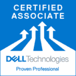
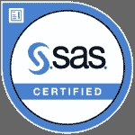
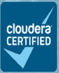
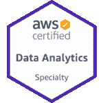
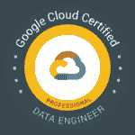
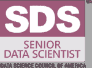

# 2023 年十大数据科学认证

> 原文：<https://www.edureka.co/blog/top-10-data-science-certifications-in-2021/>

财富 500 强企业越来越依赖于数据，并渴望聘用能够理解企业收集的信息的数据专业人士。[数据科学培训](https://www.edureka.co/masters-program/data-scientist-certification)是获得优势的一个很好的方式，因为它们允许你验证你的技能，这样招聘人员就知道如果他们雇用你，他们会得到什么。以下博客旨在让您快速了解 2023 年十大数据科学认证**！**

我们将在本博客的课程中讨论以下数据科学认证:

## 【2023 年十大数据科学认证

*   **[【CAP】](#cap)**
*   戴尔 EMC 数据科学跟踪(EMCDS)
*   **[SAS 认证数据科学家](#sas)**
*   **[微软认证:Azure 数据科学家助理](#azure)**
*   **[Cloudera 认证助理(CCA)数据分析师](#cca-da)**
*   **[Cloudera 认证专家(CCP)数据工程师](#ccp-da)**
*   **[亚马逊 AWS 数据分析认证](#aws)**
*   **[谷歌专业数据工程师认证](#google-de)**
*   **[美国数据科学委员会(DASCA)高级数据科学家(SDS)](#sds)**
*   **[【开放认证数据科学家(Open CDS)](#cds)**

如果你是一个视觉学习者，你也可以参考我们关于 2023 年 十大数据科学认证 ***的视频演示！***

## **2023 年十大数据科学认证| Edureka**

[https://www.youtube.com/embed/aMoI33I0q00](https://www.youtube.com/embed/aMoI33I0q00)

这个 edu reka 2023 年十大数据科学认证视频将首先给出选择认证计划的提示。然后，我们将讨论 2023 年十大数据科学认证

所以，事不宜迟，让我们开始列出 2023 年十大数据科学认证。

## **1。CAP-认证分析专家(CAP )**

首先是认证分析专家认证考试。 [CAP](https://www.certifiedanalytics.org/) 是面向分析从业者的顶级全球专业认证。如果你达到了 CAP 的高标准，并通过了严格的考试，你将会享受到一种待遇，因为你将会打开有利可图的职业机会之门。这个认证是专门为处于职业生涯早期到中期的分析专家设计的。

### **要求**

作为申请人，您需要满足一些要求:

*   具有 5 年专业分析经验的学士学位或具有 3 年经验的硕士学位
*   签署道德准则

### **技能**

| 话题领域 |
| 业务问题框架 |
| 分析问题框架 |
| 数据 |
| 方法选择 |
| 模型建立 |
| 部署 |
| 生命周期管理 |

### **好处**

获得该认证有几个好处，即:

*   展示可信度
*   强化技能集 s
*   向新机遇敞开大门

**了解我们在顶级城市开设的数据科学与 Python 课程**

| 印度 | 美国 | 其他热门城市 |
| [海得拉巴的数据科学与 Python 培训](https://www.edureka.co/data-science-python-certification-course-hyderabad) | [达拉斯的数据科学与 Python 课程](https://www.edureka.co/data-science-python-certification-course-dallas) | [德里的数据科学与 Python 课程](https://www.edureka.co/data-science-python-certification-course-delhi) |
| [班加罗尔的数据科学与 Python 培训](https://www.edureka.co/data-science-python-certification-course-bangalore) | [夏洛特的 Python 数据科学](https://www.edureka.co/data-science-python-certification-course-charlotte) | [孟买的数据科学与 Python 课程](https://www.edureka.co/data-science-python-certification-course-mumbai) |
| [钦奈的数据科学与 Python 培训](https://www.edureka.co/data-science-python-certification-course-chennai) | [纽约的数据科学与 Python 课程](https://www.edureka.co/data-science-python-certification-course-new-york-city) | [用 Python 进行数据科学西雅图](https://www.edureka.co/data-science-python-certification-course-seattle) |

## **2。戴尔 EMC 认证专家认证计划**

戴尔 EMC 数据科学家助理(EMCDSA)是一项基础认证，让您了解大数据和数据分析基础知识。一旦你通过了数据科学家认证，你就被认为是“认证专家”。现在，经理和招聘人员很清楚，作为一名数据科学家，你拥有他们想要的必要技能。

### **要求**

该认证考试的一些要求如下:

*   计算机科学、信息技术、电信、电子&电气或任何其他相关领域的学士学位
*   通过以下助理级别考试: DEA-7TT2 助理-数据科学和大数据分析 v2 考试

### **技能**

| 话题领域 |
| 数据分析 |
| 用 R 分析和探索数据 |
| 建模和评估统计 |
| 高级分析和统计建模的理论和方法 |
| 用于高级分析的技术和工具 |
| 运营分析项目 |
| 数据可视化技术 |

### **好处**

戴尔 EMC 数据科学助理认证考试具有很高的市场价值，因为它提供了以下优势:

*   专注于可应用于所有 IT 环境的技术
*   基于角色的培训
*   学习关注新兴业务的新 IT 技术

让我们继续 2022 年十大数据科学认证中的下一个认证。

## **3。SAS 认证数据科学家**

SAS 认证数据科学家认证专为能够处理大数据并从中获得洞察力的个人而设计。现在，通过各种 SAS 和开源工具，您可以使用复杂的机器学习模型提出业务建议，然后使用灵活的 SAS 环境部署模型。

### **要求**

以下给出的要求不是强制性的，但从考试的角度来看非常重要:

*   具有 SAS 编程基础和数据操作技术的经验
*   SQL 处理经验
*   至少 6 个月的数学和统计学经验

### **技能**

因此，该认证与其他认证非常不同，因为 SAS 数据科学学院包括三个项目，即:

*   数据监管
*   高级分析和
*   AI 和 ML

| 话题领域 |
| 大数据(BD)准备、统计和可视化探索 |
| BD 编程和加载 |
| BD 编程和加载 |
| 使用 SAS Viya 的机器学习 |
| 自然语言和计算机视觉 |
| 预测和优化 |
| 模式检测 |

**好处**

人们可以从该认证中获得一些好处，其中包括:

*   学习使用 SAS、R、Python、Pig、Hive 和 Hadoop
*   动手学习
*   全球认可的证书
*   综合训练
*   真实案例研究

## **4。微软认证:Azure 数据科学家助理**

名单上的下一个是 Azure 数据科学家助理微软认证。在这里，Azure 数据科学家应用他们的数据科学和机器学习知识，在 Azure 云平台上实现和运行机器学习工作负载。这里，你特别使用 Azure 机器学习服务栈。你可以通过班加罗尔 的 [数据工程认证更好的了解。](https://www.edureka.co/microsoft-azure-data-engineering-certification-course-bangalore)

### **要求**

除了通过 DP-100:在 Azure 考试上设计和实施数据科学解决方案之外，没有特定的先决条件来获得该认证。

### **技能**

| 话题领域 |
| 建立 Azure 机器学习工作区 |
| 运行实验和训练模型 |
| 优化和管理模型 |
| 部署和消费模型 |

### **好处**

作为助理级认证，获得 Azure 数据科学家助理证书虽然具有挑战性，但会为您赢得认可，证明您是该领域的主题专家。

现在，让我们来看看 2022 年十大数据科学认证名单中的下 5 个认证，

## **5。Cloudera 认证助理(CCA)数据分析师**

数据分析师认证表明您可以在 Cloudera 的 CDH 环境中准备、构建和分析数据。您将能够从 MySQL 向 Hadoop 导入数据，创建和修改表，并使用 select 和 join 查询生成报告。

### **要求**

CCA 数据分析师的候选人可以是 SQL 开发人员、数据分析师、商业智能专家、开发人员、系统架构师和数据库管理员。没有先决条件。

### **技能**

| 话题领域 |
| 为数据提供结构 |
| 数据分析 |

### **好处**

对精通数据分析领域的专业人员的需求日益增加，这使得这一认证更加可取。该考试提供了以下好处-

*   提高就业能力
*   承诺事业成长
*   更高的薪水

我们在这个名单上还有另一个 Cloudera 认证！请继续阅读本博客的下一部分，了解详情。

## **6。Cloudera 认证专家(CCP)数据工程师**

CCP 数据工程师证明您可以“开发可靠、自主、可扩展的数据管道，为各种工作负载优化数据集。” 换句话说，你可以这么说:CCP 数据工程师展示了你可以将数据整理成一个干净、有用的形状，供不同的人用于不同的目的。

### **要求**

CCP 数据工程师的候选人应具有开发数据工程解决方案的丰富经验，并高度掌握上述技能。没有其他先决条件。

### **技能**

| 话题领域 |
| 数据接收 |
| 数据转换 |
| 存储 |
| 数据分析和工作流程 |

### **好处**

CCP 项目让你在严格的现场实践环境中展示你的技能。为了帮助您提升技能，每位 CCP:数据工程师将获得:

*   certification.cloudera.com 上的一个独特的个人资料网址，向你的雇主或潜在雇主宣传你的技能和成就，并整合到 LinkedIn
*   用于名片、简历和在线档案的 CCP 标志

## **7。亚马逊 AWS 数据分析认证**

AWS 认证数据分析专业(DAS-C01)考试面向从事数据分析工作的人员。该考试旨在验证考生对使用 AWS 服务来设计、构建、保护和维护分析解决方案的全面理解，这些解决方案可提供来自数据的洞察力。

### **要求**

该认证考试的一些要求如下:

*   至少 5 年的常用数据分析技术经验
*   至少 2 年 AWS 实际操作经验
*   与 AWS 服务合作设计、构建、保护和维护分析解决方案的经验和专业知识

### **技能**

在这里，您将接受 5 个不同领域的测试，每个领域占您总得分的百分比。

| 话题领域 |
| 收藏 |
| 存储&数据管理 |
| 处理 |
| 分析和可视化 |
| 安全 |

### **好处**

通过该认证，您可以获得多种优势，其中包括:

*   技能验证
*   AWS 高薪
*   数字徽章
*   全球招聘
*   特殊事件

## **8。谷歌专业数据工程师认证**

通过谷歌云数据工程认证，你可以向世界展示你是使用谷歌云构建数据驱动解决方案的专家。随着公司收集大量数据，对能够在云中构建数据解决方案的熟练专业人员的需求也在增加。而且没有比手里拿着证书更好的证明自己有技能的方法了。

### **要求**

为了充分利用本课程，学员应具备以下基本能力:

*   结构化查询语言
*   计算机编程语言
*   数据建模
*   机器学习/统计

虽然不是强制性的，但要求您对这些概念有一些基本的了解。

### **技能**

| 话题领域 |
| 设计数据处理系统 |
| 建立并运行数据处理系统 |
| 操作化机器学习模型 |
| 确保解决方案质量 |

接下来，让我们来看看这项认证的一些好处。

### **好处**

获得谷歌数据工程师认证并不难，但会对你在 IT 行业的职业生涯和工作产生有意义的影响。这是一个对雇员和雇主都有利的良好记录，包括:

*   增强知识
*   你持续学习的证明
*   全球认可
*   更好的机会

就这样，让我们来看看博客中的下一个认证。

**9。美国数据科学委员会(DASCA)高级数据科学家(SDS)**

美国数据科学委员会(DASCA)的 SDS 加速了您成为数据科学家的旅程。SDS 是世界上最强大的第三方、供应商中立的认证，面向现在正在寻找更具挑战性、影响更大的数据科学家和数据架构师角色的数据科学和分析专业人士。

继续本博客的下一部分，我们将看到你获得该认证的各种标准。

### **要求**

如果你是一名经验丰富的活动家，在领先的大数据分析或科学职能部门工作了 5 年以上，你就适合获得数据科学家证书。您需要至少拥有信息技术/计算机科学的本科/学士学位，或商业/管理/统计/经济/数学的本科/学士学位，或计算机编程/软件工程的文凭，或认证机构的商业/管理文凭。  从 [数据工程课程](https://www.edureka.co/microsoft-azure-data-engineering-certification-course) 中了解大数据及其应用。

现在，我们将了解您通过此次认证考试所需的技能。

### **技能**

| 话题领域 |
| 统计分析工具、技术和方法的高级知识 |
| 接触不同的大型 SDS&分析语言和平台，如 SPSS/SAS |
| 暴露于辐射 |
| 定量方法 |
| RDMS 和哎呀的基本原理 |

**好处**

这是该计划的各种好处，其中一些是:

*   涵盖官方 DASCA 准备套件、丰富的课程、轻松的注册、更新和升级流程
*   它将帮助你思考高级顾问或产品管理需要什么
*   你可以巩固数据立方体、多维数据库和大数据框架的知识能力

## 10。开放认证数据科学家(开放 CDS)

开放集团认证数据科学家(Open CDS)认证是根据 IT 部门的要求开发的，旨在验证数据科学家专业人员是否具备有效分析数据的素质和能力，从而实现业务的整体改善。

现在，让我们检查一下需求。

### **要求**

认证是由相关领域公认的行业专家通过基于经验的档案评估授予的，因此不需要考试。

### **技能**

开放式 CDS 认证要求申请人通过书面申请和同行面试，根据一系列合规要求展示技能和经验。不需要参加培训课程，也不需要完成笔试。

| 话题领域 |
| 制作分析模型的技能和经验 |
| 技能和经验，包括数据科学广度 |
| 有纪律的、方法驱动的执行 |
| 全生命周期体验 |
| 领导力 |
| 强大的个人和专业技能 |

该认证对个人和整个组织都有好处！

### **好处**

对个人而言，福利如下:

*   提高和证明专业技能
*   改善奖励任务的前景
*   加快薪资和职业发展
*   导致更高的同行认可度

对组织而言，它有助于:

*   优化员工招聘和保留流程
*   激励员工获得这一广泛认可的开放行业标准，以证明他们的技能和经验

以上就是 2022 年 ***十大数据科学认证*** 的全部内容。希望这篇文章对你有用。对 Python 编程专业人士的数据科学的需求急剧增加，这使得该课程非常适合各种专业水平的人。[Python 数据科学课程](https://www.edureka.co/data-science-python-certification-course)非常适合希望与 Python、软件和 IT 专业人员一起工作的分析专业人员，以及对分析领域感兴趣的人和对数据科学有热情的人。

还有，如果你正在寻找数据科学的在线结构化培训，edureka！拥有专门策划的[数据科学课程](https://www.edureka.co/executive-programs/advanced-program-data-science-course-iitg)，帮助您获得统计学、数据争论、探索性数据分析和机器学习算法(如 K 均值聚类、决策树、随机森林、朴素贝叶斯)方面的专业知识。您将学习时间序列、文本挖掘的概念，以及深度学习的介绍。本课程的新批次即将开始！！

*有问题吗？请在这篇文章的评论部分提到它，我们会尽快回复你。*

*要深入了解任何 DevOps、[大数据](https://www.edureka.co/big-data-hadoop-training-certification)、[网络安全](https://www.edureka.co/comptia-security-plus-certification-training)和其他趋势技术，您可以注册我们的**实时在线认证培训计划**，该计划提供 24/7 全天候支持和终身访问课程材料。*