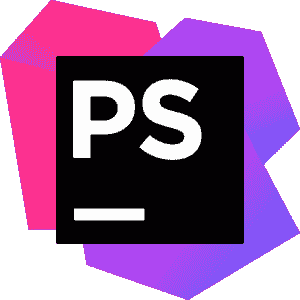
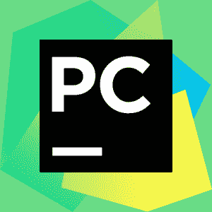

# 了解 Web 开发的 10 大 ide

> 原文：<https://www.edureka.co/blog/top-10-ides-for-web-development/>

集成开发环境(ide)是编码时极其重要的工具。在今天的市场上，您会发现大量的 ide 服务于不同的目的。因此，选择一个 IDE 来满足您的所有需求是非常令人困惑的。因此，如果你是一个 [Web 开发](https://www.edureka.co/blog/web-development-tutorial/)的爱好者，这里有一篇文章将带给你 Web 开发的 10 大 ide。

## **Web 开发的十大 IDEs】**

1.  [Visual Studio 代码](#vsc)
2.  [PHP storm](#ps)
3.  [Atom](#atom)
4.  [皮查姆](#pc)
5.  [NetBeans](#nb)
6.  [网络风暴](#ws)
7.  [SublimeText](#st)
8.  [括号](#br)
9.  [IntelliJ IDEA](#ij)
10.  [RJ 发来](#rjt')

### **Visual Studio 代码**

Visual Studio Code 是由微软开发的源代码编辑器。VS 代码受麻省理工学院许可，并在 2019 年被 Stack Overflow 评为最受欢迎的开发者环境工具。

**特性**

*   提供了内置的 ***命令行界面或者 CLI***
*   启用 ***[Git](https://www.edureka.co/blog/web-development-tutorial/) 集成*** ，允许添加、拉取或推送对远程 Git 库的更改
*   拥有丰富的 ***API*** 用于有效调试
*   VS Code 有一个叫做 ***LiveShare*** 的功能，允许用户分享他们的 VS Code 实例
*   您可以在同一个项目内打开
*   有一个 ***综合端子***
*   使用 ***插件*** 也可以增强功能

### **PhpStorm**

PHPstrom 是 JetBrains 为 [PHP](https://www.edureka.co/blog/php-tutorial-for-beginners/) 开发的跨平台 IDE。它在商业专有软件的许可下使用 [Java](https://www.edureka.co/blog/java-tutorial/) 编写。

**特性**

*   提供一个智能 PHP 代码编辑器，执行 ***代码完成、语法高亮、错误检查*** 等
*   ***代码接收*** 出现，验证您的代码以及您如何键入
*   允许您通过您的代码轻松导航
*   支持 ***零配置调试*** 让调试你的程序 变得非常容易
*   ***PHPUnit******测试*** 可以从目录、文件或类中立即开发和执行
*   支持所有的尖端 web 开发技术，包括 [HTML5](https://www.edureka.co/blog/what-is-html/) 、 [CSS](https://www.edureka.co/blog/what-is-css/) 、SASS、SCSS、LESS 等
*   提供工具，使 ***数据库支持***

### **Atom**

Atom 是一个使用 web 技术构建的开源 IDE。Atom 是基于由 [GitHub](https://www.edureka.co/blog/how-to-use-github/) 构建的电子框架，而这个框架是用 CoffeeScript 和 Less 编写的。

**特性:**

*   启用对 ***第三方包和主题*** 的支持，以便格式化编辑器
*   Atom 的 ***APM 的*** 允许安装和管理软件包
*   提供对除 [Python](https://www.edureka.co/blog/videos/python-tutorial/) 之外的 ***多种语言的支持，如 [C](https://www.edureka.co/blog/c-programming-tutorial/) 、 [C++](https://www.edureka.co/blog/c-programming-tutorial/) 、***[Java](https://www.edureka.co/blog/java-tutorial/)、HTML 等
*   ***异常报告*** 包
*   允许 ***跨平台*** 编辑，智能自动完成等

### **Pycharm**

PyCharm 由捷克公司 JetBrains 开发，是一个专门针对 Python 的 IDE。PyCharm 是一个跨平台的 IDE。因此，用户可以根据自己的需求下载任何 Windows、Mac 或 Linux 版本。 [PyCharm](https://www.edureka.co/blog/pycharm-tutorial) 被认为是 Python 的[最佳 ide 之一。](https://www.edureka.co/blog/best-ide-for-python/)

**特性:**

*   提供 ***智能代码编译、错误高亮、快速修复*** 等
*   允许 ***自动代码重构*** 并具有非常好的导航功能
*   ***专业项目视图*** 允许在文件间快速切换
*   与 **[Django](https://www.edureka.co/blog/django-tutorial) 、Flask 和 web2py** 一起促进 Web 开发
*   PyCharm 配备了***1000 多个插件*** ，因此程序员可以自己编写插件来扩展其功能
*   它提供了两个版本供下载，社区版是免费的*、* 和付费的专业版

### **NetBeans**

NetBeans 是一个跨平台的 Java IDE。它允许你从基本上是一组模块化软件组件的模块中开发应用程序。在 Apache license 2 的许可下，这个 IDE 提供了对许多其他语言的支持，如 PHP、C、C++、JavaScript 等。

**特性**

*   提供非常 ***高效的** **项目管理*** 通过不同的视图和多个窗口
*   通过 FindBug 等静态分析工具帮你编写 ***无 bug 代码***
*   大社区提供 ***插件***
*   允许 ***通过编辑器和拖拽工具***快速 UI 应用开发
*   ***快速智能编码*** 通过匹配括号、缩进行、代码高亮等实现

### **网络风暴**

被称为最聪明的 JavaScript IDE，WebStorm 是最好的跨平台 web 开发 IDE 之一。这个 IDE 由 JetBrains 开发，提供了现代 JavaScript 生态系统的全部功能。

**特性**

*   Webstrom 为 Angular、React、Vuejs 等现代 web 开发框架提供 ***高级编码辅助***
*   它还为 ***移动开发*** 语言提供编码帮助，如 React Native、PhoneGap、Cordova 等
*   ***服务器端开发*** 可以使用 Node js 完成
*   具有 ***的能力来分析*** 您的项目，以便提供最佳的代码编译结果
*   你可以通过点击 来 ***跳转到任何*** 方法、函数或变量
*   有一个内置的 ***客户端和 Node.js 调试器*** ，可以与 chrome 协同工作
*   你可以在 IDE 内部运行你的 ***测试，因为 WebStrom 已经集成了 Karma、量角器、Mocha 和 Jest***
*   提供项目模板如 **Express** 或**Web starter kit**
*   除此之外，这个 IDE 是 ***高度可定制的*** ，你可以很容易地改变它以适合你的喜好

### **崇高的文字**

Sublime-Text 是一个用 C++和 Python 开发的跨平台 IDE。除了 Python 之外，它还支持其他语言。这个 IDE 的特性可以使用插件来增强。

**特性:**

*   ***【转到任何东西】*** 允许快速访问文件、符号或线条的功能
*   它的 ***命令面板*** 为键盘调用 提供了健壮的匹配
*   基于 Python 的插件 ***API***
*   允许 ***同步编辑***
*   ***偏好*** 可针对具体项目

### **括号**

对于 web 开发来说，括号是一个非常强大的开源文本编辑器。它基本上是为 Adobe Systems 创建的网页设计师和前端开发人员设计的。在麻省理工学院的许可下，括号是使用 JavaScript、HTML 和 CSS 构建的自由软件。

**特色** :

*   它是 ***跨平台和可扩展的***
*   括号允许 ***协同编辑*** 通过它多个开发者可以同时在同一个项目上工作
*   支持 Java、C、Python 等各种 ***后端编程*** 语言
*   它为 ***文本选择*** 提供了多项功能
*   通过确保应用程序提供 ***安全性*** ，并且不允许第三方包或插件进行未经批准的访问
*   允许通过 ***插件和集成*** 增强功能
*   它还提供了一些通用特性，如 ***、语法高亮、自动完成、查找和替换、代码折叠等***

### **IntelliJ IDEA**

IntellijIdea 是一个 Java 特有的 IDE，用 Java 和 Kotlin 编写。它是由 JetBrains 开发的，社区版本是在 Apache 2 下授权的，而最终版本是在试用软件下。您可以使用其中的任何一种，但是对于成熟的 web 开发，您将需要使用 Ultimate。

**功能:**

*   **智能补全**:通过提供相关符号列表来帮助你
*   **链完成**:该功能列出了通过 getters 或 functions 可应用的建议
*   让用户通过**静态完成** 利用静态方法
*   ***分析数据流*** 当它提供编译变量时，预测可能的运行时符号类型
*   提供从语言到表达式和字符串文字的 ***编码帮助***
*   这个 IDE ***检测重复的代码*** 片段，如果有会通知你

### **RJ 发来短信**

RJ TextEd 是一个 Windows 免费的文本和源代码编辑器。它由 Rickard Johansson 开发，作为免费软件发布。

**特性**

*   可以同时处理 ***Ascii 和二进制文件***
*   提供了 ***代码折叠、自动完成、排序等功能***
*   提供高级的 ***颜色提示*** ，允许颜色格式之间的转换
*   支持 ***Unicode 和 ANSI 码*** 页面检测。
*   ***HTML*** 代码可以验证、格式化和修复
*   有一个 ***文档图***

这就把我们带到了“Web 开发的 10 大 ide”这篇博客的结尾。我希望你能从中获得有益的知识。如果您能提供您的反馈，让我们知道您个人最喜欢哪个 ide 以及为什么，那将是非常好的。

*查看我们的  [全栈开发人员课程](https://www.edureka.co/masters-program/full-stack-developer-training)计划  ，该课程包含讲师指导的现场培训和真实项目体验。本培训使您精通使用后端和前端 web 技术的技能。它包括关于 Web 开发、jQuery、Angular、NodeJS、ExpressJS 和 MongoDB 的培训。你也可以在线参加我们的[网络开发课程](https://www.edureka.co/complete-web-developer)来了解更多。*

想在 web 开发领域开始职业生涯吗？那么今天就从这个[网络开发实习](https://www.edureka.co/internship/full-stack-web-development)项目开始你的职业生涯吧。有问题吗？请在“Web 开发的 10 大 ide”博客的评论部分提到它，我们会给你回复。