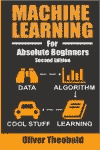
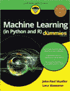
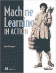
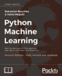
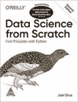
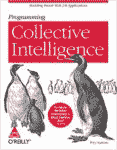
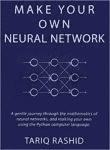
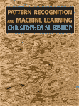

# 机器学习哪本书最好？

> 原文：<https://www.edureka.co/blog/top-10-machine-learning-books/>

书籍是美丽的，文字是它们的武器。每一个字都促使你去想象更多，这样，你就能学到更多。你自己的步调和你自己的方便，按需学习。想知道什么是[机器学习](https://www.edureka.co/blog/what-is-machine-learning/)哪本书最好？没有一本书能满足所有的需求。这就是为什么我们挖掘并找到了从完全初学者到高级开发人员的最好的机器学习书籍。

**(注:文章中已提及免费书籍 pdf 和在线订购的链接)**

本文分为以下几个部分:

*   [什么是机器学习？](#whatisml)
*   [机器学习入门书籍](#begin)
    *   [机器学习绝对初学者](#mlforbeginners)
    *   [机器学习的假人](#mlfordummies)
    *   [人工智能:现代方法](#AI)
    *   [机器学习在行动](#mlinaction)
    *   [黑客机器学习](#mlforhackers)
*   [机器学习高级书籍](#advanced)
    *   [Python 机器学习](#pyml)
    *   [数据科学从无到有](#dsfrom)
    *   [编程集体智慧](#programmingcollective)
    *   [打造自己的神经网络](#nn)
    *   [模式识别与机器学习](#patternrecognition)

那么，我们开始吧:)

## **什么是机器学习？**

*Machine Learning is the process of creating models that can perform a certain task without the need for a human explicitly programming it to do something.*

**简单来说，机器学习就是教你的计算机一些东西。它可能是区分狗和猫，或者区分水果，诊断病人的癌症，创建一个聊天机器人来帮助抑郁症患者。这可能是教你的计算机阅读，所有这一切都可能通过机器学习。好了，让我们找出所有适合[学习机器学习](https://www.edureka.co/blog/introduction-to-machine-learning/)的最佳书籍！**

## ****机器学习入门书籍****

**让我们首先浏览一些初学者的书籍，因为这最有意义。因此，请仔细阅读我们对所有机器学习新手的建议。**

***   ### Machine learning for absolute beginners Oliver theobald** 

**书名说明了一切。[面向绝对初学者的机器学习](https://www.amazon.in/Machine-Learning-Absolute-Beginners-Introduction/dp/1549617214/ref=sr_1_1?keywords=machine+learning+for+absolute+beginners&qid=1572843511&sr=8-1)面向任何完全陌生的人。你可能没有任何编程知识或数学知识，你仍然可以使用这本书开始机器学习。就是这么好。作者的语言以及他是如何解释一切的——牢记一个对这一切都不熟悉的人的视角——是当今市场上最好的语言之一。**

**它有漂亮的视觉效果和图表，对每种算法都有很好的解释，还有一些用 Python 编写的代码，让机器学习有了实际意义。所以，所有新来的人，这是一本入门书。您可以从这里 **[【付费】](https://www.amazon.in/Machine-Learning-Absolute-Beginners-Introduction/dp/1549617214/ref=sr_1_1?keywords=machine+learning+for+absolute+beginners&qid=1572843511&sr=8-1)** 订购图书。**

***   ### Machine Learning of Dummies by John paul muller and Luca Massalon** 

**再往上一点，我们有[面向傻瓜的机器学习](https://www.amazon.in/Machine-Learning-Python-R-Dummies/dp/8126563052/ref=sr_1_1_sspa?keywords=machine+learning+for+dummies&qid=1572845779&sr=8-1-spons&psc=1&spLa=ZW5jcnlwdGVkUXVhbGlmaWVyPUEzUTJRQ1M3QVdMMTkzJmVuY3J5cHRlZElkPUEwMDk4MjUxMTU1VEJOVlo3TlNTWSZlbmNyeXB0ZWRBZElkPUEwNTY5ODQyR0dHSzBKQU1SOEdSJndpZGdldE5hbWU9c3BfYXRmJmFjdGlvbj1jbGlja1JlZGlyZWN0JmRvTm90TG9nQ2xpY2s9dHJ1ZQ==)，它深入研究机器学习的理论和基本概念，让读者习惯它的所有术语。它教你如何在实践中应用机器学习，并介绍有效应用它们所需的编程语言和工具。**

**它介绍了用 [Python](https://www.edureka.co/blog/what-is-python/) 和 [R 编程](https://www.edureka.co/blog/what-is-r-programming/)语言进行编码，以及如何用它们来教会你的计算机某些模式和分析结果。您可以了解机器学习的应用程序在现实世界中是如何使用的，这是进入机器学习世界的一个很好的开端。你可以在这里免费下载本书的。**

***   ### by Stuart Russell and Peter Norvig [Artificial Intelligence: Modern Methods]** 

**对于那些想知道人工智能与机器学习有什么关系的人来说？机器学习是[人工智能](https://www.edureka.co/blog/pros-and-cons-of-ai/)的一个子领域，它们有很多共同点。[这本书](https://www.amazon.in/Artificial-Intelligence-3e-Modern-Approach/dp/9332543518/ref=sr_1_1?keywords=Artificial+Intelligence%3A+A+Modern+Approach&qid=1572846329&sr=8-1)是前两本书的完美升级，因为它详细地涵盖了两个主题，语言也非常简单易懂。**

**它讲述了它们之间的区别，以及你需要如何完美地理解问题，并据此找到解决方案。一本真正的好书，帮助你区分问题的方法，并找到所需的路径。你可以在这里免费下载本书的。**

***要了解更多关于人工智能和机器学习的知识，那就去读人工智能教程吧。此外，报名参加 NIT Warangal 的 PGP [AI ML 课程](https://www.edureka.co/executive-programs/machine-learning-and-ai)以达到精通。***

***   ### **Machine learning in action** Peter Harrington** 

**进入编程领域，我们有这本美丽的[书](https://www.amazon.in/Machine-Learning-Action-Peter-Harrington/dp/9350044137/ref=sr_1_3?keywords=Machine+Learning+in+Action&qid=1572847622&sr=8-3)，作者是彼得，他非常高效地设计了这本书，并使它对用户友好。他介绍了开始构建机器学习算法所需的所有技术，以及如何从这些算法中获取数据用于[数据分析](https://www.edureka.co/blog/exploratory-data-analysis-in-python/)。**

**如果你熟悉用 [Python](https://www.edureka.co/blog/python-basics/) 编码会很有帮助，这样你就不会理解不了任何东西。这可能是初学者入门机器学习编码的最佳教程。你可以在这里 下载 **[书的 **PDF 版本。**](http://www2.ift.ulaval.ca/~chaib/IFT-4102-7025/public_html/Fichiers/Machine_Learning_in_Action.pdf)****

***   **黑客的机器学习** 作者德鲁·康威和约翰·迈尔斯·怀特**

**现在，对于那些真正擅长编码但数学背景不好的人来说，这是一本适合你们的书。不要认为黑客是与网络安全有关的人，但这里的黑客指的是那些已经擅长编码的人。这本[书](https://www.amazon.in/Machine-Learning-Hackers-Studies-Algorithms/dp/9350236745/ref=sr_1_fkmr0_1?keywords=Machine+Learning+for+Hackers+by+Drew+Conway+and+John+Myles+White&qid=1572848849&sr=8-1-fkmr0)深入强调了机器学习所需的数学知识，并使用现实世界的场景和用例来帮助你掌握它。使用 R 编程语言的典型的[机器学习问题](https://www.edureka.co/blog/machine-learning-with-r/)是开始，然后进入高级主题，在那里你将学会如何建立一个推荐系统和那些种类的应用程序。如果你对高级编码已经很熟悉了，这本书是值得学习的。你可以在这里 下载本书的 **[PDF 版本。](https://doc.lagout.org/science/Artificial%20Intelligence/Machine%20learning/Machine%20Learning%20for%20Hackers_%20Case%20Studies%20and%20Algorithms%20to%20Get%20You%20Started%20%5BConway%20%26%20White%202012-02-25%5D.pdf)****

**现在，我们已经介绍了初级水平的书籍，让我们继续学习高级概念的书籍。**

## ****机器学习高级书籍****

***   塞巴斯蒂安·拉什卡和瓦希德·米尔贾利利的计算机编程语言机器学习**

**这本[书](https://www.amazon.in/Python-Machine-Learning-Sebastian-Raschka/dp/1787125939/ref=sr_1_1_sspa?crid=AU64HLBIKXZQ&keywords=python+machine+learning&qid=1572847386&sprefix=Python+Machine%2Caps%2C311&sr=8-1-spons&psc=1&spLa=ZW5jcnlwdGVkUXVhbGlmaWVyPUExVzc5M0RHS000NFlVJmVuY3J5cHRlZElkPUExMDIwNzU0M0pMVUYxSzAxQkFIMyZlbmNyeXB0ZWRBZElkPUEwMDQ5MTQxM1FUWkg3S0U2MFRKTiZ3aWRnZXROYW1lPXNwX2F0ZiZhY3Rpb249Y2xpY2tSZWRpcmVjdCZkb05vdExvZ0NsaWNrPXRydWU=)可能是唯一一本专注于一种编程语言的书，这种语言就是 Python，它可以帮助你理解和开发各种机器学习、深度学习和数据分析算法。它介绍了各种强大的库，如用于实现各种机器学习算法的 [Scikit-Learn](https://www.edureka.co/blog/scikit-learn-machine-learning/) 。接下来，它还使用[张量流](https://www.edureka.co/blog/tensorflow-image-classification)模块教你关于[深度学习](https://www.edureka.co/blog/deep-learning-with-python/)。它还教你各种方法，这些方法可以用来提高你制作的模型的效率，最后向你展示你可以使用机器和深度学习实现的各种数据分析机会。所以如果你对这本书感兴趣，就在这里过一遍 ** [购买吧(付费)](https://www.amazon.in/Python-Machine-Learning-Sebastian-Raschka/dp/1787125939/ref=sr_1_1_sspa?crid=AU64HLBIKXZQ&keywords=python+machine+learning&qid=1572847386&sprefix=Python+Machine%2Caps%2C311&sr=8-1-spons&psc=1&spLa=ZW5jcnlwdGVkUXVhbGlmaWVyPUExVzc5M0RHS000NFlVJmVuY3J5cHRlZElkPUExMDIwNzU0M0pMVUYxSzAxQkFIMyZlbmNyeXB0ZWRBZElkPUEwMDQ5MTQxM1FUWkg3S0U2MFRKTiZ3aWRnZXROYW1lPXNwX2F0ZiZhY3Rpb249Y2xpY2tSZWRpcmVjdCZkb05vdExvZ0NsaWNrPXRydWU=) ** 。**

***   ### **Data science starts from scratch** Joel Grush uses Python** 

**一旦你完成了 Python 机器学习，继续前进，从[这本书](https://www.amazon.in/Data-Science-Scratch-Principles-Python/dp/9352138325/ref=sr_1_1?keywords=Data+Science+from+Scratch%3A+First+Principles+with+Python&qid=1572849272&sr=8-1)开始，因为它教你到底什么是[数据科学](https://www.edureka.co/blog/what-is-data-science/)以及它所有的术语。由于机器学习的基础知识已经涵盖，这将有助于你进一步了解你到底可以用你获得的数据做什么，以及更多。是的，你不需要事先知道机器学习，但理解它会带来更好的深度和对主题的理解。你可以在这里 ** [【付费】](https://www.amazon.in/Data-Science-Scratch-Principles-Python/dp/9352138325/ref=sr_1_1?keywords=Data+Science+from+Scratch%3A+First+Principles+with+Python&qid=1572849272&sr=8-1) ** 购买这本书。**

***   ### by Toby Seigland [programming collective wisdom** 

**你用机器学习做什么？实际应用在哪里？[这本书](https://www.amazon.in/Programming-Collective-Intelligence-Building-Applications/dp/8184043708/ref=sr_1_1?keywords=%E2%80%9CProgramming+Collective+Intelligence%E2%80%9D+by+Toby+Segaran&qid=1572850171&sr=8-1)这里有这一切的答案。这是一本非常有趣的书，教你如何应用机器学习来开发更智能的应用程序。它教你如何为[网站](https://www.edureka.co/blog/web-development-tutorial/)、[应用](https://www.edureka.co/blog/machine-learning-applications/)等应用机器学习。这本书采用基于项目的方法，教你一个项目，它是如何制作的等等，然后加入机器学习的味道，显著提高项目的效率。这可能是最好的方法，因为它告诉你机器学习的重要性。你可以在这里 下载本书的 ** [ PDF 版本。](http://axon.cs.byu.edu/~martinez/classes/778/Papers/GP.pdf)****

***   ### **Make your own neural network** Tariq Rashid** 

**数据增长时机器学习失败。因此，深度学习开始发挥作用。[这本书](https://www.amazon.in/Make-Your-Own-Neural-Network/dp/1530826608/ref=sr_1_1?keywords=Make+Your+Own+Neural+Network&qid=1572850656&sr=8-1)对每个想研究深度学习以及它们如何优于典型机器学习的人来说都很美。它用实际例子和问题教你如何用 Python 构建你的[神经网络](https://www.edureka.co/blog/what-is-a-neural-network/)。文笔优美，有助于你理解这个相当难的主题。你可以在这里 ** [【付费】](https://www.amazon.in/Make-Your-Own-Neural-Network/dp/1530826608/ref=sr_1_1?keywords=Make+Your+Own+Neural+Network&qid=1572850656&sr=8-1) ** 购买这本书。**

***   ### **Pattern recognition and machine learning** Author Christopher M. Bishop** 

**对于每个立志成为[数据科学家](https://www.edureka.co/blog/who-is-a-data-scientist/)的人来说，这就是你需要的[书](https://www.amazon.in/Pattern-Recognition-Learning-Information-Statistics/dp/0387310738/ref=sr_1_3?keywords=Pattern+Recognition+and+Machine+Learning&qid=1572851277&sr=8-3)。它涵盖了各种不断发展的主题[统计](https://www.edureka.co/blog/statistics-for-machine-learning)和[概率](https://www.edureka.co/blog/statistics-and-probability/)，并通过寻找什么模式使数据更好或更差，以及如何利用它们进行机器学习。从一般的例子到真实世界的数据收集和模式研究，它都教给你。这绝对是一本只有高级程序员才应该读的书。这肯定会帮助你提升自己，并可能让你在机器学习领域找到一份好工作。你可以在这里 下载本书的 ** [ PDF 版本。](http://users.isr.ist.utl.pt/~wurmd/Livros/school/Bishop%20-%20Pattern%20Recognition%20And%20Machine%20Learning%20-%20Springer%20%202006.pdf)****

**这基本上总结了我们给你的建议，从初学者一直到最先进的领域。我们希望您喜欢我们的推荐。快乐学习。**

***现在你已经知道了机器学习的最佳书籍，请查看 Edureka 的 [**机器学习工程师硕士课程**](https://www.edureka.co/masters-program/machine-learning-engineer-training)* *，edu reka 是一家值得信赖的在线学习公司，拥有遍布全球的 250，000 多名满意的学习者。***

***Edureka 的**机器学习工程师硕士项目**课程是为想要成为机器学习工程师的学生和专业人士设计的。本课程旨在让你精通监督学习、非监督学习和自然语言处理等技术。它包括人工智能&机器学习方面的最新进展和技术方法的培训，如深度学习、图形模型和强化学习。***

***有问题吗？请在本“**”的评论部分提及，哪本书最适合机器学习？**“博客，我们会尽快回复您的。***