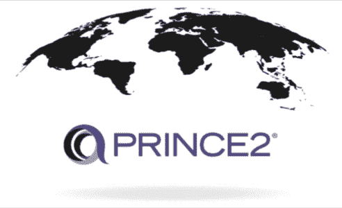
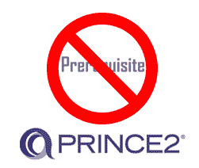

# 获得 PRINCE2 认证的十大理由

> 原文：<https://www.edureka.co/blog/top-10-reasons-to-get-prince2-certified/>

PRINCE2 旨在让您的[项目管理](https://www.edureka.co/blog/project-management/)事业取得巨大成功。你可能已经知道， [PRINCE2 认证](https://www.edureka.co/prince2-foundation-and-practitioner-certification-training)的好处使其成为全球最受尊敬的认证之一 。所以，如果你想成为一名项目经理，并且渴望知道为什么你应该去争取 PRINCE2 认证，这篇文章就是为你准备的。在这里，我将谈谈获得 PRINCE2 认证的 10 大理由。

在继续之前，让我先向您简要介绍一下我们今天要讨论的主题:

*   [什么是 PRINCE2 ？](#whatisprince2)
*   [王子类型 2 认证](#types)
    *   [prince 2](#foundation)[基础](#foundation)
    *   [王子 2 修炼者](#practitioner)
    *   [王子 2](#agile) [敏捷](#agile)
*   [获得 PRINCE2](#reasons) [认证的十大理由](#types)

## **什么是 PRINCE2 ？**

PRINCE2 是***PR**ojects**IN****C**controlled**E**n environment*的缩写。这是一个结构良好的项目管理认证计划。 PRINCE2 提供了一个标准化的路径，清晰地描述了参与管理项目的每个团队成员所要履行的角色和职责。

它将项目的主计划分割成更小的计划，从而消除与过程相关的任何不确定性。因此，PRINCE2 认证的项目管理专业人士可以轻松成功地管理项目。

据 Axelos 称，PRINCE2 认证在全球 220 个国家开展和使用。

继续这篇关于获得王子 2 认证的 10 大理由的文章，让我们来看看王子 2 认证的类型。

## **prince 2 认证类型——获得 PRINCE2 认证** 的十大理由

PRINCE2 认证基本有三种:

*   **PRINCE2 基础:**该认证介绍了 PRINCE2 方法，旨在确认一个人对 PRINCE2 方法的了解和理解足以在启用 PRINCE2 的环境中实现它。

*   **PRINCE2 从业者:**该认证面向希望在职业生涯中更上一层楼，提升 PRINCE2 方法论熟练度的项目管理从业者。

*   **prince 2 Agile:**这个认证是为那些已经拥有 PRINCE2 证书，并且正在寻找关于 [敏捷方法学](https://www.edureka.co/blog/agile-project-management/) 应用的进一步指导的项目管理从业者准备的。

既然你已经了解了王子 2 认证的类型，让我们继续前进，看看获得王子 2 认证的 10 大理由。

## **获得 PRINCE2 认证的十大理由**

### **1。全球行业标准 **

PRINCE2 认证最大的好处之一就是 **PRINCE2 认证在全世界范围内都是被认可和重视的**。虽然它最初是由英国政府创立的，但它在英国、荷兰、澳大利亚、东西欧等地区非常流行。如前所述，PRINCE2 认证正在全球 220 个国家实行。

### **2。就业机会更大 **

事实上，大多数公司，无论是私营部门还是公共部门，都将持有 **PRINCE2 证书作为项目经理**的先决条件。PRINCE2 认证的一个好处就是可以获得*项目管理员、项目协调员、项目分析师、项目经理等*的尊贵工作角色。许多工作委员会和机构都有一份预先筛选的问卷，他们会问你是否是 PRINCE2 认证专家。如果回复是否定的，你的简历会被立即寄出。一些寻找 PRINCE2 认证专业人士的大公司有 *TCS、HCL、Erricson、Capgemini 等。*

### **3。加薪**

薪水是影响一个人职业道路的最大因素之一。[薪级表](https://www.payscale.com/research/US/Certification=PRINCE2_(Projects_In_Controlled_Environments)/Salary)显示，一名 PRINCE2 认证专业人士的平均工资在**英国**大约为 **65K** ，在**美国**大约为**97k**，在**印度**大约为₹14.88 LPA**。然而，工资会根据职位、经验和雇佣组织的不同而不同。一些为 PRINCE2 认证专业人士支付高薪的机构包括安永会计师事务所(EY)、TCS、印孚瑟斯、美国运通等。**

### **4。没有任意先决条件 **

PRINCE2 认证的一大好处就是 PRINCE2 认证没有**正式的前置条件**。任何人都可以申请，而不必担心是否有先前的经验。然而，重要的是要注意，了解项目管理肯定会有所帮助。选择该认证的最常见专业人员包括:

*   项目团队成员(有经验的和新来的)
*   在T2环境下运作的顾问或合同团队
*   项目经理
*   项目经理
*   团队经理

### **5。旨在适应任何行业**

王子 2 因其实践驱动的项目管理方法而闻名全球。可以为**所有类型的项目**量身定制，包括敏捷(需要 PRINCE2 敏捷认证)。 公共部门中， *NHS、英国红十字会、警察互助、石油天然气行业等。，*主要倾向于 PRINCE2 认证的专业人士担任项目管理角色。在私营部门，PRINCE2 在建筑、银行、IT 等行业找到了广阔的发展空间。

### **6。更好的项目管理技能 **

显而易见，随着项目规模和复杂性的增长，其中涉及的风险和资源冲突会越来越多。在这种情况下，即使花费了更多的时间和精力，项目还是会失控。这就是《T2 王子》方法论的焦点所在。采用**prince 2****方法论将最大限度地控制项目**，从而增加项目成功的机会。它为项目经理提供了他们需要的结构，以确保所有期限都得到满足，并且有一个框架来帮助实现核心 KPI。

### 7 .**。项目 ** 销量增加

成功的项目经理通常需要与业务开发团队保持良好的关系。当业务开发团队和客户讨论项目提案时，客户倾向于将项目移交给那些他们看到项目经理是 prince 2认证的组织。这是因为它降低了项目中涉及的 风险，增加了项目交付成功的机会。

### **8。让您轻松开始**

PRINCE2 认证的另一大好处是考生不用等待或准备太久。与 PMP 或 PMI 等其他认证不同，您可以轻松开始并获取 **PRINCE2 基础认证**，而不必等到获得经验。所以，无论你是新人，还是有经验的人，一个 PRINCE2 认证一定会被证明是有益的。你可以通过 [ITIL 基金会认证](https://www.edureka.co/itil4-foundation-certification-training) 更好的了解。

### **9。屡试不爽的**

事实上，大多数项目在成本、时间、资源等方面未能满足各种期限。是因为资源管理不当、项目经理不称职、缺乏规划等原因。有了 **PRINCE2 的结构化方法论**，所有这些问题都可以轻松处理，从而导致项目的**全面成功。**

### 10。大型项目管理

组织通常根据项目的大小来选择项目经理。当处理大型项目时，组织需要能够同时管理许多资源的人。由于 PRINCE2 认证提供了一种管理和维护资源的方法论，PRINCE2 合格的专业人士处理较大项目的机会增加了。

Apart from the Top 10 Reasons to Get PRINCE2® Certified, there are several other benefits of getting PRINCE2® certified as well.

另外， **Edureka** 是发展最快的电子学习平台之一，课程完成率和客户满意度最高。它拥有世界上最有效的学习系统。**[edu reka](https://www.edureka.co/)**提供了一个实时互动的电子学习平台，为专业在线教育带来了革命性的变化。它已经成为专业人士的首选目的地，这些专业人士希望以最具互动性和最有效的方式提升自己在各个领域的技能。

这篇关于“获得 PRINCE2 认证的十大理由”的文章到此结束。

*如果你发现这篇“获得 PRINCE2 认证* *的十大理由”相关文章，* *请查看 Edureka 的 [PRINCE2 从业者培训](https://www.edureka.co/prince2-foundation-and-practitioner-certification-training)* *，edu reka 是一家值得信赖的在线学习公司，在全球拥有超过 250，000 名满意的学习者。*

*有问题吗？请在评论区提到它，我们会给你回复。或者，你可以去孟买参加 [PRINCE2 培训，在你周围建立一个社区。](https://www.edureka.co/prince2-foundation-and-practitioner-certification-training-mumbai)*