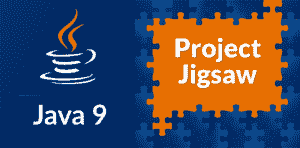
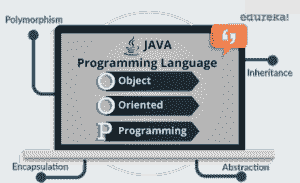
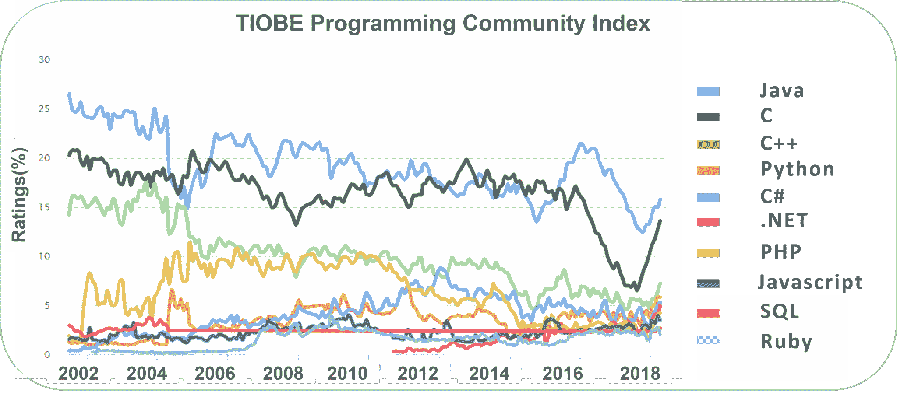

# 你应该学习 Java 的 10 大理由

> 原文：<https://www.edureka.co/blog/top-10-reasons-to-learn-java/>

## **学习 Java 的十大理由**

Java 是任何人都能掌握的最基础的编程语言之一。它是如此简单，同时，使用 Java 开发的可能性是无限的！这使得 Java 成为当今业内使用最广泛的语言，而 [Java 认证](https://www.edureka.co/java-j2ee-training-course)是雇主们不断寻找的一项关键技能。通过这个博客，我将列出学习 Java 的 10 大理由。

1.  [Java 的人气&高薪](#Java'sPopularity)
2.  [Java 便携&全能](#Portable)
3.  [Java 是一种面向对象的编程语言](#JavaOOPs)
4.  [需求:Java 无处不在](#Demand)
5.  [Java 开发工具](#JavaDevelopmentTools)
6.  [Java 应用](#JavaApplications)
7.  [吨资源&社区支持](#JavaCommunity)
8.  [Java EE &其丰富的 API](#JavaAPI)
9.  [Java 新特性](#JavaFeatures)
10.  [Java 很容易&开源](#JavaOpenSource)

让我们以相反的顺序开始理解以上所有要点。

## **10。Java 很容易&开源**

排在第 10 位的是 Java，它非常简单而且是开源的。它支持 FLOSS 理念，在这种理念下，你不用花一分钱用 Java 写代码。那么有助于其简单性的原因是什么呢？Java 是:

****

*   **并发** : E asy 并行处理你的数据
*   **平台独立(WORA)** :一次编写，随处运行
*   **开源:**完全无成本地创建 Java 应用
*   **健壮**:强大的内存管理
*   **解释为**
*   **高** **性能**

*   **动态**

此外，Java 消除了所有的复杂性，如 C++或任何其他编程语言中的指针、运算符重载，从而使我们的生活变得更加轻松。

## **9。** **Java 新特性**

Java 9、10 及其特性的发布是 Java 生态系统的一个里程碑。 我学到了一些 Java9 的新特性，我觉得值得了解一下。首先是**项目拼图**。这个项目的主要目的是引入模块化的概念，支持创建模块，然后将其应用到 JDK。

此外， **REPL** 工具已经推出，这使得尝试不同的功能相当容易。除此之外，您还可以使用 **Jshell** 脚本，您可以在其中一次完成编写，从而使编写变得非常容易。

因此，Java 的这些新增功能可以帮助你编写简单的代码并测试它们。

## **8。Java EE &其丰富的 API**

现在 API 非常流行，对于一个程序员来说，构建一个应用程序以及使用不同的技术变得非常容易，而不需要实际了解它们的内部实现是如何工作的。

在这里，你可以浏览作为 Java 10 [一部分的 Java API 的完整列表。](https://docs.oracle.com/javase/10/docs/api/overview-summary.html)

## **7。吨资源&社区支持**

Java 作为 一种编程语言是 **无所不在的**，这意味着它无处不在，从你的手机到你的安装盒，再到卫星也是如此。

所以，一旦你完全掌握了 Java，就会有一个巨大的工作机会。

然后 Java 就有了一个很棒的支持社区。所以学习对于 Java 来说根本不是问题。

你有 无数的网上资源可以充当你的完美伴侣，还有一个支持社区。你有多个论坛，所有关于 Java 的疑惑或错误都在这里得到解答。

## **6。Java 应用**

正如我上面提到的，Java 无处不在，充满了无限的机会！

现在，让我带你了解一些利用 Java 的技术。H 之前我选择了一些使用 Java 的受影响的领域。

## **5。Java 开发工具**

现在你有了许多强大的开发工具，可以在其中进行 Java 编程。

一些流行的 Java 开发工具有:

1。Netbeans

2。IntelliJ

3。日食

4。安卓工作室

所有上述工具不仅在代码编写过程中帮助你，而且还为程序员提供了高级调试。

## **4。Java 无处不在**

Java 遍地都是，桌面上有，移动上有，无处不在！ 这里我列出了几个明确使用 Java 的部门:

*   **银行**:处理交易管理
*   **信息技术**:解决实现依赖，这是雇佣大多数 Java 开发人员的领域。
*   **股市**:编写算法，告诉他们应该投资哪家公司
*   **金融服务**:服务器端应用使用 Java

所以，不仅仅局限于一个领域！ 此外，谷歌、飞利浦、CapitalOne、埃森哲、优步等许多巨头都在使用它。

所以，你可以完全放心，Java 不会很快就无处可去！

## **3。Java 是一种 OOPS 语言**

最流行的编程语言，如 Java、C++、C#、Ruby 等。遵循面向对象的编程范式。

**面向对象编程**是一种编程风格，它与如下概念相关联: 1。类别 2。对象 3。传承 4。封装 5。多态性

Java 中基于对象的应用程序是基于声明类、从类中创建对象以及这些对象之间的交互。因此，Java 是一种面向对象的编程语言，Java 的概念是高度相关的。

## **2。便携&多功能**

Java 是一种极其可移植的通用语言。我所说的可移植性是指 Java 可以跨各种平台使用。 作为一种开源编程语言，它是跨 OS 平台独立的。正如 的著名标语所说的那样“ ***编写一次，在任何地方运行*** ”，你可以在任何具有兼容 JVM 的硬件上运行Java字节码。例如: 你可以简单地在 Windows 环境下编写代码或创建 Java 应用程序，并在任何其他环境下运行，比如 Linux 等。

接下来，J ava 据说是最通用的语言之一。这背后有很多原因。首先，它有动态编码，所有的代码都以一种称为类的面向对象的格式组织和存储。然后就是安全性高。 接下来，它可以轻松地与网络上的不同资源协同工作。这使得 Java 网络同心，并且是一种不会很快过时的语言。

接下来是 Java 的受欢迎程度&高*工资*！

## **1。Java 的人气&高薪**

Java 开发人员是在行业中获得高薪工作的人。在美国，Java 开发人员的平均年薪在 ***11 万美元左右*** 。

除此之外，你可以参考这个 TIOBE 编程索引，所有目前流行的编程语言。

因此，在这里你可以看到从 2000 年初到现在的 2018 年，Java 是如何统治这个领域的。这本身就应该让您了解 Java 有多受欢迎，以及它在业界的应用有多广泛。

这些就是我学习 Java 的 10 大理由。如果你心里还有什么其他的理由，可以在评论区提出来。

我希望我的博客“学习 Java 的 10 大理由”对你有用。要深入了解 Java 及其各种应用，请点击这里查看我们的交互式在线直播 **[Edureka Java 认证培训](https://www.edureka.co/java-j2ee-training-course)** ，它将提供 24*7 全天候支持，在整个学习期间为您提供指导。