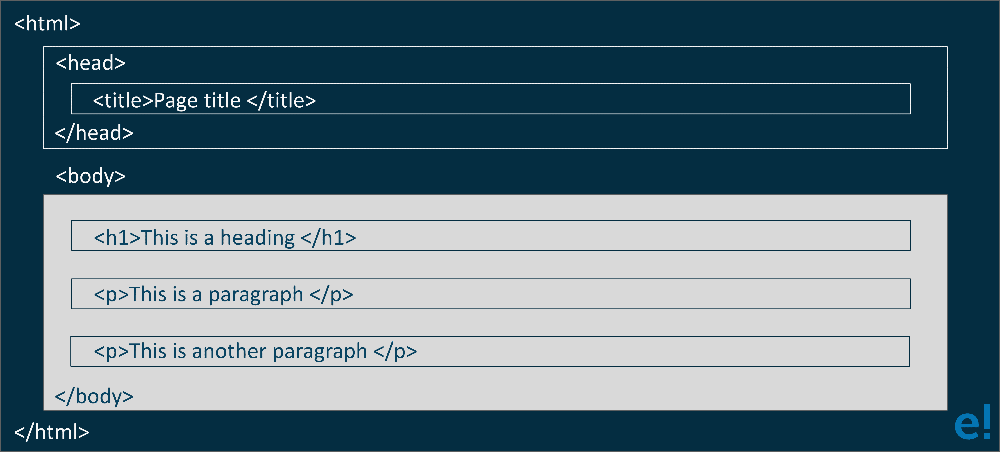

# 2023 年 50 大 HTML 面试问答

> 原文：<https://www.edureka.co/blog/interview-questions/top-50-html-interview-questions-and-answers/>

HTML 是网络上开发网页最广泛使用的语言之一。它帮助你 钻研 [网络开发](https://www.edureka.co/masters-program/full-stack-developer-training) 的世界，提升你的技能。因此，如果你正计划在 Web 开发或 HTML 领域开始你的职业生涯，并且你希望了解与之相关的技能，现在是时候开始钻研了。这些 **HTML 面试问答**将帮助你度过 2023 年的面试。

## **HTML 面试问题**

### **Q1。什么是 HTML？**

[HTML](https://www.edureka.co/blog/what-is-html/) 代表超文本标记语言。它是万维网的一种语言。它是一种标准的文本格式语言，用于在 Web 上创建和显示页面。HTML 使文本更具交互性和动态性。它可以把文本变成图像，表格，链接。HTML 页面通过添加。html 或者。网页名称中的 html。

### **Q2。HTML 元素和标签有什么区别？**

| **元素** | **标签** |
| 元素是 HTML 网页或文档的单个组件。它代表语义或意义。例如，title 元素表示文档的标题。 | 它是 HTML 文档的根，用于指定该文档是 HTML。例如，head 标签用于包含 HTML 文件中的所有 Head 元素。 |

### **Q3。什么是属性，你如何使用它们？**

每个标签都有附加属性，这些属性改变标签的行为或显示方式。例如， **< input >** 标签有一个 type 属性，可以用来指定它是文本字段、复选框、单选按钮还是更多选项中的一个。 **属性**被直接指定在**标签**的名称之后，在两个尖括号内。它们应该只出现在开始标记或自结束标记中。但是，它们永远不会出现在**结束标记**中。

**举例:**

```

<!-- Text field -->
<input type="text" />
<!-- Checkbox -->
<input type="checkbox" />
<!-- Radio button -->
<input type="radio" value="on" />

```

### **Q4。块级元素和行内元素有什么区别？**

| **块** | **内嵌** |
| 一个块级元素被绘制成一个块，该块被拉伸以填充其可用的全部宽度，即其容器的宽度，并且总是从新行开始。 **元素**默认为块级: **< div >，< img >，< section >，< form >，< nav >。** | 内联元素被绘制在它们被定义的地方，并且只占用绝对需要的空间。理解它们如何工作的最简单的方法是看文本如何在页面上流动。 **默认内联元素的**示例: **< span >，< b >，< strong >，< a >，< input >。** |

### **Q5。HTML 中什么时候使用注释？**

为了容易理解代码，您可以在 HTML 文档中添加**代码注释**。这些不会显示在浏览器中，但是它们可以帮助你为自己和其他开发者留下注释，说明 HTML 的一部分是用来做什么的。评论的开始用**表示<！–**，结束标记为 **— >** 。中间的任何东西都将被完全忽略，即使它包含有效的 **HTML** 。

**例如**:

```

<!-- This is a comment! -->
<!-- Comments can span multiple lines too -->
<!-- This part is ignored in the browser -->

```

### **Q6。用来在表格中显示数据的 HTML 标签是什么？**

用于以表格形式显示数据的 HTML 标记列表包括:

元素一起用于指定每一列的列属性

| **标签** | **描述** |
| **<表>** | 它定义了一个表 |
| **<tr>** | 这个标签定义了表格中的一行 |
| **< th >** | 它定义了表格中的标题单元格 |
| **< td >** | 这用于定义表格中的单元格 |
| **<字幕>** | 它定义了表格标题 |
| **<列组>** | 它在表格中指定一组一列或多列进行格式化 |
| **<山口>** | 这与 |
| **<tbody>** | 该标签用于对表格中的正文内容进行分组。 |
| **< thead >** | 它用于对表格中的标题内容进行分组 |
| **< tfooter >** | 它用于对表格中的页脚内容进行分组 |

### **Q7。如何在 HTML 中创建超链接？**

HTML 提供了一个锚标记来创建一个超链接，将一个页面链接到另一个页面。这些标签可以以下列任何一种方式出现:

*   **未访问的链接**–显示，带下划线，蓝色。
*   **访问过的链接**–显示，带下划线，呈紫色。
*   **活动链接**–显示，带下划线，红色。

HTML 中超链接的**语法**为:

```

<a href = "..........."> Link Text </a>

```

### **Q8。列举一些设计网页时常用的列表。**

有许多用于设计网页的常用列表。您可以选择以下列表类型中的任何一种或组合:

*   **有序列表**–有序列表以编号格式显示元素。用< ol >标签来表示。
*   **无序列表**–无序列表以项目符号格式显示元素。它由< ul >标签表示。
*   **定义列表**–定义列表以类似字典的定义形式显示元素。< dl >、< dt >和< dd >标签用于定义描述列表。

### **Q9。什么是语义 HTML？**

语义 HTML 是一种编码风格。它是使用 **HTML 标记**来强化内容的语义或含义。例如:在语义 HTML**<b></b>**标签不用于粗体语句，同样 **< i > < /i >** 标签用于斜体。我们用**<strong></strong>**和**<em></em>**标签来代替这些。

### **Q10。如何用 HTML 创建嵌套网页？**

HTML **iframe** 标签用于显示嵌套的网页。换句话说，它代表了网页中的网页。HTML < iframe >标签定义了一个内嵌框架。例如:

```

<!DOCTYPE html>
<html>
<body>
<h2>HTML example</h2>
Use the height and width attributes to specify the size of the iframe:
<iframe src="https://www.edureka.co/" height="300" width="400"></iframe>
</body>
</html>

```

### **Q11。什么是影像地图？**

图像映射用于使用单个图像链接许多不同的网页。它由<map>标签表示。您可以在图像中定义想要作为图像映射的一部分包含的形状。</map>

### **Q12。超链接只适用于文本吗？**

不，超链接既可以用在**文本**上，也可以用在**图像**上。HTML 锚定标签定义了一个超链接，将一个页面链接到另一个页面。“href”属性是 HTML 锚标记最重要的属性。

**语法:**

```

<a href = "..........."> Link Text </a>

```

### **Q13。什么是样式表？**

样式表用于构建一致的、可移植的、设计良好的**样式模板**。您可以在几个不同的网页上添加这些模板。它描述了用标记语言编写的文档的外观和格式。

### **Q14。解释 HTML 的布局。**

HTML 布局指定了网页的排列方式。每个网站都有特定的布局，以特定的方式显示内容。以下是不同的 HTML 元素,用于定义网页的不同部分:

****

*   **<表头>** :用于定义一张单据或一个章节的表头。
*   **<导航>** :定义了导航链接的容器
*   **<节>** :用于定义单据中的一个节
*   **<文章>** :用来定义一个独立的、自成体系的文章
*   **<>**:用于定义内容之外的内容
*   **<页脚>** :用于定义一个文档或一个章节的页脚

### **Q15。什么是字幕？**

Marquee 用于在网页上滚动文本。它可以自动上下左右滚动图像或文本。你应该把你想要滚动的文本放在 **<字幕>……</字幕>** 标签内。

## **Q16。用来分隔一段文本的标签是什么？**

有三种标记可用于分隔文本:

*   **< br >** 标签——通常< br >标签用于**分隔**文本的**行。它中断当前行，并将流传递到下一行**
*   **< p >** 标签——这包含了新**段落**形式的**文本**。
*   **< blockquote >** 标签——用来定义一个大的引用段。如果你有一大段引文，那么把整个文本放在 **<块引号>…………< /blockquote >** 标签。

### **Q17。HTML 中的 DIV 和 SPAN 有什么区别？**

**span** 和 **div** 的区别在于，span 元素是**内联**，通常用于一行中的一小块 HTML，比如一个段落中。然而，div 或 division 元素是**块行**，这相当于在它的前面和后面有一个换行符，用来分组更大的代码块。

**举例:**

```

<div id="HTML">
This is <span class="Web Dev">interview</span>
</div>

```

### **Q18。在图像中使用替代文字的目的是什么？**

使用替代文本的目的是定义图像是关于什么的。在图像映射过程中，很难理解特定链接对应的热点。这些替代文本在这里起作用，并在每个链接处放置一个描述，这使得用户可以很容易地理解热点链接。

### **Q19。如何创建一个新的 HTML 元素？**

您可以通过以下方式为文档创建新元素:

```

<script>
document.createElement﴾"myElement"﴿
</script>

```

它也可以在 HTML 中用作:

```

<myElement>hello edureka!</myElement>

```

### **Q20。是<！DOCTYPE html >标签被认为是 html 标签？**

不，声明不是一个 HTML 标签。

HTML 有许多类型，例如，HTML 4.01 严格、HTML 4.01 过渡、HTML 4.01 框架集、XHTML 1.0 严格、XHTML 1.0 过渡、XHTML 1.0 框架集、XHTML 1.1 等。因此，用于指示 web 浏览器关于 HTML 页面的信息。

### **Q21。为什么 URL 要用 HTML 编码？**

对 URL 进行编码是为了将非 ASCII 字符转换成可以在 Internet 上使用的格式，因为 URL 仅使用 ASCII 字符集在 Internet 上发送。如果一个 **URL** 包含了在 **ASCII** 集合之外的字符，该 URL 必须被转换。非 ASCII 字符被替换为“ **%** ”，后跟十六进制数字。

### **Q22。iframe 标签有什么用？**

iframe 用于在网页中显示网页。

**语法:**

```

<iframe src="URL"></iframe>

```

**举例:**

```

<iframe src="demo_iframe.html" width="200px" height="200px"></iframe>

```

**目标链接:**

```

<iframe src="http://www.edureka.co" name="iframe_a"></iframe>

```

### **Q23。HTML 中的实体有哪些？**

HTML 字符实体用于替换 HTML 中的保留字符。您也可以用实体替换键盘上没有的字符。这些字符被替换，因为 HTML 中保留了一些字符。

### **Q24。你能在网页上创建多种颜色的文本吗？**

是的，我们可以在网页上创建多种颜色的文本。要创建多色文本，您可以将用于您想要着色的特定文本。

### **Q25。如何制作网页背景图片的图片？**

要使一张图片成为网页上的背景图像，您应该在标签后添加以下标签代码。

```
<body background = "image.gif">
```

在这里，将“image.gif”替换为要在网页上显示的图像文件的名称。

### **Q26。span 标签有什么用？举例说明。**

span 标签用于以下用途:

*   用于在文本上添加颜色
*   在文本上添加背景
*   突出显示任何颜色的文本

**举例:**

```

<span style="color:#ffffff;">
In this page we use span.
</span>

```

### **Q27。折叠空白有什么好处？**

空白是空格字符的空白序列，在 HTML 中被视为单个空格字符。因为浏览器将多个空格合并成一个空格，所以您可以缩进文本行，而不用担心多个空格。这使您能够将 HTML 代码组织成可读性更好的格式。

### **Q28。有什么方法可以让列表元素在 HTML 文件中保持直线？**

通过使用缩进，可以使列表元素保持直线。如果将每个子嵌套列表缩进得比父列表更深，就可以很容易地确定它包含的各种列表和元素。

### **Q29。解释 LocalStorage 和 SessionStorage 对象之间的主要区别。**

localStorage 和 sessionStorage 对象之间的主要区别如下:

*   localStorage 对象存储没有截止日期的数据。然而， **sessionStorage** 对象只存储一个会话的数据。
*   对于 localStorage 对象，当浏览器窗口关闭时，数据不会被删除。但是，对于 sessionStorage 对象，如果浏览器窗口关闭，数据将被删除。
*   sessionStorage 中的数据只能在浏览器的当前窗口中访问。但是，localStorage 中的数据可以在浏览器的多个窗口之间共享。

### **Q30。什么时候使用框架合适？**

框架可以让浏览网站变得更加容易。如果网站的主要链接位于出现在浏览器顶部或边缘的**框架**中，这些链接的内容可以显示在浏览器窗口的**剩余部分**中。

### **Q31。如何在网页背景图片中插入图片？**

要将图片插入背景图像，您需要按照以下方式在标签后放置一个标签代码:

```
<body background = “image.gif”>
```

现在，用图像文件的名称替换 image.gif。这将拍摄图片，并使其成为您的网页的背景图像。

### **Q32。如果在浏览器中打开外部 CSS 文件会发生什么？**

当您尝试在浏览器中打开外部 CSS 文件时，浏览器无法打开该文件，因为该文件具有不同的扩展名。使用外部 CSS 文件的唯一方法是在另一个 HTML 文档中使用 **< link/ >** 标签来引用它。

### **Q33。当谈到样式表时，遵循的层次结构是什么？**

如果单个选择器包括三个不同的样式定义，则最接近实际标签的定义优先。内嵌样式优先于内嵌样式表，内嵌样式表优先于外部样式表。

### **Q34。如何在网页上创建文本，让你点击后可以发送电子邮件？**

要将文本变成可点击的链接来发送电子邮件，您需要在 *href* 标签中使用 *mailto* 命令。你可以这样写:

```
<a href=”mailto:youremailaddress”>text to be clicked</a>
```

### **Q35。活动链接和普通链接有什么不同？**

正常和活动链接的默认颜色是蓝色。当鼠标光标放在活动链接上时，一些浏览器会识别该链接。然而，当链接具有焦点时，其他人识别活动链接。那些没有鼠标光标的链接被认为是正常的链接。

### **Q36。分隔文本各部分的不同标签是什么？**

标签 **< br >** 是分隔文本行的一种方式。还有其他标签，如< p >标签和< blockquote >标签，也用于分隔文本部分。

### **Q37。是否有文本出现在浏览器之外的情况？**

默认情况下，文本会换行以显示在浏览器窗口中。但是，如果文本是具有定义宽度的表格单元格的一部分，则文本可能会超出浏览器窗口。

### **Q38。编写一个 HTML 表标记序列，输出如下内容:****50 PCs 100 500****10 PCs 5 50**

上述问题的 HTML 代码是:

```

<table>
<tr>
<td>50 pcs</td>
<td>100</td>
<td>500</td>
</tr>
<tr>
<td>10 pcs</td>
<td>5</td>
<td>50</td>
</tr>
</table>

```

### **Q39。将几个复选框组合在一起有什么好处？**

复选框不会相互影响。但是，将这些复选框组合在一起有助于组织它们。**复选框**按钮可以有自己的名称，不需要属于一个组。一个网页可以有许多不同的复选框组。

### **Q40。如果标签之间没有文字会怎样？这会影响 HTML 文件的显示吗？**

如果标记之间没有文本，则没有要格式化的内容。因此，不会出现任何格式。有些标签，如没有结束标签的标签，如 **< img >** 标签，它们之间不需要任何文本。

### **Q41。文本字段大小的限制是什么？**

文本字段的默认大小大约为 **13 个字符**。但是，如果包括 size 属性，可以将 size 值设置为低至 1。最大尺寸值将由浏览器宽度决定。此外，如果 size 属性设置为 0，则大小将设置为 13 个字符的默认大小。

### **Q42。边框和嵌线属性有什么关系？**

如果边框属性被设置为一个非零的**值**，那么默认的单元格边框(厚度为 **1 像素**)会被自动添加到单元格之间。类似地，如果没有包含 border 属性，当 rules 属性被添加到 **<表>** 标签时，会出现一个默认的 1 像素边框。

### **Q43。什么是 SVG？**

**HTML SVG** 用于描述二维矢量和矢量或光栅图形。SVG 图像及其行为是在 XML 文本文件中定义的。因此作为 XML 文件，您可以用文本编辑器创建和编辑一个 **SVG 图像**。它主要用于矢量图，如饼图，X，Y 坐标系中的二维图形。

```

<svg width="100" height="100">
<circle cx="50" cy="50" r="40" stroke="yellow" stroke-width="4" fill="red" />
</svg>

```

### **Q44。什么是按钮标签？**

HTML 5 中使用了 button 标签。它用于在网页上的 HTML 表单中创建一个可点击的按钮。这个标签创建了一个“提交”或“重置”按钮。按钮标签代码如下:

```
<button name="button" type="button">Click Here</button>
```

### **Q45。列出 HTML 支持的媒体类型和格式。**

HTML 支持声音、音乐、视频、电影和动画等多种媒体格式。每种媒体格式支持的一些扩展包括:

*   **影像**–png、jpg、jpeg、gif、APG、svg、bmp、BMP ico、png ico
*   **音频**–MIDI、RealAudio、WMA、AAC、WAV、Ogg、MP3、MP4
*   **视频**–MPEG、AVI、WMV、QuickTime、RealVideo、Flash、Ogg、WebM、MPEG-4 或 MP4

### **Q46。什么是单元格间距和单元格边距？**

单元格间距是指同一表格中两个单元格之间的空间或间隙。而单元格边距指的是单元格内容与单元格壁或单元格边框之间的间隙或空间。

**举例:**

```
<table border cellspacing=3>
<table border cellpadding=3>
<table border cellspacing=3 cellpadding=3>

```

### **Q47。HTML 和 XHTML 的区别是什么？**

HTML 和 XHTML 的区别在于:

*   HTML 是标准通用标记语言的应用。而 XML 是可扩展标记语言的一种应用。
*   第一个是静态网页，而后一个是动态网页。
*   HTML 允许程序员修改标签并使用属性最小化，而 XHTML 当用户需要一个新的标记时，用户可以在这里定义它。
*   HTML 是关于显示信息，而 XHTML 是关于描述信息。

### **Q48。HTML 中可以包含多少种 CSS？**

在 HTML 中包含 CSS 有三种方式:

*   **Inline CSS:** 用于样式化**小上下文**。要使用内联样式，请在相关标签中添加样式属性。
*   **外部样式表**:当样式应用于**多页**时使用。每个页面必须使用 **<链接>** 标签链接到样式表。<链接>标签进入头部。

```

<head>
<link rel="stylesheet" type="text/css" href="mystyle.css" />
</head>

```

*   **内部样式表:**单个文档有唯一样式时使用。内部样式表需要放在 HTML 页面的 head 部分，通过使用 **<样式>** 标签，方法如下:

```

<head>
<style type="text/css">
hr {color:sienna}
p {margin-left:20px}
body {background-image:url("images/back40.gif")}
</style>
</head>

```

### **Q49。HTML 中的逻辑和物理标签是什么？**

**逻辑标签**用于告知所附文本的含义。逻辑标签的例子是**<strong></strong>**标签。当我们将文本包含在强标签中时，它告诉浏览器包含的文本比其他文本更重要。

**物理标签**用于告诉浏览器如何显示物理标签中的文本。物理标签的一些例子是**<><大><I>。**

### **Q50。如何将 JavaScript 应用于网页？**

为了让你的网页更具互动性，你需要 JavaScript。它是一种脚本语言，允许您根据用户输入与页面上的某些元素进行交互。与 CSS 一样，包含 JavaScript 有三种主要方式:

**内嵌**

某些 HTML 元素允许您在特定事件发生时执行一段 JavaScript。例如，一个按钮允许你点击它运行一个脚本。这些事件是通过属性访问的，并且根据每个元素上可用的事件而有所不同。下面是一个示例，当用户单击它时，它会显示一个带有消息的警告:

```
<button onclick= "alert('Click the Buton!');">Click me!</button>
```

**脚本块**

您可以在页面上的任何地方定义一个脚本块，一旦浏览器到达文档的该部分，就会执行该脚本块。这可以在文档的或部分中。

```

<script>
    var x = 5;
    var y = 6;
    var result = x + y;
    alert(“X + Y is equal to " + result);
</script>

```

**链接到一个 JavaScript 文件**

它允许您将页面内容与用户与该内容的交互方式分开。此外，它允许您在多个页面上加载相同的脚本。与脚本块一样，您可以从 **<头>** 或 **<体>加载一个 JavaScript 文件。**

```
<script src="my-code.js"></script>
```

就这样，我们来到了 HTML 面试问题博客的尾声。希望这些 HTML 面试问题对你的面试有所帮助。如果你最近参加过这样的面试，请把这些面试问题贴在评论区，我们会回答。如果你在网络开发面试中有任何问题，你也可以在下面评论。

*查看我们的[全栈 Web 开发人员硕士项目](https://www.edureka.co/masters-program/full-stack-developer-training)，该项目包含讲师指导的现场培训和真实项目体验。本培训使您精通使用后端和前端 web 技术的技能。它包括关于 Web 开发、jQuery、Angular、NodeJS、ExpressJS 和 MongoDB 的培训。*

有问题要问我们吗？请在“HTML 面试问题”博客的评论部分提到它，我们会给你回复。