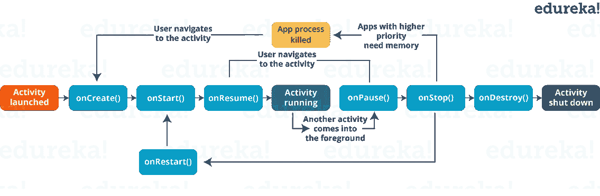
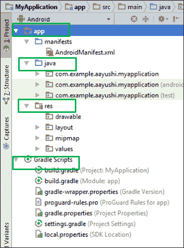
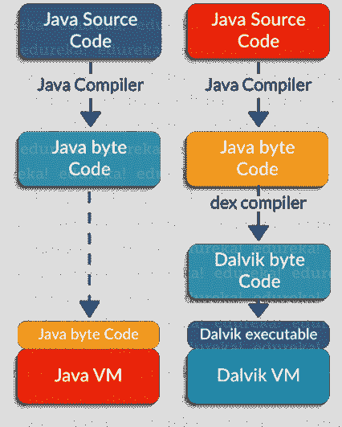

# 2023 年你必须准备的 50 个安卓面试问题

> 原文：<https://www.edureka.co/blog/interview-questions/top-android-interview-questions-for-beginners/>

## **安卓面试题**

虽然对 iOS 和 Android 技能的需求很大，但雇主招聘 Android 开发人员的速度和频率都比移动技术领域的其他专业人士要快得多。去年第四季度，Android 保持了全球最大移动操作系统的地位，以近 71%的份额控制着移动操作系统行业，而 iOS 约占移动操作系统市场的 28%。随着这些数字预计在未来几年内只会上升， ***[Android 应用程序开发认证](https://www.edureka.co/android-development-certification-course)*** 已经成为当今市场上最热门的技能之一！

对 Android 开发人员的需求正在飞速增长，现在是投身 Android 开发事业的时候了。为了帮助你开始，我们编制了一个常见的 Android 面试问题列表，以帮助你在 Android 面试中脱颖而出。如果你自己参加过 Android 面试，或者有任何问题想让我们为你解答，请随意在下面添加评论。

### **Q1。Android 的最新版本是什么？列出 Android 的所有版本。**

最新版本 **Android 13** 于 2022 年 8 月 15 日发布，而最近发布的 **Android 12.1/12L** 为可折叠手机、平板电脑、桌面大小的屏幕和 Chromebooks 提供了改进。Android 是谷歌开发的移动操作系统。它基于 Linux 内核，主要为智能手机和平板电脑等触摸屏移动设备设计。每隔一个安卓版本都以甜食或甜点命名。下表显示了 Android 名称、版本和发布年份。

| **安卓名称** | **版本** | **上映年份** |
| 安卓 1.5 | 安卓纸杯蛋糕 | 2009 年 |
| 1.6 | 甜甜圈 | 2009 年 |
| 2.0-2.1 | 艾克蕾尔 | 2009 年 |
| 2.2–2 . 2 . 3 | 弗罗约 | 2010 年 |
| 2.3–2 . 3 . 7 | 姜饼 | 2010 年 |
| 3.0–3 . 2 . 6 | 蜂巢 | 2011 年 |
| 4.0–4 . 0 . 4 | 冰淇淋三明治 | 2011 年 |
| 4.1–4 . 3 . 1 | 糖豆 | 2012 年 |
| 4.4–4 . 4 . 4 | 奇巧 | 2013 年 |
| 5.0–5 . 1 . 1 | 棒棒糖 | 2014 年 |
| 6.0–6 . 0 . 1 | 棉花糖 | 2015 年 |
| 7.0–7 . 1 . 2 | 牛轧糖 | 2016 年 |
| 8.0–8.1 | 奥利欧 | 2017 年 |
| Nine | 馅饼 | 2018 |

### **Q2。什么是活动？一个活动的所有子类都实现了哪个方法？**

在 Android 中，活动是应用程序的屏幕表示。

它作为用户交互的入口。每个活动都有一个布局文件，您可以在其中放置您的 UI。一个应用程序可以有不同的活动。例如，facebook 的起始页就是一个活动，你可以在这里输入你的电子邮件/电话和密码来登录。

下面是 Activity 的几乎所有子类都会实现的两个方法:

*   **【onCreate(Bundle)】**:这是一个完成初始化的方法。在这种情况下，您将调用 *setContentView(int)* 和一个定义您的 UI 的布局资源。此外，您可以使用 findViewById(Int)在该 UI 中检索小部件。这些是以编程方式进行交互所必需的。
*   **onPause():** 这是一个每当用户离开活动时处理用户的方法。因此，用户所做的任何更改都应该由保存数据的 *ContentProvider* 提交。

一个活动被实现为**活动**类的子类，如下:

```
public class MainActivity extends Activity {
}

```

**Q3。安卓有什么特点？**

谷歌推出了一款改善每个人移动体验的产品，改变了每个人的生活。Android 有助于了解你的品味和需求，通过提供各种功能，如壁纸、主题和启动器，完全改变你的设备界面的外观。

Android 有很多功能。下面列出了一些特性:

*   [](/blog/content/ver.1556540029/uploads/2017/06/Android-google.png) 开源
*   可定制的操作系统
*   可以开发各种应用程序。
*   降低整体复杂性
*   支持信息服务、网络浏览器、存储(SQLite)、连接、媒体等等。

### **Q4。解释 Android 架构。**

Android 架构指的是 Android 堆栈中的不同层。它包括您的操作系统、中间件和重要的应用程序。体系结构中的每一层都为其上一层提供不同的服务。Android 堆栈中的四层是:

*   Linux 内核
*   图书馆
*   安卓框架
*   安卓应用

如需了解更多关于 Android 层、堆栈及其功能的信息，请访问博文—[Android 教程](https://www.edureka.co/blog/android-tutorial/#architecture)。[](/blog/content/ver.1554792280/uploads/2019/04/Android-Architecture-Android-Interview-Questions-Edureka.png)

### **Q5。Android App 开发用哪种编程语言？**

**Java** 是 Android App 开发的官方编程语言。也可以使用 NDK (Android 原生开发)用 C/ c++语言开发。然而，Android 的主要部分是用 [**Java** **编程语言**](https://www.edureka.co/blog/java-tutorial/) 编写的，API 也主要是从 Java 设计的。

### **Q6。什么是 APK 格式？**

APK 文件或安卓应用包是一种压缩文件格式，用于在谷歌的安卓操作系统上分发和安装应用软件 e 和中间件。文件已经。apk 扩展名，并在其中压缩了所有的应用程序代码、资源文件、证书和其他文件。

### **Q7。android 活动的生命周期是怎样的？**

用户在不同的屏幕或应用程序之间导航，在其生命周期中会经历不同的状态。因此，活动生命周期由 android.app.Activity 类的 7 种不同方法组成，即:

**onCreate()** :在此状态下，活动被创建。

**【onStart()**:当活动对用户可见时，调用这个回调方法。

**onResume()** :活动在前台，用户可以与之交互。

**【on pause()】**:一个活动被另一个活动部分遮挡。前景中的其他活动是半透明的。

**【onStop()**:活动完全隐藏，用户看不到。

**onDestroy()** :活动被破坏，从内存中删除。

[](/blog/content/ver.1556012641/uploads/2017/06/ActivityLifeCycle-2.png)

### **Q8。在 Android 中定义意图。有哪些不同类型的意图？**

意图是做一件事的“意图”。意图是一个消息传递对象，您可以使用它来请求另一个应用程序组件的操作。

方法用于向不同的组件传递意图:

*   context . start activity()–开始一个活动
*   context . startservice()–启动服务
*   context . send broadcast()–发送广播

#### **意向类型:**

**隐含意图:**隐含意图是在意图中没有定义目标组件，android 系统必须根据意图数据评估注册的组件。

**显式意图:**显式意图是指应用程序在意图中直接定义目标组件。

### **Q9。隐性意图和显性意图有什么区别？**

每当你执行一个动作时，都会用到隐含的意图。例如，发送电子邮件、SMS、拨号号码，或者您可以使用 Uri 来指定数据类型。比如:

```

Intent i = new Intent(ACTION_VIEW,Uri.parse("http://www.edureka.co")); 
startActivity(i);

```

另一方面，外显帮助你从一个活动切换到另一个活动(通常称为目标活动)。它还用于使用 putExtra 方法传递数据，并由 getIntent()的其他活动检索。getExtras()方法。

例如:

```
Intent i = new Intent(this, Activitytwo.class); #ActivityTwo is the target component
i.putExtra("Value1","This is ActivityTwo"); 
i.putExtra("Value2","This Value two for ActivityTwo"); 
startactivity(i);

```

### **Q10。什么是 Android 框架？**

Android 框架是 Android 架构的重要组成部分。它是一组允许开发人员编写应用程序的 API，具有以下组件:

| ***服务*** | 在后台执行长期运行操作的组件，不包括用户界面。 |
| ***意图*** | 从其他应用组件发起动作的对象，无论是在你的程序内(显式意图)，还是通过设备上的另一个软件(隐式意图)。 |
| ***活动*** | 向用户提供屏幕的组件，用户可以在屏幕上与对象交互并执行操作。这是部署意图的基础。 |
|  | 使用户能够在应用程序中访问音频、视频、图像、联系信息等数据的组件。 |
| ***其他*** | 应用程序小部件、进程和线程 |

### **Q11。android 中的文件、类、活动有什么区别？**

它们之间的区别如下:

*   **文件**是一块任意的信息或存储信息的资源。它可以是任何文件类型。
*   类是一个编译而来的。Android 用来生成可执行 apk 的 Java 文件。
*   **活动**相当于 GUI 工具包中的一个框架/窗口。它不是一个文件或文件类型，而只是一个可以在 Android 中扩展以在视图上加载 UI 元素的类。

### **Q12。谷歌 Android SDK 是什么？android SDK 中放置了哪些工具？**

Google Android SDK 是一个工具集，它为开发者提供了在 Windows、Mac 或 Linux 中构建、测试和调试 Android 应用所需的 API 库和工具。放置在 Android SDk 中的工具有:

*   安卓模拟器
*   DDMS–达尔维克调试监控服务
*   AAPT——安卓资产打包工具
*   ADB–Android 调试桥

### **Q13。什么是祝酒词？写出它的语法。**

*   Toast 通知是一条弹出在窗口上的消息。
*   它只覆盖了消息所需的空间，用户最近的活动仍然是可见的和交互的。
*   通知自动淡入淡出，不接受交互事件。

**语法:**

```
Toast.makeText(ProjectActivity.this, "Your message here", Toast.LENGTH_LONG).show();

```

### **Q14。什么是 Android 框架？**

Android 框架是 Android 架构的重要组成部分。它是一组允许开发人员编写应用程序的 API，具有以下组件:

### **Q15。什么是 ANR？你可以采取什么措施来避免 ANR？**

ANR 代表“*应用不响应*”。如果应用程序中的主线程长时间没有响应，并且出现以下情况，则显示该对话框:

*   当输入事件 5 秒后没有响应时。
*   当广播接收机在 10 秒内没有完成执行时。

可以采取以下措施来避免 ANR:

*   为了避免 ANR，应用程序应该在单独的线程中执行冗长的数据库或网络操作。
*   一种技术是创建一个子线程来防止 Android 系统结束一个长时间没有响应的代码。代码的大部分实际工作可以放在子线程中，以确保主线程以最小的无响应时间运行。
*   对于后台任务密集型应用，你可以通过使用 IntentService 来减轻 UI 线程的压力。

### **Q16。什么是 AAPT？**

AAPT 是安卓资产打包工具的简称。这个工具为开发人员提供了处理 zip 兼容存档的能力，包括创建、提取以及查看其内容。

### **Q16。什么是广播接收机？是如何实现的？**

*   广播接收器是一种机制，主机应用程序可以使用它来监听系统级事件。
*   每当应用程序需要根据系统事件执行时，就会使用广播接收器。比如接听来电，短信等。
*   广播接收器帮助响应来自其他应用程序或系统的广播消息。
*   用于处理 Android 操作系统和应用程序之间的通信。

它被实现为 **BroadcastReceiver** 类的子类，每个消息都作为 **Intent** 对象进行广播。

```
public class MyReceiver extends BroadcastReceiver {
Public void onReceive(context,intent){}
}

```

### **Q17。如何将数据传递给子活动？**

*   我们可以使用**包**将数据传递给子活动。
*   有类似的散列表，它们接受琐碎的数据类型。这些包将信息从一个活动传输到另一个活动

```
Bundle b=new Bundle();
b.putString("Email","abc@xyz.com");
i.putExtras(b); // where I is intent

```

### **Q18。Android 中的 WebView 有什么用？**

WebView 是在你应用程序中显示网页的视图。根据 Android 的说法，“这个类是一个基础，在这个基础上你可以运行你自己的网络浏览器，或者简单地在你的活动中显示一些在线内容。它使用 WebKit 渲染引擎来显示网页，并包括在历史中向前和向后导航、放大和缩小、执行文本搜索等方法。 为了将 WebView 添加到您的应用程序中，您必须将 **< WebView >** 元素添加到您的 XML 布局文件中。

### **Q19。Android 中有哪些不同种类的上下文？**

上下文定义了应用程序的当前状态。上下文提供对创建新活动实例、访问数据库、启动服务等的访问。有一个基类 ApplicationContext，以及组件的子类:Activity、Service。

### **Q20。请简要说明创建新应用程序时的重要文件和文件夹？**

*   **App**——它描述了 App 的基本特征，并定义了它的每个组件。
*   **j****ava**–这里面包含了 **。java** 项目的源文件。默认情况下，它包括一个*MainActivity.java*源文件。在这个目录下，你创建了所有的活动。java 扩展和应用程序背后的所有代码。MainActivity.java 是实际的文件，它被转换成 dalvik 可执行文件并运行你的应用程序。
*   **r****es**——它是定义你的应用程序用户界面的文件目录。你可以添加 *TextView，button 等 t* 来构建 GUI，使用它的各种属性如*Android:layout _ width*，*Android:layout _ height*等来设置它的宽度和高度。
*   **G** **radle** **脚本**——这是一个自动生成的文件，包含 compileSdkVersion、buildToolsVersion、applicationId、minSdkVersion、targetSdkVersion、versionCode 和 versionName

### **[ ](/blog/content/ver.1556012641/uploads/2019/04/components-android-interview-questions-edureka.png) Q21。Android 中有哪些不同的存储方式？**

Android 提供了几个选项来查看持久的应用数据。他们是:

*   共享偏好——在键值对中存储私有原始数据
*   内部存储–在设备存储器上存储私人数据
*   外部存储器–在共享外部存储器上存储公共数据
*   SQLite 数据库——在私有数据库中存储结构化数据

### **Q22。可以在 android 上部署可执行的 jar 吗？它支持哪个包？**

不，Android 不支持 JAR 部署。应用被打包成 Android 包(。apk)，然后部署到 Android 平台上。

### **Q23。什么是服务？是如何实现的？**

android 中的服务是一个后台进程，用于执行长时间运行的操作。比方说，当用户在不同的应用程序中时，位置服务在后台是活动的。因此它不会干扰用户与活动的交互。现在，服务分为两种类型，即:

1.  本地:从应用程序内部访问该服务。
2.  远程——该服务可从同一设备上运行的其他应用程序远程访问。

作为 **服务**类的子类实现，如下 :

```
public class MyService extends Service {
}

```

### **Q24。什么是粘性意图？**

Sticky Intent 是来自 sendStickyBroadcast()方法的广播，它甚至在广播之后还会浮动，允许其他人从中收集数据。

### **Q25。解释文件夹，文件&安卓应用描述**

*   **src** :包含了。项目的 java 源文件。
*   **gen** :包含了。r 文件，一个编译器生成的文件，引用项目中的所有资源。
*   **bin** :包含安卓包文件。在构建过程中由 ADT 构建的 apk 以及运行 Android 应用程序所需的一切。
*   **res/drawable-hdpi** :这是一个为高密度屏幕设计的可绘制对象的目录。
*   **【RES/layout】**:这是一个定义应用程序用户界面的文件目录。
*   **res/values** :这是其他各种 XML 文件的目录，这些文件包含一组资源，比如字符串和颜色定义。
*   **AndroidManifest.xml** :这是清单文件，描述了应用的基本特征，并定义了它的每个组件。

### **Q26。清单文件如何在应用程序开发中发挥不可或缺的作用？**

清单文件起着不可或缺的作用，因为它向 Android 系统提供了关于您的应用程序的重要信息，系统必须拥有这些信息才能运行应用程序的任何代码。清单文件执行各种任务，例如:

*   它为应用程序命名 Java 包，因为包名是应用程序的唯一标识符。
*   它通过声明权限来保护应用程序，以便访问 API 的受保护部分并与其他应用程序交互。
*   清单文件声明 android API 的最低级别，并列出与应用程序链接的库。
*   清单文件列出了仪表类。这些类在应用程序运行时提供分析和其他信息，但是一旦应用程序发布，这些信息就会被删除。它只保留到应用程序处于开发模式。

**清单文件的结构:**清单文件的结构由各种元素组成，例如动作、活动、活动别名等等。请参考下面的截图，它显示了清单文件的一般结构。

```
&lt;?xml version="1.0" encoding="utf-8"?&gt;
cmanifest xmlns:android="&lt;a class="Xx" rel="nofollow noreferrer noopener" href="https://www.google.com/url?q=http://schemas.android.com/apk/res/android&amp;sa=D&amp;source=hangouts&amp;ust=1556291767429000&amp;usg=AFQjCNH7OW4Zi9NULaQDs71WDEo-67ZouA" target="_blank" tabindex="-1" data-display="http://schemas.android.com/apk/res/android" data-sanitized="https://www.google.com/url?q=http://schemas.android.com/apk/res/android&amp;sa=D&amp;source=hangouts&amp;ust=1556291767429000&amp;usg=AFQjCNH7OW4Zi9NULaQDs71WDEo-67ZouA"&gt;http://schemas.android.com/apk/res/android"
package="com.example.aayushi.myapplication"&gt;
&lt;application android:allowBackup-"true" android:icon="@mipmap/ic_launcher android:label="My Application android: roundIcon="@mipmap/ic launcher round" android:supportsRtl="true android:theme="style/AppTheme"&gt;
&lt;activity android:name=".MainActivity"&gt;
  &lt;intent-filter&gt;
    &lt;action android:name="android.intent.action.MAIN &gt;
    &lt;category android:name="android.intent.category. LAUNCHER" /&gt;
   &lt;/intent-filter&gt;
  &lt;/activity&gt;
 &lt;/applications
&lt;/manifest&gt;

```

### **Q27。片段和活动有什么区别？**

**活动**通常是用户可以执行的单个集中操作，例如拨号、拍照、发送电子邮件、查看地图等。

**片段**是一个活动的模块化部分，有自己的生命周期和输入事件，可以随意添加或删除。此外，片段的生命周期直接受其宿主活动的生命周期影响，即当活动暂停时，其中的所有片段都会暂停，当活动被销毁时，其所有片段也会暂停。

### **Q28。在应用程序部署后，可以更改它的名称吗？**

不建议在部署后更改应用程序。这可能会破坏某些功能。

### **Q29。安卓用的是什么数据库？它与客户机-服务器数据库管理系统有什么不同？**

SQLite 是开源的关系数据库。SQLite 引擎是无服务器的、事务性的和独立的。 与大多数数据库管理系统典型的客户机-服务器关系不同，SQLite 引擎与应用程序集成在一起。该库还可以被动态调用，并利用简单的函数调用来减少数据库访问的延迟。

### **Q30。什么是 DDMS？**

DDMS 代表*T2 达尔维克调试监控服务器 T4。它给出了以下一系列调试功能:*

*   港口转运服务
*   设备上的屏幕截图
*   线程和堆信息
*   Logcat
*   来电和短信欺骗
*   网络流量跟踪
*   位置数据欺骗

### **Q31。服务和线程的区别？**

| **服务** | **线程** |
| 服务就像一个活动，但是没有接口。 | 线程是一个并发的执行单元。 |
| 服务是**而不是**一个独立的过程。它在后台工作，直到服务或其他人明确停止它。 | 默认情况下，同一应用程序的所有组件都运行在同一进程和线程中(称为“主”线程)。 |
| 应用程序被终止时，服务不会被终止。 | 当一个应用程序被终止时，线程被终止。 |
| 通过调用 [Context.bindService](https://developer.android.com/reference/android/content/Context.html) 、 () ，它向其他应用程序公开它的一些功能。 | 谷歌在 android 线程中引入了处理程序和循环程序。 |

### **Q32。容器是什么？**

容器将对象和小部件放在一起，这取决于需要哪些特定的项目以及想要什么样的特定排列。例如，容器可以包含标签、字段、按钮，甚至子容器。

### **Q33。Android 有哪些缺点？**

Android 是一个开源平台，并且考虑到不同的 Android 操作系统已经在不同的移动设备上发布，对于应用程序如何适应不同的操作系统版本和升级并没有明确的政策。在一个版本的 Android 操作系统上运行的应用程序可能会在另一个版本上运行，也可能不会。

另一个缺点是，开发人员很难开发出能够正确调整屏幕尺寸和各种 Android 设备的不同功能和规格的应用程序。

### **Q34。什么是 Android 运行时？**

*   Android 运行时由 Dalvik 虚拟机和核心 Java 库组成。
*   DVM 针对低处理能力和低内存环境进行了优化。
*   与 JVM 不同，Dalvik 虚拟机不运行。类文件，而是运行。德克斯文件。
*   Android 2.2“Froyo”将基于跟踪的实时( **JIT** )编译引入 Dalvik，优化应用程序的执行，并将频繁执行的字节码小段动态编译成本机代码。

[](/blog/content/ver.1556012641/uploads/2019/04/Android-Runtime-Android-Interview-Questions-Edureka.png)

### **Q35。一个模拟器在 Android 中的重要性是什么？**

*   这个模拟器可以让你玩一个界面，就好像它是一个真实的设备一样。
*   它让你编写和测试代码，甚至调试。
*   它是测试代码的安全场所，尤其是在早期设计阶段。

### **Q36。说出一项活动的四个基本状态。**

T 他活动的四个基本状态是:

*   **活动**——如果活动在前台
*   **暂停**——如果活动处于背景并且仍然可见
*   **停止**–如果活动不可见，因此被另一个活动隐藏或遮挡
*   **销毁**——当活动流程被终止或完成时终止

### **Q37。普通位图和九补丁图像有什么区别？**

与位图不同，九色图像可以调整大小，并用作目标设备的背景或其他图像大小。九个补丁指的是您可以调整图像大小的方式:四个角不缩放，四个边在一个轴上缩放，中间的一个可以在两个轴上缩放。这就是九补丁图像与普通位图的区别。

### **Q38。android 的核心构建模块是什么？**

*   **Activity**:Activity 是 Android 中任何应用的屏幕表示。每个活动都有一个布局文件，您可以在其中放置您的 UI。
*   **内容提供商:**内容提供商在应用程序之间共享数据。
*   **S****service**:它是一个在后台运行的组件，在不与用户交互的情况下执行长时间的操作，甚至在应用程序被破坏的情况下也能工作。
*   **B****roadcast****receiver**:响应来自其他应用或系统本身的广播消息。这些信息有时被称为事件或意图。

### **Q39。Android 支持哪些对话框？**

Android 支持四个对话框:

*   **AlertDialog** :一个警告对话框支持 0 到 3 个按钮和一个可选元素列表，包括复选框和单选按钮。在其他对话框中，建议最多的对话框是警告对话框。
*   **进度对话框**:该对话框显示进度轮或进度条。它是 AlertDialog 的扩展，支持添加按钮。
*   **【DatePickerDialog】**:该对话框用于用户选择日期。
*   **时间选择对话框**:该对话框用于用户选择时间。

### **Q40。APK 代表什么？**

APK 代表安卓包装套件。Android 打包密钥由类、UI、支持性资产和清单压缩而成。所有这些文件都被压缩成一个名为 APK 的文件。

### **Q41。什么是粘性广播？举个例子。**

一个**粘性广播**用于应用程序之间的通信。这些**广播**在没有通知用户的情况下发生。Android 操作系统通常将每个应用程序视为独立的用户。下面是一个例子:当您为该操作调用 registerReceiver()时——即使使用空的 broadcast receiver——您将获得该操作最后广播的意图。因此，您可以使用它来查找电池的状态，而不必注册电池中所有未来的状态变化。

### **Q42。什么是 Dalvik 虚拟机(DVM)？**

*   Dalvik 是 Android 的虚拟机名称。
*   Dalvik VM 是一个纯解释器虚拟机，它执行 Dalvik 可执行文件(.dex)格式。
*   虚拟机是基于寄存器的，可以运行由 Java 语言编译器编译的类，这些类已经使用包含的“dx”工具改变为其本机格式。
*   Dalvik 核心类库旨在为那些习惯于使用 Java 标准版编程的人提供一个熟悉的开发基础，但它是专门为小型移动设备的需求而设计的。

### **Q43。android 中有哪些例外？**

*   **InflateException** :当错误条件发生时抛出该异常。
*   **面。OutOfResourceException** :当一个表面没有被创建或调整大小时，这个异常被抛出。
*   **持面者。BadSurfaceTypeException** :在 Surface ' Surface _ TYPE _ PUSH _ BUFFERS '上调用时，这个异常从 lockCanvas()方法中抛出。
*   **WindowManager。BadTokenException** :这个异常在试图查看一个无效的 WindowManager 时抛出。LayoutParamstoken

### **Q44。什么是内容提供商？是如何实现的？**

*   内容提供商管理对结构化数据集的访问。它是连接一个进程中的数据和另一个进程中运行的代码的标准接口。
*   它们封装数据，并提供定义数据安全性的机制。
*   内容提供商用于在不同的应用程序之间共享数据。

它被实现为**ContentProvider** 类的子类，并且必须实现一组标准的 API，使其他应用程序能够执行事务。

```
public class MyContentprovider extends ContentProvider {
 public void onCreate(){}
 }

```

### **Q45。的意义是什么。德克斯文件？**

*   安卓程序编译成’。dex' (Dalvik 可执行)文件，这些文件被压缩成一个单独的。设备上的 apk 文件。
*   ’。“dex”文件可以通过翻译用 Java 编写的已编译应用程序来创建。
*   (。dex)是一种针对有效存储和内存可映射执行而优化的格式。

### **Q46。转义字符如何用作属性？**

转义字符前面有两个反斜杠。例如–使用“n”创建一个换行符。

### **Q47。亚行代表什么？**

ADB 代表安卓调试桥。它是一个命令行工具，用于与模拟器实例通信。ADB 可以从电脑通过 USB 控制您的设备，来回复制文件，安装和卸载应用程序，运行 shell 命令等。

它是一个客户端-服务器程序，包括三个组件:**客户端-**，运行在您的开发机器上。您可以通过发出 ADB 命令从 shell 调用客户机。DDMS 等其他安卓工具也创建了亚行客户端。**服务器**，在你的开发机器上作为后台进程运行。服务器管理客户端和运行在仿真器或设备上的 ADB 守护程序之间的通信。**守护进程**，在每个仿真器或设备实例上作为后台进程运行。

### **Q48。能否列举并解释一下 Android 平台上与使用传感器相关的四个 Java 类？**

**传感器管理器:**这个类提供了关于传感器事件监听器注册、数据采集管理和校准的方法。它还提供了访问和列出传感器的方法。

**传感器:**这个类创建一个特定传感器的实例，提供允许你确定其能力的方法。

**SensorEvent** **:** 这个类通过创建一个传感器事件对象来提供传感器事件的信息。

**SensorEventListener****:**这个接口提供了两个回调方法，可以接收传感器事件的通知。

### **Q49。android 中的定向是什么？是怎么做到的？**

方向有助于表示行或列的布局。

**语法:**

```
&lt;activity android name=".activity" android: screenOrientation="portrait"&gt;

```

### **Q50。什么是 AIDL？AIDL 支持哪些数据类型？**

AIDL 代表安卓界面定义语言。–它处理客户端和服务之间的接口要求，以便通过进程间通信在同一级别进行通信。——这个过程包括将对象分解成 Android 可以理解的原语。

**数据类型:**

*   字符串
*   列表
*   地图
*   字符序列
*   原生 Java 数据类型(int、long、char 和 Boolean)

这就把我们带到了 Android 面试问题博客的结尾。你在这篇 Android 面试问题文章中学到的主题是招聘者在 Android 开发者身上寻找的最受欢迎的技能。这些 Android 面试问题肯定会帮助你在求职面试中胜出。**祝你面试顺利！**

如果你在这些 Android 面试问题上面临任何挑战，请在下面的部分评论你的问题。除了这个 Android 面试问题，如果你想得到专业人士在这方面的培训，你可以选择来自 **[edureka](https://www.edureka.co/android-development-certification-course)** 的结构化培训！

*有问题吗？请在“安卓面试问题”的评论区提出来，我们会给你回复。*