# 您需要了解的顶级大数据技术

> 原文：<https://www.edureka.co/blog/top-big-data-technologies/>

大数据技术，这是最近几天你经常听到的热门词汇。在本文中，我们将讨论使**大数据**扩展其分支以达到更高高度的突破性技术。

*   [什么是大数据技术？](#bigdata)
*   [大数据技术的类型](#types)
*   [顶级大数据技术](#top)
*   [新兴大数据技术](#emerge)

## **什么是大数据技术？**

[**大数据**](https://www.edureka.co/blog/big-data-tutorial) 技术可以定义为一种软件工具，旨在**分析**、**处理**和**从极其复杂和庞大的数据集中提取**信息，这些数据是传统数据处理软件永远无法处理的**。**

我们需要大数据处理技术来分析大量的实时数据，并得出结论和预测，以降低未来的风险。

*参加[数据架构师认证](https://www.edureka.co/masters-program/big-data-architect-training)在线课程，成为大数据专家。*

现在让我们看看**大数据技术**被归入的**类**:

## **大数据技术的类型:**

大数据技术主要分为两种类型:

1.  **运营大数据技术**
2.  **分析型大数据技术**

**首先，**运营大数据是指我们生成的日常数据。这可能是**在线交易、社交媒体、**或来自**特定** **组织**等的数据。你甚至可以认为这是一种原始数据，用于支持**分析** **大数据技术。**

通过[大数据 Hadoop 课程](https://www.edureka.co/big-data-hadoop-training-certification)更好地了解这些技术。

**运营** **大** **数据技术**的几个例子如下:

*   网上订票，包括火车票、飞机票、电影票等。
*   网上购物是你的亚马逊，Flipkart，沃尔玛，Snap deal 等等。
*   来自脸书、Instagram、what's app 等社交媒体网站的数据。
*   任何跨国公司的员工详情。

因此，现在让我们进入**分析性大数据技术。**

**分析型大数据**就像是大数据技术的高级版本。比运营大数据稍微复杂一点。简而言之，分析性大数据是实际性能发挥作用的地方，关键的实时业务决策是通过分析运营性大数据制定的。有了 [蔚蓝数据工程认证](https://www.edureka.co/microsoft-azure-data-engineering-certification-course) 可以更好的理解。

**分析性大数据技术**的几个例子如下:

*   股票市场
*   执行太空任务时，每一点信息都至关重要。
*   天气预报信息。
*   可以监控特定患者健康状态的医疗领域。

让我们来看看 IT 行业正在使用的顶级大数据技术。

## 从德里 [蔚蓝数据工程培训](https://www.edureka.co/microsoft-azure-data-engineering-certification-course-delhi) 了解更多大数据及其应用。

## **顶级大数据技术**

顶级大数据技术分为 **4** 个领域，分类如下:

*   [**数据存储**](#storage)
*   [**数据挖掘**](#datamine)
*   **[数据分析](#analytics)**
*   [**数据可视化**](#dataview)

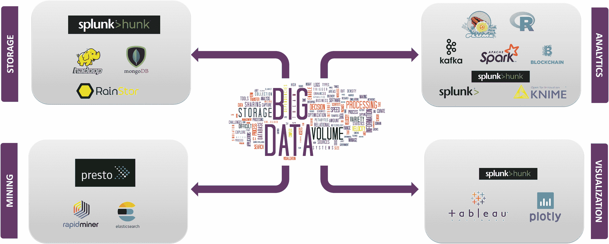

现在，让我们来讨论一下这些技术的事实和功能，以及使用这些技术的公司。你甚至可以通过[数据工程师课程](https://www.edureka.co/microsoft-azure-data-engineering-certification-course)了解大数据的细节。

让我们从数据存储领域的**大数据技术开始。**

**数据存储**

**Hadoop**

**Hadoop 框架**设计用于在**分布式数据处理环境**中存储和处理数据，该环境采用商用硬件和简单的编程模型。它能以高速度和低成本存储和分析存在于不同机器中的数据。

使用 Hadoop 的公司: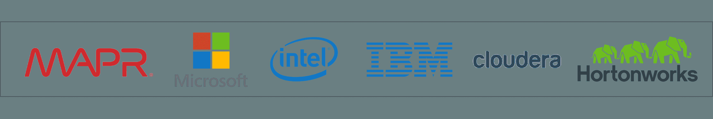

**Mong** **o** **DB**

像 **MongoDB、**这样的 **NoSQL** 文档数据库为关系数据库中使用的严格模式提供了一个直接的替代方案。这使得 **MongoDB** 能够在处理大量**数据类型**和跨**分布式架构的同时提供灵活性。**

使用 MongoDB 的公司:

**Rainstor**

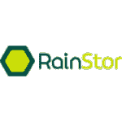 **RainStor** 是一家软件公司，开发了一个同名数据库管理系统，旨在为大型企业管理和分析大数据。它使用**重复数据删除技术**来组织存储大量数据以供参考的过程。

使用 RainStor 的公司:

**大块头**

****

**Hunk** 允许您通过虚拟索引访问远程 Hadoop 集群中的数据，并允许您使用 Splunk 搜索处理语言来分析您的数据。使用 Hunk，您可以报告和可视化来自 Hadoop 和 NoSQL 数据源的大量数据。

现在，让我们进入数据挖掘中使用的**大数据技术。**

**数据挖掘**

**转眼间**

**Presto** 是一个开源的**分布式 SQL 查询引擎**，用于运行**交互式分析查询**来处理从千兆字节到千兆字节的各种大小的数据源。Presto 允许查询 **[Hive](https://www.edureka.co/blog/hive-tutorial/)** ， **[Cassandra](https://www.youtube.com/watch?v=y-ZqjhvFUhc)** ，**关系数据库**和**专有数据存储中的数据。**

使用 **Presto** 的公司:

**快速采矿机**

**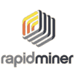**

**RapidMiner** 是一个集中式解决方案，具有非常强大和健壮的图形用户界面，使用户能够创建、交付和维护预测分析。它允许创建非常先进的工作流程，支持多种语言的脚本。

使用 **RapidMiner** 的公司:

**弹性搜索**

**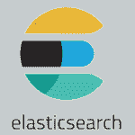**

**Elasticsearch** 是一个基于 Lucene 库的搜索引擎。它提供了一个分布式的、支持多租户的全文搜索引擎，带有 HTTP Web 界面和无模式的 JSON 文档。

使用 **Elasticsearch** 的公司:

至此，我们现在可以进入数据分析中使用的**大数据技术。**

**数据分析**

[**卡夫卡**](https://www.edureka.co/blog/apache-kafka-next-generation-distributed-messaging-system)

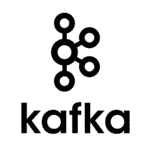

**阿帕奇** **卡夫卡**是一个分布式流媒体平台。流媒体平台有以下三项关键功能:

这类似于消息队列或企业消息传递系统。

*   **由** : Apache 软件基金会于 2011 年开发
*   **写成** **用** : Scala，JAVA
*   **当前** **稳定** **版本**:阿帕奇卡夫卡 2.2.0

使用**卡夫卡**的公司:

**Splunk**

**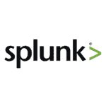 Splunk** 在一个可搜索的存储库中捕获、索引和关联实时数据，并从中生成图表、报告、警报、仪表板和数据可视化。它还用于应用程序管理、安全性和合规性，以及业务和 Web 分析。

使用 **Splunk** 的公司:

刀

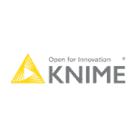 **KNIME** 允许用户可视化地创建数据流，有选择地执行部分或全部分析步骤，并检查结果、模型和交互视图。KNIME 是用 Java 编写的，基于 Eclipse，利用它的扩展机制来添加插件，提供额外的功能。

使用 **KNIME** 的公司:

 **火花**

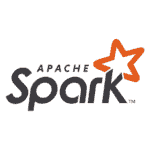

**Spark** 提供了 **[内存计算](https://www.edureka.co/blog/rdd-using-spark/)** 能力来提供速度，一个通用的执行模型来支持各种各样的应用，以及 **[Java](https://www.edureka.co/blog/java-tutorial/) 、** [**Scala**](https://www.edureka.co/blog/what-is-scala/) 和[**Python**](https://www.edureka.co/blog/videos/python-tutorial/)API 来简化开发。

使用 Spark 的公司:

[**R-语言**](https://www.edureka.co/blog/r-tutorial/)

****

**R** 是针对 [**统计计算**](https://www.edureka.co/blog/math-and-statistics-for-data-science/)**图形**的编程语言和自由软件环境。统计学家和数据挖掘者广泛使用 R 语言来开发统计软件，主要用于数据分析。

使用 R 语言的公司:

[**区块链**](https://www.edureka.co/blog/blockchain-tutorial/)

区块链用于支付、托管和所有权等基本功能，还可以减少欺诈、增加金融隐私、加快交易速度和实现市场国际化。

区块链可用于在企业网络环境中实现以下目标:

*   **由**开发出 T2:比特币
*   **写成** **写成** : JavaScript、C++、Python
*   **当前** **稳定** **版本**:区块链 4.0

使用区块链的公司:

至此，我们将进入**数据可视化大数据技术**

**数据可视化**

[**表**](https://www.edureka.co/blog/tableau-tutorial/)

**Tableau** 是用于**商业智能**行业的强大且发展最快的数据可视化工具。使用 **Tableau** 可以非常快速地进行数据分析，并以仪表板和工作表的形式创建可视化效果。

使用 Tableau 的公司:

**阴谋地**

主要是**用来**使创建图形更快更有效。用于 **Python、**、 R 、 **MATLAB、Node.js、Julia、**和 **Arduino** 的 API 库以及一个 **REST API。**也可以用于用 [**Jupyter 笔记本绘制 I **交互式图形**。**](https://www.youtube.com/watch?v=fiQTb7-rCPo)

使用 Plotly 的公司:

 现在让我们来讨论一下新兴的大数据技术

## **新兴大数据技术**

[**张量流**](https://www.edureka.co/blog/tensorflow-tutorial/)

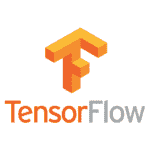

**TensorFlow** 拥有一个全面、灵活的工具、库和社区资源生态系统，使研究人员能够推动机器学习领域的最新发展，开发人员可以轻松构建和部署机器学习驱动的应用。

使用 TensorFlow 的公司:

**光束**

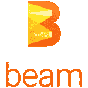

**Apache Beam** 为构建复杂的**并行数据处理管道**提供了一个可移植的 API 层，这些管道可以跨多种执行引擎或运行程序执行。

使用 Beam 的公司:

 [ **码头工人**](https://www.edureka.co/blog/videos/what-is-docker/)

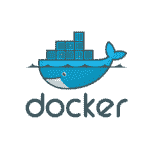

Docker 是一个工具，旨在通过使用**容器来简化应用程序的创建、部署和运行。**容器允许开发人员将应用程序打包成所需的所有部分，比如库和其他依赖项，然后作为一个包发送出去。

使用 Docker 的公司:

**气流**

Apache Airflow 是一个工作流自动化和调度系统，可用于创作和管理数据管道。Airflow 使用由任务的有向无环图(Dag)组成的工作流。在代码中定义工作流提供了更容易的维护、测试和版本控制。

使用气流的公司:

Kubernetes 是一款独立于供应商的集群和容器管理工具，由 Google 于 2014 年开源。它为跨主机集群的应用程序容器的自动化、部署、扩展和操作提供了一个平台。

使用 Kubernetes 的公司:

到此，我们来结束这篇文章**。** 我希望我已经向您展示了一些关于  **大数据** 及其**技术的知识。**

*既然您已经了解了大数据及其技术，请查看 Edureka 在德里举办的  **[Hadoop 培训](https://www.edureka.co/big-data-hadoop-training-certification-delhi)*** *，edu reka 是一家值得信赖的在线学习公司，拥有遍布全球的 250，000 多名满意的学习者。Edureka 的[大数据工程师课程](https://www.edureka.co/masters-program/big-data-architect-training)使用零售、社交媒体、航空、旅游、金融领域的实时用例，帮助学习者成为 HDFS、Yarn、MapReduce、Pig、Hive、HBase、Oozie、Flume 和 Sqoop 方面的专家。*