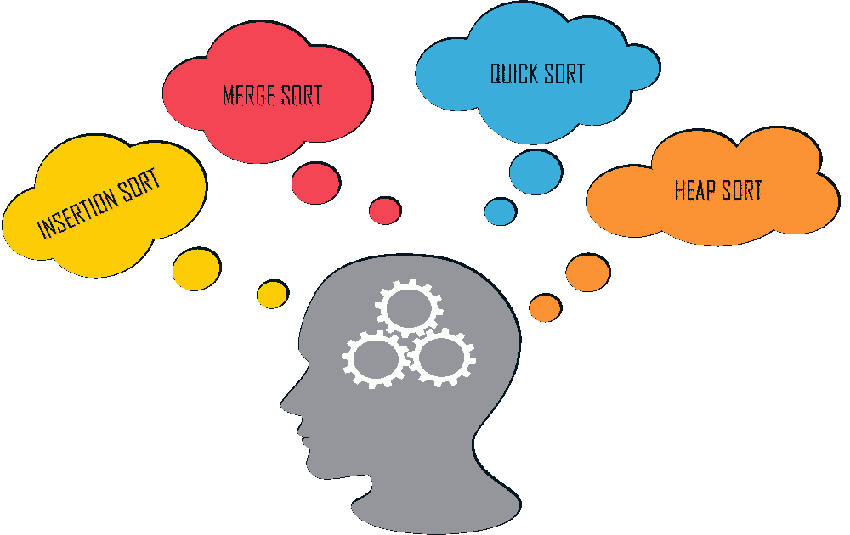

# 2023 年前 25 个编程面试问题

> 原文：<https://www.edureka.co/blog/top-programming-interview-questions>

编码和编程是令人着迷的学科。它让个人每天聚在一起创造独特的东西，分享想法，发展，解决问题，并学习新的东西。据 Business Insider 报道，编程或软件开发将是 2023 年最受欢迎的工作之一。在这篇博客中，我们将带你了解 2023 年最常被问到的编程面试问题。

这个关于编程面试问题的博客将涵盖你在从初级到专家职位的几乎所有面试中会遇到的所有问题。所以，事不宜迟，让我们直接看问题。所以没有任何延迟，让我们潜入 2023 年问得最多的编程面试问题，让我们开始吧！

让我们继续这个编程面试问题博客，深入一些初学者编程问题。

## **初学编程面试问题**

### **1。什么是计算机编程？**

计算机编程是执行特定计算的过程，通常是通过设计/构建可执行的计算机程序。编程涉及分析、生成算法、分析算法的准确性和资源消耗以及算法的实现等任务。

**2。** **编程是如何工作的？**

编程包含一组指令，供计算机执行不同的任务。这些指令是可执行的命令，每个都有不同的用途。

**3。什么是算法？**

一个算法 是告诉计算机显示完成任务的一组指令和标准。算法通过对输入信息应用特定的步骤来实现输出。算法被用在各种程序中，例如搜索引擎，并且在设计自动化中是至关重要的。

**4。什么是常数？**

常量是每当计算机程序启动时保持不变的数据值。例子有文字常量、嵌入在源代码中的常量、名称常量、文字常量的简化标题。

**5。什么是数据结构？**

数据结构是专门用来组织数据和轻松执行功能的系统。一些数据结构包括数组、链表和栈。

**6。什么是调试？**

调试是发现并消除程序中错误的过程。在这个过程中，程序被彻底检查错误。然后指出错误并进行调试。

**7。W 什么时候出现语法错误？**

当程序员使用不正确的语法 编写指令时，会出现语法错误 。 当 程序员写了一行不正确的代码 时，就会出现语法错误。大多数语法错误包括缺少标点符号或拼写错误的名称。如果编译或解释的编程语言中有语法错误，那么代码就不会工作。

让我们继续这个编程面试问题博客，深入一些中级编程问题。

## **中级编程面试试题**

**8。什么时候会出现运行时错误？**

当一个程序在语法上是正确的，但包含一个只有在程序执行过程中才能检测到的问题 时，就会出现运行时错误。这些问题不能在编译时被 Java 编译器捕获，只能在应用程序运行时被 Java 虚拟机(JVM)检测到。

**9。当出现逻辑错误时。**

当一个程序实现了错误的逻辑时，就会发生逻辑错误。翻译器(编译器或解释器)不会报告任何逻辑错误的错误消息。这些错误是最难定位的。

**10。什么是流程图？**

流程图是程序的图形表示，有助于理解算法中的控制和数据流。

### 

**11。你学的第一门编程语言是什么？**

对面试官诚实会有所帮助。你的第一门编程语言是什么？是 JavaScript 错误吗？Python？这个问题的目的之一是评估你的编程语言知识。无论你从哪里开始，都要仔细温习你计划讨论的语言的细节。

**12。什么是循环？**

循环是一种可以重复一组语句达到固定次数或者直到满足某个准则的结构。

**13。什么是数据抽象？**

数据抽象是将大量信息简化为其本质特征的过程。这个过程也被称为“建模”,它简化了程序开发。由于数据库是复杂的结构，只有选择显示对应于特定用户受众的数据才是程序功能的关键。

让我们继续这个编程面试问题博客，深入一些高级编程问题。

## **高级编程面试问题**

**14。编译器的工作原理是什么？**

编译器是一种计算机软件，它将以高级语言编写的源代码翻译或编译成数字计算机 CPU 可以理解的一组机器语言指令。编译器将源代码转换成机器可读的目标代码。这种机器可读代码通常由 0 和 1 组成，因为它是二进制形式。现在编译器可以将程序作为可执行文件运行。

15。什么是变量？

在计算机程序设计中，变量是一个与相关符号名配对的抽象存储位置，它包含一些已知或未知数量的信息，称为值；或者用更简单的术语来说，变量是一组特定的位或数据类型的容器。

16。什么是排序？提及一些分类类型

排序是根据信息类型之间特定的关系元素，以递减或递增的顺序组织数据的过程。

*插入排序*–值逐渐插入到现有列表中。

*合并排序*–创建并合并元素分区，以区分每个分区组件的优先级。

*快速排序*–这种排序类型定位一个枢纽元素，并将较小的元素组织在左边，将较大的元素组织在右边。

*基数排序*–该方法根据数值的位数对数据进行排序。

*堆排序*——一个依赖于将数据排序成序列的过程。

****

**17。什么是文档？**

文档是对程序的算法、设计、编码方法、测试和正确使用的详细描述。对于每天依赖程序的用户来说，以及对于可能被要求修改或更新程序的程序员来说，文档是很有价值的。

18。做程序员最难的是什么？

成为一名计算机程序员最难的可能不是一项具体的技术技能，而是一种人格特质。数字平台和框架的发展速度比以往任何时候都要快。保护自己免于失败的唯一方法不是你从书本上学到的东西，而是你从自己内心培养的东西。适应性是计算机程序员在职业生涯任何阶段的秘密武器。如果你致力于适应的艺术，你很快就会发现自己已经准备好并有能力应对摆在你面前的每一个挑战。

**19。能说说你最喜欢的编程项目吗？**

每个程序员都有自己喜欢的语言，他们喜欢用这种语言来完成项目。了解一个人最喜欢的编程项目可能会告诉你很多他们在工作中喜欢做什么。你可能会发现这个人在解决复杂问题时喜欢创新思维，或者候选人喜欢迷失在重复的代码行中。

20。什么是二分搜索法，如何使用它？

二分搜索法也称为半区间搜索、对数搜索或二进制斩波，是一种在排序数组中查找目标值位置的搜索算法。二分搜索法将目标值与数组的中间元素进行比较。

在任何可以用小于/大于方式比较元素的情况下，实现二叉查找树都是有用的。对于我们的例子，我们将使用字母顺序作为判断一个元素是大于还是小于另一个元素的标准。这是一个重要的编程面试问题，请注意！

**21。** **定义低级编程语言。**

在计算机编程中，没有从计算机的“指令集体系结构”中概括出来的编程语言被称为低级编程语言。它通常指向机器代码或汇编语言。

**22。定义高级编程语言。**

在计算机编程中，从计算机的“指令集体系结构”中提供高度概括的编程语言被称为高级编程语言。为了使程序的开发比低级编程语言更容易，它可以使用自然语言元素。

**23。什么是机器码？**

机器码是一种语言，可以由微处理器直接处理，不需要任何之前的转换。程序员从不直接用机器码写程序。

**24。** **什么是建模语言？**

一种人工语言，可用来表达信息、知识或系统，其排列由可靠的规则数定义。这些规则也用于解释结构中组件的含义。

**25。什么是分析程序？**

将程序分解成子问题的过程。我们试图单独解决每个子问题，而不是把更大的问题作为一个整体。这导致了一个简单的解决方案。这种技术也被称为自顶向下设计。

这些是面试中被问得最多的编程问题，尽管这些问题很简单，可以重新组织。答案不变。希望这些问题能让你知道你需要准备什么样的问题。下一步是什么？为什么不试试 [Edureka 的 Python 面试问题](https://www.edureka.co/blog/interview-questions/python-interview-questions/)并在下一次 Python 开发者面试中胜出呢！

如果你想从零开始学习编程，你是否可以参加 Edureka 的 [Python 认证](https://www.edureka.co/python-programming-certification-training)考试，在那里你将会受到业内顶尖 Python 开发者的指导，他们不会教你 Python，但也会指导你如何成为业内最好的软件开发者。快乐学习！