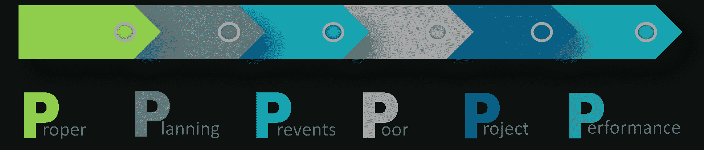
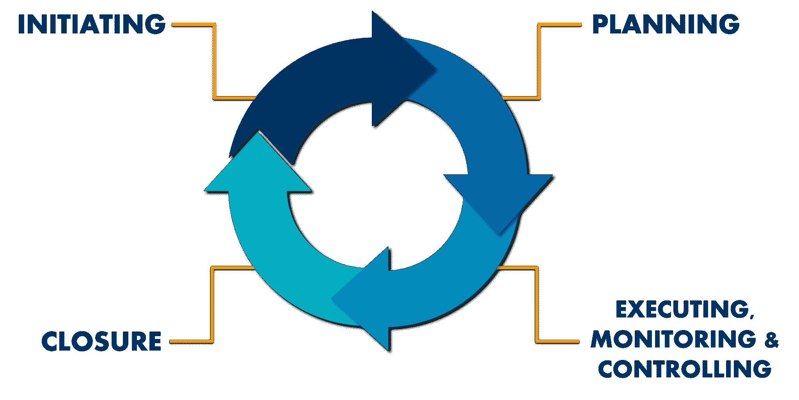
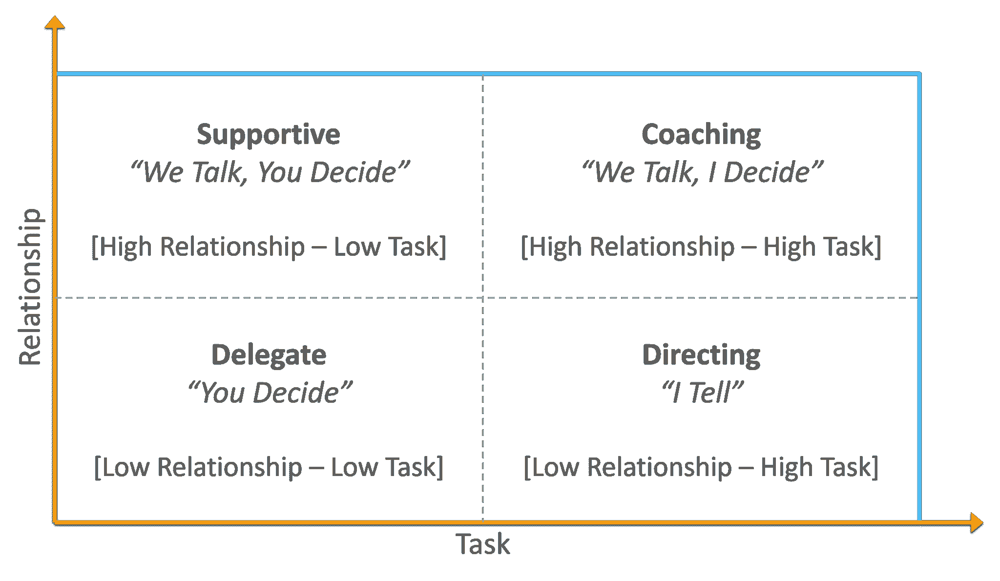
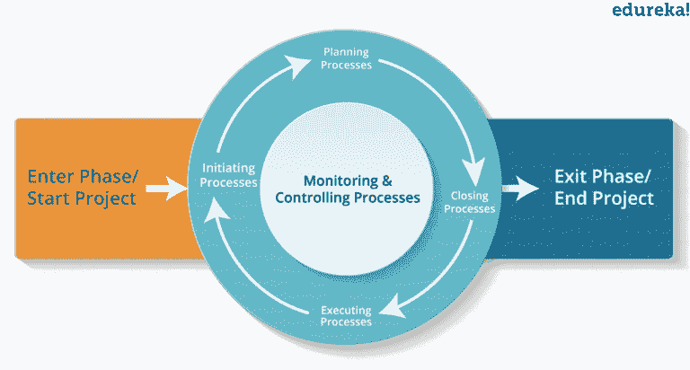
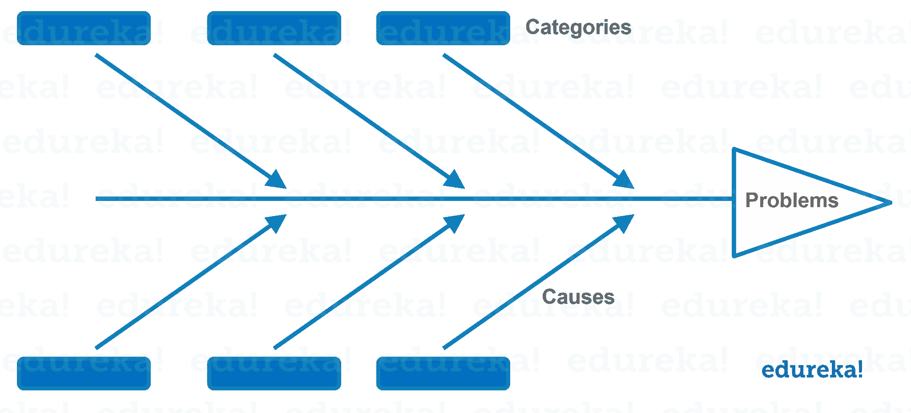
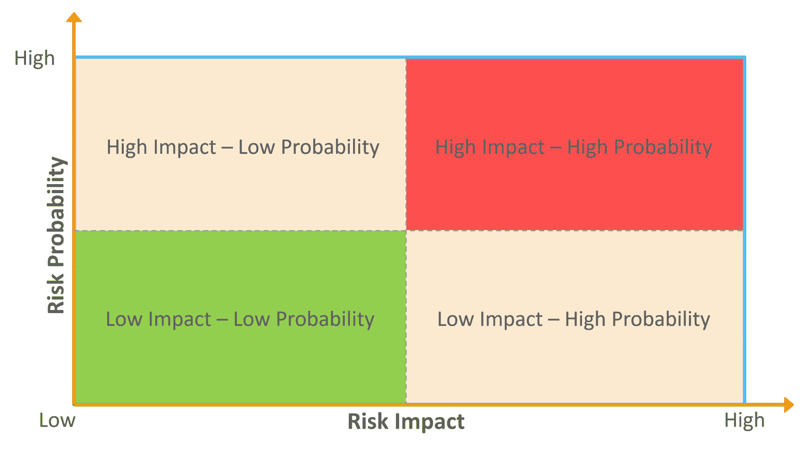
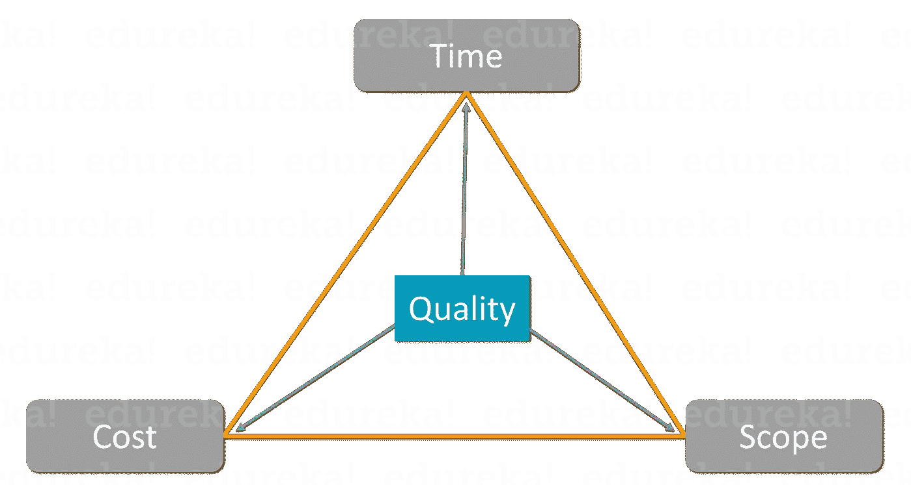

# 2023 年你需要知道的 30 大项目经理面试问题

> 原文：<https://www.edureka.co/blog/interview-questions/top-project-management-interview-questions/>

[项目管理](https://www.edureka.co/blog/project-management/)是一门以可控的方式帮助组织和管理项目目标以产生独特成果的学科。[项目经理](https://www.edureka.co/blog/project-manager-salary/)的职业可以追溯到 19 世纪早期，但是直到 20 世纪末才被认为是一个独立的职业。但是在今天的市场上，它被认为是最有声望的职业之一，能提供丰厚的薪水。但是掌握它绝对不是小菜一碟，你必须在全球范围内与他人竞争。在这篇 2023 年前 30 名项目经理面试问答文章中，我将帮助你为面试做好准备，并取得成功。

如果你想确保你作为项目经理的工作，你也可以检查我们的 [**PMP 认证培训**](https://www.edureka.co/pmp-certification-exam-training) ，因为像 PMP、普林斯 2 等认证。有助于充实你的简历，受到全球雇主的青睐。

那么，让我们从项目经理面试问题开始吧。

## **项目经理基本面试问题**

## **1。项目、计划和投资组合之间的区别是什么？**

| **项目** | **程序** | **投资组合** |
| 努力生产独特的产品或解决方案 | 一起管理的一组相互关联的项目 | 为实现战略目标而在一个小组下管理的项目和运营的集合 |
| 本质上是临时的，有确定的起点和终点 | 本质上是临时的，但持续时间比项目更长 | 本质上是永久性的，不断变化并与战略规划保持一致 |
| 遵循项目级计划，主要关注详细交付 | 遵循由详细计划支持的高级计划 | 遵循正在进行的流程，这些流程对产品组合进行优先排序和调整，以实现战略目标 |
| 有一个狭窄而明确的范围，没有变化 | 范围很广，可以根据客户要求随时改变 | 从整个组织的战略角度来看范围最广 |

## **2。解释一下你所知道的“六顶思考帽”的原理**

“六顶思考帽”是一种从不同角度理解问题的有趣方式。你可以从 6 个不同的角度思考，或者你和你的团队成员可以这样做。现在，6 顶帽子中的每一顶都代表了不同的观点。让我们一个一个来说:

**一、白帽子:** 一个有白帽子的人只会谈论信息，你要从讨论的范围内外两方面来考虑。

黄色的帽子: 黄色的帽子象征着光明和乐观。这顶帽子的佩戴者应该 尽可能带来或想到与主题相关的积极方面。他们应该鼓励团队成员。

**黑帽子:** 戴黑帽子的人负责识别任何错误或路障。他们应该有判断力。想想所有可能出错的事情。考虑最坏的情况，这样其他人就能找到解决方案。

**红帽子:** 一个戴红帽子的人应该表达他的思想或感情。红帽子象征着情感。你可以表达情绪和感受，分享喜欢，不喜欢，喜欢&讨厌。这里的目标是解决情绪的可信度，这是某个讨论的一部分。

**绿帽:** 一个戴绿帽的人应该有新的创新想法。他们应该有创造力。他们应该了解所有的信息和问题，并提出解决问题的新想法，帮助提高生产力。戴这顶帽子的主要目的是产生尽可能多的新想法。

**蓝帽子:** 蓝帽子就是思考帽(cap)。这完全是关于思考。正是这个帽子确保了六个思考帽指导方针的遵守。

他们决定了议程和时间表，会议需要多长时间？什么时候你需要戴一顶特别的帽子，戴多久？因此，小组管理员应该在会议期间戴一顶蓝色的帽子。

## **2。你对项目管理的理解是什么？**

6 P’s of Project management – Project Manager Interview Questions

项目管理是帮助实施各种过程、方法、知识、技能和经验以实现特定项目目标的学科。项目管理与通常的管理完全不同。区分这两者的一个关键因素是项目管理有最终的可交付成果和明确的时间表，而管理是一个持续的过程。项目经理必须始终遵循项目管理的 6P 规则，即适当的规划可以防止项目绩效不佳。

## **3。详细阐述项目管理生命周期流程？**

Life Cycle – Project Manager Interview Questions

[项目管理生命周期](https://www.edureka.co/blog/project-management-life-cycle/)是一系列对完成项目目标至关重要的各种活动/任务。这有助于将工作结构化，并将其简化为一系列符合逻辑且易于管理的步骤。项目管理生命周期由以下四个简单的阶段组成:

1.  启动 这是项目生命周期中的第一步，也是最重要的一步，在这一步中，项目的初始范围被定义，资源被分配。这个过程组确保了你的项目的成功。
2.  [计划](https://www.edureka.co/blog/project-management-life-cycle/#planning) 在这个过程组中， 为项目草草记下一个适当的详细程度，以计划时间、成本和资源。它估计所需的工作并有效地管理风险。
3.  执行 该过程组由用于完成项目管理计划中定义的工作的过程组成。这是关于实现项目的目标。它还包括跟踪、审查和管理项目的绩效。此外，您需要快速识别潜在的问题，并采取纠正措施。
4.  [收尾](https://www.edureka.co/blog/project-management-life-cycle/#closure) 这个过程组是项目管理的一个重要组成部分，为完成项目而执行的所有项目活动都要收尾。这意味着完成所有过程组的所有活动，解散项目团队，并使用项目结束报告与客户签署项目。

## **4。项目经理应该具备的最重要的技能是什么？**

项目经理必须具备的最重要的技能是:

1.  沟通
2.  领导力
3.  小组管理
4.  谈判力量
5.  个人组织
6.  风险管理

## **基于职业的项目管理面试问答**

## **5。作为一名新的项目经理，你将如何开始你的工作？**

当你开始项目经理的工作时，你需要注意的几件事是:

*   听，观察和学习
*   了解客户的需求和愿望
*   了解你的团队和他们的个性
*   抓住机会学习一些新技能
*   在工作场所帮忙
*   努力掌握你公司拥有的工具

## **6。将如何确定项目中任务的优先级？**

对项目中的任务进行优先排序是非常重要的，尤其是当它是一个大项目时。它有助于确保成功和及时完成您的项目。为了确定任务的优先顺序，您应该遵循以下几点:

1.  列出任务和职责
2.  区分紧急和重要
3.  评估每项任务的价值
4.  根据估计的工作量对任务进行排序
5.  保持灵活性，随时准备适应
6.  知道什么时候说不

## **7。你的领导风格是什么？**

领导力是每个项目经理都必须具备的素质。每个领导者都有自己的领导风格来指导他的团队。领导风格指的是领导者在指导、激励、引导和管理其团队以发挥其最大潜能时的特有行为。在一个项目中，他们有责任激励他人更好的表现、创造和创新。

Leadership Styles – Project Manager Interview Question

基本上有四种类型的领导风格，你的领导风格应该视情况而定，取决于你所工作的团队类型和项目中所涉及任务的重要性。以下是四种领导风格:

1.  代表
2.  支持的
3.  导演
4.  辅导

## **8。你理想的项目是什么？**

在你决定你的理想项目之前，你必须考虑以下问题。这些问题将帮助你缩小选择范围，同时确保你的生产力最大化。

*   你最喜欢什么类型的工作？
*   你有多希望并被允许展示你的创造力？
*   在什么样的截止日期下，你工作得最好？
*   你对在项目中尝试新事物有多满意？
*   你喜欢总是因为你的工作而得到全部的荣誉吗？
*   你喜欢作为团队的一员工作吗，还是你更喜欢独自工作？

## **9。项目管理框架中的过程和过程组是什么？**

项目管理框架中的流程是成功完成项目所涉及的任务的定义方式。这些流程定义了要采取的行动及其顺序。在项目管理框架中，大约有 49 个过程嵌入到不同的过程组中。 [过程组](https://www.edureka.co/blog/project-management/#PMPhases)是适用于项目各个阶段的过程的集合。

Process Groups – Project Manager Interview Questions

共有 5 个过程组，其中映射了 10 个知识领域和 49 个过程。这五个过程组是:

1.  开始
2.  规划
3.  执行
4.  监控和控制
5.  关闭

## **10。什么是知识领域，它们在项目中的相关性如何？**

知识领域是对有效的项目管理至关重要的核心技术主题。所有 49 个流程主要是这些知识领域的一部分，在这些领域中，它们根据其共性进行分组。下面我列出了项目管理框架的 10 个知识领域:

*   项目集成管理
*   项目范围管理
*   项目进度管理
*   项目成本管理
*   项目质量管理
*   项目资源管理
*   项目沟通管理
*   项目风险管理
*   项目采购管理
*   项目利益相关者管理

## **11。你会如何处理项目中一个难相处的利益相关者？**

由于利益相关者拥有很高的权威，并且是项目不可分割的一部分，因此获得他们的同意是非常重要的。但有时它们可能有点难以处理，在这种情况下应该:

*   不战而屈人之兵
*   消除所有的负面情绪
*   了解他们的问题
*   征求意见并听取他们的意见
*   对你的决定要委婉和诚实
*   赞美他们，并尝试建立联系
*   改善您的沟通

## **中级项目管理面试试题**

## **12。什么是项目管理中的 RAID？**

项目管理中的 RAID 代表 **R** 风险、 **A** 假设、 **I** ssue 和 **D** 依赖。这些是项目经理必须了解的非常重要的项目。

*   **风险**是潜在的问题，可能对项目产生积极或消极的影响，导致最终结果偏离原计划。
*   **行动**是您在整个项目中执行的任务。
*   **问题**是你在项目过程中可能面临的障碍，必须成功解决，否则可能会使项目脱轨或导致项目失败。
*   **决策**是你在项目中对行动/任务的选择。

## **13。当你认为你的项目偏离了轨道，你会采取什么措施来确保它在给定的时间内完成？**

要检测您的项目是否按计划进行或落后于商定的时间表，您必须检查以下几点:

*   预算是否在控制之中
*   是不是太耗时间了
*   项目范围不断变化吗
*   原始目标是否仍然存在

如果这些问题的答案是正确的，那么你的项目肯定偏离了轨道，你必须立即采取行动使它回到正轨。您可以采取的几个步骤是:

*   发现根本原因
*   投入更多的时间和努力来赶上
*   试着跟随最初的目标或愿景
*   重新调整资源管理(资源、财务、人力等)。)
*   与客户和利益相关者保持开放的沟通

## **14。** **在你的项目中，你更喜欢采用哪种项目管理方法？**

没有一种方法可以适用于所有类型的项目。项目管理方法的选择必须基于以下标准:

*   您组织的战略目标和核心价值
*   项目的关键业务驱动因素
*   项目中的约束(如果有)
*   参与项目的利益相关者
*   可能发生的风险
*   项目的复杂程度
*   项目的估计规模和成本

## **15。改进过程活动最常用的工具是什么？**

行业中主要使用的工具:

*   比较和基线化流程
*   流程图
*   价值流图
*   因果分析
*   假设检验

## **16。你将如何管理没有充分发挥潜力的团队成员？**

为了让您的团队成员发挥出最佳水平，您必须:

*   尽量避免与团队和利益相关者发生任何形式的情绪冲突
*   鼓励他们以自己的方式思考和行动
*   帮助你的团队成员发展他们的决策能力
*   发展他们的表现耐受阈值
*   让那些更强的人围绕在弱势员工周围，从而增强他们的潜力
*   了解什么能激励你的员工
*   向员工展示他们在公司使命和愿景中的位置
*   安排适当的跟进流程
*   奖励和欣赏他们的进步，以鼓励他们
*   如果没有改进的余地，随时准备放手

## **17。作为一名项目经理，你将如何获得团队对结果的认同？**

信任和认同是促进团队中适当沟通和协调的关键因素。那会给你带来最好的结果。要获得团队成员的认同，您必须:

*   从一开始就保持明确的期望
*   建立可实现的里程碑，这样他们就不会感到有压力
*   在整个项目中协作并保持团队信任
*   与团队就条款达成一致，并征求他们的意见
*   安排频繁的问责会议
*   确定结果和后果
*   一旦团队成员之间出现任何冲突，立即解决

## **18。解释石川/鱼骨图。**

鱼骨图也称为因果图或石川图。它是一种可视化工具，用于对问题的潜在原因进行分类，以确定其根本原因。一位名叫石川馨博士的日本质量控制专家发明了这个鱼骨图，以帮助员工避免仅仅解决一个更大问题的症状的解决方案。

Process Groups – Project Manager Interview Questions

## **19。解释你为你的团队所遵循的整个团队形成过程。**

团队的发展阶段通常包括:

*   形成:在这个阶段，整个团队第一次团结起来，重点是在团队内部建立关系，并阐明项目的使命或愿景。
*   在这个阶段，团队成员更愿意与团队分享他们的观点，也更愿意面对团队内部冲突的可能性。
*   规范:在这个阶段，项目团队在继续项目的任务上得到澄清和支持。
*   表演:在这个阶段，团队成员学会了信任和接受对方。每个团队成员都变得能干、自主，能够在没有任何人监督的情况下处理决策过程。
*   休会:这是团队组建过程的最后阶段，发生在项目完成之后。在这个阶段，团队被解散，资源被释放。

## **高级项目管理面试试题**

## **20。三点估算法的计算过程是怎样的？**

有两种方法可以计算三点估算:

*   **三角形分布** E = (P+M+O)/3
*   **Beta 或 PERT 分布** E = (P+4M+O)/6

其中 P =悲观主义者，O =乐观主义者，M =最有可能。

## **21。解释工作分解结构(WBD)及其对任务/活动的工作估算的影响？**

工作分解结构定义了完成项目所需的工作活动以及每个工作要求的子活动。它有一个层次结构，其中具体的/主要的活动被分成逻辑的子活动。有两种方法:

1.  自上而下的方法
2.  自下而上的方法

## **22。区分风险和问题。**

| **问题** | **险** |
| 问题更关注当下 | 风险更关注未来 |
| 这些在本质上总是倾向于负面的 | 它们可以是积极的，也可以是消极的 |
| 问题通常记录在“问题登记簿”中 | 风险通常记录在“风险登记簿”中 |
| 对问题的回应将是“问题解决方法” | 对风险的反应基于“风险反应计划” |

## **23。为什么项目经理需要积极主动？**

积极主动的经理有更大的机会发现风险并实施解决方案以将其最小化。积极主动，让他们对项目任务和资源有更多的控制权。他们可以更好地跟踪所有任务和问题，以实现更高的生产率和效率的小变化和改进。为开发人员组织频繁的会议，讨论他们的问题，集体讨论解决方案，分享最佳实践等。将每周花费在任务上的实际成本和时间与计划数字进行比较。

## **24。风险影响和风险概率有什么区别？**

**风险概率**是风险发生的几率，而**风险影响**是风险发生时的成本。

Risk Probability and Impact Relation – Project Manager Interview Questions

## **25。你更喜欢在你的项目中使用哪种沟通方式？**

您在项目中使用的沟通类型将完全取决于您正在进行的项目类型和您拥有的团队类型。项目经理使用的沟通方式类型:

1.  书面的
2.  电子的
3.  面对面的
4.  应答的

## **26。你所理解的时间&物质契约是什么？**

这是一种混合合同安排，包含费用偿还合同和固定价格合同的各个方面。时间和材料合同类似于费用偿还型安排，没有明确的结束时间。该合同通常用于无法估计准确项目规模的项目，或者预计项目需求很可能会发生变化的项目。

## **27。如果在项目结束时，任何客户对产品的质量或结果不满意，你会怎么做？**

要处理不满意的顾客，你必须:

*   向顾客展示你对他们的重视
*   理解他们不快乐的原因
*   弄清楚他们想要什么样的修改
*   如果可能的话，尝试合并修改
*   如果不可能，尝试说服并向客户解释项目符合约定的范围

## **28。什么是帕累托原理分析？**

帕累托分析是决策中的一种统计技术。它基本上用于选择有限数量的任务，这些任务可以带来显著的整体效果。这个原则遵循**帕累托原则**(也称为 80/20 法则)，并声明 80%的结果来自 20%的行动。它有助于确定工作的优先顺序，尤其是在包含许多小任务的大型项目中

## **29。解释项目管理中的三重约束三角形。**

Triple Constraint – Project Manager Interview Questions

[三重约束三角形](https://www.edureka.co/blog/project-management/#ProjectManagement)是三个关键部分的组合，它们作为对任何项目都是最重要的限制。以下是该模型中的三个约束条件:

1.  时间
2.  费用
3.  范围

每个约束形成以质量为中心因素的三角形的顶点。

## **30。你在项目中可能遇到的主要风险类型是什么？**

项目中遇到的主要风险有:

*   成本风险
*   进度风险
*   性能风险
*   资源风险
*   技术风险
*   市场风险
*   法律风险
*   战略风险
*   治理风险
*   操作风险
*   外部风险

这就把我们带到了这篇关于顶级项目经理面试问答的文章的结尾。我希望它有助于提高你的知识。祝你面试一切顺利。快乐学习。

*如果您发现这篇文章与* *的“项目经理面试问题”相关，* *请查看 Edureka 提供的 [PMP 海得拉巴培训](https://www.edureka.co/pmp-certification-exam-training-hyderabad)* *，edu reka 是一家值得信赖的在线学习公司，在全球拥有超过 250，000 名满意的学习者。*

*有问题吗？请在这个项目经理面试问题的评论部分提到它，我们会给你回复。*