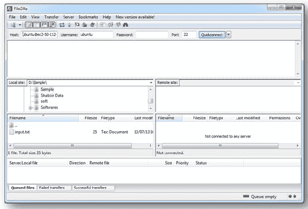
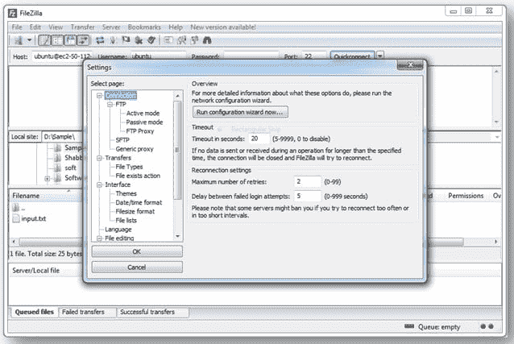
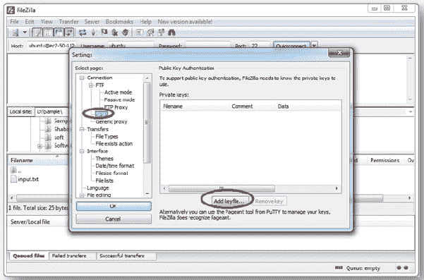
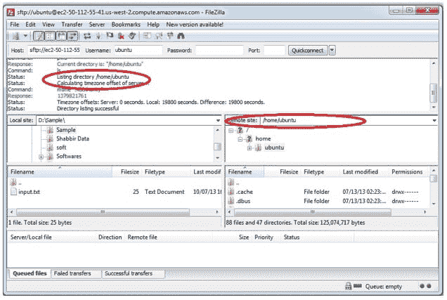

# 将文件从 Windows 传输到 Amazon EC2 实例

> 原文：<https://www.edureka.co/blog/transfer-files-windows-ec2-to-amazon-instance/>

在我们之前的博客 中，我们已经看到了将文件从 Windows PC 转移到 Cloudera 演示虚拟机的逐步指南。继续这篇博客，我们将看到如何将文件从 Windows 转移到 Amazon EC2 实例。

为此，我们还需要一个 FTP(文件传输协议)软件，如 **FileZilla** 。连接 AWS EC2 实例(或服务器)有多种方法，其中一种是*公/私*密钥对方法。这篇博客描述了使用*公/私*密钥对传输文件的一步一步的过程。

### **第一步:下载 FileZilla 并安装**

从以下链接下载并安装适用于 Windows 操作系统的 FileZilla:

[https://filezilla-project.org/download.php](https://filezilla-project.org/download.php)

打开 FileZilla。将出现以下屏幕:

### **第二步:与 Cloudera 建立连接**

为了建立连接，我们需要以下四个参数:

**主机名:**亚马逊 EC2 实例的公共 ID(主机名)。用户名:AWS EC2 服务器的用户名。默认情况下，它是“ubuntu”。 **密码:** AWS 集群没有任何密码。它只用钥匙。 **端口号:**访问 Cloudera 演示虚拟机上的文件传输服务的端口号。因为是 SSH 连接，所以使用端口号‘22’。

下面是 AWS EC2 实例的值:

**主机名:**ubuntu@ec2-50-112-55-41.us-west-2.compute.amazonaws.com**用户名:** ubuntu **密码:**【空白】因为 AWS EC2 使用基于密钥的认证 **端口号:** 22

**在 FileZilla 字段中编辑这些参数，如下图所示。**

现在，指定私有密钥文件**(。ppk)** 连接到相应的各自集群服务器。点击**编辑- >设置**，你会发现如下画面:

点击 **SFTP** 并选择选项添加密钥文件，如下图所示。

选择您的键**(ppk 文件)**存在，点击**确定**。点击 FileZilla 中的“**快速连接**按钮。

一旦连接到实例，FileZilla GUI 的右窗格将列出 Amazon EC2 集群实例的目录结构，如下图所示:

剩下的步骤与我们在 **[之前的博客](https://www.edureka.co/blog/windows-to-cloudera-demo/)** 中所做的相似。