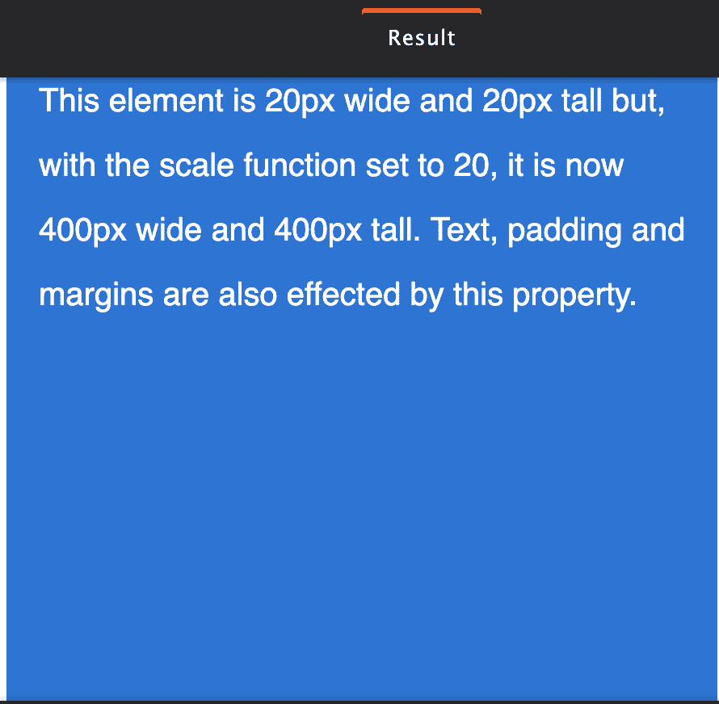

# 如何在 CSS 中最好地利用 Transform？

> 原文：<https://www.edureka.co/blog/transform-in-css/>

在本文中，我们将详细了解 CSS 中的转换，并通过详细的实践演示来跟进。本文将涉及以下几点:

*   [什么是转换 CSS？](#WhatistransformCSS?)
*   [各种变换属性是什么？](#Whatarethevarioustransformproperties?)

随着网站功能的进步，在你的网站上提供巧妙的整合以使其更吸引人和更好也同样重要。添加各种 CSS 元素来补充你的站点是当前的需要。人们远离那些对大众没有吸引力的网站。因此，如何尝试转换一些元素，并用较小的压缩值美化您的 CSS。为了满足类似的需求，我们开发了 transform CSS 属性，通过倾斜、旋转、缩放或平移来转换元素。

继续这篇关于 CSS 转换的文章

## **什么是转换 CSS？**

变换 CSS 元素意味着为它提供 2D 或 3D 形式的边缘。它在视觉上改变了元素的样式。 2D 变换适用于 X 轴和 Y 轴。您可以在两个轴上提供任何边或结构来进行更改。而对于 3D 变换，它需要在 X、Y 以及 Z 轴上工作，以提供所需的深度。如欲了解更多信息，请立即参加[全栈开发者课程](https://www.edureka.co/masters-program/full-stack-developer-training)/

CSS 2D 变换属性:

| **功能** | **描述** |
| 矩阵( *n，n，n，n，n，n* | 六值矩阵 |
| 平移( *x，y* ) | 允许元素沿 X 轴和 Y 轴移动 |
| translateX( *n* | 允许元素沿 X 轴移动 |
| translateY( *n* | 允许元素沿 Y 轴移动 |
| 刻度( *x，y* ) | 更改元素的宽度和高度 |
| scaleX( *n* ) | 更改元素的宽度 |
| scaleY( *n* ) | 更改元素的高度 |
| 旋转(*角度*) | 允许以参数中指定的角度旋转元素 |
| 歪斜( *x 角度，y 角度*) | 沿 X 轴和 Y 轴倾斜元素 |
| skewX( *角度*) | 沿 X 轴倾斜元素 |
| 歪斜(*角度*) | 沿 Y 轴倾斜元素 |

CSS 3D 变换属性:

| **属性** | **描述** |
| 改变 | 对元素应用 2D 或 3D 变换 |
| 转换原点 | 允许您更改变换元素的位置 |
| 转换样式 | 指定嵌套元素在三维空间中的渲染方式 |
| 远景 | 指定如何查看 3D 元素的视角 |
| 透视原点 | 指定 3D 元素的底部位置 |
| 背面可见度 | 定义元素不面对屏幕时是否可见 |

例如:

```
css
.element {
width: 20px;
height: 20px;
transform: scale(20);
}

```

现在，当您这样做时，定义的元素将被缩放 20 倍。



不仅如此，您还可以在水平和垂直方向上进行轴向缩放。

```
transform: scaleX(2);
transform: scaleY(.5);

```

要在所有浏览器之间提供适当的转换，您可以:

```
div {
-webkit-transform: scale(1.5);
-moz-transform: scale(1.5);
-o-transform: scale(1.5);
transform: scale(1.5);
}

```

transform CSS 属性改进了 CSS 可视格式级别的坐标空间。什么是视觉格式化水平？可视化格式层是指对文档进行处理，并在媒体平台上可视化呈现。通过可视化格式，您可以将每个元素转换为符合 CSS box 模型的模型。CSS box model 定义了一个标准矩形框格式的元素，定义了大小、位置和属性。 **注:**只有可变形元素才能变形。

继续这篇关于 CSS 转换的文章

## **各种变换属性是什么？**

让我们看看所有的转换属性:

**1.scale():** 缩放是指水平或垂直改变元素的大小。

对于垂直缩放: scaleX

对于水平缩放: scaleY

对于元素，您还可以更改字体大小、填充、高度或宽度。默认值为 1，这也意味着提供 0.5 作为该值的一半，而提供 2 使缩放加倍。

**2。skew():** Skew 属性允许用户从一个坐标点向右或向左倾斜一个元素。这几乎就像把一个矩形变成一个平行四边形。您可以根据元素的坐标倾斜元素。

**举例:**

```
.element {
transform: skewX(25deg);
}
.element {
transform: skewY(25deg);

```

这样做时，元素会使用 skewX 或 skewY 水平和垂直倾斜 25 度。

3.rotate( **)** :使用该属性可以顺时针旋转元素。您可以将它旋转 180 度或 360 度，使其回到原来的位置。

```
.element {
transform: rotate(25deg);
}

```

为了提供旋转，您可以使用三个维度中的任何一个:rotateX、rotateY 或 rotateZ。

4.translate( **)** :可以适当上下左右移动一个元素。

```
.element {
transform: translate (20px, 10px);
}

```

Translate 将上下或左右移动指定的对象/元素。第一个指定值将向右移动对象(负值将向左移动)，第二个值将向下移动对象(指定负值将向上移动对象)。

如果这可能会使你困惑，那么应用 X 轴来改变元素的水平位置，应用 Y 轴来改变元素的垂直位置。关于 transform 属性最令人惊奇的方面是，应用 transform 将只允许元素移动，而保持所有其他元素或文本不变。距离通常以像素或百分比为单位。

**例如:**

```
.element {
transform: translateX (value);
transform: translateY (value);
}

```

5.perspective():您可以在元素的透视图中提供深度。它允许对一个元素进行 3D 变换，方法是在变换中使其为立方体。 translate3d(x，y，z) translateZ(z)

```
translate3d(x, y, z)
translateZ(z)

```

z 轴的引入给了元素一个三维可视化。translateZ()将元素移向查看者，而负值将元素移离查看者。

**6。matrix()** :将所有的变换合并成一个。

```
rotate(45deg) translate(24px, 25px)

```

应用 matrix()将所有转换属性组合在一个数组中。

应用变换属性可以大大增强你的元素，从而提高你的网站的吸引力。一定要尝尝！

这就把我们带到了这篇关于 CSS 中的转换的文章的结尾。

如果你有兴趣学习更多关于网络开发的知识，可以看看 Edureka 的 **[网络开发认证培训](https://www.edureka.co/complete-web-developer)** 。 *Web 开发认证培训将帮助您学习如何使用 HTML5、CSS3、Twitter Bootstrap 3、jQuery 和 Google APIs 创建令人印象深刻的网站，并将其部署到亚马逊简单存储服务(S3)。*

如果你仍然感兴趣，如果你有任何问题，你可以在这个“什么是 CSS”博客的评论区发表，我们会尽快回复你。