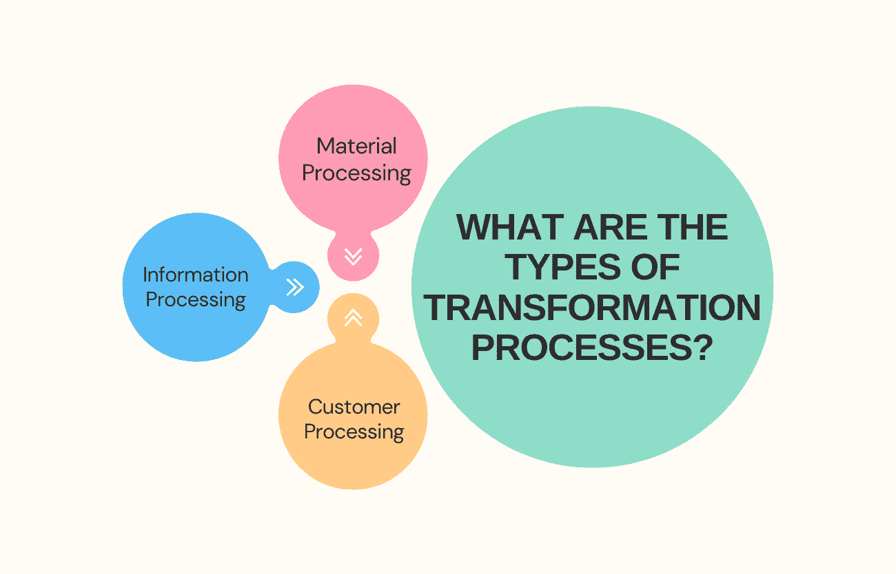
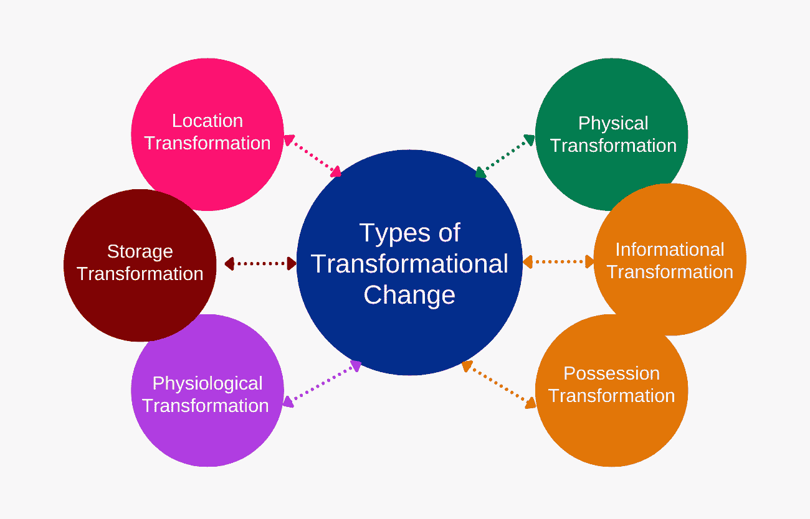
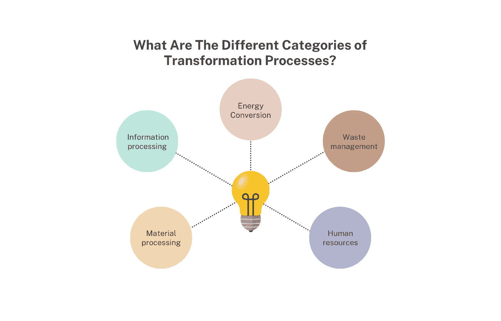

# 运营管理中的转型过程是怎样的？

> 原文：<https://www.edureka.co/blog/transformation-process-in-operations-management/>

在[运营管理](https://www.edureka.co/blog/beginners-guide-to-operations-management/)中的转变过程就是将输入转化为输出。这可以通过制造或服务流程来实现。转换过程的目标是增加信息的价值，使信息的价值超过其各部分的总和。为了增加价值，投入必须转化为对顾客更有益的东西。

转型过程可被视为一个增值链，其中每个环节都为最终产品增值。转型过程中最重要的部分是选择正确的投入。错误的输入会导致不太令人满意的输出。同样，选择错误的制造或服务流程会导致次优结果。了解转型过程以优化您的运营并创造竞争优势至关重要。

## **运营管理中的转型过程:概述**

运营管理中的转变过程需要一系列将输入转化为输出的活动。转化过程可以是物理的或化学的。在商业中，该术语通常指制造过程。

在运营管理中，转换过程的输入通常是原材料，而输出是成品。转换过程旨在为信息增加价值，并创造满足客户需求的产品。

运营管理中的转型过程涉及几个步骤:

*   从供应商处接收输入。
*   材料被储存起来，直到需要的时候。
*   生产计划决定了材料加工的顺序。
*   材料被转移到生产区域。
*   工人们将材料转化成成品。
*   产品经过检验和测试，以确保质量。
*   成品运送给客户。

## **运营管理中的转型流程有哪些类型？**

**材料加工**

在运营管理中有各种转换流程，但物料处理是最常见的一种。这种转变包括将原材料转化为成品。成品可以是实物也可以是服务。

材料加工有许多步骤，但基本的想法是把原材料变成更有用的东西。这通常包括通过一些制造过程增加原材料的价值。例如，原木可以变成家具，或者生铁可以变成钢。

物料处理是运营管理的重要组成部分，因为它通常负责生产客户将购买的最终产品。正因为如此，仔细计划和执行材料加工活动以确保最终产品满足客户期望是至关重要的。

**信息处理**

运营管理是关于计划、指导和控制将投入转化为成品或服务的活动。

有三种主要类型的转换过程:信息处理、物理转换和化学转换。

物理转化通过制造、组装和包装将原材料转化为成品。化学转化改变了物质的化学成分，从而创造出新产品或增强现有产品。信息处理包括使用数据和信息来执行决策、监测和控制任务。

**客户处理**

运营经理使用转换流程将输入转化为输出。所使用的转换过程的类型取决于操作的性质。

所用的转化过程类型是生产。例如，在一家制造企业，投入可能是原材料，产出可能是成品。在服务公司中，输入可能是客户请求，输出可能是满意的客户。所使用的转换过程的类型是客户处理。

有四个主要的转换过程:生产、制造、装配和海关处理。生产是使用原材料从无到有创造某种东西的过程。制造是使用工具和机器从零件创造某种东西的过程。

组装就是将零件组装在一起，创造出一个完整的产品。客户处理是从客户那里获取输入，并将其转化为满足其需求或期望的输出。

所使用的转换过程的类型将取决于操作的性质。例如，生产和客户处理可能发生在也提供服务的制造公司。在某些情况下，可能会使用一个以上的转换过程。

## **转型变革的类型**

**物理转化**

有三种类型的物理转换:

1.  **结构转型—**这种转型改变了组织的物理结构，例如引入新的产品线或建设新的设施。
2.  **流程转型—**这种转型改变了组织内部的工作方式，例如引入新的生产方法或采用新技术。
3.  **行为转变–**这种类型的转变会改变员工的文化和行为，比如引入新的价值观或改变奖励方式。

## **信息转换**

信息转换是改变信息的形式或结构而不改变其含义的过程。最常见的信息转换类型是数据转换，包括将数据从一种格式转换为另一种格式。例如，您可以将文字处理器中的文本文件转换为 PDF，以便在任何设备上阅读。

信息转型是运营管理中的一种变革，有助于组织更好地了解其内部流程和运营，从而做出必要的变革。它通常包括创造新的或创新的方法来收集、存储、共享和使用信息。目标是提高效率和有效性，同时降低成本。

根据组织的具体需求，可以实施各种类型的信息转换。一些常见的例子包括数据仓库、商业智能和知识管理。

数据仓库是指将数据存储在一个集中的位置以便于访问和分析的过程。这种类型的信息转换可用于跟踪一段时间内的趋势，确定需要改进的地方，并根据实时数据做出决策。

商业智能包括使用分析工具和技术将数据转化为洞察力，帮助组织做出[更好的决策](https://www.edureka.co/blog/operations-management-decisions)。这种类型的信息转换可用于了解客户行为、优化营销活动和预测未来趋势。

知识管理是组织和存储信息，使其对需要它的人来说容易获得和有用。这种信息转型可以帮助组织分享最佳实践，改善沟通和协作，并促进创新。

**也可阅读:[什么是运营和供应链管理(OSCM)？](https://www.edureka.co/blog/what-is-operations-and-supply-chain-management-oscm/)**

**占有转化**

所有权转换通常是通过购买或投资获得某物的所有权。这种转变通常用于商业，允许组织通过收购其他公司或资产来扩大其影响力和控制力。

这可以通过几种不同的方式实现，例如合并、收购或剥离。当这种类型的变化发生时，它会对组织的运营管理产生重大影响。

当一个组织经历所有权转变时，需要考虑许多因素:

1.  新的所有权结构可能会有不同于以前的目标和[目标](https://www.edureka.co/blog/what-are-the-objectives-of-operations-management/)。它会影响运营决策和资源分配。
2.  新老板可能想改变做事的方式，以提高效率或盈利能力。
3.  组织必须适应监管环境的变化。

此外，他们需要与所有利益相关者就正在发生的事情进行沟通，并获得他们对任何提议变更的认可。一个组织可以希望通过仔细规划和执行所有权转换来实现其全部潜力。

**位置变换**

位置转换是将货物或材料从一个地方移动到另一个地方的过程。这可以通过物理方式(运输货物)来实现，也可以通过虚拟方式(从一个位置存储和检索货物)来实现。

企业可能选择进行地点转换的一个原因是他们希望降低成本。

例如，如果一家企业位于一个昂贵的城市，那么搬到一个更便宜的地方可能有助于减少管理费用和提高盈利能力。或者，如果一家企业需要扩大业务，但目前的办公场所没有足够的空间，搬迁到更大的地方可能是一个解决办法。

位置转换的另一个原因可能是客户需求或偏好的变化。例如，如果一家公司销售的产品只在某些地区受欢迎，那么靠近这些地区以更好地服务客户和促进销售可能是有意义的。或者，如果客户越来越要求更快的交货时间，那么将生产设施设在离他们更近的地方有助于缩短交货时间。

当然，像这样的任何一种变革都有风险，并不总是能保证达到预期的结果。此外，货物或材料的物理移动会涉及大量成本，并且在进行重新定位时会造成运营中断。因此，在决定位置转换之前，企业需要仔细评估优缺点。

**存储转换**

许多不同类型的转换过程可用于改变数据存储方式。存储转换就是这样一个过程。这种类型的转换改变了数据的物理存储方式，而不改变数据的逻辑结构或含义。例如，您可以使用存储转换将所有数据从文本文件格式转换为二进制文件格式。

存储转换可以是无损的，也可以是有损的。无损存储转换会保留原始数据中的所有信息，而有损存储转换会丢弃一些信息。无损存储转换通常是首选，但有时为了节省空间或减少处理时间，有损转换可能是必要的。

谈到存储转型，有两种主要的流程类型:手动和自动化。手动存储转换更为传统，需要将物品从一个位置移动到另一个位置。另一方面，自动化存储转换使用技术将项目从一个位置移动到另一个位置。虽然手动存储转换可能耗时耗力，但自动化存储通常速度更快、效率更高。

**生理转变**

在运营管理中有两种类型的转变过程:生理的和化学的。生理变化包括物质的物理变化，如水果的成熟或植物的生长。另一方面，化学转化需要物质之间的化学反应，例如从牛奶中生产奶酪。

## **运营管理中影响转型过程的因素有哪些？**

转型过程是任何制造或服务组织的核心。它需要投入(原材料、信息、劳动力等)。)并将其转化为产出(成品、服务等)。).这个过程可以像一条装配线一样简单，也可以像一条全球供应链一样复杂。

**也读:[运营管理的范围是什么？](https://www.edureka.co/blog/what-is-the-scope-of-operations-management/)**

许多因素会影响转变过程。下面是五个最重要的:

1.  **技术:** 转型过程中使用的技术类型会显著影响其效率和效果。例如，3D 打印等新技术可以显著加快生产速度，同时降低成本。
2.  **地点:** 变换过程的地点也会影响其表现。例如，如果原材料需要长途运输，这将增加流程的时间和成本。
3.  **劳动力:** 劳动力的类型和技能也会对转化过程产生影响。例如，使用高技能工人可能会提高质量，但也会增加成本。
4.  **供应商:** 供应商的质量和可靠性会对转型过程产生重大影响。如果供应商定期交付延迟或有缺陷的材料，将会降低生产速度和质量。
5.  **顾客:** 顾客的需求和期望也会影响变革过程。例如，如果客户要求更快的交付时间，可能需要改变生产流程以满足他们的需求。

## **转化过程有哪些不同的类别？**

转化过程有五大类:

1.  **材料加工:** 这涉及到原材料转化为成品的物理和化学过程。例如汽车、电子和食品加工等制造业。
2.  **信息处理:** 这一类包括为特定目的对数据或信息的操纵。它包括数据输入、视频编辑和软件编程等活动。
3.  能源转换: 这是将一种形式的能量转换成另一种形式的能量，如化石燃料发电或太阳能发电。
4.  废物管理: 这包括固体、液体和气体废物的收集、处理和处置。它是许多工业生产不可缺少的一部分。
5.  **人力资源:** 人力资源类别包括所有与招聘、培训和发展员工相关的活动。对于任何依靠人来实现目标的组织来说，这都是成功的关键。

## **结论**

运营管理中的转换流程将输入转换为输出。这一过程对于任何组织的成功都是至关重要的，因为它允许创造客户需要的产品和服务。通过了解转型过程中涉及的不同步骤，组织可以更好地优化其运营，并确保满足客户需求。

关于运营管理，你需要学习很多东西；我们有一门课程非常适合更新你的技能。查看[运营、供应链和项目管理高级证书](https://www.edureka.co/highered/advanced-program-in-operations-supply-chain-project-management-iitg)，开始你的运营管理职业生涯或更上一层楼。

## **更多信息:**

[什么是运营管理中的能力规划？](https://www.edureka.co/blog/what-is-capacity-planning-in-operations-management/)

为什么企业需要运营战略？

[医院运营管理——了解关键职能](https://www.edureka.co/blog/operations-management-in-hospitals)

[运营管理:定义、范例和策略](https://www.edureka.co/blog/operations-management-definition)