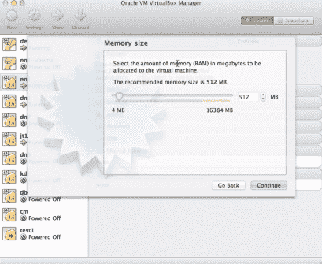
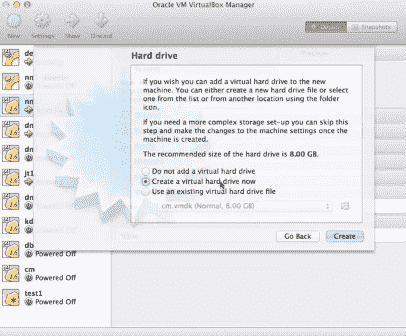
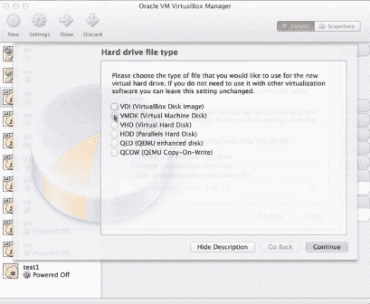
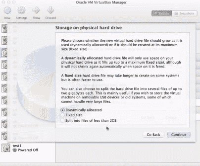
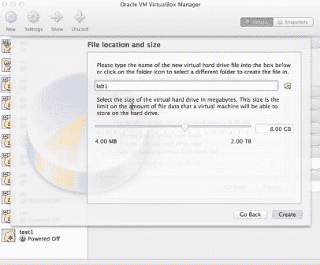
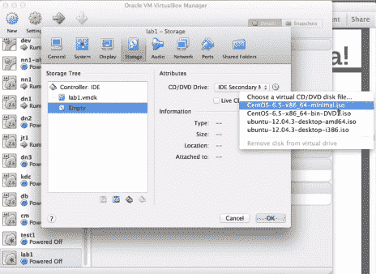
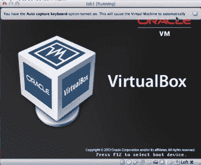
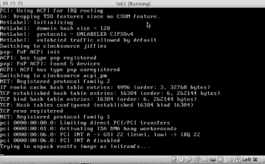
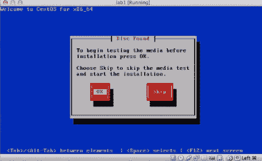

# 教程:在 Hadoop 中设置虚拟环境

> 原文：<https://www.edureka.co/blog/tutorial-setting-up-a-virtual-environment-in-hadoop/>

[//www.youtube.com/embed/gZUHJx--jEc](//www.youtube.com/embed/gZUHJx--jEc)

在开始介绍在 Hadoop 中设置虚拟环境的教程之前，我们先简单介绍一下 Hadoop 集群的不同模式。

## **Hadoop 集群模式介绍:**

Hadoop 可以在以下三种模式中的任何一种模式下运行:

*   **独立或本地模式**–没有守护进程在运行，一切都在单个 JVM 中运行。这种模式适合在开发过程中运行 MapReduce 程序，因为它易于测试和调试。
*   **伪分布式模式**–Hadoop daemon 在本地机器上的单独 Java 进程中运行，从而模拟小规模的集群。
*   **完全分布式模式**–Hadoop 运行在一个机器集群上。这就是 Hadoop 被各行各业用来进行真实世界数据处理的模式。通常，集群中的一台机器被专门指定为 NameNode，另一台机器被指定为 JobTracker。 有了 [Azure 数据工程认证](https://www.edureka.co/microsoft-azure-data-engineering-certification-course) 可以更好的理解。

## **创建新虚拟机的步骤:**

让我们看看在 Hadoop 中创建虚拟环境的步骤。用于 Windows 的 VMware 或用于 Mac 的 VirtualBox 可用于此目的。以下演示是在 VirtualBox 中完成的:

**步骤 1:** 提供名称“Lab1”(可以是您选择的任何名称)。选择“Linux”作为类型，选择“其他 Linux”作为版本。

**第二步:**选择要分配给虚拟机的内存量。

**步骤 3:** 选择“立即创建虚拟硬盘”选项

**步骤 4:** 选择硬盘文件类型为“VMDK ”,然后点击“继续”。

**步骤 5:** 对于物理硬盘的存储，选择“动态分配”并点击“继续”。

**步骤 6:** 指定文件位置和文件大小，并点击“创建”。

新的虚拟机已经创建！！！

**第七步:**在“CD/DVD 驱动器”中选择“CentOS-6.5-x86_64”。您正在指定虚拟机所需的参数。

你可以通过伦敦 [蔚蓝数据工程培训](https://www.edureka.co/microsoft-azure-data-engineering-certification-course-london) 更好的了解。

## **启动虚拟机:**

让我们看一下启动虚拟机的步骤:

**第一步:**在确认框中选择“回车”初始化启动。

**步骤 2:** 选择“跳过”开始安装，并继续点击“确定”

步骤 3:选择“全部重新初始化”并继续。

对屏幕上弹出的问题选择适当的答案，安装过程将开始。

从这个由大数据专业人士设计的[大数据培训](https://www.edureka.co/big-data-hadoop-training-certification)课程中，你将获得 Hadoop 工具、命令和概念的 100%实时项目经验。

有问题要问我们吗？在评论区提到它们，我们会给你回复。

**相关帖子:**

[大数据和 Hadoop 培训](https://www.edureka.co/big-data-and-hadoop)

[Hadoop 2.0 集群架构联盟概述](https://www.edureka.co/blog/overview-of-hadoop-2-0-cluster-architecture-federation/ "Overview of Hadoop 2.0 Cluster Architecture Federation")

[Hadoop 2.0 简介](https://www.edureka.co/blog/introduction-to-hadoop-2-0-and-advantages-of-hadoop-2-0/ "Introduction to Hadoop 2.0 and Advantages of Hadoop 2.0 over 1.0")